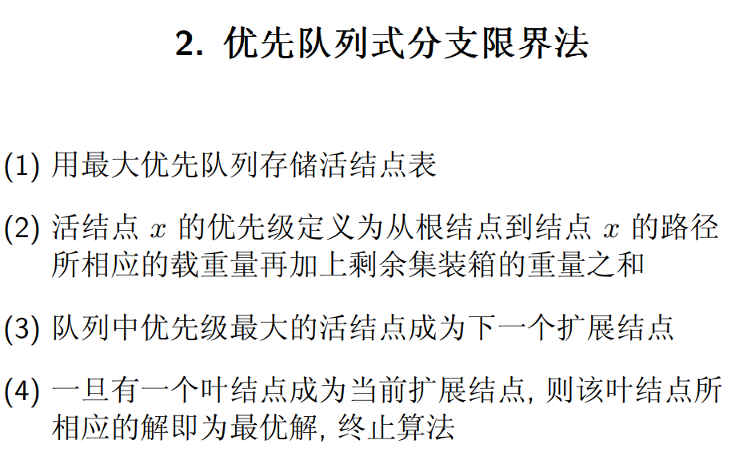
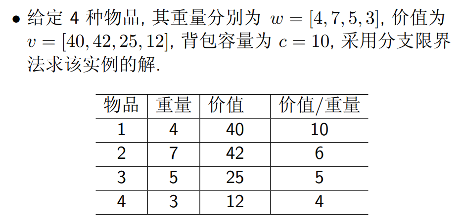

## 回溯法

基于 DFS，带有回退功能的深度优先搜索，可以提前结束一次错误的搜索或提前返回最优解

经典问题：装载问题，n 后问题，0-1 背包问题，旅行商问题

智能穷举法（intelligent exhaustive search）

- 回溯法（backtracking）
- 分支限界法（branch-and-bound）

## 分枝限界法

基于 BFS，在扩展结点的过程中，边搜索边减去树的某些分支，在当前节点的儿子节点中找到最优的一个向下扩展

经典问题：单源最短路径问题，装载问题，0-1 背包问题

剪枝策略

- 节点不能构成可行解
- 该节点的边界值不优于目前最优解的解，有两种情况
  - 第一种：其边界值小于某来自**同一直系父节点**的兄弟节点
  - 第二种：多次访问到该节点，删除边界值较大的节点分支

两种分枝限界方式

- 队列式分支限界法：按照队列先进先出原则选取下一 个节点为扩展节点
- 优先队列式分支限界法：按照优先队列中规定的优先级选取优先级最高的节点成为当前扩展节点

### 单源最短路径问题

剪枝策略：优先级判定条件为当前节点到起点的路长

- 当不小于（大于等于）当前节点的最短路长，删去
- 当第二次经过该节点，删去路径较长的那一颗子树

其中，经过路径 p 以最小的长度到达了终点 t

### 装载问题

### 0/1 背包问题

考虑 0/1 背包问题：n = 3, w = [16, 15, 15], v = [45, 25, 25], c = 30

- 队列式分枝限界利用一个队列来记录活节点，节点将按照顺序从队列中取出
- 优先队列分枝限界使用一个最大堆，该队列的优先级定义为活节点所获得的价值

以这样的方式，可以列出所有背包装载的情况

定义第 i 个物品的上界 ub（性价比）
$$
ub = v_i + (C − w_i)(v_{i+1}/w_{i+1})
$$
C 是当前还能装载的重量

对上述空间树进行剪枝，剪枝策略为

- 删除当前层直系兄弟节点中`ub`大于等于当前最小`ub`的节点分支
- 删除装不进的分支

## 线性规划与网络流

### 线性规划算法模型

线性规划问题是一个多变量线性函数的最优化问题，参考高中的平面线性规划

- 所有可行解构成的集合为线性规划问题的可行区域
- 目标函数取得极值的可行解称为最优解, 在最优解 处目标函数的值称为最优值
- 有些情况下可能不存在最优解
  - 可行域不存在
  - 目标函数在可行域没有极值，即无界

举个栗子

### 单纯形算法

> 求解线性规划问题

极点定理：可行区域非空的任意线性规划问题有最优解，而且最优解总是能够在其可行区域的一个极点上找到

于是产生朴素想法：穷举可行域中所有极点，找出最大值，但极点数是指数增长的

单纯形法的几何描述

- 先在可行区域内找到一个极点，然后检查一下邻接极点处是否可以让目标函数取值更佳
  - No，当前顶点就是最优点，算法停止
  - Yes，处理下个能让目标函数取值更佳的邻接顶点
- 有限步之后，该算法可以找到一个最优解的极点，或证明最优解不存在

线性规划问题的约束标准型，限制条件均为等式的线性规划问题称为约束标准型

在解决线性规划问题是添加一组**基变量**将限制条件全化为等式的形式，转化为约束标准型，再通过单纯形法进行求解

一个栗子

- 要求最大值的 z 的式子的各项系数是始终不变的

- 检验数均小于等于 0 时迭代完成，其中
  $$
  Z_j = C_B\times x_i\,,\,\,
  如\,Z_1
  =
  [0,0,0]\times
  \begin{bmatrix}
  1\\
  2\\
  1
  \end{bmatrix}
  = 0
  \\
  δ_j = C_{B_j} - Z_j
  $$

### 增广路算法

网络最大流