## 概述

> 算法是任何良好定义的计算过程，该过程以某个值或值集合作为输入并产生某个值或值的集合作为输出
>
> 一个好的算法是反复努力和重新修正的结果
>
> 算法是求解良好说明的计算问题的工具
>

具体算法应用

- 传输路由算法
- 安全加密算法
- 存储排序算法
- 检索模式匹配算法

本课程包括：算法设计技术及算法分析技术

### 算法与程序

要点

- 算法概念
- 求解问题基本步骤
- 算法复杂性分析框架
- 算法复杂性的渐近数学表述

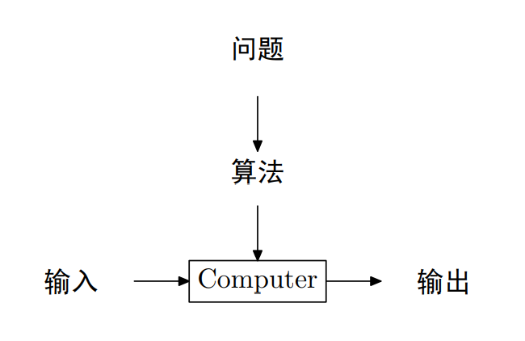

算法性质

- 输入（可空） 
- 输出（一个算法至少产生一个量）
- 确定性
- 有限性：指令条数、指令执行时间有限

程序：命令序列的集合，等于算法加数据结构

求解问题过程

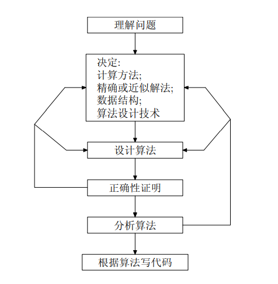

理解问题

- 手工处理一些小规模的例子
- 考虑特殊情况
- 待解问题属于某类问题，用已知算法求解；不存在完全可用算法，自己设计算法
- 算法的输入，确定了该算法所解决问题的一个实例

算法描述：伪代码 / 程序语言

算法分析

- 有效性：时间效率和空间效率
- 简单性
- 一般性

> 降低时间复杂性是算法研究中永恒的主题
>
> 算法的时间复杂性用基本操作的执行次数来度量
>
> 方便对算法定量研究，好打分

输入规模的度量和运行时间的度量

### 算法复杂度概念

设输入规模为 n，机器每执行一条指令时间为 cop，当前程序指令执行次数 C(n)

- 总耗时 T(n) = cop C(n)
- 若 C(n) 的最高次为 2，如`C(n) = 2n^2+4n`，则输入规模每扩大 2 倍，运行时长扩大 4 倍；若最高次为 3，则扩大 8 倍

运行时间渐近分析：忽略常数因子并关注输入大小无限增长后算法的行为，简单说，就是看输入趋于 ∞ 的复杂度（求极限）

时间复杂性类型：算法的最优、最差和平均复杂性

- 算法在最优情况下的执行效率
- 算法在最坏情况下的执行效率
- 平均复杂性提供在“典型”或“随机”输入情况下，算法所具有的效率

平均复杂度计算

对于以下程序：在数组中找到目标元素返回其下标，若查找失败返回 -1

```c
int searchArr(int* arr, int n, int target){
    for(int i = 0; i < n; i++){
        if(arr[i] == target){
            return i;
        }
    }
    return -1;
}
```

- 最优复杂度：1

- 最差复杂度：n

- 平均复杂度：设在数组 arr 中找到 target 概率为 p，则
  $$
  \begin{aligned}
  C_{avg}(n)=&\frac{p\times(1+2+...+n)}{n}+n\times(1-p)\\
  =&\frac{p}{n}\times \frac{n\times(n+1)}{2}+n\times(1-p)\\
  =&\frac{p\times(n+1)}{2}+n\times(1-p)
  \end{aligned}
  $$
  对于找到的情况，即 p 成立时，设一共找了 n 次，每次 target 均在不同位置，则基本语句总共执行了`n!`次，求平均则除以 n

  对于没找到的情况，执行语句一共 n 次，再乘上概率前提

### 渐近复杂度

渐近分析，若

$$
\lim_{n->\infty}\frac{F(n)-G(n)}{F(n)}=0
$$
则 G(n) 为 F(n) 在 ∞ 的渐近性态，或渐近复杂性

- 从数学上，G(n) 是 T(n) 中略去低阶项所留下的主项

渐近复杂度类型

| 类型  | 名称    | 解释                               |
| ----- | ------- | ---------------------------------- |
| 1     | 常量    | 效率最高                           |
| logn  | 对数    | 每次循环消去问题规模的一个常数因子 |
| n     | 线性    | 遍历搜索算法                       |
| nlogn | n-log-n | 大多分治算法                       |
| n^2   | 平方    | 两重嵌套                           |
| n^3   | 立方    | 三重嵌套                           |
| 2^n   | 指数    | 求 n 个元素集合的所有子集          |
| n!    | 阶乘    | 求 n 个元素集合的全排列            |

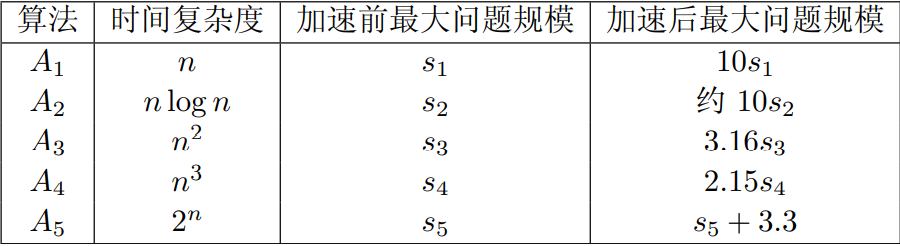

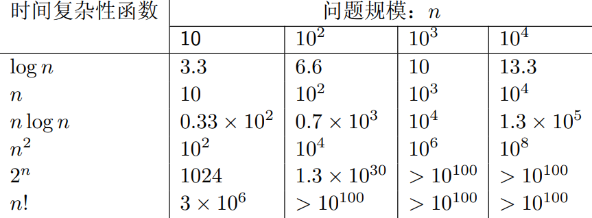

渐近复杂度符号表示

- 同阶函数符号 Θ，可视为 =
- 低阶函数符号 O，可视为 ≤，用于估计函数的渐近上界，如`O[T(n)]`表示 T 的低阶函数
- 高阶函数符号 Ω，可视为 ≥，用于估计函数的渐近下界

同阶函数的判断：夹逼定理

设有函数`f(n), g(n)`，若存在常数`a, b, c`，使得`ag(n) <= f(n) <= bg(n)` 在`n>c`时恒成立，我们则说 f 和 g 是同阶函数，如
$$
证明\,f(n)=\frac{n-1}{2}n = Θ(n^2)
$$
令`a=0.25, b=0.5, c=2`，当`n>2`时，下式恒成立，故`f(n)`和`n^2`是同阶函数
$$
\frac{1}{4}n^2<f(n)<\frac{1}{2}n^2
$$
渐近复杂性函数关系定理

- 当 g(n) 同时为 f(n) 的低阶函数和高阶函数，那么 g(n) 就是 f(n) 的同阶函数
- 函数相加，其新函数复杂度由较高的一项决定

**其实判断复杂度直接相除求无穷极限就行，不要用夹逼**

### 计算时间复杂度

1、利用极限比较函数阶确定一个函数的时间复杂度


- 等价无穷小
- 洛必达
- 泰勒展开

2、对代码的基本语句执行次数进行求和，确定他的时间复杂度

确定一个数组是否有重复元素

```c
bool repeat(int *nums, int n){
    for(int i = 0; i < n; i++){
        for(int j = i+1; j < n; j++){
            if(nums[i] == nums[j]){
                return true;
            }
        }
    }
    return false;
}
```

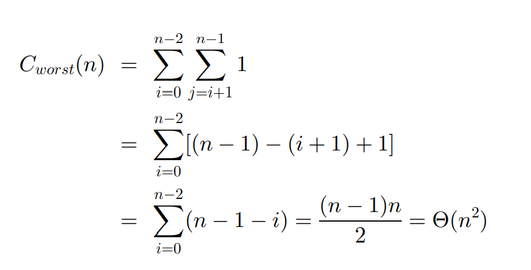

## 递归与分治策略

设计思想：分解问题 - 递归求解 - 合并子问题

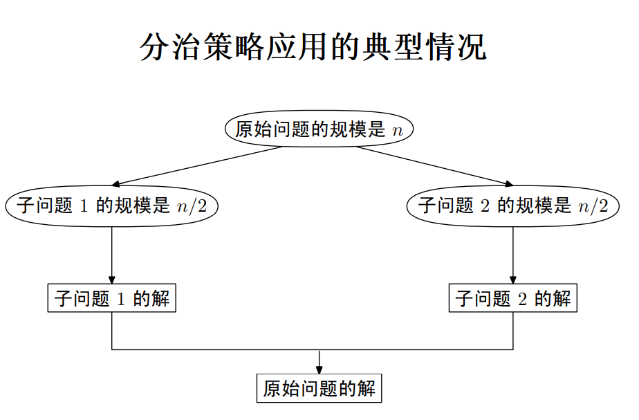

### 经典递归算法

> 阶乘、斐波那契数列、阿克曼函数、全排列、整数划分、汉诺塔

**直接或间接地调用自身**的算法称为递归算法

#### n 的阶乘

求整数 n 的阶乘

```c
void cal(int n){
    if(n == 0){
        return 1;
    }
    return cal(n-1)*n;
}
```

- 对于输入参数 n，乘法的执行次数为 n

#### Fibonacci

斐波那契数列，求第 n 位值，`f(n)=f(n-1)+f(n-2), f(0)=f(1)=1`

```c
int fib(int n){
    if(n <= 1){
        return 1;
    }
    return fib(n-1)+fib(n-2);
}
```

#### Ackerman

阿克曼函数

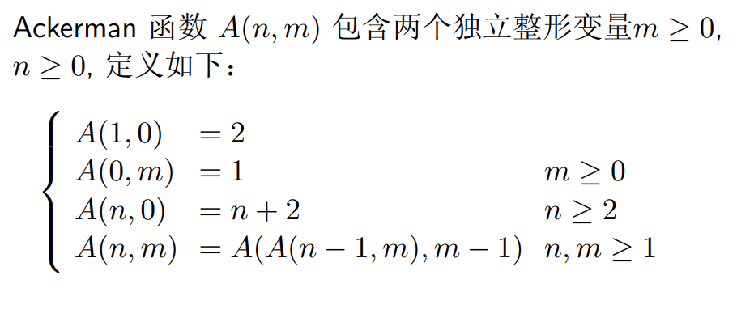
$$
A(1,1) = A(A(0,1),0) =  A(1,0) = 2
$$

```c
int ackerman(int n, int m){
    if(n == 1 && m == 0){
        return 2;
    } else if(n == 0){
        return 1;
    } else if(m == 0){
        return n+2;
    }
    return ackerman(ackerman(n-1, m), m-1);
}
```

- m 为外层迭代，n 为内层迭代，当 m 为 0 时迭代完成

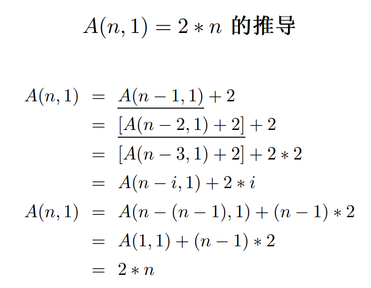

补充 Ackermann 函数

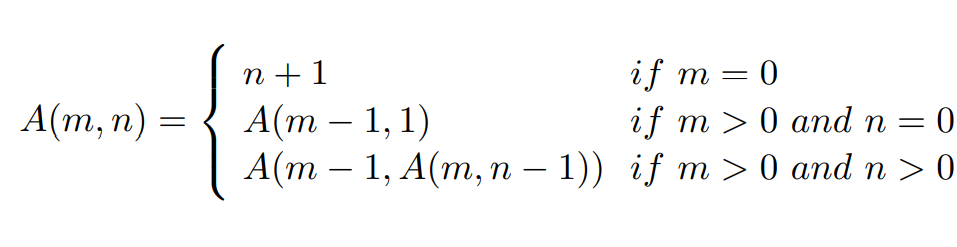

```c
int ackermann(int m, int n){
    if(m == 0){
        return n+1;
    } else if(n == 0){
        return ackermann(m-1, 1);
    }
    return ackermann(m-1, ackermann(m, n-1));
}
```

#### 全排列问题

对于`R = {r1, r2, . . . , rn}`，n 个元素排列

- `Ri = R − {ri}`
- 集合 X 的全排列记为`Perm(X)`
- `(ri)Perm(X)`表示在全排列`Perm(X)`的每一个排列前加上前缀得到的排列

譬如

- 当 n = 1 时，`Perm(R) = (r)`， 其中 r 是集合 R 中唯一元素
- 当 n > 1 时，`Perm(R)`由`(r1)Perm(R1) , . . ., (rn)Perm(Rn)`构成

匪夷所思

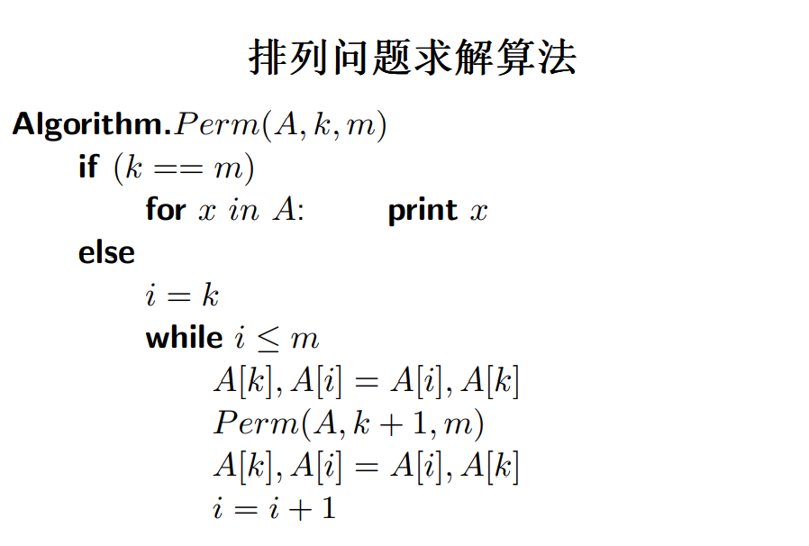

```c
#include <iostream>
using namespace std;

void swap(int *arr, int i, int j) {
	int temp = arr[i];
	arr[i] = arr[j];
	arr[j] = temp;
}

void perm(int *arr, int k, int m) {
	if (k == m) {
		for (int i = 0; i <= m; i++) {
			cout << arr[i] << " ";
		}
		cout << endl;
		return;
	}
	int i = k;
	while (i <= m) {
         // 确定当前位
		swap(arr, k, i);
		perm(arr, k + 1, m);
         // 重置当前位
		swap(arr, k, i);
		i++;
	}
}

int main() {
	int arr[] = {1, 2, 3, 4};
	perm(arr, 0, 3);
	return 0;
}
```

有点回溯的感觉，外层循环置换确定第 k 位的元素，在这种情况下向下扩展，每层再向后延展 m-k 个分支，直到 m==k，遍历到了叶子节点，输出当前序列

返回后，将外层确定的元素归还，开始回溯，遍历另一颗子树，整个过程相当于**一个带有回溯的深度优先搜索**，建议背诵

#### 整数划分

将正整数 n 表示成一系列正整数之和，称为 n 的一个划分，整数划分指：求正整数 n 的不同划分的数量

如 5 可划分为`{5, 4+1, 3+2, 3+1+1, 2+2+1, 2+1+1+1, 1+1+1+1+1}`共 7 种划分

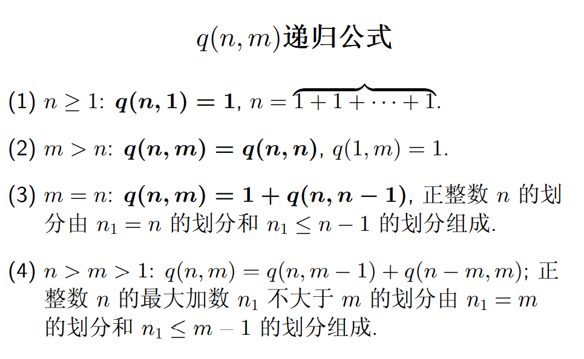

```c
#include <iostream>
using namespace std;

// n 表示要加到的和，m 表示当前因子最大能达到的值
// 如 partition(5, 1) 表示用不大于 1 的正整数划分 5，只有一种 1+1+1+1+1
int partition(int n, int m) {
	// 当和为 1 或最大因子为 1，只有一种情形，一个一个加上去
	if (n == 1 || m == 1) {
		return 1;
	} else if (n == m) { // 当和与最大因子值相同，去掉 n = m，剩下 partition(n, m-1)
		return 1 + partition(n, m - 1);
	} else if (n < m) {
		return partition(n, n);
	}
	// 把当前因子最大值递减，依次参与构成 n
	// 把当前和减去 m，表示存在一个比 n 小的参数 m
	return partition(n, m - 1) + partition(n - m, m);
}

int partition(int n) {
	return partition(n, n);
}

int main() {
	cout << partition(5);
	return 0;
}
```

#### Hanoi 塔

汉诺塔问题

求解有 n 个盘子的汉诺塔问题（3 个柱子）需要多少步能完成

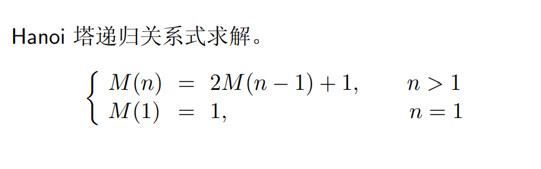

```c
int hanoi(int n){
    if(n == 1){
        return 1;
    }
    return 2*hanoi(n-1)+1;
}
```

时间复杂度计算

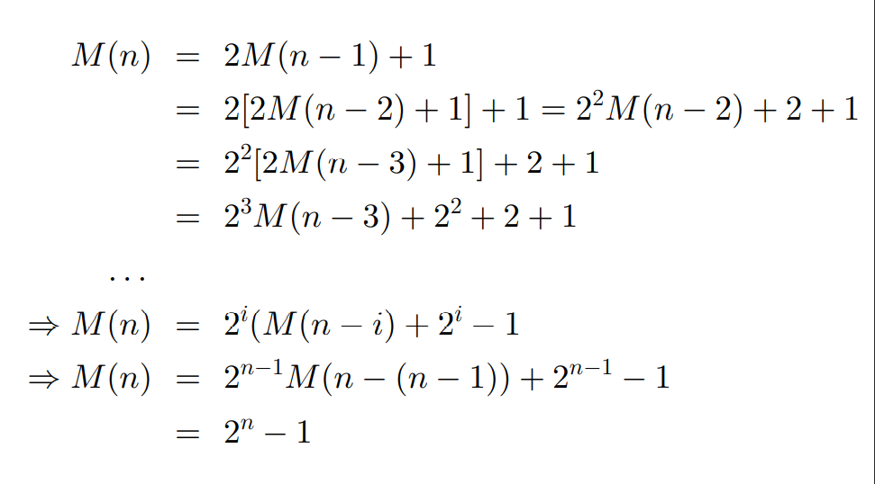

等比数列求和公式，q 为公比
$$
\sum_{i=1}^n a_i = \frac{a_1\times(1-q^n)}{1-q}
$$

### 分治复杂度公式

基本思想

- 问题的规模缩小到一定程度就可以容易地解决
- 问题可分解为若干规模较小的相同问题
- 利用子问题的解可以合并为该问题的解
- 问题所分解出的子问题之间不包含公共子问题

分治算法时间复杂度计算公式

- a 为每次分解得到的子问题数
- b 为每次分解的规模，如一分为二则 b=2
- f(n) 为每次分解/合并的代价

$$
T(n) = aT(n/b) + f(n)
$$

### 主定理

主定理：用于估算分治算法时间复杂度，取决于`f(n)`的复杂度
$$
令\,f(n) = O(n^d)
$$
求出 d，分治算法的总时间复杂度 T(n) 满足

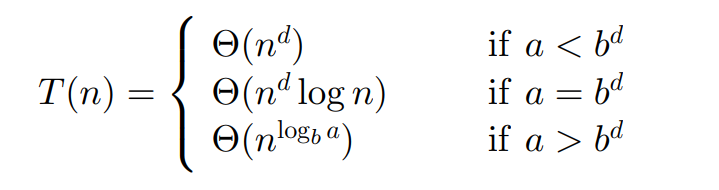

对于数组加法

```c
int add(int arr[], int l, int r){
    if(l == r){
        return arr[l];
    }
    int mid = (l+r) / 2;
    return add(arr, l, mid) + add(arr, mid+1, r);
}
```

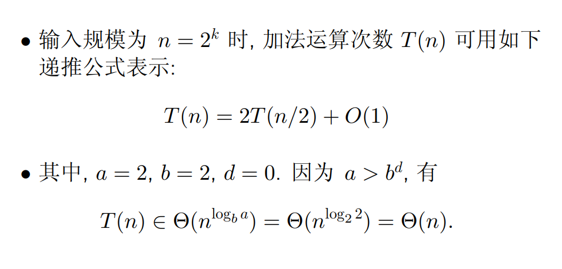

- `a > b^d`，为指对数

### 经典分治算法

> 二分查找、大整数乘法、矩阵乘法、归并排序、快排

#### 二分搜索

```c
int binary_search(int arr[], int target, int l, int r){
    if(l > r){
        return -1;
    }
    int mid = (l+r) / 2;
    if(arr[mid] = target){
        return mid;
    }
    if(target < arr[mid]){
        return binary_search(arr, target, l, mid-1);
    }
    return binary_search(arr, target, mid+1, r);
}
```

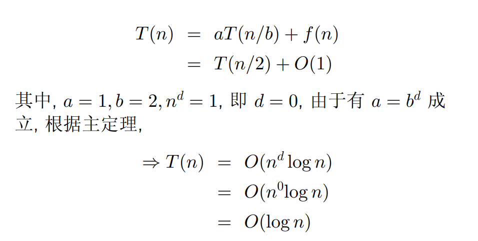

- `a = b^d`为乘对数

#### 大整数乘法

高斯发现

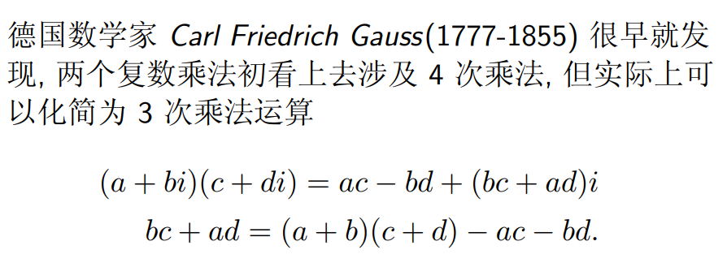

运用到两位数乘法
$$
\begin{aligned}
23\times14 =& (2\times10^1+3\times10^0)\times(1\times10^1+4\times10^0)\\
=&2\times10^2+12\times10^0+[(2+3)\times(1+4)-2-12]\times10^1\\
=&322
\end{aligned}
$$
复杂度分析

- 每个大乘法分解成三个小乘法，每次分解要加 n 次
- 主定理：`a=3; b=2; n^d=n => d=1`，又`a > b^d`，故"指对数"，以 b 为底，a 为对数

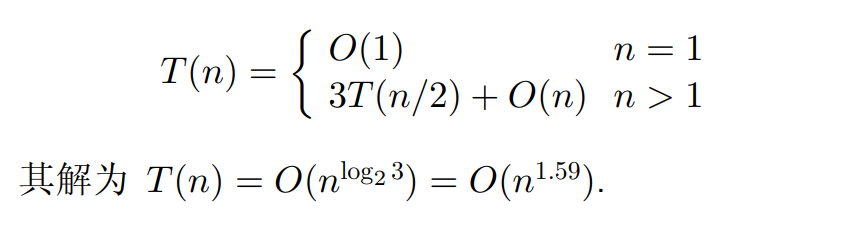

#### Strassen 矩阵乘法

正常的矩阵乘法，大小均为 nxn
$$
C = AB
$$
各分为四等块
$$
\begin{bmatrix}
C_{1}&C_{2}\\
C_{3}&C_{4}\\
\end{bmatrix}
=
\begin{bmatrix}
A_{1}&A_{2}\\
A_{3}&A_{4}\\
\end{bmatrix}
\times
\begin{bmatrix}
B_{1}&B_{2}\\
B_{3}&B_{4}\\
\end{bmatrix}
$$
其中

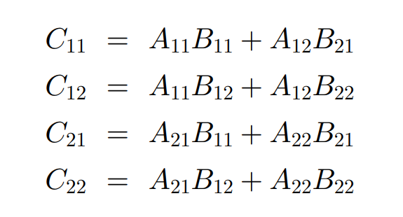

从原来的一个矩阵乘法，分解成了 8 个矩阵乘法，每个子矩阵的规模均为 n/2；另外，每次分割，需要多出 4 次加法，

于是得到分治算法时间复杂度

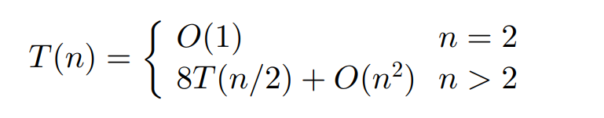

根据主定理，由于`a > b^d`，复杂度指对数，为
$$
T(n) = n^{log_28} = n^3
$$
Strassen 改进算法：就是减少了一次矩阵乘法，采用加减法获得，于是复杂度降为
$$
T(n) = n^{log_27} \approx n^{2.81}
$$

#### 归并排序

```java
public class Solution {

    public int[] sortArray(int[] nums){
        temp = new int[nums.length];
        mergeSort(nums, 0, nums.length-1);
        return nums;
    }

    private int[] temp;

    public void mergeSort(int[] nums, int left, int right){
        if(left >= right){
            return;
        }
        int mid = (left+right)/2;
        mergeSort(nums, left, mid);
        mergeSort(nums, mid+1, right);
        int i = left, j = mid+1, count = 0;
        while(i<=mid && j<=right){
            if(nums[i]<nums[j]){
                temp[count++] = nums[i++];
            }else{
                temp[count++] = nums[j++];
            }
        }
        while(i<=mid){
            temp[count++] = nums[i++];
        }
        while(j<=right){
            temp[count++] = nums[j++];
        }
        for(int k = 0; k <= right-left; k++){
            nums[k+left] = temp[k];
        }
    }
}
```

就是始终将数组一分为二直到只有一个元素，然后不断相邻的两个子数组进行重排，很明显
$$
T(n) = 2T(n/2) + O(n)
$$
根据主定理可得
$$
T(n) = nlogn
$$

#### 快速排序

```java
class Solution {
    public int[] sortArray(int[] nums){
        quickSort(nums, 0, nums.length-1);
        return nums;
    }


    public void quickSort(int[] nums, int left, int right){
        if(left>=right){
            return;
        }
        swap(nums, right, (left+right)/2);
        int pivot = nums[right];
        int position = left;
        for(int i = left; i < right; i++){
            if(nums[i] <= pivot){
                swap(nums, i, position);
                position++;
            }
        }
        swap(nums, position, right);
        quickSort(nums, left, position-1);
        quickSort(nums, position+1, right);
    }

    public void swap(int[] nums, int i, int j){
        int temp = nums[i];
        nums[i] = nums[j];
        nums[j] = temp;
    }
}
```

在当前数组的`left, right`区间内随机取数为参考，将小于该数的置于左边，大于该数的置于右边，将数组分割，再继续对分割的数组进行以上操作直到`left >= right`

快排的时间复杂度取决于划分是否平衡，即每次是否平均的划分大于参考和小于参考的数

若每次都是等分，此时复杂度最优
$$
T(n) = 2T(n/2) + O(n) \stackrel{主定理}{\Rightarrow}nlogn
$$
若每次分割最不平衡，如左部只剩 1 个元素，此时复杂度最差
$$
T(n) = T(n-1) + O(n) \approx O(n^2)
$$

#### 循环日程赛表

设有 n = 2k 运动员要进行网球循环赛，设计一个满足 如下要求的比赛日程表

- 每个选手必须与其他 n − 1 个选手各赛一次
- 每个选手一天只能赛一场
- 循环赛一共进行 n − 1 天

设计成有 n 行和 n − 1 列的表
$$
T(n) = 2T(n/2) + O(n) \stackrel{主定理}{\Rightarrow}nlogn
$$
