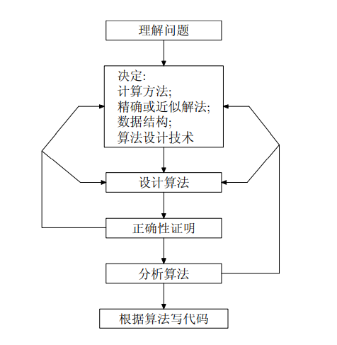
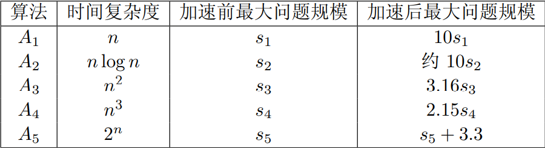

算法是任何良好定义的计算过程，该过程以某个值或值集合作为输入并产生某个值或值的集合作为输出

一个好的算法是反复努力和重新修正的结果

算法是求解良好说明的计算问题的工具

具体算法应用

- 互联网的信息传输需要路由算法
- 互联网的信息安全需要加密算法
- 互联网的信息存储需要排序算法
- 互联网的信息检索需要模式匹配算法

本课程包括

- 算法设计技术
- 算法分析技术

## 概述

### 算法与程序

要点

- 算法概念
- 求解问题基本步骤
- 算法复杂性分析框架
- 算法复杂性的渐近数学表述


算法性质

- 输入（可空） 
- 输出（一个算法至少产生一个量）
- 确定性
- 有限性：指令条数、指令执行时间有限

程序：命令序列的集合，算法加数据结构

求解问题过程



理解问题

- 手工处理一些小规模的例子
- 考虑特殊情况
- 待解问题属于某类问题，用已知算法求解；不存在完全可用算法，自己设计算法
- 算法的输入，确定了该算法所解决问题的一个实例

算法描述：伪代码 / 程序语言

算法分析

- 有效性：时间效率和空间效率
- 简单性
- 一般性

### 时间复杂度分析

> 降低时间复杂性是算法研究中永恒的主题
>
> 算法的时间复杂性用基本操作的执行次数来度量
>
> 方便对算法定量研究，好打分

输入规模的度量和运行时间的度量

#### 算法复杂度概念

设输入规模为 n，机器每执行一条指令时间为 cop，当前程序指令执行次数 C(n)

- 总耗时 T(n) = cop C(n)
- 若 C(n) 的最高次为 2，如`C(n) = 2n^2+4n`，则输入规模每扩大 2 倍，运行时长扩大四倍；若最高次为 3，则扩大 9 倍

运行时间渐近分析

主要特征是忽略常数因子并关注输入大小无限增长后算法的行为，简单说，就是看函数 ∞ 极限（自变量为输入规模，因变量为执行次数）

时间复杂性类型：算法的最优、最差和平均复杂性

- 算法在最优情况下的执行效率
- 算法在最坏情况下的执行效率
- 平均复杂性提供在“典型”或“随机”输入情况下，算法所具有的效率

总结

- 算法复杂性用输入规模的函数进行度量
- 算法的时间复杂性用基本操作的执行次数来度量
- 当算法的输入规模趋向于无限大的时，关注时间复杂性的渐近分析
- 某些算法需要区分最差复杂性、最优复杂性和平均复杂性

平均复杂度计算

对于以下程序：在数组中找到目标元素返回其下标，若查找失败返回 -1

```c
int searchArr(int* arr, int n, int target){
    for(int i = 0; i < n; i++){
        if(arr[i] == target){
            return i;
        }
    }
    return -1;
}
```

- 最优复杂度：1

- 最差复杂度：n

- 平均复杂度：设在数组 arr 中找到 target 概率为 p，则
  $$
  \begin{aligned}
  C_{avg}(n)=&\frac{p\times(1+2+...+n)}{n}+n\times(1-p)\\
  =&\frac{p}{n}\times \frac{n\times(n+1)}{2}+n\times(1-p)\\
  =&\frac{p\times(n+1)}{2}+n\times(1-p)
  \end{aligned}
  $$
  对于找到的情况，即 p 成立时，设一共找了 n 次，每次 target 均在不同位置，则基本语句总共执行了`n!`次，求平均则除以 n

  对于没找到的情况，执行语句一共 n 次，再乘上概率前提

渐近分析

$$
\lim_{n->\infty}\frac{F(n)-G(n)}{F(n)}=0
$$
若上述等式成立，我们称 G(n) 为 F(n) 在 ∞ 的渐近性态，或渐近复杂性

- 从数学上，G(n) 是 T(n) 中略去低阶项所留下的主项

渐近复杂度类型

| 类型  | 名称    | 解释                               |
| ----- | ------- | ---------------------------------- |
| 1     | 常量    | 效率最高                           |
| logn  | 对数    | 每次循环消去问题规模的一个常数因子 |
| n     | 线性    | 遍历搜索算法                       |
| nlogn | n-log-n | 大多分治算法                       |
| n^2   | 平方    | 两重嵌套                           |
| n^3   | 立方    | 三重嵌套                           |
| 2^n   | 指数    | 求 n 个元素集合的所有子集          |
| n!    | 阶乘    | 求 n 个元素集合的全排列            |




渐近复杂度符号表示

- 同阶函数符号 Θ，可视为 =
- 低阶函数符号 O，可视为 ≤，用于估计函数的渐近上界，如`O[T(n)]`表示 T 的低阶函数
- 高阶函数符号 Ω，可视为 ≥，用于估计函数的渐近下界

同阶函数

设有函数`f(n), g(n)`，若存在常数`a, b, c`，使得`ag(n) <= f(n) <= bg(n), n>c`，我们则说 f 和 g 是同阶函数，如
$$
f(n)=\frac{1}{2}n\times(n-1)=Θ(n^2)\\
$$
下式在`n>2`时恒成立，此时`a=0.25, b=0.5, c=2`，故`f(n)`和`n^2`是同阶函数
$$
\frac{1}{4}n^2<f(n)<\frac{1}{2}n^2
$$
低阶函数和高阶函数和同阶同理，就是符号只有 < 和 >，函数前只有一个常数限制，常数 c 作用不变

- 另外，我们称`Θ[f(n)]`是函数`f(n)`的同阶函数集合
- 同理，有低阶函数集合`O[f(n)]`，高阶函数集合`Ω[f(n)]`


渐近复杂性函数关系定理

- 当 g(n) 同时为 f(n) 的低阶函数和高阶函数，那么 g(n) 就是 f(n) 的同阶函数
- 两个函数之和是较大同阶集合的同阶函数，即对于两个连续执行部分组成的算法, 该算法整体效率由具有较差时间复杂性的部分决定

#### 计算时间复杂度

利用极限比较函数阶确定一个函数的时间复杂度


- 等价无穷小
- 洛必达
- 泰勒展开

对代码的基本语句执行次数进行求和，确定他的时间复杂度

确定一个数组是否有重复元素

```c
bool repeat(int *nums, int n){
    for(int i = 0; i < n; i++){
        for(int j = i+1; j < n; j++){
            if(nums[i] == nums[j]){
                return true;
            }
        }
    }
    return false;
}
```


## 递归与分治策略

要点

- 理解递归概念
- 掌握分治算法设计策略
- 二分查找；大整数乘法；矩阵乘法；归并排序；快排

设计思想

- 将要求解的问题划分成 k 个小问题
- 然后对这 k 个子问题递归求解
- 合并子问题的解


### 递归概念


## 动态规划

## 贪心算法

## 回溯法

## 分枝限界法

## 线性规划与网络流