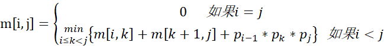
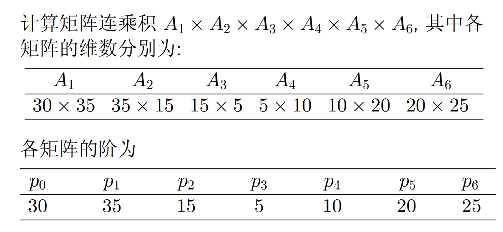
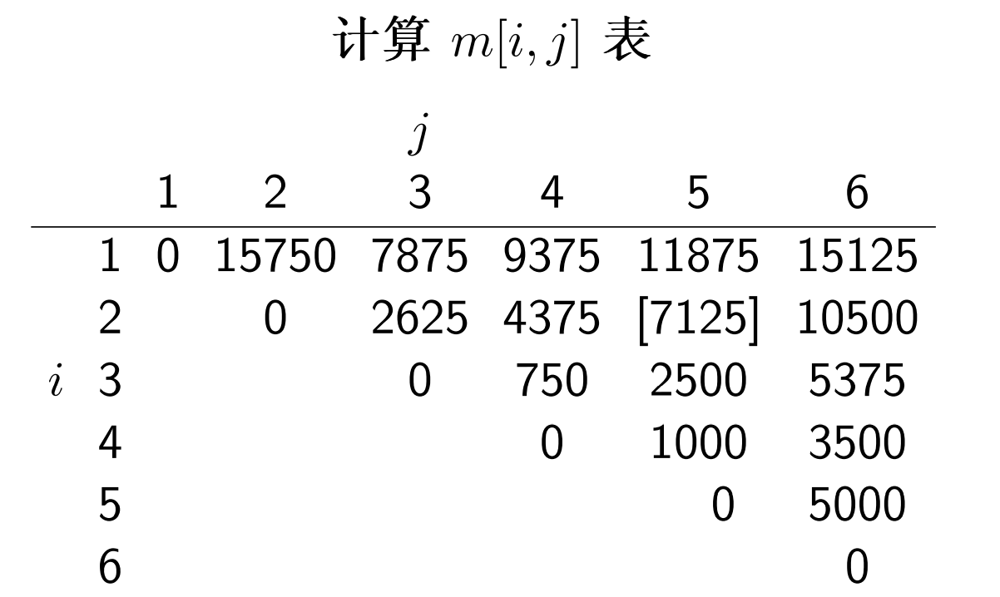
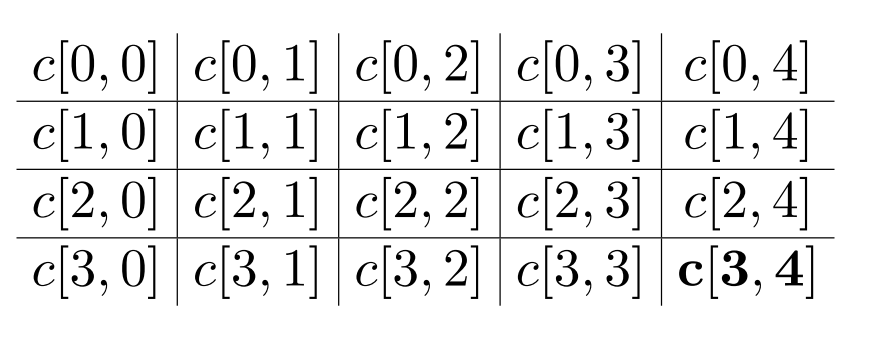
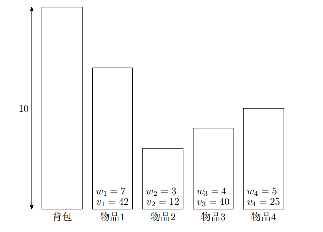
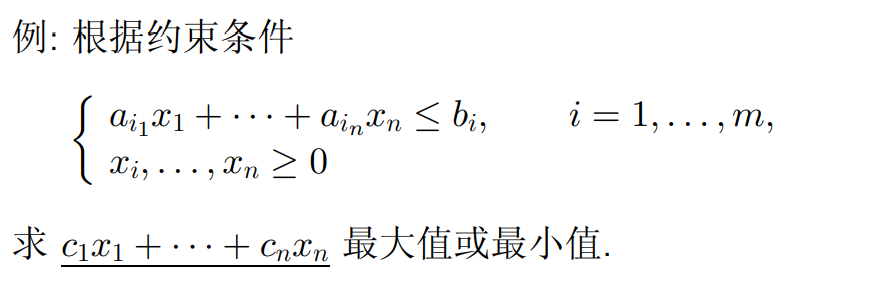
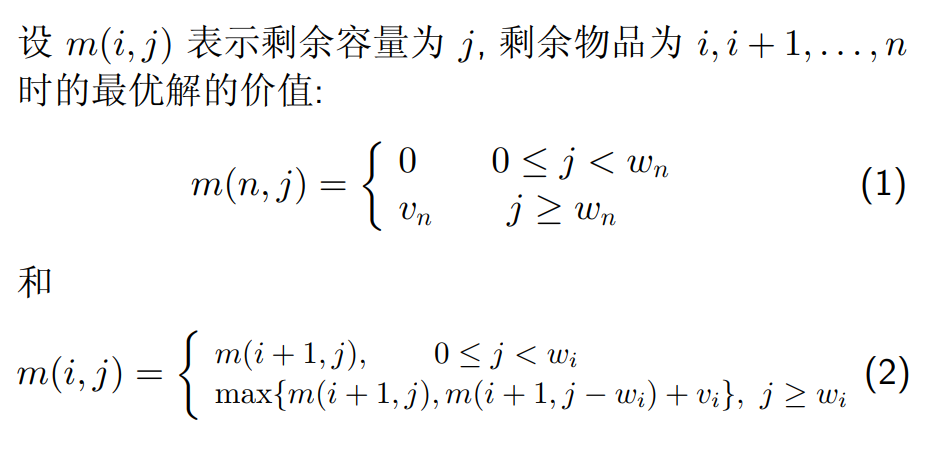
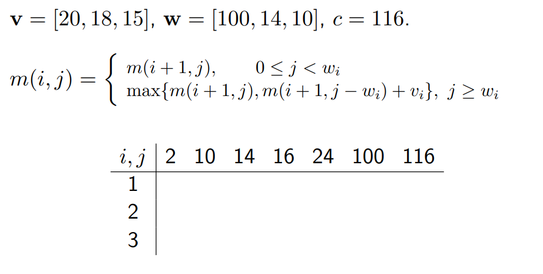
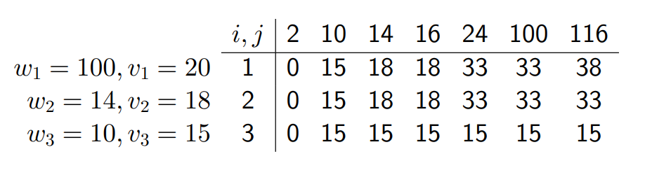

## 动态规划

掌握动态规划算法的基本要素

- 最优子结构性质
- 重叠子问题性质

掌握设计动态规划算法的步骤

应用范例

- 矩阵连乘问题
- 最长公共子序列
- 背包问题
- 最优二叉搜索树问题

### 动态规划概述

> 使多阶段决策过程最优的通用方法
>
> 动态规划不仅是应用数学中用来解决某类**优化问题**的重要工具，而且在计算机领域被当作一种通用的算法设计技术

总体思想：分治思想

- 将待求解问题分解成若干个子问题，如果分解得到的子问题重复出现，可用表格将已计算出的结果保存以节省重复计算，从而降低时间复杂度
- 动态规划适用于解决包含重叠子问题的优化问题
- 重叠子问题一般出现在对给定问题求解的递归关系中，递归关系包含了更小子问题的解

动态规划基本步骤

- 分析问题最优解的结构，找出最优解的性质
- 递归地定义最优解的代价
- 以自底向上的方式计算出最优解的代价并保存
- 根据计算最优解的代价信息构造最优解

基本要素：最优子结构和重叠子问题

**最优子结构**，如果一个问题的最优解包含了它的子问题的最优解，则称此问题具有最优子结构

- 即该问题的最优解同时是其子问题的最优解

**重叠子问题**，递归算法中求解子问题，若重复求解同一子问题，则称该问题存在重叠子问题

**备忘录方法**，对子问题的求解结果进行保存，每向下求一步，保存一次，是自顶向下的；而动态规划不是，动态规划是自底向上的

### 矩阵连乘

> 将一个矩阵连乘不断分割，找到乘法次数最少的排列
>
> `p[]`数组记录矩阵阶数；`m[i][j]`数组记录从矩阵`i`乘到矩阵`j`的乘法次数；`s[i][j]`数组记录`m[i][j]`的分割位置 k

矩阵连乘问题，对于`pxq`乘以`qxr`的矩阵乘法，将得到一个`pxr`的结果矩阵，结果矩阵的每个元素需要`q`个元素相乘并相加，即共执行`prq`次乘法
$$
T(n) = T(pqr)
$$
在连乘时，不同的乘法次序将得到不同的新矩阵，从而总复杂度有多有少，如何找到复杂度最小的连乘



```c
void MatrixChain(int p[], int n, int m[][] ,int s[][]) {
    for(int i = 1; i <= n; i++) {
        m[i][i]=0; //最小的子问题，连乘矩阵个数为1
    }
    for(int r = 2; r <= n; r++) { //r代表连乘的矩阵个数，从2到n
        for(int i = 1; i <= n-r+1; i++) {  //枚举左边界
            // 确定右边界
            int j = i+r-1;
            // 将矩阵分为 m[i:i] 和 m[i+1, j] 作为本轮初始分割
            m[i][j] = m[i][i]+m[i+1][j]+p[i-1]*p[i]*p[j]; // m[i][i] == 0
            // 记录第几轮
            s[i][j] = i;
            for(int k = i+1; k < j; k++) {  // 讨论k的所有可能情况
                int t = m[i][k]+m[k+1][j] + p[i-1]*p[k]*p[j];
                if(t < m[i][j]) {
                    m[i][j]=t;
                    s[i][j]=k; // 选择数乘次数最小的情况，并将相关数据覆盖于表中的相应位置
                }
            }
        }
    }
}
```

举个栗子



p 表比矩阵数大一轮，第三个矩阵的行数实际上就是第二个矩阵的列数，于是我们只需要存每个矩阵的行数，然后单独存最后一个矩阵的列数



在计算时，严格根据子问题的大小逐级提升

- 先确定`m[i:i]`，均为 0
- 再算长度为 2 的子问题，如`m[1:2], m[2,3]`，这一步很好算，因为只有一种分割方法，其值实际上就等于`m[i:j] = p[i-1]p[i][j]`，因为`k = i`
- 再计算长度为 3 的序列，这里就有两种分割方法，如`m[2,4] = m[2:2] + m[3:4]`和`m[2,4] = m[2:3] + m[4:4]`，需要一一计算比对赋予`m[2:4]`最小的一个值


这个 s 表实际上记录的是子问题`m[i,j]`最佳的分割点，如`s[1,6] = 3`，就表示矩阵连乘问题`m[1:6]`的最佳分割点`k = 3`，该问题可被最佳分解为`m[1,3]`和`m[4,6]`

根据这个 s 表，我们可以输出得到最佳的连乘序列

```c
void print_optimal_parens(int s[], int i, int j){
    // i j 分别表示左右边界
    if(i == j){
        cout << 'A' << i << ' ';
    }
    cout << '(';
    print_optimal_parens(s, i, s[i][j]);
    print_optimal_parens(s, s[i][j]+1, j);
    cout << ')';
}
```

### 最长公共子序列

> longest common subsequence，LCS

求两个数组最长公共子序列的长度，注意子序列的定义：对于序列`[a,b,c,d,e]`，`[a,c,e]`是其子序列，因为顺序没有发生改变

递归定义




在实际求解时，先将“边框”全部置零，然后一点点向右下方遍历求解，

- 在遍历过程中，可以记录移动的方向，如`xi = yi`时，说明向右下方移动，`c[i,j-1] > c[i-1,j]`时说明向下方移动

```c
lcs-length(X, Y){
	m = length[X]
	n = length[Y]
    for i = 1 to m // 初始化“边框”
		c[i, 0] ← 0
	for j = 0 to n
		c[0, j] ← 0
 	for i = 1 to m
		for j = 1 to n
			if xi == yj
 				c[i, j] = c[i − 1, j − 1] + 1
 				b[i, j] = "↖"
 			else if c[i − 1, j] ≥ c[i, j − 1]
 				c[i, j] = c[i − 1, j]
 				b[i, j] = "↑"
			else
 				c[i, j] = c[i, j − 1]
 				b[i, j] = "←"
	return c and b
}
```

根据返回的 b 数组，构造最优解（最长公共子序列）

```c
print-lcs(b, X, i, j)
	if i = 0 or j = 0
		return
	if b[i, j] = '↖'
		print-lcs(b, X, i − 1, j − 1)
		print xi
	else if b[i, j] = '↑'
		print-lcs(b, X, i − 1, j)
	else if b[i, j] = '←'
		print-lcs(b, X, i, j − 1)
```

只有当碰到`↖`时，说明当前字符一样，作为公共子序列的一部分输出

时间复杂度，因为在构造`dp[][]`数组时用了外层`m`内层`n`的双重嵌套，所以复杂度为：`O(mn)`

### 最长递增子序列

> Longest Increasing Subsequence，LIS

```c
lis-length(A)
	for i = 0 to len(A)
		L[i] = 1 // 初始化每位最长长度为 1
		for j = 0 to i // 遍历A[i]之前的元素，找到当前元素的最长递增子序列，并记录长度于L[i]
			if A[j] > A[i] and L[i] + 1 > L[j]
				L[j] ← 1 + L[i]
	return max(L) // 返回L数组中的最大值
```

### 0/1 背包问题

> Knapsack 问题

就是往背包里放东西使价值最大，限制条件是容量



线性规划问题



递归关系（状态转移方程）



j 就是当前背包空余，w 为物品重量，若 j < w，物品装不进去，为空，向后继续判断，实际上就是一个根据 w 和 j 填表格的事

i 是指从第几个物品开始往背包中放，若 j < w 即容量不够将向后递归





根据上表判断每个物品的 0/1 值（取了或者没取哪些物品）


- 就是看最终结果和哪一列匹配（列表示当前背包容量）

时间复杂度：O(nc)

补充背包问题：物品可以被重复取出

### 最优二叉搜索树

> 二叉搜索树：左节点小于根，右节点大于根，没有平衡限制


## 贪心算法

回溯法

分枝限界法

线性规划与网络流