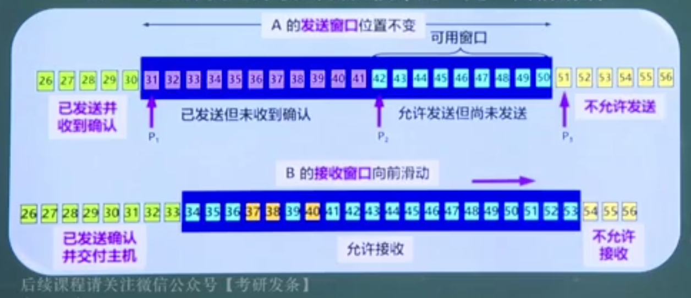

## 数据链路层概述

> 五星重难点

传输的基本单位是 帧，在对等的数据链路层之间的数字管道中传输，注意他并不必考虑比特的传输

不同的链路层可能采用不同的数据链路层协议

广域网中的主机、路由器等都必须实现数据链路层（还包括网络层和物理层）

- 广域网中实现的点对点通信

局域网中的主机、交换机等都必须实现数据链路层（不包括网络层）

- 局域网内部往往刺采用广播通信

## 数据链路层的功能

也是数据链路层的基本问题

- 封装成帧
- 透明传输
- 差错控制
- 流量控制

### 封装成帧

物理层接收到的比特会上传到数据链路层，链路层会对这串比特加上帧首部和尾部，表明这是一段帧，最常用的办法是加上控制字符 SOH(start of header) / EOT(end of transmission)，表示帧的开头和结尾

两种封装方法：

- 字符计数法：在首部加入内容比特的长度，一旦出错，对正确性的影响最大，一般不用
- 字符填充的首尾定界符法：加入帧头（DLE STX）和帧尾（DLE ETX）
- 比特填充的首位标志法
- 违规编码法

### 透明传输

若数据中某个字节的二进制代码切好为 SOH / EOT，链路层就会找到错误的帧边界

为了处理以上问题，在处理数据的时候使用字节填充，碰到 SOH 的数据，就在原数据前加上 ESC，碰到 ESC、EOT 同理，这样就避免了错误边界的产生（就像反斜杠转义）

### 差错控制

数据传输过程中可能会出现比特差错，即1变为0，0变为1

- 误码率：传输错误的比特占比特总数的比率
- 在数据链路层中广泛使用循环冗余检验 CRC 的检错技术

CRC 技术：在原始数据，k 位数据位后添加 n 位冗余码，一起发送，在接收端检测冗余位的误码率

- 补 3 位 0 的数据，设原始数据 101001，补3位0则为 101001000
- 给定除数 P = 1101，用 101001000 除以 P，这里注意，二进制除法，实际上就是在各位上进行异或操作（不同为1，相同为0）
- 得到余数 R = 001，商 Q = 110100
- 用余数 011 代替原先补的3位0，得到所需数据 CRC = 101001011
- 再用 CRC 除以 P，若余数为 0，则接受，反之则丢弃数据（认为失真严重）

两次除以 P，第一次得到 CRC，第二次用 CRC 补全判断余数是否为 0

注意：CRC 循环冗余技术只能做到无差错接受（发送什么就收到什么），但无法提供可靠传输（没有确认和重传机制）

- CRC 无法决定数据之间的传输顺序
- CRC 不能保证数据传输过程中不丢失
- CRC 无法判断重复数据

数据链路层协议都是不可靠的传输协议

## 流量控制

> 相对重要，频率高难度大

### 机制

#### 循环队列

- 线性结构：首、尾、前驱和后继
- 队列：尾进头出（排队出站）

避免队列的假溢出（尾指针超过上界，但元素未满，因为添加/删除过程中头/尾指针不断后移） ——> 循环队列

流量控制：让接收方来控制发送方发送数据的速度，避免发的太快，接收方无法有效、准确的处理发送的数据，造成溢出或者丢失

- 一种点对点控制，即接收方控制发送方（1v1）

在数据传输过程中

- 发送方A和接收方B分别维护一个发送窗口和一个接受窗口
- 发送窗口表示：没有收到确认时，继续发送数据直到空
- 接受窗口表示：只允许接受落入窗口内的数据

#### 停止-等待机制

发送方每发送一帧数据后，必须等待接收方的应答后，才继续发送下一帧数据

#### 滑动窗口机制

按照窗口大小，流量控制可以分为三种

- 发送、接收窗口均为 1
- 发送窗口 N，接收窗口 1
- 发送窗口 N，接收窗口 M

当发接窗口均为 1 时，实际上就是使用的**停止-等待协议**

- 正确情况：发送 - 接收 - 确认 - 发送下一数据
- 错误情况：发送 - 计时 - 超时未收到确认 - 重传数据
  - 这里涉及到数据的重发次数问题，需要对重发的数据进行编号，第一次编为 0，重传的编为 1（只需要一个比特编号）

### 网络利用率

最大利用率

- 数据发送时延 t1
- 数据传播时延 t2
- 确认信息发送时延 t3
- 确认信息传播时延 t4

网络利用率即为发送数据的时间除以总时间：t1 / (t1+t2+t3+t4)

分为以下几种情况，一般为后两种

- 正常情况，发送接收确认均单独考虑
- 等长确认帧：即 t1=t3，t2=t4，网络利用率为 t1 / 2(t1+t2)
- 忽略确认帧：等长基础上忽略确认帧的发送时延 t3，此时利用率为 t1 / (t1+t2+t2)

### GBN & SR 协议

#### 后退 N 帧滑动窗口协议

发送窗口 N，接受窗口为 1

发送方一股脑发送很多，然后开等，接收方进行**累计确认**，如一共发送 7 个数据，接收方确认了第 7 个数据，则说明 7 个数据全部确认

这里累计确认还有另一重意义，如发送七个数据，确认了 0、2、3，这说明 0、1、2、3 个数据是没问题的，从第四个数据开始重传

如果在 N 处出现错误，发送方 "go back N point"，从第 N 个数据帧开始重发

编号问题：发送窗口 N 个数据帧的编号为帧的下标（从0始）模上 N，发送窗口的编号实际上是一个滚动的循环队列，编号始终在 0~N-1；接收窗口大小为 1，接收到的单个帧编号也在 0~N-1

编号所需的数据位 n 需要满足 2^n >= 发送窗口大小

- n 位数据可以编号 2^n 数（如 00,01,10,11）
- 在发送窗口中不能出现两个编号 0，这样在一次发送中将无法辨别，于是 2^n >= N，（N 为窗口大小）

不足之处：网络好时效率很高（确认次数少），但一旦网络差，回退成本很高

网络利用率：Nt1 / (t1+t2+t3+t4)

- 发送时延 t1
- 传播时延 t2
- 确发时延 t3
- 确传时延 t4

在整个 (t1+t2+t3+t4) 的时间范围内共发送/接收了 发送窗口大小N 个数据，且发送时延为 t1，于是网络利用率要乘上 N

- 为什么这样？率应该是单位时间个数的效率

同样也存在等长确认帧和忽略确认帧的情况

#### 选择重传滑动窗口协议

发送窗口 N，接收窗口 M，要求 N > M（肯定是这样，因为必然是小控制大，不然流量控制就没有意义了，都供不应求了还控制啥）

关于发送和出错处理：不支持累计确认，即一个个确认；哪里出错传哪里（不同于哪里出错回哪里），在错误情况下利用率显著提高

关于编号：因为两个窗口大小均大于 1，需要维护两个循环队列进行编号，同样的，编号位数 n 要满足 2^n >= 发送窗口大小+接收窗口大小

关于利用率：Nt1 / (t1+t2+t3+t4)

- N 为发送窗口大小

### 计算题

#### 窗口大小的讨论

> 当接收窗口大小为 1，能够保证帧的有序性

当编号位数为 n 时，总共编号数则为 2^n，发 >= 接

| 情况                | 有序接收 | 最小发送窗口 | 最大发送窗口 | 最小接收窗口 | 最大接收窗口 |
| ------------------- | -------- | ------------ | ------------ | ------------ | ------------ |
| 停止等待            | true     | 1            | 1            | 1            | 1            |
| GBN（go back n）    | true     | 2            | 2^n-1        | 1            | 1            |
| SR（select resend） | false    | 2^(n-1)      | 2^n-1        | 2            | 2^(n-1)      |

连续 ARQ 协议：GBN 和 SR

只有 SR 协议是无序接收，当发送窗口最小接收窗口最大时，性能最好

#### 利用率的讨论

正常情况，这里的 N 是发送窗口大小，和帧编号比特位 n 的关系为 2^n >= N
$$
\frac{N\times t_1}{t_1+t_2+t_3+t_4}
$$
等长确认帧
$$
\frac{N\times t_1}{2\times(t_1+t_2)}
$$

忽略确认帧
$$
\frac{N\times t_1}{t_1+t_2+t_2}
$$

#### 带宽的讨论

> 链路上所耗时间即为传播时延

带宽 = 数据量 / 时间，带宽其实也就是最大平均数据传数速率

实际带宽，n 为发送窗口大小
$$
\frac{n\times 帧长}{t_1+t_2+t_3+t_4}
$$
理论带宽（考题带宽），即题干中给出的带宽，大于实际带宽

注意一定要将字节转为字，1 字节 = 8 bit

## 介质访问控制

总线型介质访问

分时和共享

使用一对多的广播通信模式，多个计算机发送数据时信道很有可能发生冲突

### 信道划分介质访问控制

> 也叫静态划分方式

就是多路复用，无冲突，但效率较低

- 频分多路复用
- 时分多路复用
- 波分多路复用
- 码分多路复用

复用：即多个站点通过同一道信道进行传输，对信道的复用

#### 频分复用 FDMA

将带宽通过频率分段，各个站点在各自的频带进行传输，在同样的时间占用不同的带宽资源

#### 时分复用 TDMA

每个用户在不同时间段使用信号，划分 TDM 帧，进行数据传输

#### 波分复用 WDMA

光的频分复用，在光纤中传播，不同频率的光对应不同的用户

#### 码分复用 CDMA

给每个站点规定自己独有的码片，长度固定为 m bit，当他要发送 1 的时候，就发送该码片，要发送 0 时，就发送码片的二进制反码

如 P 站的码片为 00011011

- 发送1：00011011
- 发送0：11100100

码分复用的规格化内积：将收到的二进制码按照码片长度 m 进行分组，和站点的码片进行内积运算（向量内积，懂？）

- 若内积结果为正，表示是该站发的1
- 为负，表示是该站发的0
- 为0，表示不是该站发送的信息

如 S 站码片为 0101，收到数据位 0 1 0 1，0 0 0 0，0 -1 0 -1
$$
\begin{pmatrix}
0&1&0&1
\end{pmatrix}
\begin{pmatrix}
0\\1\\0\\1
\end{pmatrix}=2
$$

$$
\begin{pmatrix}
0&1&0&1
\end{pmatrix}
\begin{pmatrix}
0\\0\\0\\0
\end{pmatrix}=0
$$

$$
\begin{pmatrix}
0&1&0&1
\end{pmatrix}
\begin{pmatrix}
0\\-1\\0\\-1
\end{pmatrix}=-2
$$

所以第一组发的1，第二组不是 S 发的，第三组发的0

### 随机访问介质访问控制

> 也叫争用型方式，考得较多
>
> 注意，争用型方式均有可能发生冲突

两个节点同时发送数据，一去一来，同一频率，数据将发生冲突

#### ALOHA 协议

> 最简单、最早想到的方法

只要有数据，就可以直接发送，当一段时间内没有收到确认，认为发生冲突，等待一会儿后重发，当年成功率只有 18.4%

#### CSMA 协议

载波侦听多路访问协议：发送前先侦听一下信道是否空闲

##### CSMA 的三种策略

- 1-坚持 CSMA：监听，空闲则发，忙则持续监听
- 非坚持 CSMA：监听，空闲则发，忙则歇一会儿再监听
- p-坚持 CSMA：监听，空闲时，以 p 的概率发，(1-p) 的概率不发，忙则不发，若不发，延迟一段时间再监听

但只能保证别人在发时不发，但不保证两者同时向同一信道发送数据

#### CSMA/CD 协议

CSMA 存在这样的问题，a、b 同时监听到信道 q 空闲，于是同时想信道 q 发送数据，造成冲突

为了处理这种情况，站点在总线上发送数据时，总线上的信号电压变化值将增大，当一个站检测电压摆动值门限值时，认为发生了碰撞，不发送数据

##### CSMA/CD 的工作过程

- 先听后发：检测是否空闲
- 边听边发：一边发，一边检测有无冲突
- 冲突停发：一旦有冲突，立即停发
- 随机重发：等待一个随机时间，再次发送

冲突停发的冲突期：最先发送数据帧的站，发送数据帧后 2p（最远站点一来一回的时延） 后，就可以直到发送的数据帧是否遭受了碰撞

为了保证站点在传输时能检测到冲突，传输时延 T1 至少是单向传播时延 T2 的两倍，因为在传输过程为 T1 中，要收到回传的冲突信息至少要 2T2（即第一个数据发送达到后立即传回冲突信息，一来一回之下为2T2），于是 T1 >= 2T2

最小帧长即为 2T2 乘以带宽，这样才能保证在传输过程中检测到冲突

- T2 = 传输距离 / 传输速度

##### 二进制指数类型退避算法

即随机重发的规则

- 争用期 2p
- 取整数 k = Min(重传次数, 10)
- 在整数集合 [0, 1,..., 2^k-1] 中随机取一个整数 r，重传时延则为 r x 2p
- 当重传次数达到 16 时，丢弃该帧，向高层报告

小tip：k 最大为 1023，当重传次数小于等于 10 时，r = 重传次数

注意：冲突信号只存在于 CSMA/CD 协议中，在 CSMA/CA 协议中提前避免了冲突；首次重传的帧再次发生冲突的概率最低，因为 k 越大，从概率上讲，等待的时间会越长，越容易冲突

#### CSMA/CA 协议

载波侦听多路访问/冲突避免，应用于无线局域网

先检测信道是否空闲，若空闲，等待一段时间，再次检测，若仍空闲，立即发送数据；否则（即不空闲），随机等待一定时间后，再次发送检测

因为涉及到多次检测，需要对信道的状态进行标记，即空闲零次/空闲一次/空闲两次，这里有三种空闲的检测方法：

- 能量检测：对接收信号能量大小进行判断，是否超过阀值
- 载波检测：对接收信号与本地 PN 码进行运算比较，若超过某一极限，认为信道被占用
- 能量载波混合检测：通过发送报文的方式检测，先发送请求传送报文 RTS，直到收到目标端响应报文 CTS 后，发送端才开始传送真正的数据（报文很小，基本不影响整体效率）

##### 带确认的发送机制

需要接收方的确认信息 ACK，若有则说明接收到了；若无则重传该帧，直到收到 ACK，若若干次均为收到 ACK，丢弃

### 轮询访问介质访问控制

> 无冲突

主要用在**令牌环局域网**中

协议为**令牌传递协议**

在令牌环局域网中，各站点在逻辑上构成一个由信道连接的环，令牌在环上传递，接收 a 的帧后，依次传递到 e，放下帧，继续轮询

注意，令牌上有数据时，将不再接收新的数据；无需发送数据时，令牌将在坏上空转

就像在一个环形镇子上，只有一辆不能拼车的的士到处接客
