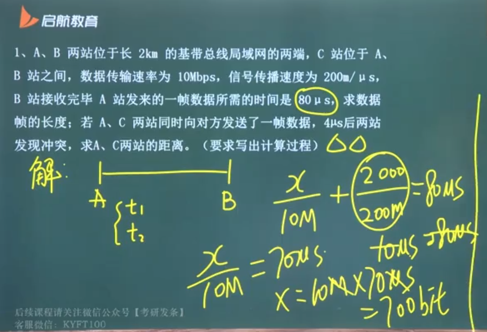
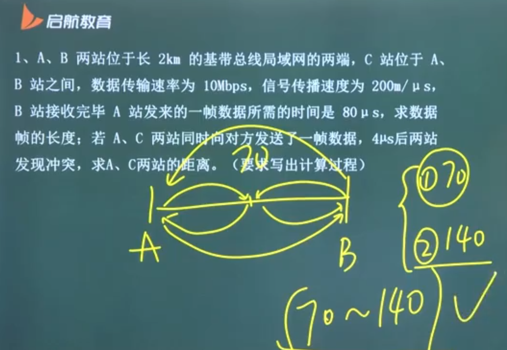

## 局域网的数据链路层

> 被一个学校、单位、楼使用的网络

主机与主机之间通过交换机（数据链路层设备）连接在一起，局域网中的主机和交换机实现数据链路层

局域网之间通过路由器连接在一起

### 特点及三要素

特点

- 物理范围较小
- 专门的传输介质，速率高
- 延迟短，可靠性较高
- 支持多种传输介质
- 往往采用广播的通信模式

局域网的三要素：

- 网络拓扑结构：星型网、环形网、总线型网和树形网
- 传输介质：双绞线
- 介质访问控制方法

### 以太网子层

局域网的标准：以太网

- 在考试里面，数据链路层的局域网约等于以太网，而以太网等于802.3局域网

**LLC & MAC**

IEEE 802 将局域网的数据链路层拆成两个子层

- 逻辑链路控制 LLC（logical link control） 子层：向上给网络层提供服务，与传输媒体无关
- 媒体接入控制 MAC（medium access control） 子层：向下连接物理层

### 以太网服务、编码及争用期

以太网提供的服务：尽最大努力的交付（不可靠）

当收到有茶错的帧时直接丢弃，差错的纠正由高层处理，并且无法识别帧是否是重传的

#### 编码

以太网发送的数据使用曼彻斯特或差分曼彻斯特编码（为了保证同步），码元率 = 2数据率（因为曼彻斯特需要两个码元，才能产生一个“变化”，即传递一个比特）

#### CSMA/CD - 争用期

争用期指最远两端的往返时延 —— 能够知道是否发生碰撞（冲突），也叫碰撞窗口

如果过了争用期仍未检测到碰撞，则肯定这次发送不会发生碰撞

10 Mbit/s 以太网争用期的长度：
$$
51.2\mu s
$$

- 在争用期，10Mb/s 的以太网可以发送 512bit，即 64 字节的数据，带宽乘以时间 ——> 时延带宽积
- 所以，若前 64 字节数据未发生冲突，则之后的数据就不回发生冲突
- 这个 64 字节也被称为 10Mb/s 以太网的最短有效帧长

推广到一般：最短有效帧长 = 争用期 × 发送速度（带宽）

- 就是**时延带宽积**

以太网规定了最短有效帧长为 64 字节，凡长度小于 64 字节的帧都是由于冲突而异常中止的无效帧

### 以太网 MAC 层

#### MAC 层的通信方式

广播模式只能实现一对多，点到点通信实现一对一

以太网将计算机连在一条总线上，这意味着一发送全部站点都会收到数据，很容易实现一对多的通信

收到数据不意味接收，MAC 层以此实现一对一通信

- 将目标接收站的硬件地址写入帧首部的目的地址字段中
- 仅当帧中目的地指与适配器的硬件地址一致时，才接收该数据帧

硬件地址，也叫物理地址、MAC 地址

- 48 位的 MAC 地址
- 前六个字节（低 24 位）的后三个字节由厂家自行指派

#### MAC 地址类型

- 广播地址（一对全体，校园广播）：FFFF FFFF FFFF，所有局域网上的计算机均接收
- 多播地址（一对多，班级广播）：01005E000000 ～ 01005E7FFFFF，只要 MAC 地址在这一范围内，即为多播地址
- 单播地址（一对一，私信）：只要不是上两种，就是单播地址

MAC 地址（硬件地址）其实就是网卡地址，焊在网卡上的

~~~bash
yay -S net-tools

# 查看网卡地址
ifconfig
~~~

#### 网卡

MAC 层也就位于网卡上，网卡也叫 通信适配器、网络接口卡 NIC

网卡的重要功能：

- 进行串行/并行转换
- 数据缓存
- 在操作系统安装设备驱动程序
- 实现以太网协议

装网卡驱动实际上就是在实现以太网协议，以实现无线上网

局域网中常常是串行通信，而计算机内部尝是并行通信，这里就涉及到传并行的转换（通过 MAC 实现）

#### 信息处理

从局域网中收到帧后，先检查本机 MAC 和帧中的目的 MAC 是否一致

- 若相同，则接收
- 若不同，则直接丢弃，不作任何处理

MAC 地址本质上来讲就是一个二进制标记（身份证号）

### 以太网的帧格式

> 有人的地方就有江湖
>
> 拿到标准即拿到下一代发展的权利

MAC 帧格式有两种常用标准

- DIX Ethernet V2 标准
- IEEE 的 802.3 标准

最常用的 MAC 帧是以太网 V2 的格式

固定格式共占 6 + 6 + 2 + 4 = 18 B，帧的有效长度为 64～1518 B，其中有效数据长度为 46～1500 B

- 目的地址：目的 MAC 地址，占 6 字节，和硬件地址保持一致
- 源地址：发送方的地址，也占 6 字节
- 类型：指明帧向上交给什么协议处理，即指定给谁提供服务，占 2 字节
- 数据：46～1500，数据的有效长度
- FCS 校验信息：校验值，占 4 字节，将校验结果放在该处，检测成功率极高

无效的 MAC 帧

- 数据长度和长度字段指不一致
- 帧长度不是整数
- 帧检验序列 FCS 查出有差错
- 数据字段长度不在 46～1500
- 帧长度

直接丢弃，不关心是否重传

另外，还有 8 个字节的前导码，包含 7 字节的前同步码和帧开始定界符

例题：

## 广域网的数据链路层

> 这种信道往往使用一对一的点对点通信模式，因为一般来说信道很长，广播代价很大

连接不同的局域网，让信息在局域网之间通信，通过路由器进行跨网络通信，涉及到网络层

|      | 广域网             | 局域网        |
| ---- | ------------------ | ------------- |
| 距离 | 几十公里到几千公里 | 某一区域      |
| 协议 | PPP、HDLC          | CSMA、CSMA/CD |
| 连接 | 节点交换机         | 路由器        |
| 层次 | 下三层             | 下两层        |

### PPP 协议

要求

- 简单
- 封帧
- 透明
- 多种网络层协议
- 多种链路
- ......

无序要的功能

- 纠错 ——> 不可靠
- 流量控制
- 序号
- 多点线路
- 半双工或单工链路

#### PPP 协议的组成

一个将 IP 数据报封装到串行链路的方法

- 封帧方法

链路控制协议 LCP（link control protocol）

- 管理数据链路层
- 匹配不同的数据链路层

网络控制协议 NCP（network control protocol）

- 对上承接网络层协议
- 匹配不同的网络层

#### PPP 协议的帧格式

7E FF 03 + 协议 + 数据 + FCS + 7E

以 7E 开头/结尾（并不算在帧内），FF 为硬件地址（不起作用），03 为控制字段，FCS 为校验值

因为以 7E 作为首尾，若在数据中出现了 01111110，将按照如下规则处理

- 若为异步传输：使用转义方法，即用字符填充
- 若为同步传输：硬件填充，0 比特填充法，在遇到连续的 5 个 1 之后，补一个 0，接收方会删掉连续 5 个 1 后的 0，也叫位填充

#### PPP 协议的运行

分为四个阶段

- 建立链路（LCP）
- 验证（PAP / CHAP）
- 网络控制协商（NCP）
- 终止（LCP）

特点

- 不使用序号和确认机制
- 只支持全双工
- 面向字节，帧长度均整数
- 只支持点对点链路通信
- 面向连接但不可靠
- 具有身份验证功能

##### 建立链路

使用 LCP 协议在链路两端建立连接，动态协商一些参数，比如双方使用的认证方式、是否支持压缩和 MLP（多路复用、负载均衡）

交换 LCP 报文

##### 验证

PAP 口令验证协议

CHAP 挑战握手身份验证协议

解决安全问题

##### 网络协商控制

根据 NCP 的协商建立并配置 IP、IPX、AppleTalk 等网络层协议，以及建立并中断会话

##### 终止 PPP 链路

同样使用 LCP 协议

### HDLC 协议

面向比特的数据链路层协议

#### 帧类型

信息帧（I 帧）：传递有效信息和数据

监控帧（S 帧）：监视和控制数据链路，完整信息帧的接收确认

无编号帧（U 帧）：确认存活，相当于“在吗”

- 因为 HDLC 是同步传输，必须保证两端在线

#### 三种操作方式

主节点和从节点	

##### 正常响应方式 NRM

主节点作为主控方

##### 异步响应方式 ARM

从节点作为主控方

##### 异步平衡方式 ABM

主从同一地位

#### 特点

- 依赖于比特，不依赖任何一种字符编码集
- 同样使用 0 比特插入法
- 全双工通信，效率较高
- 采用 CRC 检验，对信息帧顺序编号，可靠性高
- 传输控制功能和处理功能分离，灵活性高

## 数据链路层设备

### 网桥

#### 两个基本概念

碰撞域：有可能产生帧冲突的网络部分

信号或者数据不经过任何筛选或者过滤

广播域：任何一个设备发出 IP 广播通信，都可以被该部分网络中其他设备所接收，那么这些设备处于同一广播域

- 具有处理 IP 地址的机器才可以隔离广播域

#### 概述

在数据链路层使用网桥扩展局域网

网桥工作在数据链路层，根据 MAC 帧的目的地指对收到的帧进行转发

网桥具有过滤帧的功能，即先确认方向，再决定向哪转发

如何确认方向？

在网桥内部维护有一张站表，不同主机对应相应接口，当识别到主机的 MAC 地址时，向表中相应接口转发

### 透明网桥

目前使用最多的网桥，透明是指站点并不知道自己转发的帧会经过哪些网桥

自学习算法处理帧和建立转发表（逆向学习算法）

- 从 A 发出的帧从接口 x 进入网桥，那么就认为从 x 除法沿着相反方向就可以将帧传送到 A
- 网桥每收到一个帧，就记下其源地址和进入网桥的接口，作为站表（转发表）的一个项目

建表时，将源地址作为键，接口作为值记录在表中

转发帧时，将帧首部的目的地址作为键，在表中查询到相应接口进行转发

另外，在建表的时候要登记每个键值对的时间，只保留最近的状态信息，保证网络最新的拓扑状态

#### 运行过程

- 学习：建立转发表
- 转发：使用目的 MAC 地址
  - 若表中无目的地址，对除了来源接口以外的所有接口进行转发
  - 若目的地址在表中指向来源接口，丢弃
  - 若目的地址在表中存在且对应接口不是来源接口，正常转发

转发和学习是一个整体，收到帧便开始学习，建立/更新站表，同时查表进行转发

#### 存在的问题：回路

两个网桥 s1, s2 有两个接口 a, b 相连，当表为空时，将帧进行广播，s2 通过 a 播向 s1，s1  又通过 b 播回 s2，s2 由通过 a 播向 s1......形成循环

IEEE 802.1D 标准制定了一个生成树协议 STP（Spanning Tree Protocol）

将图转换成无回路的生成树，消除兜圈子现象

### 源路由网桥

透明网桥的网络资源利用不充分，自学习过程的站表很有可能不是最优

**源路由网桥**让发送方指令所经过的网桥/路径

发送方又如何知道他该怎么走？

在真正发送数据之前，发送方会广播一个发现帧，这些发现帧会根据各个网桥的站表规则向目的地址发送，当到达目的地址后，该发现帧将按原路经返回发送方，发送方会在返回的诸多发现帧中选取最佳路径，写入数据帧的首部，再进行发送

#### 网桥优缺点

好处：

- 过滤通信量
- 扩大物理范围
- 提高可靠性
- 可互联不同的物理层、不同 MAC 子层和不同速率的局域网

缺点：

- 增加时延
- 在 MAC 子层并没有流量控制功能
- 不同 MAC 子层的网段桥接在一起时延更大
- 只适合用户数不多（不超过100个）和通信量不太大的情况，否则会产生**广播风暴**

### 多接口网桥

又称为以太网交换机、第二层交换机（表明该交换机仅工作在链路层）

全双工通信信道

两种交换模式

- 直通式交换：之检查前 6 个字节的数据报，若数据大于 6 个字节，直接转发；若不，认为其为碎片不转发

  这样会引起 48bit / 带宽 的转发延迟

- 存储转发式：先将收到的帧线存储下来，数据正确才发送，不然不发

  可靠性高，但延迟太大

#### 带宽的讨论

物理层中，集线器和中继器处于同一冲突域，共享带宽（取平均值）

网桥和交换机是全双工工作方式，独占带宽（自己占有）

#### 冲突域和广播域的讨论

| 设备           | 冲突域   | 广播域   |
| -------------- | -------- | -------- |
| 集线器、中继器 | 不能隔离 | 不能隔离 |
| 网桥、交换机   | 可以隔离 | 不能隔离 |

如 16 个端口的集线器/中继器，有 1 个冲突域，1 个广播域；16 个端口的网桥/广播域，有 16 个冲突域，1 个广播域

- 隔离广播域需要处理 IP 地址
- 隔离冲突域需要编址能力，如 MAC 地址

底层把该层统一起来，向高层提供统一的服务，无法决定高层使用什么服务，也不能处理高层的不同服务

网桥的工作原理：

- 学习过程
- 转发过程

例题：07 1:22:00
