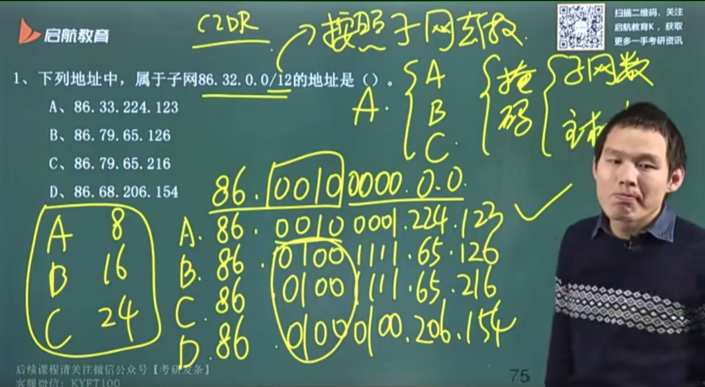
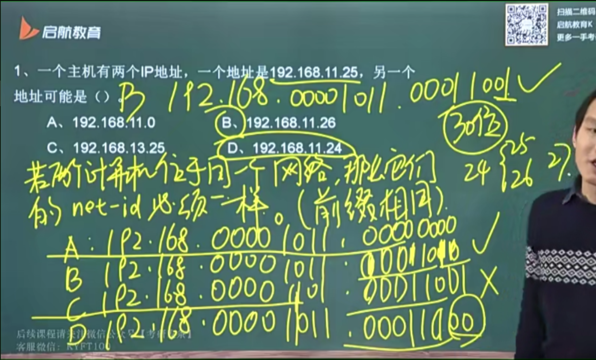
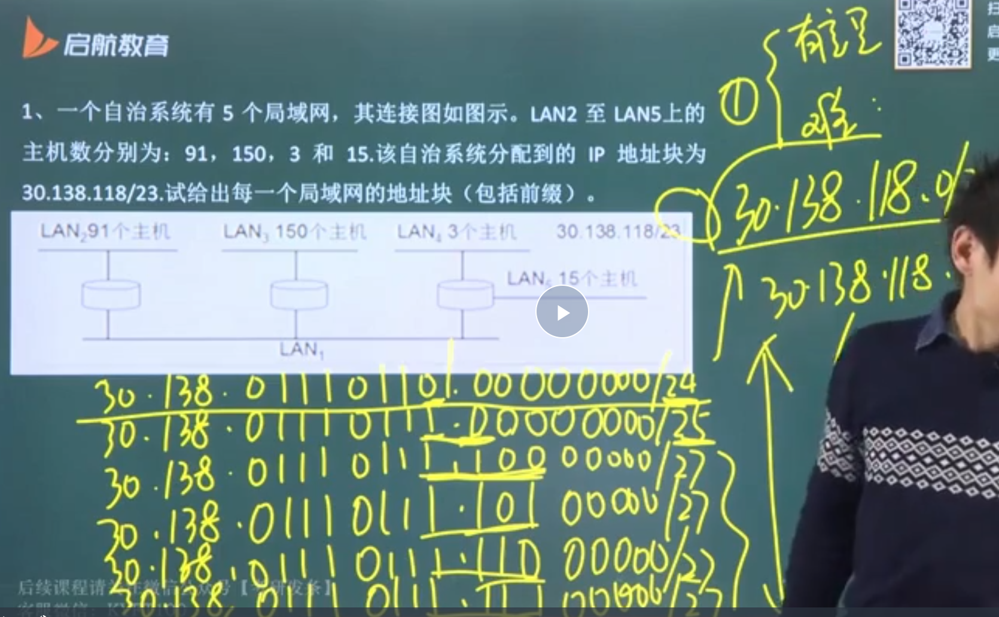
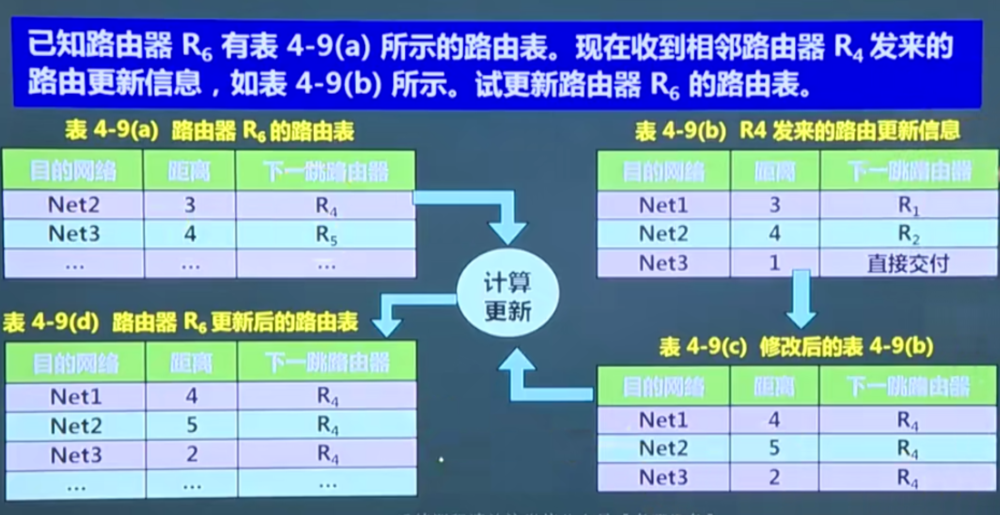
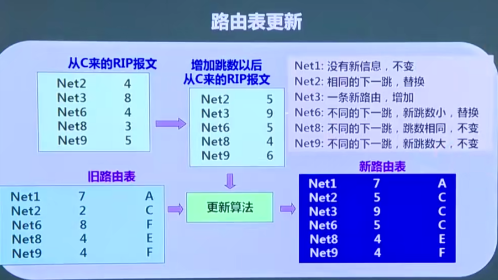

## 概述

### 网络层概述

> 网络层是最重要的章节

网络层向上只提供简单灵活的、无连接的、尽最大努力交付的数据报服务

网络在发送分组时不需要先建立连接，每个分组（IP 数据报）独立发送，与其他分组无关，也不进行编号

不提供服务质量的保证，分组有可能出错、丢失、重复和失序，以及时限

分组在互联网中传递，常会经过许多异构的网络

### 网际协议：IP 协议簇

与 IP 配套的有三个协议

- 地址解析协议 ARP：Address Resolution Protocol
- 网际控制报文协议 ICMP：Internet Control Message Protocol
- 网际组管理协议 IGMP：Internet Group Management Protocol

ICMP、IGMP 向上层传输层提供服务，ARP 向下网络接口层调取服务，IP 工作在二者之间1

## IP 地址

网络层连接异构网络，需要一种方案来标识异构网络，这种标识符也就是 IP 地址

- 上一种标识符是 MAC 地址，用于标识硬件，IP 地址用于标识一整块网络

分类的 IP 地址：最基本的编址方法

改进方案：

- 子网的划分
- CIDR
- 私有 IP
- IPv6

### 分类 IP

将 IP 地址划分成若干个固定类

- 每一类地址都由两个固定长度的字段组成，其中一个是网络号 net-id，标志主机/路由器连接到的网络；另一个是主机号 host-id，标志该主机，共 32 位二进制代码
- 网络号和主机号的组合在指定网络范围内必须是唯一的
- 一个 IP 地址在整个互联网范围内是唯一的，一个 IP 对应一个主机

根据网络号和主机号所占位数不同，分为以下 5 类地址

- A 类地址：8+24
- B 类地址：16+16
- C 类地址：24+8
- D 类地址：1110+多播地址
- E 类地址：1111+保留为今后使用

32 位二进制代码书写并不方便，于是我们将其 8 位分为一组，然后化为十进制
——> 点分十进制

一些特殊的 IP 地址：

- 0.0.0.0
  - 代表本网络
  - 代表 DHCP 请求的源 IP 地址
  - OSPF 的根区域
- 255.255.255.255
  - 代表全网广播
  - 代表 DHCP 请求的目的 IP 地址
- 127.0.0.0：环回地址
- 网络地址：主机位全为 0
- 广播地址：主机位全为 1

#### 有效 IP 地址

以 c 类 IP 为例，hots-ip 共 8 位，于是有 2^8 = 256 种编号，但是要去掉两种特殊 IP

- 网络地址：0.0.0.0
- 广播地址：255.255.255.255

于是有效 IP 地址为 254 个 ——> 推广到一般，若主机地址 n 位，那么有效 IP 共 2^n-2 个

#### 分类 IP 特点

管理机构只分配网络号，主机号由单位分配，注意数据在互联网中的转发只考虑网络号

一个网络对应一个 IP 地址，这意味着，若一个主机连接有两个网络，那么他就有两个不同的 IP 地址；路由器至少连接有两个网络，也就意味着他至少有两个 IP 地址

用转发器/网桥连接的局域网仍属于同一个网络，共用一个网络号

### 子网划分

由于主机号太多了，特别在a、b网络中，24位和16位的主机号，很多单位根本用不上这么多 IP 地址，于是我们采用子网（subnet）的方式对 IP 地址进行分组

如 172.24.12.52（这是一个b类网络，因为首字节位于128-191），我们将其第三个字节作为子网IP，划分为

- 172.24.9.xx
- 172.24.12.xx
- 172.24.24.xx

这样就大大提供了IP地址的利用率

#### 子网掩码

划分子网的过程中出现了新的问题，就是无法区分哪是子网IP，就比如 172.24.12.52，我怎么知道那个 12 是代表子网ip还是主机ip的一部分

于是我们引入子网掩码

其长度和完整的ip地址保持一致，即 32 位，从左往右是一串连续的 1，从右往左是一串连续的 0，1 对应的位置的就是网络号和子网号，相应 0 对应的位置就是主机号

- a类的标准子网掩码：255.0.0.0
- b类的标准子网掩码：255.255.0.0
- c类的标准子网掩码：255.255.255.0

再通过首字节范围判断网络类型，确认网络号长度，于是将三个部分分开

- a类：0-127
- b类：128-191
- c类：192-225

#### 网络地址和IP地址

如何将IP地址转为网络地址？

- 根据子网掩码和首字节范围确定网络号、子网号和主机号
- 将IP地址和子网掩码位做与操作（全为1才为1）
  - 这也意味着网络位保持不变（网络位的子网掩码处全为1）
  - 但子网位很有可能变化，因为子网位借的主机位，主机位的子网掩码为0，有可能发生变化
- 将主机位全置零，网络位保留，得到网络地址

注意：在规范的IP地址中，主机号不能全为0或1

子网掩码（十进制）转二进制

- 128 一个 1
- 192 两个 1
- 224 三个 1
- 240 四个 1
- 248 五个 1
- 252 六个 1
- 254 七个 1
- 255 八个 1

子网数量：2^子网位数（子网位编号）

每个子网的有效IP数：2^主机位数-2（主机位编号-网络/广播地址）

重点在于：确定网络类别，确定子网借了几位，与操作写就行了

#### 无分类编址 CIDR

> 无类别，子网掩码的变种

CIDR消除了传统的a、b、c类地址以及划分子网的概念

CIDR使用网络前缀（network-profix）代替分类地址中的网络号和子网号，相当于**子网掩码**

IP地址 = 网络前缀+主机号，在表示的时候使用斜线法

如 128.14.32.0/20 表示有 20 位的网络前缀，12 位的主机号，在分配的时候，网络前缀是始终不变的，即只改变主机号，于是这个网络共有 2^12 个有效IP地址

- 在 CIDR 中，主机位可以全为 0/1

当主机位 2 位，前缀/网络尾 30 位，只有两个有效 ip，常应用于串行线路，两个机器一对一连在一起

判断 ip 地址是否处于同一网络的两种方法：

- 将所有 ip 二进制展开，逐位对比
- 将网络地址的范围写出，判断每 8 位是否在范围内（因为存在子网号借位）

重点在于，同一网络的前缀一定相同，这里的前缀指网络号（包括子网号）

#### 路由聚合

将前缀相同的网络聚合在一起，路由聚合也成为**构成超网**

如何聚合？

- 取出公共前缀
- 将非公共前缀置零，即得到这几个网络的超网

#### 网络分配问题

网络优先：当每个子网所需的主机数相同时，优先考虑分配子网数量，即 2^n 个子网数，n 为子网位数量，然后根据网络类别考虑主机位数

- 网络优先分得的各个网络都是等大的，没有最小/大的概念

主机优先：适用于每个子网中主机数不同

- 从地址要求多的网络开始划分主机位数
- 每向后划分一位，都会将原网络一分为二；划分两位（等分四份），即一分为四
- 当划分到最后需求都不多时采用等分的方式

主机优先的分配方式也叫下楼梯，网络位逐位向后扩展，呈阶梯状

需要注意的是，当一个网络被分好后，以这个网络为前缀的网络都不可有再分了

比如需要 150 个主机，分配 8 个主机位，网络位 24 位，此时固定前 24 个网络位，算作已分配，若想继续分配其他 ip，需要把第 24 位从 0 改成 1，算作新的网络号继续分配

- 为什么是第 24 位而不是更前面呢，因为我们在主机优先分配时，先从主机需求大的网络进行分配，即继续分配时不会超过上一次的阀值

尽可能提高 ip 地址利用率：使用主机优先，首先去分大号主机，再向下延伸

若要求分得最大子网或最小子网，需要使用逐层阶梯下降主机优先方法

### 私有 IP

> 局部性原理

私有地址也叫专用地址、本地地址，仅在机构内部使用的IP地址，可由本机构自行分配而不需要申请

全球地址，全球唯一的IP地址，需要买

- 就像在学校里用学号，而很少用身份证，但出门在外得用身份证

三个专用私有IP地址块

- A类：10.0.0.0-10.255.255.255，记为10.0.0.0/8
- B类：172.16.0.0-172.31.255.255，记为172.16.0.0/12
- C类：192.168.0.0-192.168.255.255，记为192.168.0.0/16

IP是收钱的，使用专用IP仅在内部使用节约成本，专用IP地址也叫做**可重用地址**

#### 网络地址转换 NAT

私有IP无法出现在互联网上（出校了不能用学号）

需要在路由器上安装软件 NAT，network address transform，这样的路由器叫做 NAT路由器，它至少有一个有效的全球IP地址

NAT 的作用是将私用IP翻译成路由器所拥有的IP，出入多经过一层，在 NAT 种有一张手动配置的表格，将公用地址对应内部的私有dizhi

- 离开专用网时，替换源地址，将内部地址替换为全球地址
- 进入专用网时，替换目的地址，将全球地址替换为内部地址

#### NATP

多个私有IP映射到同一个公有IP的不同端口，以此实现公用对私有的一对多

### IPv6

IPv4顶破天只有 2^32 个IP地址，总有一天会用完，于是使用 IPv6 规则，将 32 位扩展到 128 位，共 2^128 个IP地址（据说一个树叶一个IP都够用）

8 字节对齐

#### 首部格式

首部长度固定为 40 字节，首部字段数为 8 位二进制数，占第一个分组的前半部

#### 冒号十六进制记法

用冒号分隔十六进制，将共 128 位分成 8 组，每组为 16 位二进制，用十六进制表示，即每四位二进制表示为一个十六进制数，每组四个

简写：0000 ——> 0，0001 ——> 1

零压缩，将连续的 0 压缩成两个冒号

#### IPv6 的地址

类型：

- 单播：点对点播
- 多播：一对多播
- 任播：将数据报交付给距离最近的一组计算机

特殊地址：

- 未指明地址：::/128
- 环回地址：::1/128
- 多播地址：FF00::/8（首部全为1）
- 本地链路单播：FE80::/10（前十位为1111111010）

#### 从 IPv4 到 IPv6 过渡

双协议栈，自动在 IPv4/IPv6 之间切换，要在主机上多装一个协议栈

隧道技术：将 IPv6 封装到 IPv4 中，通过 IPv4 传输，传输到了之后再拆封成 IPv6

## 地址解析协议 ARP

>重点

数据从上往下，TCP报文，添加 IP 地址首部 ——> 数据报，添加MAC帧首尾部 ——> 帧

ARP协议实现 IP 到 MAC 的映射

ARP cache 记录 IP 到 MAC 的映射关系，就像网桥的转发表

ARP 分组，包含发送方、接收方的 MAC/IP 地址，帧中，只在本地广播（路由器不转发）

### 广播和单播硬件地址

转发请求必须要使用到 MAC 地址，因为是向下封装-传输-向上拆封的过程

当 a 知道 b 的 ip 但不知道 mac，a 则 mac 广播一个 ARP 分组，ip 符合的计算机 b 单播 mac 响应（因为分组中包含发送方的 ip 和 mac）

广播

- ip 广播：主机位全为1
- mac 广播：FFFFFFFFFFFFFFFF

ip不广播，mac有可能广播；ip广播，mac一定广播

需要注意的是，ARP解决的是同一局域网的主机或路由器的地址映射问题，因为广播只限于同一网络中

若双方不在同一网络，ARP分组就需要通过路由器进行中继，剩下的工作由目的机所在的路由器解决

这是一个递归的过程：发送 - 广播 - 中继 - 广播 - ... - 找到目的机 - 向回单播 - 单播 - ... - 接收

注意在向回单播的过程中并不使用 ARP 协议

### ARP 的四种典型情况

发送方是主机，数据报接收方是本网络的另一主机，直接通过 ARP 找到目的机的 MAC 地址为

发送方是主机，接收方是另一网络的主机，此时要用 ARP 找到本网络的一个路由器的 MAC 地址，通过这个路由器向外转发（路由表告知该往哪发）

发送方是路由器，接收方是本网络主机

发送方是路由器，接收方是另一网络的主机，同样要找本网络上另一个另一个路由器，再进行转发

### 为什么不直接用 MAC 通信

MAC 地址和 IP 地址都是唯一的，为什么不适用 MAC 地址通信？

路由器只根据 IP 地址发送，在网络层只能看到 IP 数据报而看不到 MAC 帧（发送的时候还没封装，接收的时候已经拆封丢弃）；而链路层只能看到 MAC 帧而看不到 IP 数据报

- MAC 地址是局域网地址，无法屏蔽网络差异
- 对于链路层来说，IP 地址始终不变，MAC 一直在变（主机不同）

## 网际控制报文协议 ICMP

> IP 协议簇是无连接、不可靠、尽最大努力

ICMP 设计用于更有效地转发 IP 数据报和提高交付成功率

- ICMP 允许主机/路由器报告差错情况和提供有关异常的报告
- ICMP 是网络层协议，既为网络层提供服务（上报异常），又让网络层给他提供服务（异常借用 IP 数据报进行发送）

报文本身出错不会处理

ICMP 报文种类

- ICMP 差错报告报文
  - 终点不可达
  - 超时：超时 / TTL=0
  - 参数问题
  - 改变路由（重定向）：发送过程中路由改变
  - 源抑制：发的太快，接收不过来，网络拥塞时将发送该种报文
- ICMP 询问报文
  - 回送请求和回答报文
  - 时间戳请求和回答报文

ICMP 应用举例

PING(Packet Internet Groper)：使用 ICMP **回送请求**和**回送回答报文**，应用层直接使用网络层 ICMP，没有通过传输层的 TCP/UDP

Traceroute(tracert)：跟踪分组从源点到终点的路径，利用 TTL 字段和 ICMP 超时差错报告报文

## IP 数据报的格式

>长 1 首 4 偏 8，长度以 1 个字节为单位，首部长度以 4 个字节为单位，偏移以 8 个字节为单位

一个 IP 数据由首部和数据两部分组成

- 首部前一部分定长，为固定首部，共 20 字节，所有 IP 数据报共用
- 固定首部从前往后储存信息
  - 版本：v4/v6，占4位
  - 首部长度：记录首部长度，包括可变首部，最大 60 字节
  - 区分服务
  - 总长度，数据报的长度，不超过 1500 字节
  - 标识：给数据报编号
  - 标志：片偏移的标志 MF/DF
  - 片偏移：距离数据头的距离，以 8 字节为单位
  - 生存时间：TTL(time to life)，每经过一个路由器 TTL-1，TTL=0 时丢掉数据报，防止产生环路
  - 协议
  - 首部检验和：只校验首部（FCS 还校验数据）
  - 源地址
  - 目的地址
- 剩余首部为可变首部：支持排错、测量以及安全等措施

经过路由器时，TTL 一定会变化，首部校验和一定会变化；如果分片的话，标志、总长度、片偏移也一定会变化；经过私有网络时，源地址、目的地址也会发生变化

- 注意在公共网络中传输时首部地址并不会发生变化

### IP 数据报分片

为什么要分片？

链路层一次最多传输 1500 字节，而数据报数据大小最大可以达到 65535 字节，于是需要对数据分片传输

- 每个分片的标识保持一致

片偏移 = 偏移字节 / 8

原始数据报 3820 字节，标识为 12345，分为以下三片，每片都有自己首部

- 片1：标识 12345，长度 1420，MF=1，DF=0，片偏移=0
- 片2：标识 12345，长度 1420，MF=1，DF=0，片偏移=175
- 片3：标识 12345，长度 1020，MF=0，DF=0，片偏移=350
  
其中 MF 表示有后继数据片，DF表示不能分片（1为真，0为假）

不能取整怎么办？

即除以 8 除不尽时，向下取整

分片只可能发生在路由器，重组必须在目的机

- 重组是可靠的服务，必须有完整的 TCP 层

## 网际组播管理协议 IGMP

IP 多播，也叫组播，一对多通信，一个源点发送到许多个终点

适用场景：视频服务器要给 90 个用户发送数据，若采用单播，将会发送 90 次，耗费大量带宽

采用多播的方式，只需发送一次到组播路由器，再进行转发

在互联网上进行多播叫做 IP 多播，使用多播路由器实现

>多播 IP 地址

使用 D 类地址，也叫多播地址：224-239

- 多播地址只能用于目的地址，不能用于源地址

多播数据报同样是尽最大努力的

>硬件多播

软件多播即 IP 多播，硬件多播即 MAC 多播，MAC 地址共 48 位，6 个字节

多播 MAC 地址范围为 [01-00-5E-00-00-00, 01-00-5E-FF-FF]

IP 多播到 MAC 多播的映射：前 24 位固定为 01-00-5E，第 25 位固定为 0，后 23 位来自D类 IP 地址的 9-32 位，共同组成一个 48 位 MAC 广播地址

>网际组播管理协议 IGMP

IGMP 只在本地局域网对组播进行管理，IGMP 让连接在本地局域网上的多播路由器知道本机局域网上是否有主机参加或退出了某个多播组

IGMP 工作分为两个阶段

第一阶段：加入多播组

- 当主机加入多播组时，主机向多播组的多播地址发送 IGMP 报文，声明加入
- 多播路由器收到 IGMP 报文后，将组关系转发给互联网上的其他多播路由器

第二阶段：探询组成员变化情况

- 因为组关系是动态的，所有需要探明各主机是否存活
- 只要一个组的某个主机响应，则认为组存活
- 若多次探询均不响应，该组将不会被转发

## 路由选择协议

两台计算机进行通信，不同网络需要路由器进行连接，路由器和主机将构成一种网状结构，如何在网状网络中寻找合适的路径信息？路由选择协议的任务在此

静态路由选择策略

动态路由选择策略

自治系统 AS(Autonomous System)：如美爹的各个州

内部网关协议 IGP，工作在自治系统内部，常用的有 RIP 和 OSPF 协议

外部网关协议 EGP，工作中自治系统之间，目前使用最多的是 BGP-4

### 内部网关协议 RIP

分布式的、基于距离向量的路由选择协议，要求路由器维护从自己到每一个网络的距离，存在**路由表**中

距离的定义：直连网络的距离定义为 1，非直连网络的距离为经过的路由器数量加一

- 就是数路由器的数量，距离为所经过路由器数量+1

距离也称为跳数，这里的距离实际上指的是最短距离，认为经过路由器数量越少，路径越好

RIP 允许一条路径最多只能包含 15 个路由器，即距离最大为 16，再长则认为不可达，由此可见 RIP 只适用于小型互联网

#### 路由表的建立

一开始，每个路由器只知道直连网络的距离为 1，路由表为空

每个路由器都会和相邻的路由器交换信息，以更新路由表，经过若干次更新后，路由器将知道自治系统中各个路由器的路径

#### RIP 协议的三个特点

1、仅和相邻路由器交换信息

2、交换的信息是当前路由器所知道的全部信息，即路由表

3、按固定的时间间隔交换路由信息，当网络拓扑发生变化时，也要向相邻路由器告知最新信息

#### 距离向量算法

在收到信息后，发现发送的某个路由距离大于自己的路由表，我是否要更新呢？我们得决定哪个路由更好

距离向量算法：当路由器收到相邻路由器（相邻路由器的地址为 X）的 RIP 报文后

- 相邻路由器发送 RIP 报文所有项目，把下一跳地址改为 X，同时距离 +1，发送给当前路由器
- 对修改后的报文的每一个条目，当前路由器重复以下内容
  - if 不在路由表中，加入路由表
  - elif 条目的下一跳地址（其实就是 X）和路由表中相同，更新
  - elif 条目中距离小于路由表中距离，更新
  - else 不满足上述三条，啥也不做
- 若 3 分种没收到相邻路由器更新路由表，认为不可达，记距离为 16

有这样有一个问题：好消息传播的快，坏消息传播的慢

考虑场景，路由器 r1 直接连接的子网 n1 不可达了，需要把这个信息传达到相邻的路由器 r2，就在这时，r2 发送一个消息给 r1，向传给 n1，要知道，这个时候 r2 的路由表还没更新，也就是说 r2 认为可以通过 r1 抵达 n1，这个消息从 r2 发送给 r1 后，r1 因为对 n1 不可达，于是向相邻路由器寻求帮助，然后就发现TM r2 可达（因为路由表没更新），然后 r2 又根据他的旧路由表向 r1 发送这个消息，直到距离增加到 16（每经过一次路由器 +1），才认为不可达

- 原因：相互为下一跳，形成回环，直到距离跳到 16

优点：实现简单，开销较小

缺点：

- 限制了最大距离为 15
- 坏消息传得慢

### 内部网关协议 OSPF

采用分布式的链路状态协议(link state protocol)，背后运行的是最短路径算法 SPF

三个要点：

- 向本自治系统所有路由器发送信息，使用洪泛法
- 发送的信息是相邻路由器的信息
- 只有网络发生变化时，才以洪泛法发送信息

洪泛法：一种广播方法

链路状态数据库：随着信息不断交换，路由器将形成一个稳态，最终都能建立一个链路状态数据库，实际上是整个网络的拓扑状态图

#### OSPF 区域

为了更好的管理，OSPF 将自治系统切割成更小的模块，叫做区域(area)

根据路由器将自治系统分为不同的区域，在上层的区域叫做主干区域，标识符定为 0.0.0.0，其他区域均连通在主干区域的下层

- 将洪泛法的范围局限于每个区域而不是整个系统，减少通信量
- 区域内部的路由器只知道本区域的拓扑结构而不知道其他区域的

OSPF 直接用 IP 数据报传送，其数据报很短，减少通信量的同时降低重传、丢失的可能性

#### OSPF 的五种分组类型

- 类型1：hello 分组，保活分组，一来一回
- 类型2：数据库描述分组，两来两回，达到数据库同步
- 类型3：链路状态请求分组，a 向 b 请求
- 类型4：链路状态更新分组，b 向 a 发送更新的数据库
- 类型5：链路状态确认分组，a 向 b 确认已更新
  
#### 其他特点

- 每隔一段时间刷新一次链路状态
- 链路状态只涉及相邻路由器的连通状态，在网络范围大时也能用
- 没有坏消息传播慢的问题
  
### 外部网关协议 BGP

BGP 是不同自治系统的路由器之间交换路由信息的协议

可以将 BGP-4 简称为 BGP 协议

边界网关协议 BGP 只要求寻求一条较好的路由（不兜圈子），而非找到最佳路径，能用就行

BGP 发言人交换路径向量，保证能够连接上，但不保证效率

- BGP 发言人即自治系统中向其他自治系统发送消息的路由器

BGP 发言人交换路由信息的过程

- 建立 TCP 连接，可靠的三次握手，两个发言人处于对等地位(p2p)
- 在此连接上 BGP 报文以建立 BGP 会话，利用该 session 交换路由信息

#### BGP 协议的特点

- BGP 报文并不大，数量级大概是自治系统数
- 每个自治系统中 BGP 发言人其实很少
- BGP 支持 CIDR

#### BGP-4 的四种报文

- 打开
- 更新
- 保活
- 通知

### 三种协议总结

> 必考，考性质

| 协议 | 范围 | 层级 | 下层 | 原理 | 要点 |
| --- | --- | --- | ------- | -- | ---- |
| RIP | AS 内 | 应用层 | UDP | 距离向量 | 按照固定时间间隔向相邻路由器发送自己的路由表 |
| OSPF | AS 内 | 网络层 | IP | 开放的路径状态 | 只有当网络发生变化时才以洪泛法向本 AS/area 发送相邻路由器的链路状态 |
| BGP | AS 间 | 应用层 | TCP | 路径向量 | 通过在 BGP Speaker 之间建立 TCP 连接，在 AS 之间提供可靠通信 |
