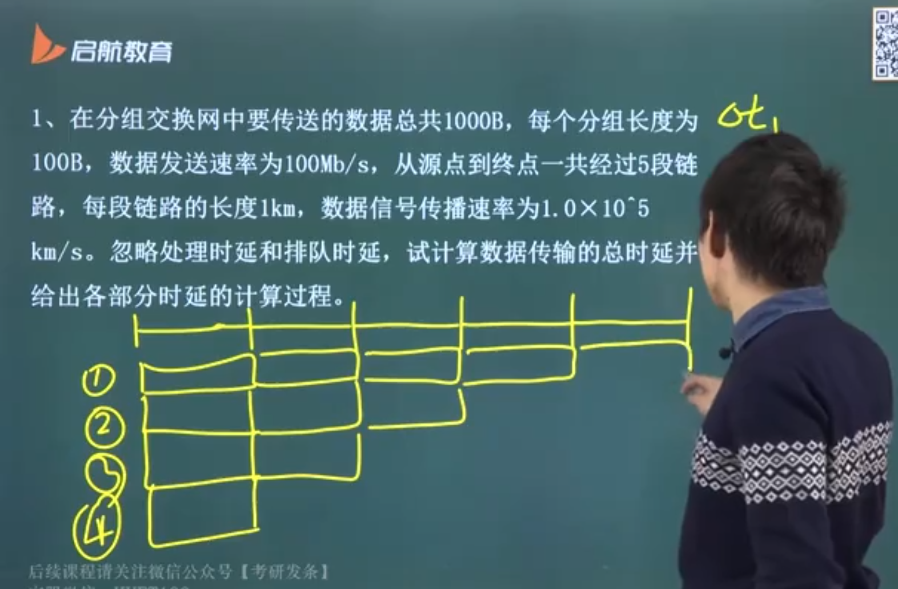

## 定义和组成

> 蠢背，并以计网知识为准 ——> 满分

网络定义：

- 计算机网络是一些互相连接的、自治的计算机的集合
- 因特网是网络的网络

网络的组成（物理）：

- 硬件：主机、通信处理机，线路、交换设备（交换器、路由器、中继器等连接设备）
- 软件：实现资源共享的软件（百度网盘）和方便用户使用的软件实体（linux、windows、lol）
- 协议：数据在线路上传输遵循的规则

网络的组成（工作方式）：

- 边缘部分：所有联网的主机（联网的计算机），这些主机也叫端系统，边缘部分也叫资源子网
- 核心部分：网络和连接网络的路由器，为边缘部分提供连接服务和交换服务，也叫通信子网

网络并不在乎其内部传输的数据，就像铁路不关心火车中运的是什么，而只关心二者是否联通

端系统（主机）之间的通信方式：

- C/S 方式，客户/服务器方式，如 MC
- P2P 方式，对等，如种子、百度网盘

核心部分：向主机提供连通性

- 起核心作用的是路由器
- 路由器实现分组交换和路由选择，这是网络核心最关键的功能

## 网络服务

核心部分除了提供连通性，同时还提供一些服务

### 面向连接服务和无连接服务

- 面向连接服务（打电话），如 TCP、PPP，需经过建立连接、维护连接、释放连接三过程，协议复杂且效率不高，但传输可靠性高
- 无连接服务（发邮件），如 UDP，每个分组都携带完整的目的地址并且独立传送，不需要连接，协议相对简单、传输效率高，但可能出现乱序、重复和丢失的现象（寄出去就不管了），可靠性不好

### 可靠服务和不可靠服务

- 可靠服务：具有纠错、检错、应答机制，能够保证数据正确、可靠传送到目的地
- 不可能服务：尽量正确、可靠地传输，是一种尽力而为的服务

### 有应答服务和无应答服务

- 收到数据后是否发送应答，告知传输方相应信息
- TCP、CSMA/CA 为有应答服务，其余均为无应答服务

可靠 => 面向连接且有应答

反之不然，如 PPP 面向连接但不可靠，CSMA/CA 有应答但不可靠，这二者均存在丢弃机制

- 当数据错误后，选择重发，重发次数达到上限（15次）则丢弃

## 特点和功能

特点：

| 连通性                                               | 共享性                       |
| ---------------------------------------------------- | ---------------------------- |
| 交换信息                                             | 指资源共享                   |
| 互联网具有虚拟的特点，无法知道另一台主机是否是一只猫 | 信息共享、软件共享、硬件共享 |

主要/基本功能

- 数据通信：最基本和最重要的功能（注意最）

  包括连接控制、传输控制、差错控制、流量控制、多路复用等子功能

- 资源共享：数据共享、软件共享以及硬件资源共享

其他功能

- 分布式处理
- 信息综合处理

VPN

- VPS：虚拟私人（代理）服务器
- 软件或插件 ——> 利用算力

## 计算机网络分类

### 按交换技术分类

- 电路交换
- 报文交换
- 分组交换

### 按传输介质分类

有线网络

- 双绞线网络
- 同轴电缆网络

无线网络：蓝牙、微波、无线电等

### 按拓扑结构分类

星型是散射的，由一结点引出其余所有结点

- 星型网络
- 总线型网络
- 环形网络
- 网状型网络

### 按分布范围分类

注意这里的四种网络均属于无线网络

- 广域网 WAN
- 局域网 LAN
- 城域网 MAN
- 个人局域网 PAN

### 按使用者分类

- 公用网
- 专用网

### 按传输技术分类

- 广播式：1 对 n，如局域网
- 点对点：1 对 1，如广域网

## 计算机网络的性能指标

> 在数据链路层和网络层中进行考察

### 速率

也叫比特率，每秒传输的字节数，单位可以是 b/s，Mb/s，Gb/s

### 带宽

数字通信（离散通信，以高低电位表示1/0）中，带宽即网络能达到的最高速率（比特率）

模拟通信（连续通信，波形）中，带宽指波段的上下界之差

### 时延

数据从一端到达另一端的时间称为时延，由以下部分组成

- 发送时延 / 传输时延（如进入高速路前的收费站，车长/车速）：数据帧长度 / 发送速率
- 传播时延，在链路中经过的时间（高速路上的开车时间）：信道长度 / 信号在信道上的传播速度
- 排队时延（高速收费站的排队时间）
- 处理时延（收费站收费的时间）

总时延 = 发送时延 + 传播时延 + （排队时延 + 处理时延）

- 后二者忽略不计

链路带宽减少了数据的发送时延，但不影响传播时延，由信号决定（大多网速快指的是发送时延小）

时延带宽积：传播时延 x 带宽

- 我们将数据看作连续的，那么整个通信信道中最多存在 传播时延 x 带宽 个比特（高乘以底面积），就像一条路充满车，那么这条路的长度可以用车来衡量
- 时延带宽积（比特数）也被视作两个节点之间的距离
- 如 a b 之间传播时延 100s，每秒发送 1bit 数据，那么 a b 之间距离为 100bit

### 吞吐量

> 对比港口，吞指进，吐指出

单位时间内通过某个网络（信道或接口）的数据量，与带宽相关：带宽 x 时间 为最大吞吐，而吞吐量为实际发生的量

例题：流水线，总时间 = mt + (n-1)t

- m 流水线的段数
- n 数据组数
- t 每发送一段数据所需时间（发送时延+传播时延）

分组是一组一组发送的，即上一组到达后，下一组才发出，这里的总时延要求的是第一组开始发送到最后一组数据到达末端经历的时间

思路一：

每次发送一组数据一端路程时延：t = 发送时延+传播时延 = 100x8b / 100Mb/s + 1km / 10^5km/s = 0.000018 s

那么，从 0.00018s（10t） 后，十组数据全部发送到第二个节点，很明显，此时最后一组数据在第二个节点，再经过四段路到末端，结束发送，于是总时延为 10t + 4t = 14t

思路二：

首先考虑第一组数据，他经过 5 次发送到达末端，即 5t，因为下一组数据总是紧跟在上一组之后，所以之后每经过一个 t 时延，都将有一组数据到达末端，一共还剩 9 组，故总时延为 5t + 9t = 14t

## 计算机网络体系结构

> 包括了全部考题

### 体系结构及相应概念

分层的设计方案（解藕）：按照信息的流动过程将网络功能分成一个个的功能层，同等功能层采用相同的协议，同一计算机的相邻层通过接口传递信息

- 体系结构定义了各层的功能，但不讨论功能的实现

网络的体系结构：计网的各层和其协议的集合

- 实体：任何能接收/发送信息的硬件或软件进程
- 对等实体：同一层的实体称为对等实体，如副总1和副总2为对等实体（不同节点的相同层）
- 对等层：不同计算机的同一层，如公司a和公司b的管理层为对等层
- 相邻层：同一计算机的相邻层次

底层为高层提供服务，如第 n 层为第 n+1 层提供服务

### 体系结构的三要素

- 协议：事先约定好的规则，规定数据交换的格式以及有关的同步问题，为数据交换而建立的标准、约定和规则
  - 语法：数据的结构或格式
  - 语义：数据所代表的意义，如绿灯表示通行
  - 同步：事件实现顺序的说明，如绿灯 40s 后红灯 20s
- 服务：下层为紧邻的上层提供功能调用
  - 面向连接和无连接服务（尽力而为的交付）
  - 可靠和不可靠
  - 有应答和无应答
- 接口：相邻两层交换信息的连接点，Service Access Point，SAP，服务访问点

协议是水平的，控制对等实体之间的规则；服务是垂直的，下层对上层

### OSI 参考模型

> 考题集中分布
>
> Open System Internetwork Reference

OSI 参考模型（从上到下）：应表会传网数物

- 上三层为通信子网，为了联网附加的通信设备，完成数据传输功能
- 下三层为资源子网，相当于计算机系统，完成数据处理
- 传输层呈上启下

每层功能、每层数据格式以及每层协议（重点）

| 层级                     | 数据格式                              | 功能                                                         | 协议                               |
| ------------------------ | ------------------------------------- | ------------------------------------------------------------ | ---------------------------------- |
| 应用层                   | 数据                                  | 为用户的各种应用程序提供各类网络服务                         | HTTP、FTP、TELNET、SMTP、DNS、DHCP |
| 表示层（representation） | /                                     | 将不同的数据格式转化为一种，解决数据格式问题以及加密、解密、压缩、解压缩问题 | ASCH、JPEG、MPEG、WAV              |
| 会话层（session）        | /                                     | 建立、管理会话，保证两个点之间的连接，为表示层提供服务       | 安排访问次序，同步点的设计         |
| 传输层                   | TCP 数据端 / UDP 数据报（用户数据报） | 提供端到端的连接、进程到进程的连接，保证数据的正确的顺序和完整性 | TCP、UDP                           |
| 网络层                   | 数据包（数据报 / 分组）               | 主机之间的连接、路径选择以及基于IP的寻址，为分组提供路由功能 | IP、ICMP、ARP、IGMP                |
| 数据链路层               | 帧                                    | 提供数据在物理链路的传输、物理寻址、网络拓扑、错误检测，提供SAP | 两层交换器、网桥                   |
| 物理层                   | 比特流                                | 高低电平、数据传输速度、传输距离、物理连接器                 | HUB（集线器）、中继器以及传输线路  |

### TCP/IP 模型

> 工业应用，减少层数提高效率

应表会传网数物 ——> 应传网网

| 层级                                 | 功能                       |
| ------------------------------------ | -------------------------- |
| 应用层（用户对用户）                 | 对应应用层、表示层、会话层 |
| 传输层（进程对进程，端到端）         | TCP、UDP                   |
| 网络层（网际层、IP层）（主机对主机） | IP、IGMP、ARP、ICMP        |
| 网络接口层                           | 数据链路层和物理层         |

#### OSI/RM 对比 TCP/IP

|          | TCP/IP                 | OSI                                |
| -------- | ---------------------- | ---------------------------------- |
| 流量控制 | 应用层、传输层         | 数据链路层、网络层、传输层、上三层 |
| 网络层   | 尽力而为的传输         | 可靠和不可靠均有                   |
| 传输层   | 可靠的TCP，不可靠的UDP | 只有可靠传输                       |

### 教学模型

五层模型

- 应用层、运输层、网络层取自 TCP/IP 模型
- 数据链路层、物理层取自 RM 模型

数据从上到下封装，不改变数据内容，加上头尾用于识别

从下往上叫做解封装

- 物理层和应用层不参与封装
