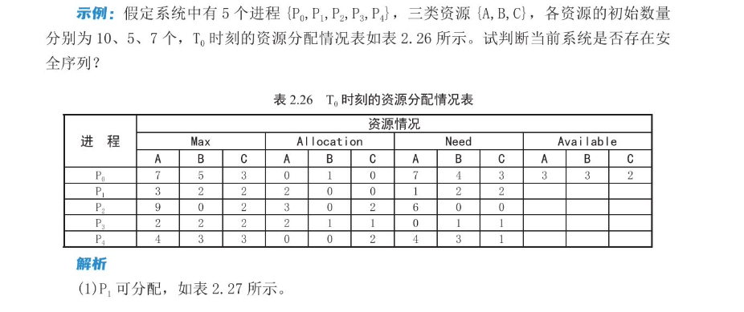
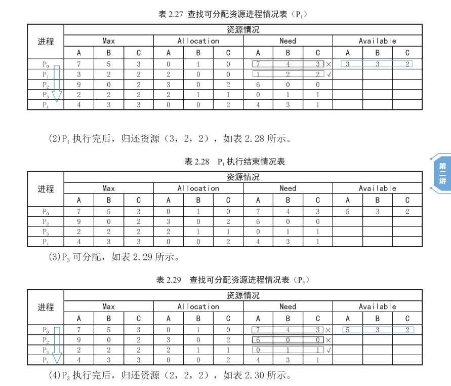
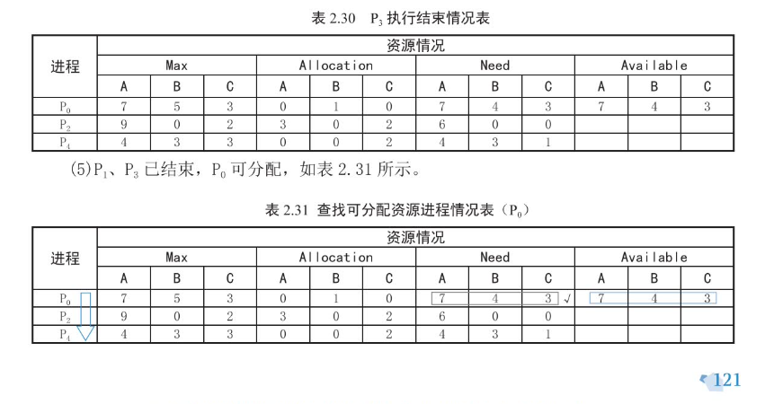
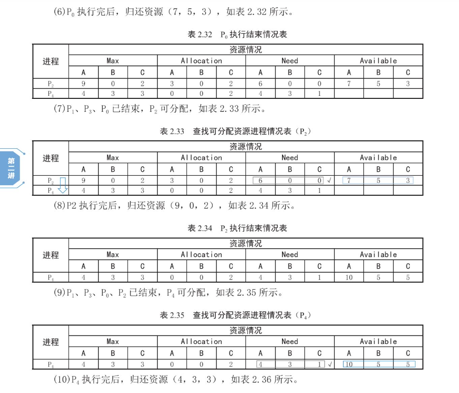
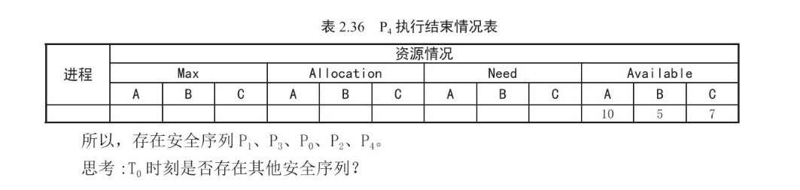
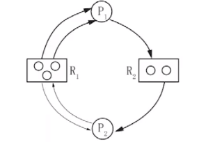

## 死锁概念

> 过于忙碌 ——> 死锁，物极必反

资源竞争引发的恶果，多个进程在运行过程中可能因争夺资源出现的一种无外力作用时无法向前推进的僵局，称作死锁

- 比如哲学家同时拿左手筷子，出现僵局（死锁）

### 资源分类

是否可重用

- 可重用资源：可供用户重复使用的资源，其中每个单元每次只能分配给一个进程，不允许多进程共享；一般来说数量固定，程序无法创建
- 可消耗资源：进程运行期间，可由进程动态创建的资源，如指针
  - 消耗性资源的单元数可在执行期间动态变化
  - 进程运行过程可以不断创建该类资源
  - 生产者进程创建，消耗者进程消耗

是否可抢占

- 可抢占资源：进程获得资源后（尚未用完），可被强制回收并分配给其他进程，如 CPU 和内存
- 不可抢占资源：进程获取资源后必须得用完自行释放，如磁带打印机

死锁产生的根本原因：资源不足

**死锁产生的具体原因**

- 竞争消耗性资源
- 进程间推进顺序非法
- 竞争不可剥夺资源
- 请求和释放资源的顺序不当

### 死锁产生的必要条件

> 重点捏，解决死锁 ——> 打破必要条件

互斥使用：进程对所分配资源具有排他性

请求保持：进程已经保持了至少一个资源，又提出新的资源请求，但进程请求的资源已被占用，进程请求资源阻塞，此时进程保持请求，同时该进程已占用的资源将保持不释放

不可抢占：进程已获得的资源必须得自己执行完毕后自行释放

循环等待：发生死锁时，必然存在进程-资源循环链

## 死锁预防

> 死锁的一种解决办法

采取限制措施破坏死锁的一个或多个必要条件

- 互斥使用：不可破坏
- 破坏“请求保持”条件
  - 协议一：进程执行过程中不申请资源，初始分配时就分配所有所需资源
  - 协议二：进程获取初期所需资源后，开始执行
- 破坏“不可抢占”条件：提出新请求无法得到满足时，释放所有已获得的资源
- 破坏“循环等待”条件：对所有系统资源进行线性排序，进程必须按序号递增顺序申请资源
  - 问题一：增加新设备排序很麻烦
  - 问题二：申请资源的顺序可能很不合理，造成浪费

## 死锁避免

> 银行家算法

资源动态分配过程中，防止进入“不安全”状态（有可能死锁的状态）

系统安全状态：进程序列顺序调度资源时，系统资源能够最大化满足各进程顺序执行完毕，那么我们称这个进程序列是系统安全的

- 安全状态一定不死锁
- 不安全状态不一定死锁
- 避免死锁的实质是系统进行资源分配时，使系统不进入不安全状态

### 银行家算法

银行家算法：设系统 m 类资源，n 个进程

4 个数据结构

- 可利用资源数组`Available[i]`：反映第 i 类可利用资源的数量
- 最大需求矩阵`Max[i][j]`：表示第 i 个进程对第 j 类资源的最大需求量
- 分配矩阵`Allocation[i][j]`：表示第 i 个进程已经具有第 j 类资源的个数
- 需求矩阵`Need[][]`：表示第 i 个进程还需要第 j 类资源的个数

其中`Max[i][j] = Need[i][j] + Allocation[i][j]`

设`Request[i]`是第 i 个进程 P 的请求向量，若`Request[i][j] = k`，则说明进程 i 需要第 j 类资源 k 个，当 P 发出请求后，系统将以以下顺序进行检查

- `Request[i][j] <= Need[i][j]`，转下一步，否则出错（请求的不大于需要的）
- `Request[i][j] <= Available[j]`，转下一步，否则等待（请求的不大于空闲的）
- **尝试**将资源分配给进程 P，同时修改数据结构数值
  - `Available[j] = Available[j] - Request[i][j]`
  - `Allocation[i][j] = Allocation[i][j] + Request[i][j]`
  - `Need[i][j] = Need[i][j] - Request[i][j]`
- 安全性检测：若分配后系统处于安全状态，则将资源实际分配给 P；否则取消本次尝试，恢复原来的资源分配状态（恢复数据结构），P 进入等待

### 安全性检测

如何进行安全性检测？判断必须要熟且快，因为分少但流程长

- 设置两个向量
  - 工作向量`Work[j]`：表示**当前进程**所需第 j 类资源的数量，初始状态时`Work[j] == Available[j]` 
  - 结束向量`Finish[i]`：表示系统能够提供足够资源以供第 i 个进程顺利运行完毕，初值为 false
- 从进程集合中找到一个`Finish[]`为 false 的变量，假设为 i，判断`Need[i][j]`是否小于等于`Work[j], 0 <= j <= m`，若全满足，为其分配资源，更新`Work[j], Allocation[i][j], Need[i][j]`，执行后释放资源，恢复`Work[j], Available[j]`，设置`Finish[i] = true`
- 重复第二步，寻找下一个符合的进程，直到遍历结束，若存在进程 k 使得`Finish[k] = false`，说明处于不安全状态，否则处于安全状态

注意这里安全性的判断遵循进程编号的先后顺序，从前往后遍历，每次寻找都从头开始，即完成一个进程后，将其从队列中删除，从头开始遍历寻找下一个进程

栗子











在例题中，我们称 P0、P2、P4 打头不存在安全序列，安全序列只有可能由 P1、P3 打头，且 P1 存在安全序列

## 死锁检测和解除

既不预防，也不避免，让系统自己去运行，运行系统发生死锁。此时，系统在固定的时间周期运行死锁检测算法和死锁解除算法，判断系统是否发生死锁。若发生死锁，用死锁解除算法将系统从死锁状态解脱出来

必须对死锁的发生足够敏感，并精确确定与死锁有关的进程和资源（进程 - 资源循环链），系统必须保存资源的请求和分配信息

### 资源分配图及其简化

资源分配图：描述系统资源的分配和空闲情况，用于检测死锁

- G = ( N, E )，N 为 G 的顶点集合，E 表示 G 的边集合
- 顶点包括所有进程和资源
- 边有向
  - 若从资源指向进程，则为进程占用资源，称为**占用边**
  - 若从进程指向资源，则为进程请求资源，称为**请求边**

如



顶点集`N = {P1, P2, R1, R2}`

边集`E = {<P1, R2>, <R2, P2>, <R1, P1>, <R1, P1>, <R1, P2>, <P2, R1>}`

简化资源分配图：利用简化资源分配图可以判断当前系统是否存在死锁

- 找到一个不阻塞且不独立的进程节点 P
- 不阻塞意味着资源能够满足其运行，于是我们释放 P 所有的资源，删除和 P 相关的所有边（请求边和占用边），使其孤立
- 继续考虑其他非孤立节点
- 直到所有顶点均孤立，说明不存在死锁，若不能使所有进程孤立，则发生了死锁，称这个图不可完全简化

### 死锁检测中的数据结构

`Available[] / Work[]`记录每类资源当前可用量，`Allocation[]`记录每类资源分配出去的量，`Request[]`表示某一进程对某类资源的请求量，表 L 记录孤立的进程节点

在死锁检测中

- 寻找`Request[i] <= Work[i], 0<=i<=n`的进程
- 将其资源分配图简化，释放资源，`Work[i] += Allocation[i]`
- 将该进程记入 L 表，重复以上过程

若不能将所有进程记入 L，说明当前系统可能发生死锁

### 死锁解除

死锁接触是与死锁检测相配套的一种措施，在发生死锁时将系统从死锁状态中解脱出来。实施方法为回收部分资源，再将这些资源分配给阻塞态进程使之继续运行

回收资源的方法

- 抢占资源
- 撤销 / 挂起 / 终止进程
  - 终止所有死锁的进程
  - 逐个终止进程，直到能打破循环停止

付出代价最小的死锁解除算法：原始算法和改进算法

原始算法：就是穷举所有终止情况，暴搜，每轮一个个尝试终止各个进程直到不死锁

```c
vector<vector<process>> drop;

void dfs(condition s, vector<process>& path){
    if(deadlock(s)){
        // 若死锁，穷举所有当前进程，一个个排除
        for(int i = 0; i < s.process.size(); i++){
            // 将当前要排除的进程添加到路径中
            process cur = s.process[i];
            path.push_back(cur);
            // 获取排除当前进程后的新环境
            condition c = s.exclude(i);
            // 判断新环境死否死锁
            if(locked(c)){ // 若死锁，继续在新环境下排除更多进程，复制当前路径展开新分支
                vector<process> branch(path);
                dfs(c, branch);
            } else { // 若不死锁，将当前路径添加到全局变量 drop 中作为记录，并退出当前情况
                drop.push_back(path);
            }
        }
    }
}

vector<process> unlock(condition s){
    if(locked(s)){
        // 传入第一轮的死锁环境和原始路径，开始暴搜
        for(int i = 0; i < s.process.size(); i++){
            vector<process> path;
            dfs(s.exclude(i), path);
        }
    }
    if(drop.size() == 0){ // 说明没有找到一条解除死锁的路径
        return NULL;
    }
    // 选取一条最短的解除死锁的路径，作为答案返回
    vector<process> unlock_path;
    int length = INT_MAX;
    for(auto& p: drop){
        if(p.size() < length){
            unlock_path = p;
        }
    }
    return unlock_path;
}
```

改进算法：根据接触进程的代价将各个进程升序排列，每次解除代价最小的进程，直到解除死锁

| 死锁处理方法   | 系统开销 | 资源利用率 |
| -------------- | -------- | ---------- |
| 死锁预防       | 低       | 低         |
| 死锁避免       | 中       | 中         |
| 死锁检测和解除 | 高       | 高         |

一般来说，在不加限定条件的情况下，为保证系统安全性，把每个进程对资源的最大需求量 -1 处理再求和并 +1，记为 n，要求资源总量大于等于 n

栗子一：如 6 个进程共享 18 个某类资源，每个进程最多申请 3 个该类资源
$$
6\times(x-1) + 1 \leq 18 \Rightarrow x \leq \frac{17}{6} + 1 = 3.83
$$
故 x 最大值为 3，每个进程最多申请不能超过 3

栗子二：三个并发进程互斥使用某一资源，其需求量分别为 3、4、5，问至少要多少个该类资源，才不会发生死锁
$$
n \geq (3-1)+(2-1)+(5-1)+1 = 10
$$
