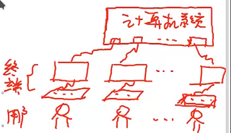

## 操作系统的概念、特征和功能

### 基本概念

操作系统，OS，指控制和管理计算机系统资源（软件和硬件）、合理调度各类资源，提高系统效率，方便用户使用的系统软件

- 方便用户使用

- 硬件系统上的第一层软件：虚拟机

- 控制软硬件资源

- 合理调度资源，提高效率和吞吐量

### 基本特征

并发：同一时间段内执行两个或两个以上程序，通过资源复用实现

- 并发是操作系统最重要的特性

共享：即资源复用，根据资源属性常分为**互斥共享**和**同时访问**

- 互斥共享：如打印机，进程顺序执行

- 同时访问：如磁盘，进程交替访问

并发和共享是多用户操作系统最基本的两个特征，是操作系统所必备的特征

虚拟：将同一物理实体演变为若干逻辑物体（如实地址映射虚地址），常分为**时分复用**和**空分复用**

- 时分复用：在同一时段，在某程序的空闲时间为其他程序复用，注意若一个物理设备供 n 个用户时分复用，单用户的平均处理速度不高于 1/n

- 空分复用：占用某一设备后并不全部使用，如磁盘，只用一部分，剩下的部分给其他用户复用

异步性：多道程序环境下，各进程以不可预知的速度执行，导致运行结果可能存在差异

### 主要功能

CPU 管理：以进程为单位进行 CPU 的分配，将对 CPU 的管理转化为对进程的管理和调度。**进程管理**包括进程的**控制**、**同步**和**通信**

- 进程控制：为作业创建进程，分配必要的资源；撤销已结束的作业，回收其占用的资源；控制进程运行过程的状态转换

- 进程同步：为多个进程的运行做协调
  
  - 互斥：锁机制
  
  - 同步：信号量机制、确认机制

- 进程通信：进程之间的信息互换

存储器管理：为程序运行提供良好环境，提高内存利用率，逻辑扩充内存（虚拟存储器）

- 内存分配：静态分配和动态分配
  
  - 静态分配：装入作业时一次性分配，运行期间不再申请空间
  
  - 动态分配：运行期间能够重复申请空间

- 内存保护：各个进程不要越界，各进程互不干扰，通过界限寄存器去实现

- 地址映射：逻辑地址映射为实际内存地址

- 内存扩充：逻辑扩充（感觉上扩充，小内存运行大程序），如请求调入和置换

设备管理：将设备视作文件，分配 IO 设备，完成指定 IO 操作，包括缓冲管理、设备分配和设备处理

- 缓冲管理：解决信息交互双方的速度矛盾

- 设备管理：分配用户 IO 设备

- 设备处理：通过驱动程序实现 CPU 和设备控制器之间的通信

文件管理：对存放于外存的所有文件进行管理，包括系统文件和用户文件

- 文件存储空间管理：为文件分配必要的外存空间，以及销毁和回收

- 目录管理：按名管理

- 文件读写管理：读写文件

- 文件保护：保证文件安全性

接口管理

- 用户接口：联机用户接口（命令行）、脱机用户接口（批处理作业用户使用）、图形用户接口（GUI 界面）

- 程序接口：即系统调用，为程序提供基础服务，每次将经过用户态-核心态-用户态的转换

系统安全

- 认证技术

- 密码技术

- 访问控制技术

- 反病毒技术

## 操作系统发展历程

> 即操作系统分类

操作系统不是计算机必备的软件

### 无操作系统

人工操作方式：用户独占全部系统资源，CPU 等待人工操作，资源利用率低，人机交互矛盾突出

脱机输入 / 输出方式：事先将纸带上的指令和数据通过纸带机，在外围机的控制下输入磁带，CPU 从磁带上高速调入程序和数据

- 借助磁带或磁盘实现
- 减少了 CPU 空闲时间，提高了 IO 效率

### 单道批处理操作系统

**单道**指内存中最多存放一道用户程序（不包括操作系统），**批处理**指在系统监督程序（monitor）控制下，一次连续处理存储于磁带的一批作业

- 系统监督程序 monitor：操作系统原型
- 优点：解决了人机矛盾和 CPU 与 IO 设备之间的速度不匹配问题，提高了系统资源使用率
- 缺点：无交互能力，一道用户作业，系统资源利用率不高
- 特点：实现脱机将一批作业输入磁带；自动性；顺序性；单道性

就有点像，同学写作业，统一交作业，老师独自批改的过程

### 多道批处理操作系统

内存中可以容纳多个用户程序，内存中最少有一个程序，即操作系统。第一台小规模集成电路计算机：IBM360，配备操作系统 OS/360

允许多个作业同时使用不同的外围设备

- 优点：显著提高 CPU、内存以及 IO 设备的利用率；多道批处理利用更多的系统资源；提高系统的吞吐量
- 缺点：无交互能力；平均周转时间长
- 特点：
  - 多道性：内存同时存在多个用户作业
  - 无序性：多个作业运行速度和时间受进程调度策略影响
  - 调度性：经过调度后，CPU 才能运行

注意：提高批处理操作系统形成和发展的主要动力是提高资源利用率和系统吞吐率

### 分时系统

允许一台主机为多个用户服务，并及时响应用户请求，一个计算机系统提供多个终端供用户使用

解决问题：

- 及时接收：及时接收用户的指令和数据
- 及时处理：通过时间片分时使用处理器

特点：

- 多路性：一台主机，多套终端，分时共享
- 独立性：各用户在自己的终端操作，互不干扰
- 及时性：较短时间内得到响应
- 交互性：通过终端请求主机和得到响应

### 实时系统

在分时操作系统的基础上，主要解决快速响应问题

实时任务：分为周期性实时任务和非周期性实时任务

- 周期性通过激励信号实现周期性控制
- 非周期性必须提供截止时间，开始截止时间和完成截止时间

硬实时和软实时：硬实时必须在截止时间内完成，软实时并不严格

常见的实时系统：工业控制系统、武器控制系统、信号查询系统、多媒体系统、嵌入式系统等

特点：

- 独立性
- 及时性：受制于控制对象的截止时间
- 交互性
- 多路性：周期性采集、控制和处理
- 可靠性：多级容错机制保证系统、数据安全

### 微机操作系统

单用户操作系统：仅允许一个用户存在，分为

- 单用户单任务
- 单用户多任务：Windows

多用户多任务操作系统：UNIX / Linux

## 程序运行环境

> 重点

### 中断和异常处理

就像函数调用，主程序进入函数，主程序暂停，函数结束后返回继续执行

- 但不同点在于中断是出现异常情况或特殊请求时才发生，属于意外

中断常处理 CPU 外的事件，如 IO、定时器中断、硬件故障等

中断向量：中断服务程序的入口地址

- 表示为 CS:PC

- 其内存地址为 16CS + PC

- CS/PC 都是 16 位寄存器，中断向量 20 位，无法直接存储，只能以这种偏移的方式存储

中断源 / 中断类型号：8 位类型号用于标记不同的请求中断设备

中断向量表：记录中断向量的表，存于内存最底层的 1KB 空间

- 0000H - 03FFH 是系统内存空间，程序无法访问

- 这里实际上是间接寻址，存放的是中断程序的入口地址

- 小端存储和大端存储：小端存储指内存的**低字节内容存储于内存低地址**，如 0080H 存 12，0081H 存 34，则数据正确顺序为 3412，大端存储则反之，为 1234

- 对于中断向量来说，高位为 CS，低位为 IP，实际内存地址为 16CS+IP，如 12345678 则表示内存地址 1234x16+5678 = 25422H

中断隐指令：终端执行中的一些固定操作，功能类似于指令，但完全由硬件实现

- 保存断点

- 关中断

- 执行中断服务程序

中断服务程序流程

- 保护现场

- 开中断：为了响应更高级的中断

- 中断处理

- 关中断：这个环节已经处理完当前中断，防止被其他中断打扰

- 恢复现场

- 开放中断：开放中断隐指令关闭的中断

- 中断返回

异常，也叫内中断，由 CPU 执行的指令引发，分为

- 陷阱：主动型，try / catch，将程序交予操作系统执行

- 故障：如缺页

- 终止：不可恢复的错误引起

### 系统调用

用户程序发送给操作系统，请求系统提供服务的方法或函数，如 java 的 native 函数，调用底层的 c++ 请求系统服务

操作系统提供给用户程序调用其底层服务的方式，是用户访问内核的途径

### 程序运行时内存映像与地址空间

用户 —— 源程序 —— 库函数 —— 模块 ——内存

- 符号名空间

- 目标地址空间：编译后的二进制形式代码

- 物理地址空间

### 程序的编辑、编译和链接

编辑：使用无格式编辑软件创建用户源程序

编译：将用户源代码翻译为目标代码的过程

链接：将目标代码和所需库函数链接在一起

- 静态链接：程序运行前，将目标模块和库函数链接为完整的、从唯一零地址开始的装配模块

- 装入时动态链接：边装入边链接，便于修改更新以及对目标模块的共享

- 运行时动态链接：运行时用到目标模块时对其进行链接

装入：将装入模块放在内存某空间，构造进程控制块 PCB，形成可执行的进程

- 绝对装入方式：程序中使用绝对地址，指定每个程序装入固定的内存空间

- 重定位方式：程序均使用自己的零地址，在装入时通过硬件/软件实现对物理地址的重定位
  
  - 静态重定位：装入时完成所有的地址变换
  
  - 动态重定位：装入时不转换，执行时通过硬件自动变换

### CPU 运行模式

操作系统是基础的系统软件，运行时占据内存空间（内核空间），被所有程序共享；应用软件也占据内存空间（用户空间），软件所私有。为避免切换进程时间开销过大，内核空间和用户空间共存于同一地址空间

用户程序运行时需要访问内核空间，这时进行运行模式的切换，而非切换进程

为保护数据安全，CPU 具有不同的运行模式，常见为**内核模式**和**用户模式**

- 内核模式又叫核心态/管态，是核心操作系统组件和大部分驱动程序运行时所处模式，这一状态下 CPU 可使用所有系统资源，所有内存地址、外部设备、寄存器、所有机器指令（分为通用指令和特权指令）
  
  - 通用指令：访管指令
  
  - 特权指令：只能由操作系统使用的指令，如 IO、内存清除、允许/禁止中断

- 用户模式又称为用户态或目态，只能访问私有虚拟地址空间和指定的寄存器，只能执行通用指令，不能执行特权指令

运行模式的转换

- 用户态切内核态：当需要输入输出、申请内存等底层操作时，必须使用系统调用，切换至内核态
  
  - 访管指令
  
  - 系统调用
  
  - IO 控制命令
  
  - 异常

- 内核态切用户态：操作系统执行中断返回指令

## 操作系统结构

### 非内核结构

无结构：由众多过程直接构成，各过程可相互任意调用

- 系统高效，但大且杂乱，功能较简单

模块化结构：将功能分为若干模块，结构清晰，由繁到简，利于合作

- 模块和接口划分较困难，未区分共享资源和独占资源，系统结构可能不够清晰

分层结构：分为若干层次，像计网一样，由简到繁，下层向上层提供服务

### 内核结构

#### 宏内核结构

也叫做大内核，基于模块化思想设计，各将一些和硬件紧密相关的、使用频率较高的功能及关键数据结构独立出来，形成常驻内存的内核，模块直接调用接口函数实现通信

如 UNIX / Linux

可靠性和安全性随操作系统复杂性的增加而降低，且内核较大，包含较多功能，容错率低

#### 微内核结构

操作系统常驻内存部分仅保留最核心的功能，如中断、CPU、存储管理，更复杂的功能，如程序管理，通过用户程序请求获取

如 Windows XP，Mac OS

#### 外核结构

分为内核和外核，内核负责资源分配，外核负责资源管理

## 操作系统引导和虚拟机

操作系统安装在外存，开机后自动加载到内存运行，其启动流程如下

- 引导：CPU 通电后执行 BIOS，存储与 ROM，将启动盘的引导程序读入内存
  
  - 初始化寄存器，如 (CS) = 0xFFFF 和 IP，执行**无条件转移指令**至 IP 所指内存
  
  - 自检，检查关键设备是否存在、正常
  
  - 将 BIOS 复制到内存并执行
  
  - 搜索可引导的存储设备，根据 CMOS 中的引导顺序搜索启动设备，将 Boot 读入内存，控制器交给操作系统

- 执行磁盘引导程序：启动盘主扇区转活动分区引导扇区，将活动分区引导扇区内容读入内存并执行，将 loader.bin 读入内存

- 执行磁盘分区加载程序：将操作系统内核 kernel.dll 加载至内存

- 操作系统初始化：初始化处理器、中断、各管理模块；创建主进程并死循环执行；启动控制台

虚拟机：使用软件模拟的、运行在隔离环境中的、完整的操作系统，如 [KVM(Kernel-based Virtual Machine) - ArchWiki (archlinux.org)](https://wiki.archlinux.org/title/KVM)
