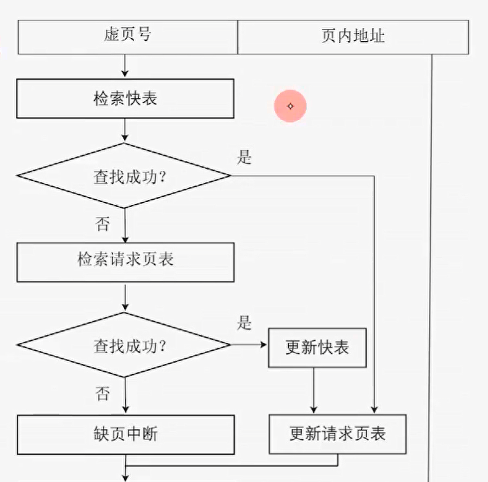
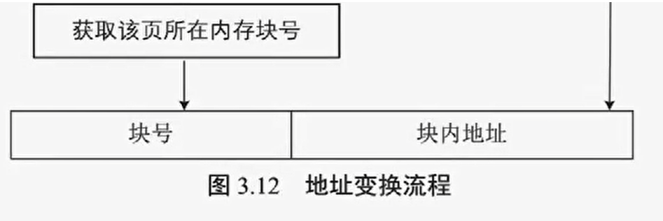
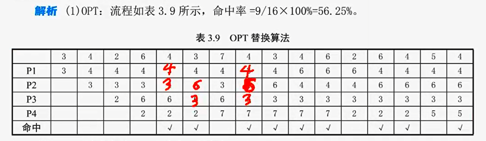
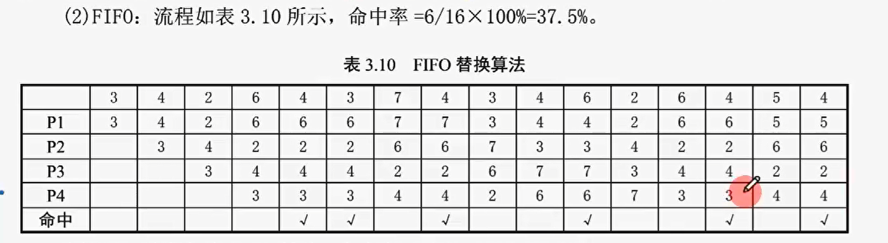
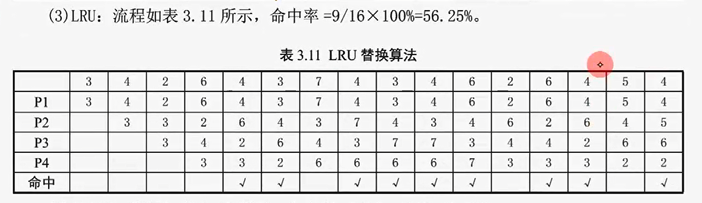
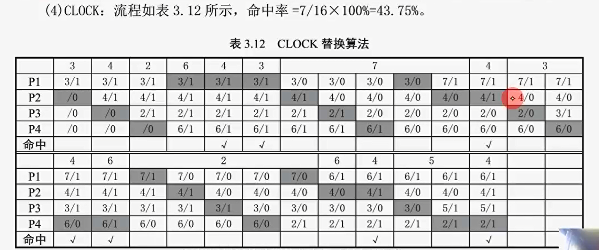

> 实存管理，要求作业一次性装入内存
>
> - 一次性：大作业、多道性受限
> - 驻留性：直到运行结束才释放内存
> - 低效性
>
> 解决办法
>
> - 从物理上增加内存容量
> - 从逻辑上扩充内存容量，通过算法解决问题
>
> 因为不是所有程序段都要执行，我们选择性的将程序调入内存，即先部分装入肯定会执行的部分，其余部分需要时再装入
>
> 这种方式即通过虚拟存储管理实现，由操作系统提供
>

## 虚拟内存基本概念

> 基于实存管理，出应用

虚拟内存基于程序访问的局部性原理（cache 同样基于局部性原理）

- 时间局部性：刚被访问的数据可能不久后再次被访问
- 空间局部性：刚被访问的数据内存附近的数据很可能也要被访问

在实际执行时，先调入部分页（段）执行

- 请求调入：当发生缺页 / 段，利用操作系统的请求调页 / 段，将其调入内存
- 置换：当内存已满，利用 OS 置换功能，将暂时不用的页调入外存

于是，内存实际操作空间变得很大（从逻辑上假象扩充，粗略总和为内存和外存之和），但注意，这种技术一定是建立在非连续的内存管理方式之上，即页、段、页段式管理

特点

- 多次性：对应一次
- 对换性：对应驻留
- 虚拟性：扩充仅在用户的感受上

## 请求页式管理

在页式存储管理的基础上增加**请求调页和置换功能**后形成的虚拟存储管理方法

硬件支持：内存和外存；页表机制；缺页中断机构；地址变换机构

优点

- 离散性
- 高利用率
- 高多道性

缺点：需要更多硬件支持；可能发生抖动（置换算法有问题），降低系统效率；仍存在碎片问题

### 请求页表

| 页号     | 块号           | 状态位         | 访问次数       | 修改位                                                   | 外存地址             |
| -------- | -------------- | -------------- | -------------- | -------------------------------------------------------- | ---------------------- |
| 进程页号 | 页对应内存块号 | 表示是否在内存 | 该页的访问次数 | 也叫脏位，表示该页内容是否被写过，表示内外存内容是否一致 | 该页内容对应的外存地址 |

查询时根据状态位判断是否在内存，若缺页，从对应外存地址进行调入，同时根据访问次数和修改位执行请求调入或置换算法

### 缺页中断机构

缺页中断机构：当发生缺页且请求页状态位为 0 时，触发缺页中断处理程序

- 保存现场：保存 PC 等寄存器内容
- 获取缺页：启动外存
- 置换页框：当内存已满，才会发生置换
- 读入内存：启动 I/O，将外存页调入内存
- 更新请求页表：有效位置 1
- 返回引起缺页中断的指令
- 恢复现场

缺页中断是一种特殊中断，设计用户态和内核态的切换，虚拟地址和物理地址的转换；最重要的，缺页中断产生在指令执行期间，并且可能产生多次缺页中断

### 地址变换机构

地址格式：虚页号 + 页内地址

当快表或页表查询成功，该页的访问次数将加 1

## 页框分配

进程是资源分配单位，OS 为进程分配内存块 / 页框时，通常需要满足**最少物理块数原则**，

### 物理块分配方法

常见的内存物理块分配方法有以下三种

- 平均分配：容量 / 进程数量，不可取
- 比例分配：按照进程大小按比例分配
- 优先权分配：按照优先级为重要、紧迫的作业分配较多内存块

### 页面分配策略

请求页式存储管理具有**固定和可变**两种内存**页面分配策略**，具有**全局和局部**两种**页面置换策略**

常见有三种分配和置换的策略

- 固定分配局部置换：进程内存块一经分配，整个运行期间不变，缺页时调用自身被分配的空闲内存块
- 可变分配全局置换：预分配物理块，若缺页，从全局的空闲物理块队列中取出一个为其分配
- 可变分配局部置换：预分配物理块，缺页时，从进程拥有的内存块中选出一个换出；若频繁缺页中断，将多分配内存块，反之将取回部分内存块

### 调页策略

操作系统常采用以下两种策略调入所缺页

- 预调页：在顺序结构下，一次性调入多个相邻页，当遇到分支结构可能造成浪费
- 请求调页：缺页时，发出缺页中断，调入缺页，一次仅调入一页，系统开销较大

### 外存管理

文件区：用于存放普通文件，离散存储，相对较慢

对换区：SWAP 分区（linux），存放从内存中换出的进程，连续存储

操作系统调入页的来源

- 全部从对换区调入：linux 建议为内存容量两倍，将内存执行完的进程复制到对换区
- 被修改部分从对换区调入
- UNIX 方式：访问过且换出的页存放在对换区，其余均放在文件区（UNIX 支持页面共享）

## 页面置换算法

当发生缺页，进程所属内存空间又放满了，需要进行置换，从内存中选择一页将其置换的对换区

不恰当的置换算法可能导致**抖动 / 颠簸**，常见的算法有

### OPT

最佳置换算法（OPT）

- 淘汰以后永不再用或最长时间内不再被访问的页面
- 过于理想化，难于实现，常用作对比

简单来说，就是之后用的越多的页，被保留的优先级越高，这需要预知，很难

已知页面访问序列，每次访问后需要实时更新内存中页面之后的访问次数，并以此排序

### FIFO

先进先出置换算法（First In First Out, FIFO）

- 淘汰最先进入内存的页面，直观，性能可能最差

最后进入内存的页面被保留的优先级最高

### LRU

最近最久未使用算法（Least Recently Used, LRU）

- 使用相对较多

最近使用过的页面被保留的优先级最高，编程实现，只需要改指针

已知访问顺序，模拟访问/置换过程

### CLOCK

CLOCK 置换算法：最近未使用算法（Not Recently Used, NRU）：**LRU 和 FIFO 的折中**

- 维护内存中进程页面的循环队列
- 每个页设置访问位，初始为 1
- 当需要置换时，按队列从前往后寻找页面
  - 当遇到访问位 0 的页面，将其换出，停止查找
  - 遇到访问位为 1 的页面，将访问位置为 0，继续向后查找

已知访问顺序，模拟 CLOCK 工作过程，共四个内存块，运行七个页面

灰色部分表示循环链表的指针所指位置

- 命中后，访问位置 1
- 指针始终保存在上一操作的结果位置

改进 CLOCK 置换算法

- 增加修改位，表示页是否被修改过
- 在置换时，优先考虑未使用过、又未被修改过的页面，将同时满足两项的页面作为首选淘汰对象

页面类型根据修改位和访问位分为四类

- 00B：1 类页面，既未被访问，也没被修改
- 01B：2 类页面，未被访问，但被修改
- 10B：3 类页面，被访问，但未被修改
- 11B：4 类页面，被访问，也被修改

在置换时

- 首先扫描 1 类页面，扫到即换出
- 未扫到，再扫一次，寻找 2 类页面，扫到即换出
- 未扫到，将所有页面访问位置位 0，重复进行第 1/2 步扫描，直到换出一个 1 类或 2 类页面

### LFU

最少使用置换算法（LFU）：淘汰访问次数最少的页面

### PBA

页面缓冲算法（PBA）：基于 FIFO 的改进，常被 VAX/VMS 操作系统采用

- 页面管理策略采用可变分配局部置换方式
- 未每个进程预分配一定数量的内存物理块
- 两个链表
  - 空闲页面链表：存放空闲的页面和被换出的未被修改的页面
  - 修改页面链表：存放被换出的被修改过页面
- 特点：减少磁盘 I/O 操作次数；降低页面换入换出频率和开销；采用简单的 FIFO 算法，实现简单

以上算法中，除页面缓冲算法，其余均采用固定分配局部置换策略

### 命中 / 缺页率

命中率和缺页率：即判断 CPU 请求的页是否在内存中，在即命中，不在即缺页
$$
缺页率 = 未命中次数 / 总访问次数 = 1 - 命中率
$$

### 访问有效时间

请求分页管理方式的内存访问有效时间组成

- 访问页表时间
- 访问物理单元时间
- 处理时间

设内存访问有效时间为 EAT，查快表时间为 t，访问物理单元时间为 T，缺页中断处理时间 u，缺页率 f，分为以下几种情况

1、当访问页在内存，EAT = t +T

- 访问快表 - 读取内存

2、访问页在内存，但快表没记录，EAT = 2(t+T)

- 访问快表 - 访问页表 - 读取内存 - 写入快表

3、访问页不在内存，EAT = 2(t+T) + u

- 访问快表 - 访问页表 - 中断处理 - 读取内存 - 写入快表

4、当快表命中率为 h，缺页率为 f
$$
EAT = (t+hT)_{命中快表}+(1-h)_{未命中快表}(T_{访问页表}+(1-f)(t+T)_{页表命中}+f(u+t+T)_{缺页})
$$

### Belady 和抖动

Belady 现象：进程分配到的页面数增多，缺页率反而增加的奇怪现象

- 其中，FIFO 可能出现 B elady 现象，LRU 和 OPT 不会出现 Belady

抖动现象：刚调出又调入

- 原因：系统资源不够用；置换算法有问题；用户程序有问题
- 抖动必然启动 I/O，需要系统调用、切换内核状态等操作，忙而低效
- 局部抖动和全局抖动：局部抖动指进程内部页面抖动；全局抖动指整个系统抖动

### 工作集

正常情况下，进程拥有物理块数量和缺页率成反比（无 belady 现象），在分配内存块数量合理的情况下，缺页率会比较稳定，据此，再加上进程之前的工作状态，可以推测进程将来的行为，调整进程所需内存块的数量，在这引入**工作集**的概念

- 工作集：页面的集合，在一段时间内进程访问的页面集合
- 窗口尺寸：即工作集的大小（单位时间内访问页面的数量）
- 表示：`w(t, ▲t)`，表示从 t 时刻开始经过 ▲t 时间中所访问页面的集合
- 规律：`w(t, ▲t)`是关于 ▲t 的非降序函数，即 ▲t 增加，w 一定不减

## 内存映射文件

> Memory-Mapped File

磁盘文件到内存的映射，使得应用程序可以通过内存地址访问外存磁盘文件，适合管理大文件

内存映射由操作系统调用 mmap() 实现，效率较高

特点：文件没有进入内存，没有实际的数据复制

原理及执行流程：像访问内存一样地访问磁盘文件

- 调用 mmap() 返回进程逻辑地址空间中映射区的首地址 sAddr
- 地址转换：通过存储管理模块 MMU 将逻辑首地址 sAddr 转换为物理地址
- 产生缺页中断，将 sAddr 映射的文件复制到内存
  - 先找 swap 分区，若有则从 swap 分区读入文件至内存（说明曾被读入内存）
  - 若不在交换分区，通过 mmap() 建立的映射关系，从硬盘上将文件读入内存（用户进程空间）

只复制一次数据，效率高

- 若采用读写 read() / write(）的方法，将复制两次，第一次从外存复制到 OS 的缓冲区，第二次从缓冲区复制到用户空间

内存映射文件和虚拟存储器的共性：部分内容加载内存；支持应用程序的动态性

|          | 内存映射文件         | 虚拟存储器       |
| -------- | -------------------- | ---------------- |
| 文件类型 | 任何磁盘文件         | 页面文件         |
| 目的     | 处理大文件；进程通信 | 运行大的应用程序 |
| 架构     | 用户程序地址空间     | 物理内存空间     |

## 性能改进方法

> 虚拟存储器性能的影响因素和改进方法

导致系统颠簸 / 抖动，或者频繁 I/O 操作，降低虚拟存储器系统性能的因素

- 页面置换算法：LRU；FIFO；CLOCK
- 页面分配策略：固定分配局部置换；可变分配全局置换；可变分配局部置换
- 物理块分配算法：平均分配；按比例分配；按优先权分配
- 页面调入时机：用户提供预调页策略；操作系统提供请求调页策略
- 写回磁盘频率：增大 I/O 时间
- 读入内存频率：增大 I/O 时间

改进方法如下

### 采用局部置换策略

进程发生缺页时，只能置换分配给它的内存块，限制抖动的范围，不影响其他进程

特点

- 简单易行
- 效果较差

### 工作集概念融入处理机调度

监测处理机利用率，当利用率降低时，尝试调入新作业

调入新作业前，检查进程在内存的驻留页面是否够多，够多则调入；否则为缺页率较高的进程增加物理块且不调入新作业

### L=S 准则调节缺页率

L 为发生缺页之间的平均时间，S 为平均缺页服务时间

- L < S：缺页频繁，上一个缺页还没服务完，下一个缺页就发生了
- L > S：很少发生缺页
- L ≈ S ：磁盘和处理机均达到最大利用率

### 暂停进程

当多道程序度大，且已经影响到处理机的利用率时，强行减少进程数

### 降低读写磁盘频率

将换出的页面加入一个链表中（在内存里）

- 降低读频率：当 CPU 需要再次读取页面时，从该链表中取出
- 降低写频率：当链表容量过大时，一次性写回磁盘

### 尽量从 SWAP 调入/出页面

换出的页面尽量进入 SWAP 分区，能够有效减少文件区的调入 / 出
$$
虚存容量 = min(逻辑地址空间大小,内外存容量之和)
$$
实现虚存最主要的技术是：（进程）部分对换
$$
物理地址 = 页框号\times页大小+偏移地址
$$

- 页框号不等于页号，页号是进程页表中的序号，**页框号是用户空间被分配的连续物理块的编号**
- 若页进入内存，每个页号会对应一个页框号，即逻辑地址到物理地址的对应

t 时刻的工作集指从 t 时刻结束，**往前**数窗口大小个页面，这些页面构成的页面集合

逻辑地址 / 物理地址位数与容量关系
$$
位数 = log_2\frac{总容量}{编码单位}
$$

- 如物理地址总容量为 64KB，按字节编码（B），则`位数 = log64K = 16`
