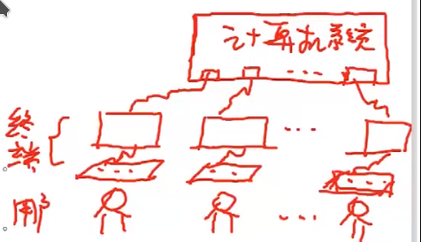

## 操作系统的概念、特征和功能

### 操作系统基本概念

操作系统，OS，指控制和管理计算机系统资源（软件和硬件）、合理调度各类资源，提高系统效率，方便用户使用的系统软件

- 方便用户使用

- 硬件系统上的第一层软件：虚拟机

- 控制软硬件资源

- 合理调度资源，提高效率和吞吐量

### 操作系统基本特征

并发：同一时间段内执行两个或两个以上程序，通过资源复用实现

- 并发是操作系统最重要的特性

共享：即资源复用，根据资源属性常分为**互斥共享**和**同时访问**

- 互斥共享：如打印机，进程顺序执行

- 同时访问：如磁盘，进程交替访问

并发和共享是多用户操作系统最基本的两个特征，是操作系统所必备的特征

虚拟：将同一物理实体演变为若干逻辑物体（如实地址映射虚地址），常分为**时分复用**和**空分复用**

- 时分复用：在同一时段，在某程序的空闲时间为其他程序复用，注意若一个物理设备供 n 个用户时分复用，单用户的平均处理速度不高于 1/n

- 空分复用：占用某一设备后并不全部使用，如磁盘，只用一部分，剩下的部分给其他用户复用

异步性：多道程序环境下，各进程以不可预知的速度执行，导致运行结果可能存在差异

### 操作系统主要功能

CPU 管理：以进程为单位进行 CPU 的分配，将对 CPU 的管理转化为对进程的管理和调度。**进程管理**包括进程的**控制**、**同步**和**通信**

- 进程控制：为作业创建进程，分配必要的资源；撤销已结束的作业，回收其占用的资源；控制进程运行过程的状态转换

- 进程同步：为多个进程的运行做协调
  
  - 互斥：锁机制
  
  - 同步：信号量机制、确认机制

- 进程通信：进程之间的信息互换

存储器管理：为程序运行提供良好环境，提高内存利用率，逻辑扩充内存（虚拟存储器）

- 内存分配：静态分配和动态分配
  
  - 静态分配：装入作业时一次性分配，运行期间不再申请空间
  
  - 动态分配：运行期间能够重复申请空间

- 内存保护：各个进程不要越界，各进程互不干扰，通过界限寄存器去实现

- 地址映射：逻辑地址映射为实际内存地址

- 内存扩充：逻辑扩充（感觉上扩充，小内存运行大程序），如请求调入和置换

设备管理：将设备视作文件，分配 IO 设备，完成指定 IO 操作，包括缓冲管理、设备分配和设备处理

- 缓冲管理：解决信息交互双方的速度矛盾

- 设备管理：分配用户 IO 设备

- 设备处理：通过驱动程序实现 CPU 和设备控制器之间的通信

文件管理：对存放于外存的所有文件进行管理，包括系统文件和用户文件

- 文件存储空间管理：为文件分配必要的外存空间，以及销毁和回收

- 目录管理：按名管理

- 文件读写管理：读写文件

- 文件保护：保证文件安全性

接口管理

- 用户接口：联机用户接口（命令行）、脱机用户接口（批处理作业用户使用）、图形用户接口（GUI 界面）

- 程序接口：即系统调用，为程序提供基础服务，每次将经过用户态-核心态-用户态的转换

系统安全

- 认证技术

- 密码技术

- 访问控制技术

- 反病毒技术

## 操作系统发展历程

> 即操作系统分类

操作系统不是计算机必备的软件

### 无操作系统

人工操作方式：用户独占全部系统资源，CPU 等待人工操作，资源利用率低，人机交互矛盾突出

脱机输入 / 输出方式：事先将纸带上的指令和数据通过纸带机，在外围机的控制下输入磁带，CPU 从磁带上高速调入程序和数据

- 借助磁带或磁盘实现
- 减少了 CPU 空闲时间，提高了 IO 效率

### 单道批处理操作系统

**单道**指内存中最多存放一道用户程序（不包括操作系统），**批处理**指在系统监督程序（monitor）控制下，一次连续处理存储于磁带的一批作业

- 系统监督程序 monitor：操作系统原型
- 优点：解决了人机矛盾和 CPU 与 IO 设备之间的速度不匹配问题，提高了系统资源使用率
- 缺点：无交互能力，一道用户作业，系统资源利用率不高
- 特点：实现脱机将一批作业输入磁带；自动性；顺序性；单道性

就有点像，同学写作业，统一交作业，老师独自批改的过程

### 多道批处理操作系统

内存中可以容纳多个用户程序，内存中最少有一个程序，即操作系统。第一台小规模集成电路计算机：IBM360，配备操作系统 OS/360

允许多个作业同时使用不同的外围设备

- 优点：显著提高 CPU、内存以及 IO 设备的利用率；多道批处理利用更多的系统资源；提高系统的吞吐量
- 缺点：无交互能力；平均周转时间长
- 特点：
  - 多道性：内存同时存在多个用户作业
  - 无序性：多个作业运行速度和时间受进程调度策略影响
  - 调度性：经过调度后，CPU 才能运行

注意：提高批处理操作系统形成和发展的主要动力是提高资源利用率和系统吞吐率

### 分时系统

允许一台主机为多个用户服务，并及时响应用户请求，一个计算机系统提供多个终端供用户使用

解决问题：

- 及时接收：及时接收用户的指令和数据
- 及时处理：通过时间片分时使用处理器

特点：

- 多路性：一台主机，多套终端，分时共享
- 独立性：各用户在自己的终端操作，互不干扰
- 及时性：较短时间内得到响应
- 交互性：通过终端请求主机和得到响应

### 实时系统

在分时操作系统的基础上，主要解决快速响应问题

实时任务：分为周期性实时任务和非周期性实时任务

- 周期性通过激励信号实现周期性控制
- 非周期性必须提供截止时间，开始截止时间和完成截止时间

硬实时和软实时：硬实时必须在截止时间内完成，软实时并不严格

常见的实时系统：工业控制系统、武器控制系统、信号查询系统、多媒体系统、嵌入式系统等

特点：

- 独立性
- 及时性：受制于控制对象的截止时间
- 交互性
- 多路性：周期性采集、控制和处理
- 可靠性：多级容错机制保证系统、数据安全

### 微机操作系统

单用户操作系统：仅允许一个用户存在，分为

- 单用户单任务
- 单用户多任务：Windows

多用户多任务操作系统：UNIX / Linux

## 程序运行环境

> 重点

### CPU 运行模式

### 中断和异常处理

### 系统调用

### 程序的链接和装入

### 程序运行时内存映像与地址空间

## 操作系统结构

## 操作系统引导

## 虚拟机
