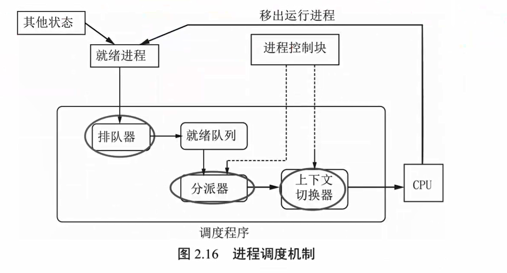
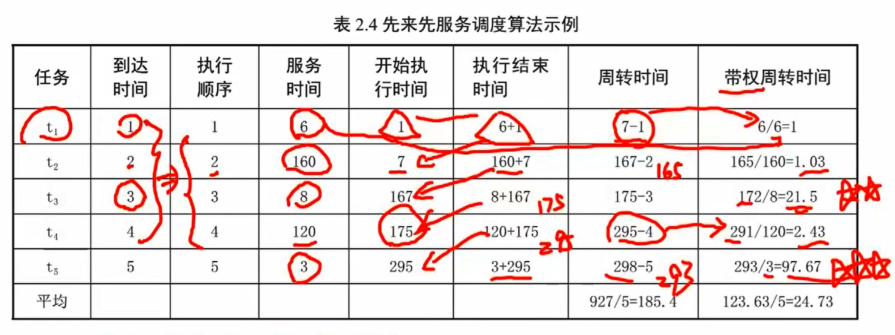
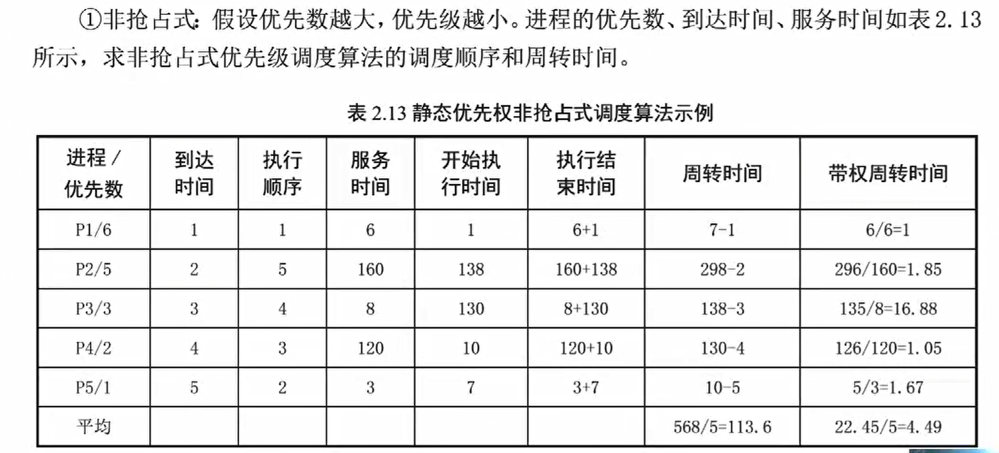
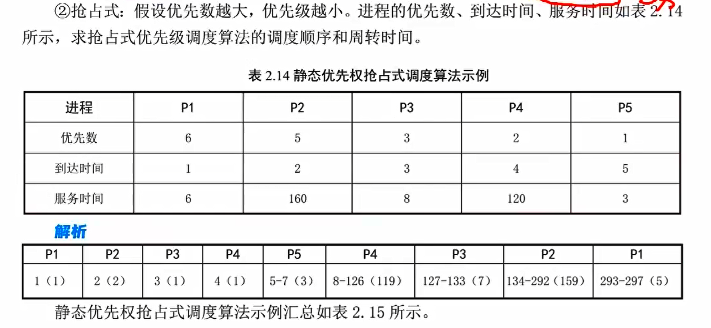
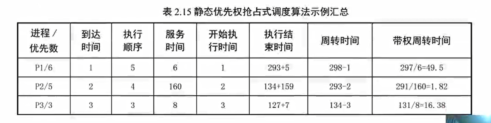

## 调度的基本概念

内存中存在多个运行实体（进程），而 CPU 数量有限（资源不足）无法真正使其并行，于是我们就要挑进程进行执行，令其他进程处于准备执行的状态（就绪），操作系统需要通过调度程序为各进程分配所需资源

调度分为以下三种级别

### 作业调度

又称为高级调度，作业，指用户交给操作系统的一个独立任务，由若干作业步构成，往往上一个作业步的输出是下一个作业步的输入

作业调度概述

- 调度单位：作业
- 特点：运行频率较低，可选择较复杂的调度算法（因为用的少）
- 作业控制块（一个复杂的表格 JCB）：作业注册程序，作业后备队列，等待作业调度程序调入

不同操作系统的高级调度方法不同

批处理系统

- 选择作业
- 分配资源
- 创建进程：进入进程就绪队列
- 作业控制：启动、衔接、异常处理
- 回收资源

分时系统和实时系统：为及时响应，作业直接送入内存，不需要作业调度

### 交换调度

也称为内存调度或中级调度，将暂时不具备运行条件的进程挂起，释放资源，并将进程 PCB 调至外存或内存挂起队列，令其处于**驻外存状态或挂起状态**，直到内存空闲区满足挂起状态的某进程需求时，调度算法将外存上的挂起进程重新调入内存

注意，被挂起的进程状态可能是就绪，也可能是阻塞，当被转换至外存后统一处于挂起状态（静止就绪或静止阻塞），不能参与低级调度（进程调度）

交换调度概述

- 应用背景：小内存，大作业，无法放入作业
- 目的：提高内存利用率、提高系统吞吐量、短期平滑和调整系统负荷
- 使用频率居中

### 进程调度

也叫低级调度、线程调度、处理机调度，是最基本的调度，是所有 OS 的核心功能，是多道操作系统的基础

进程调度概述

- 调度单位：进程 / 线程
- 使用频率高，通常选用简单的调度算法
- 主要任务：为就绪进程 / 线程分配处理机，使其处于运行状态

低级调度的任务：注意他并不创建进程（由作业调度创建），只调度进程

- 保存当前进程 / 线程信息，如 PC 内容、程序状态字等
- 调度算法从就绪队列调度某一进程
- 将处理机分配给这一进程

进程调度机制如图所示

- 排队器：将系统所有的就绪进程按一定方式排列成一个或多个队列
- 分派器：将进程调度程序选定的进程从就绪队列取出，进行上下文切换，将 CPU 分配给新进程
- 上下文切换器：进行两次切换，第一次将当前程序保存，装入分派程序的上下文；第二次为将新进程的上下文装入 CPU 相应寄存器
  - 这里的上下文切换非常耗资源

### 操作系统中作业和进程的关系

#### 批处理系统

作业是进程的任务实体，进程是作业的执行实体，没有作业进程将不存在、虚无，没有进程作业将无法完成

- 任务是考高分，作业是学习各学科

作业多用于批处理操作系统，面向外存；进程用于多道程序设计，面向内存

作业的三阶段四状态

- 收容阶段：提交状态、后备状态
  - 提交任务，由输入设备预输入
  - 输入结束，调入后备队列（外存）
- 运行阶段：执行状态
- 完成阶段：完成状态

#### 分时操作系统

每个终端的一次提交是一个作业交互，可以是提交一个作业，也可以是一个作业步

### 调度的任务和基本准则

进程调度：为当前要执行的进程分配处理机（CPU）

作业调度

- 根据 JCB 检查系统资源及作业需求；按照某种调度算法从作业后备队列选取满足资源的若干作业调入内存，并为内存中的作业创建进程，分配必要资源；将进程插入进程就绪队列，等待进程调度，使之执行
- 需要决定
  - 接纳多少作业（取决于多道度）：系统规模、运行速度、作业大小、系统性能
  - 接纳哪些作业（取决于调度算法）：分时、实时系统无需作业调度，但需要某种接纳措施控制进入系统的用户数

调度的基本准则

面向用户

- 周转时间：尽量短
- 相应时间：尽量快
- 截止时间：尽量满足
- 优先权准则：对不同任务设定优先权，并对优先级高的任务动态调度，以保证紧急任务及时处理。如实时系统采用**抢占式调度方式**

面向系统

- 吞吐量大：单位时间内完成的作业数尽量多
- CPU 利用率高：单位时间内 CPU 处于忙碌状态的时间占比尽量高，在单用户系统和实时系统中，该准则并不重要，更在意实时性
- 系统资源平衡利用
- 公平性

各级调度区别

| 调度级别             | 调度算法复杂度 | 使用频率 | 必备   |
| -------------------- | -------------- | -------- | ------ |
| 低级调度（进程调度） | 低             | 高       | 是     |
| 中继调度（交换调度） | 中             | 中       | 可选   |
| 高级调度（作业调度） | 高             | 低       | 有或无 |

各操作系统调度存在情况

| 操作系统       | 低级调度 | 中继调度 | 高级调度 |
| -------------- | -------- | -------- | -------- |
| 多道批处理系统 | 有       | 可选     | 有       |
| 分时系统       | 有       | 引入     | 一般无   |
| 实时系统       | 有       | 可选     | 无       |

注意在多处理机情况下，调度并不负责为进程选择合适的 CPU，只是分配（分配 != 选择）

## 调度的目的

不同类型操作系统调度算法的目的不同

CPU 利用率 = CPU 有效工作时间 / (有效工作时间 + 空闲时间)

处理机调度的共同目标如下

- 资源利用率高：尽可能忙碌
- 公平性：合理分配 CPU 时间
- 平衡性：合理调度，使使用均衡
- 策略执行性强

### 批处理系统目标

平均周转时间短：作业从提交（外存到内存）到完成

- 等待作业调度时间
- 就绪队列等待时间
- 执行时间
- 等待 IO 时间

作业希望自己的周转时间最短（贪婪），操作系统则要考虑平均周转最短，使大多数用户满意，提高系统资源利用率

带权周转时间：周转时间（任务结束时间 - 任务到达时间）比上执行时间（整个时间比上占用 CPU 比例）；越大，说明 CPU 占用越少
$$
T_{weight} = \frac{T}{T_e}
$$
系统吞吐量高：短作业优先，追求处理更多的作业，以提高吞吐量（单位时间内完成作业数量）

处理机利用率高：大作业优先，CPU 占用时间长

### 分时系统目标

分时系统最大的目的：交互性

响应时间快：分时操作系统调度算法的主要准则

- 请求时间
- 处理时间
- 回送时间

均衡性：尽可能保持均衡，大任务用时稍长可以接受

### 实时系统的目标

截止时间的保证：主要目的，确定作业必须完成的最迟时间

- 硬实时周期任务：必须确保截止时间
- 软实时周期任务：基本保证截止时间（可稍延迟）

可预测性：如视频处理的第 i 帧和 i+1 帧具有连续性，由此可以压缩所需存储的数据规模

## 调度的实现

### 调度器和调度程序

> scheduler

从多个任务中选取若干任务合理分配资源，使其在微观（并行）或宏观（并发）上同时执行，提高系统资源利用率和吞吐量

调度器常包含三部分内容

- 数据结构：存储任务的必要信息，为调度服务
- 上下文：为切换提供参数，包含
  - 用户地址空间：程序代码、数据和用户堆栈等
  - 控制信息：进程描述符、内存堆栈等
  - 硬件上下文：重要寄存器的内容
- 虚拟时钟：为算法提供时钟标准

### 调度的时机和切换

处理中断、处于操作系统内核临界区、正在处理原子操作、正在执行原语时将暂缓调度，其余时间，任何请求调度的事件发生都有可能除法调度程序运行

调度时机

- 系统调用结束
- 中断或陷入处理结束：意外处理完毕
- 主动：进程执行完毕或执行发生异常；进程执行过程中请求外设操作
- 被动：进程时间片用完；抢占方式下遇到优先级更高的进程进入

切换指处理机占用者发生变化，即 PC 中的内容变为其他程序中的指令地址，正占用者放弃处理机，唤醒调度程序，使其运行新的占用该处理机的进程

非抢占式 / 非剥夺式：只有运行结束或因 IO 阻塞时，正运行程序才会释放处理机，适用于批处理系统

其引起进程调度的因素如下

- 进程运行完毕
- 进程因 IO 请求暂停执行
- 进程无法执行
- 通讯过程中执行了某原语，导致其停止执行

非抢占式调度特点

- 优点：实现简单，系统开销小
- 缺点：无法满足重要或紧迫任务的需求，很难满足交互性作业和实时性需求
- 适用于大多数批处理系统，不适用于分时系统和大多数实时系统

注意在非抢占式调度中，即使优先级最高，也不一定被及时调度，触发进程调度程序

抢占式 / 剥夺式：正在执行进程可被动让出处理机

- 优先级原则：为紧迫作业赋予较高优先级
- 短进程优先原则：占用 CPU 时间短的作业优先级较高
- 时间片原则：作业的时间片用完后，将自动执行下一个任务

抢占式调度特点

- 优点：系统相应快，吞吐量大，资源利用率高，能够满足重要、紧迫任务的需求
- 准则：优先权；基于时间片；短进程优先

### 闲逛进程

0 号进程，优先级最低，抢占式下很容易被剥夺 CPU，由内核初始化函数创建，就绪队列为空时，CPU 执行闲逛进程，可以省电并减少产热

### 调度实现方式

可以由操作系统完成，也可以由用户程序完成，前者更快，后者灵活性更高

### 用户级线程调度

用户程序通过线程函数库创建的线程，运行于用户状态（如 JAVA 的 Tread，C3P0 线程池），对操作系统透明（没有 PCB、TCB）

用户级线程的调度算法由用户自己变写，操作系统进行进程调度，线程的调度无需内核参与

特点

- 优点：控制简单，易扩展，无需切换内核，开销较小
- 缺点：进程是资源调度单位，用户线程进行请求时只能请求单个进程资源，这意味着多个线程只能运行在同一进程（处理机），并且，当进程中某线程阻塞时，整个进程可能会被阻塞（线程调度算法可以被用户重写以处理单个线程阻塞切换其他线程的情况）

### 内核级线程调度

由操作系统实现，位于内核空间，运行于核心状态，通过线程控制快 TCB 进行控制

通过系统调用创建新鲜成，并由 OS 对线程表进行更新，一个进程的多个线程可以同时运行在多个 CPU 上，实现并行，各自不会相互阻塞

需要不断从内核态到用户态切换，需要额外开销

## 典型调度算法

调度算法的选择取决于操作系统的类型和设计目标（算法即流程）

### 先来先服务调度算法

> First Come First Served, FCFS

以等待时间为优先级，属于不可抢占的调度方式，进程、线程、作业调用都可适用

进程 / 线程调度的 FCFS：将处理机分配给就绪队列队头的进程，使其处于执行态

作业调度的 FCFS：从外存后备队列的队头开始，选择一个或多个作业进入后备队列且资源能够得到满足的作业调入内存，为他们分配资源、创建进程并插入就绪队列

特点：不会出现饥饿现象 —— 即早早进入队列且资源能够满足，但一直得不到执行的情况

- 带权周转时间越大，说明安排的越不合理（执行一小会儿，等
- 平均周转时间、平均带权周转时间简单取均值即可

### 短进程优先调度算法

> Short Process First, SPF

谁占用 CPU 的相对时间短，谁优先级高，相对指`运行时间/计算时间`，但在实际计算中看进程的**服务时间**即可，适用于进程调度和作业调用

特点

- 可能出现饥饿现象
- 没有考虑紧迫作业的需求
- 必须预知作业的运行时长，这并不容易估计
- 不利于运行 时间长的作业

### 时间片轮转调度算法

分时操作系统为保证用户请求响应的及时性，采用简单的时间片轮转调度算法，90 年代广泛采用多级反馈队列调度算法

基本原理

- OS 将所有就绪进程按 FCFS 排成一个队列
- 将 CPU 分给队首进程，令其执行一个时间片
- 时间片用完立即停止该进程，将其插入队尾
- 重复操作，直至所有进程执行完毕

当队列为空执行零号闲逛进程，用于省电

进程切换时机

- 时间片未用完，进程执行完毕，进行进程切换，立即启动一个新的时间片
- 时间片用完，进程未用完，进行进程切换，启动一个新的时间片

时间片大小的确定：

- 时间片小利于短进程运行，对于大进程增加了进程调度和上下文切换的开销
- 大时间片利于长作业运行，算法可能退化为 FCFS
- 可行方法为：时间片略大于一次典型交互时间

特点：确保就绪队列所有进程在一定时间内均能获得一个时间片；系统在给定时间内能够响应所有用户请求

- 实际上执行顺序和服务时长保持一致，越短越早执行完
- 短的进程会先结束，长的进程也不会发生饥饿

轮转算法的推导过程非常繁琐，一定要捋清关系，慢慢算

### 高相应比优先调度算法

相应比 = (等待时间+运行时间) / 运行时间 = 1 + 等待时间 / 运行时间 = 响应时间 / 运行时间

- 等待时间越长，优先级越高

缺点：每次调度之前均需计算相应比，增加系统开销

优点

- 对于不同进程实现了较好的这种
- 等待时间相同，运行时间越短越先执行，有利于短任务调度
- 运行时间相同，等待时间越长越先执行，类似于先来先服务调度

每当一个任务结束后，队列中所有任务的等待时间都需要更新一次（服务时间不变），做题时要手动更新并计算出相应比最大的一个任务，作为下一个执行任务

### 优先级调度算法

> Priority Scheduling Algorithm, PSA

调度优先级最高的进程进行执行，可能出现饥饿现象，适用于批处理操作系统和实时操作系统

分为动态优先级和静态优先级，也分为抢占式和非抢占式

- 非抢占式必须要等待当前任务执行完毕才可以执行优先级最高的任务

动态优先级：优先级在创建进程时就赋予，在排队过程中，各进程的优先级是可以动态改变的

- 适用于批处理和实时系统，分时系统需要抢占式调度
- 复杂，系统开销大

静态优先级：每个进程在创建时被赋予的优先级不可变

确定的优先级的依据

- 进程类型
- 进程对资源的需求
- 用户要求

栗子一：静态优先级的非抢占式实例

栗子二：静态优先级的抢占式实例

### 多队列调度算法

系统中设置多个队列，每个队列可以使用不同的调度算法，各个队列之间有队列的优先级，在调度时，先根据队列的优先级确定队列，再根据队列具体的调度方式从当前队列中调度进程/作业

在多处理机系统中

- 可以为每个处理机设置一个就绪队列
- 不同处理机可采用不同的调度策略
- 可将一个进程的多个线程分配在一个处理机上
- 可将一组需要合作的进程或线程分配到一组处理机对应的多个就绪队列，使其并行处理作业

### 多级反馈队列调度算法

> 非常复杂捏，有可能考到

工作原理

- 设置多个就绪队列，一队列优先级高于二队列，二高于三，以此类推
- 在每个队列内，采用时间片轮转调度算法，队列优先级越高，时间片越小
- 当第 i 队列中，某一进程的时间片用完，且进程未完成，将加至第 i+1 个队列的队尾，直到该进程完成
- 初始时进程将加至一队列队尾，所有进程都遵循以上规则直至所有任务完成

注意：只有当第 i 队列前的所有队列均空时，第 i 个队列才能执行其队头进程，这也是队列优先级的含义

优点：

- 性能很好，能满足各种类型用户需要
- 终端型作业，大多属于较小的交互型作业
- 短批处理作业用户：周转时间仍较短，至多在 2-3 队列完成
- 长批处理用户：不会饥饿，总会完成

调度算法比较

| 调度算法     | 可抢占 | 不可抢占 | 优点                                   | 缺点                                                         | 适用               | 能否用于作业调度 | 能否用于进程调度 |
| ------------ | ------ | -------- | -------------------------------------- | ------------------------------------------------------------ | ------------------ | ---------------- | ---------------- |
| 先来先服务   | 0      | 1        | 公平；简单；利于 CPU 繁忙型            | 不利于短作业和 IO 繁忙型服务                                 |                    | 1                | 1                |
| 短作业优先   | 1      | 1        | 平均等待时间最少，效率最高             | 长作业可能饥饿；估计时间不易确定；未考虑紧迫程度             | 作业调度批处理系统 | 1                | 1                |
| 高响应比优先 | 1      | 1        | 兼顾长短作业                           | 计算响应比开销较大（每执行一个进程都需要重新计算所有入队进程的等待时间） |                    | 1                | 1                |
| 时间片轮转   | 1      | 1        | 兼顾长短作业                           | 平均等待时间较长；上下文切换开销较大                         | 分时系统           | 0                | 1                |
| 多级反馈队列 | 1      | 0        | 兼顾长短作业；响应时间较短；综合效率高 | 同样存在计算开销                                             | 通用               | 0                | 1                |

这里要注意的是：多级反馈的抢占不同于优先级调度的抢占，他是优先级高的队列中进程抢占队列优先级低的进程，他的抢占必须发生在**本次时间片执行结束或进程提前时间片结束**，而优先级调度的抢占可以发生在进程执行期间

