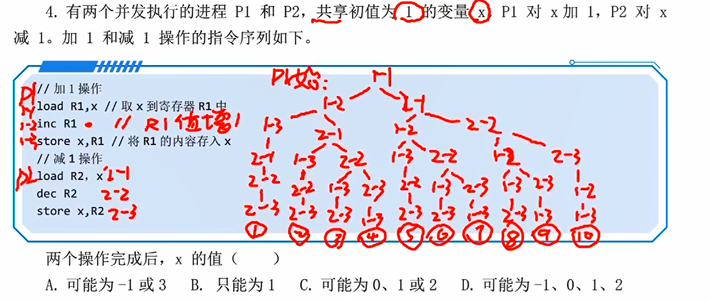
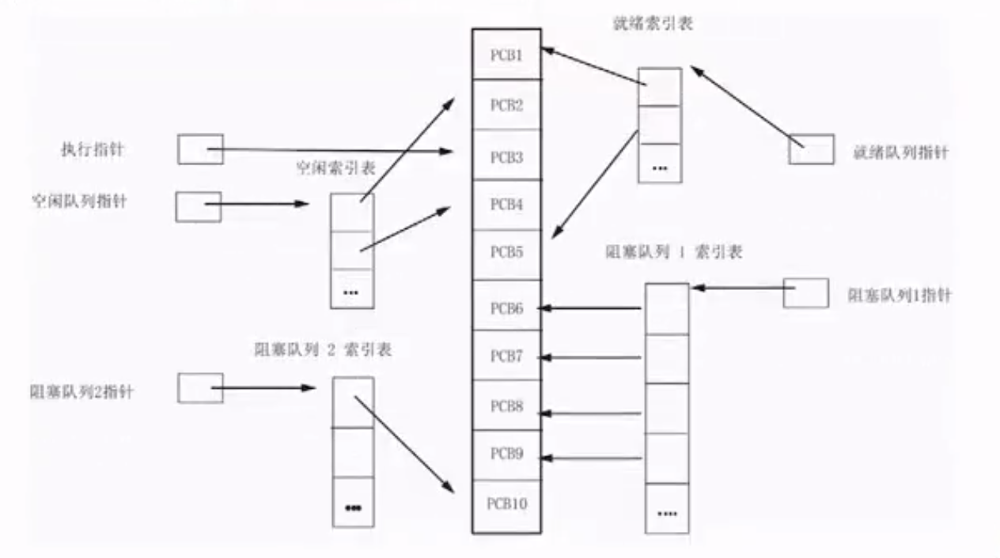

> 进程管理，又称 CPU 管理，包括了两章内容，内容非常之多

## 进程基本概念

### 前趋图和程序执行

#### 前趋图

描述进程或程序各部分之间执行顺序的有向无环图，具有一个开始节点和一个终止节点，只有在所有前驱均完成时，当前进程才可以开始执行

每个节点可有一个权重，表示进程的执行时间等

#### 程序的顺序执行

程序由各程序段组成，各程序段按照约定的先后顺序执行，一个程序段之间的各语句也存在执行顺序问题，有以下特点

- 顺序性，任一操作必须在后继开始之前结束
- 封闭性，程序在封闭环境中运行，即独占机器所有资源，资源的状态只有本程序能够改变，并且程序一旦开始执行，其结果就不再受外界因素影响
- 可再现性，只有环境和初始条件相同，就可获得相同的执行结果

因为独占，系统吞吐量小，资源利用率低

#### 程序的并发执行

基于多道技术，系统中可同时存在多个处于执行状态的程序，这意味着不存在前驱后继的程序或程序段可以在宏观上同时执行（当单处理器时，微观上多道程序分时交替执行），会导致执行结果存在不确定风险，其特点有

- 间断性：程序的执行过程未必连续
- 失去封闭性：程序受其他并发程序影响
- 不可再现性

系统吞吐量大，资源利用率高，但程序间相互制约，正确性保证难度大

注意：并行和并发并不完全一样，并发是严格的同时执行，需要多个硬件资源支持，而并发是在同一时间段内同时执行，可以是分时交替

### 进程的引入

操作系统的基本特征：并发和共享

同一程序、不同数据集，对应不同的进程，如多个人各自编写程序，使用同一个编译器进行编译，就属于不同的进程

| 程序          | 进程           |
| ----------- | ------------ |
| 静态          | 动态           |
| 完成一个功能      | 反应程序的执行      |
| 永久存在        | 具有生命周期       |
| 顺序性         | 并发性          |
| 功能单位        | 资源拥有、分配、调度单位 |
| 一个程序可对应多个进程 | 一个进程可以执行多个程序 |

进程的特点

- 结构性：由进程控制块（PCB）、程序和数据构成
- 动态性：程序的一次执行过程，具有生命周期
- 并发性：多个进程实体共存于内存，且在一段时间内同时运行
- 独立性：独立运行、独立分配资源、独立接受2调度
- 异步性：按各自独立、不可预知的速度向前推进，可能导致不确定

线程是进程的基本单位

栗题：进程的并发对共享变量结果的影响

- 程序内部顺序执行
- 程序之间瞎几把排列执行

还有从 p2 开始的十条路径，应该是选 C，在这可以看到，两个进程，各三条指令，居然有 20 种可能结果，这很哈人

## 进程的状态与转换

### 进程的基本状态

进程的三种基本状态：就绪、执行、阻塞

- 就绪状态得到 CPU 控制转到执行状态
- 执行状态时拥有所有所需资源
- 阻塞是放弃处理机后的状态，又称等待状态

在单处理机上，处于执行状态的进程同时只有一个，存在一个或多个就绪队列和多个阻塞队列，阻塞队列将根据资源空缺进行分类

注意，这里的队列并不是简单的先进先出，需要 CPU 主动调度，若 CPU 正忙，即使进程位于 first，也无法转为执行状态

### 进程基本状态转换

进程的动态性 ——> 状态转换

- 就绪 ——> 执行：获取 CPU 调度
- 执行 ——> 就绪：时间片用完，根据调度算法插入就绪队列
- 阻塞 ——> 就绪：获取 CPU 以外的所有资源
- 执行 ——> 阻塞：资源请求失败

### 进程操作

创建：由创建进程的原语（原子语言）完成，可以由系统创建，也可以由用户创建。创建进程时为进程分配进程控制块 PCB（空白），并将其（PCB）插入就绪队列，同时分配必要资源

终止：进程完成任务或发生意外时，将被终止，由原语完成

- 不再执行，但会在 os 中保留记录，内容为状态码和统计数据（log），供其他进程收集
- 收集完成后，将删除记录，将其 PCB 清零，并将空白 PCB 返还 os

挂起、激活：挂起指暂停执行、暂停就绪进入静止就绪状态，暂停阻塞（退出资源排队）进入静止阻塞状态，激活反之，由挂起原语和激活原语实现

阻塞：从执行状态自主阻塞，进入阻塞状态

唤醒：从阻塞状态转入就绪状态，插入就绪队列

## 线程的基本概念、状态与转换

进程的引入解决了单机环境下程序并发问题

- 执行程序个数（进程个数）多余处理器个数

线程引入的目的在于提高程序并发执行的速度

- 减少进程执行的时空开销，进程独占资源，开销其实很大
- 提高操作系统的并发性

### 进程和线程

进程是计算机中**独立的运行单位、资源拥有单位，CPU 调度和分派单位**，其时空开销分析如下

- 创建进程：分配除 CPU 的其他所需资源，建立 PCB 插入就绪队列
- 进程切换：保存执行状态的 CPU 环境（入栈），设置新 CPU 环境，修改相关进程的 PCB
  - 新进程：就绪 ——> 执行
  - 原进程：执行 ——> 就绪 / 等待
- 撤销进程：回收进程所占系统资源，撤销 PCB

进程的属性、操作太过复杂，为了简化，我们将资源拥有属性和 CPU 调度和分配属性进行分割，降低系统开销

**线程**：也叫轻量进程，是进程中某个单一顺序的控制流，是一个可执行实体，作为系统调度和分配的基本单位

多线程操作系统中的进程

- 拥有资源的基本单位，资源为其所有线程共享
- 多个线程**并发**执行 
  - 每个进程至少含一个线程  
  - 每个线程只能属于一个进程
- 进程不再是可执行实体 
  - 线程是独立的调度、运行单位  
  - 进程中所有线程的各状态和进程保持一致：这意味着，线程执行态，则进程也是执行态，若进程挂起，其所有线程也被挂起

线程和进程的比较

|      | 线程                      | 进程               |
| ---- | ----------------------- | ---------------- |
| 调度   | 资源调度、分配单位               | 资源拥有、调度、分配单位     |
| 时空开销 | 无需上下文切换，开销小             | 需要切换，开销大         |
| 并发性  | 具有并发性                   | 具有并发性            |
| 独立性  | 同进程不同线程独立性低             | 独立性高             |
| 处理器  | 进程内各线程可运行在不同 CPU 中，并行执行 | 同一个进程只能运行于一个 CPU |

注意：线程的引入并没有令资源分配更加细化，资源分配仍然是以进程为单位，只是线程向进程申请资源，谈不上分配的细化

### 线程状态和操作及状态转换

状态：就绪、执行、等待（阻塞）

线程同样具有生命周期，因创建而产生，由调度执行，由终止而消亡

- 创建：程序启动时，通常仅有一个“初始化线程”执行，用于创建新线程  
  - 创建新线程需要通过线程创建函数 / 系统调用，并提供参数  
  - 线程创建函数执行后，返回线程标识符，该函数就是一个线程
- 终止：完成任务（自然终止）或出现异常（强行终止）  
  - 系统线程创建后不终止  
  - 大多线程被终止后不立即释放资源  
  - 终止后，线程不处于活跃状态，但仍然占有资源，只有当进程中其他所有线程执行**分离函数**后，才释放资源  
  - **已终止但未释放资源**的进程可以被其他线程通过**连接命令**重复调用，只有当线程终止后，连接命令才会有效

线程的状态转换和进程保持一致

## 线程的实现

### 线程实现方式

不同系统（OS、DBMS）的线程实现方式不同，一般具有以下两种形式，可以实现其中一种，也可以同时实现两种

#### 内核支持线程

内核支持线程（KST, kernel supported threads）：所有线程操作均在核心态进行，需要状态切换，产生额外开销

- 大多数 OS 支持该种方式
- 内核空间为每个线程设置一个线程控制块 TCB 用于被内核感知
- 线程的创建、等待、撤销、切换均在内核空间实现

优点

- 多处理器支持线程并行执行
- 进程某线程阻塞，可执行进程其他线程，不直接导致进程阻塞
- 空间小，线程切换快，开销小

缺点

- 用户线程在用户态执行，线程调度核管理在核心态实现，需要不断切换
- 同一进程中不同线程的切换需要状态转换

#### 用户级线程

用户级线程（ULT, user level threads）：线程在用户空间实现，无需内核支持，内核也无法感知用户级线程的存在

优点

- 不需要切换，切换开销小
- 每个进程可以使用自己单独的专用调度算法，可操作性更高
- 用户级线程实现和 OS 无关，线程管理代码属于用户程序一部分，所有程序均可共享

缺点

- 进程不好给线程分配时间片
- 在这一模式下，大多数系统调用将导致进程阻塞
- 线程只能并发执行

#### 组合方式

组合方式：KST 和 ULT 结合使用

- 多对一模型：所有用户级线程映射到一个内核支持线程
- 一对一：每个对应一个，可并行
- 多对多：若干对若干，组对组

### 线程的实现

进程和线程需要内核支持，以获取系统调用，内核支持可以直接调用，用户级线程需要借助**中间系统**帮助

内核支持线程实现：创建线程时，分配任务数据区 PTDA 和若干线程控制块 TCB，内核通过 TCB 感知、控制线程，执行创建、撤销、调度、切换等操作

用户级线程实现：中间系统的实现

- 运行时系统：用户空间的系统函数集合
- LWP（light weight process）轻量线程线程池：LWP 具有线程的数据结构，如 TCB、标识符、优先级，同时可以进行系统调用，用户级线程通过 LWP 获取系统服务

## 进程和线程的组织

操作系统通过数据结构（表）对进程 / 线程进行管理，PCB 即进程对应的表，TCB 即线程所对应的表，创建进程、线程即向表中填入进程、通过修改 PCB 动态更新线程信息，以达到控制需求

其中 PCB 和 TCB 都属于系统资源

### PCB 的作用

process control block，进程管理模块，每个 PCB 需占用较多字节，记录操作系统需要的、描述进程当前情况及管理进程运行的全部信息，是操作系统中最重要的记录型数据结构，随着进程的建立，经历从空白到有具体内容，再到内容变化，最后空白的过程

其作用有

- 独立运行基本单位的标志：当操作系统分配出一个 PCB 时，业绩标志着一个进程的建立，成为一个独立运行的基本单位
- 实现间断性运行方式：PCB 可保存 CPU 现场信息
- 提供进程管理所需要的信息：PCB 记录有进程所对应程序和数据的内外存地址，运行程序所需资源清单
- 提供进程调度所需要的信息：PCB 记录进程的状态、优先级、等待时间等
- 实现与其他进程的同步和通信

### PCB 的内容

进程标识符：唯一表示一个进程

- 外部标识符：为字符串，方便进程访问，由创建者提供，如 Thread t
- 内部标识符：为数字，进程序号，方便在操作系统内部使用

处理机状态：主要包含处理机的各寄存器内容，进程中断时，各寄存器的信息保存在 PCB 中

- 通用寄存器：数据集存其
- 指令计数器 PC：下一条指令的地址
- 程序状态字寄存器 PSW：记录状态，如是否溢出
- 用户栈指针

进程调度信息

- 进程当前状态
- 进程优先级
- 阻塞原因

控制信息

- 程序和数据的地址
- 同步和通信机制
- 资源清单
- 链接指针：指向本进程所在队列下一个进程的 PCB 首地址

### PCB 组织方式

系统中存在大量的 PCB，需要对其进行有效管理，常见组织方式如下

线性方式：结构体数组，通过线性表管理，适合进程不多的系统

- 实现简单，存储开销小
- 查找效率低，需要连续的内存空间，不利用内存利用

链接方式：结构体链表，结构体首部为自身序号，尾部为 PCB 指针，指向下一个 PCB。该方式维护各个队列的首指针，如执行指针、就绪队列指针，用于访问 PCB 队列

- 就绪队列：维护一个或多个就绪队列，按照优先级排序，通过链表相连
- 空白队列，以链表方式链接空白的 PCB 表
- 阻塞队列：一个等待事件的所有进程的 PCB 构成的队列，多个等待事件则有多个队列

索引方式：提取关键信息，先建立各种状态的 PCB 的索引表，就像字典，再通过索引表去查找 PCB

- 所占内存更多，一般是索引表顺序存放
- 查找很快

### 线程组织

把 PCB 换成 TCB，即为线程组织，同样分为线性、链接和索引三种组织方式

注意

- PCB / TCB 均存储于内存中，并非 cache 或快表
- PCB / TCB 不可被用户使用，是由操作系统管理的共用数据结构

## 进程和线程的控制

进程控制是进程管理最基本的功能，通过进程操作完成，如创建、终止、阻塞、唤醒、挂起、激活等，如此这些操作构成一个进程的完整生命周期。进程操作一般由操作系统内核的原语实现，线程控制类似于进程控制

### 操作系统内核

内核指操作系统中和**硬件密切相关的模块**（如中断处理程序）、**常用驱动程序**、**运行频率较高模块**等紧靠硬件的软件层，这部分软件常驻于内存，运行于内核态。不同操作系统内核包含的功能未必相同，但一般具有以下两个功能

- 支撑功能：最核心最底层的功能，如 
  - 中断处理：系统调用、设备 IO、进程调度 
  - 时钟管理：时间控制
  - 原语操作：保证操作的原子性
- 资源管理功能：进程管理、存储管理、设备管理

设置内核目的：保护内核，使其不受其他程序破坏，提高操作系统运行效率

### 进程的层次结构

有些操作系统运行一个进程创建另一个进程，形成进程的层次结构，如 UNIX，就有**父子进程**的说法，创建进程的进程称为父进程，被创建的叫做子进程，特点如下

- 子进程可以继承父进程的资源，且父进程无法拒绝子进程的继承权
- 子进程撤销后，资源交还给父进程
- 父进程撤销后，子进程被同时撤销

我们用进程图来描述进程家族关系，是一颗有向树，双亲为父进程，子节点为子进程，

在 Windows 中，所有进程地位相同，没有父子关系，创建进程的进程通过句柄、令牌来控制被创建的进程

### 创建进程

通过操作系统**调用进程创建原语**完成进程的创建

- 创建过程不可中断

引起进程创建的事件

- 用户登录：分时系统中，用户登陆成功，系统将为其创建一个进程
- 作业调度：多道批处理系统中（多指的是内存，批指的是外存），为作业创建进程，插入就绪队列
- 提供服务：运行状态进程提出请求，如打印数据，系统将为其创建一个打印进程
- 应用请求：如应用“打印输入数据”，需要 CPU 不断响应应用的请求，共包含三个进程（输入、处理输入、输出），为了提高效率，三者并发运行，于是应用同时创建了三个进程

进程的创建过程

- 申请空白 PCB（有可能失败），填写控制和管理进程的信息
- 为新进程分配资源，如内存、文件、IO 设备
- 初始化 PCB
- 如果就绪队列能够容纳新进程，将 PCB 插入就绪队列

### 终止进程

进程完成任务或发生意外后，将被终止

进程终止原因

- 正常结束
- 异常结束，出现无法克服的错误
- 外界干扰：被操作系统终结，或被其他有终止权的进程终止

引起进程终止的事件

- IO 故障，如外设出错
- 算术运算出错
- 超时：运行超时 / 等候超时
- 越界超时：超出允许访问范围
- 异常结束
- 非法指令：不正确或不允许使用的指令
- 特权指令错误
- 保护错误：以不恰当的方式访问资源

进程的终止过程

- 根据标识符在 PCB 表中检索出 PCB，读出状态，如果被终止进程还有子进程，同时终止其所有子进程；若为执行状态，应立即终止该进程执行，并置调度标志为真，允许被其他进程重新调度
- 将资源归还给父进程或系统
- 将被终止进程的 PCB 从所在队列移出，归还系统，加入空闲 PCB 表

### 挂起、激活

被挂起后，处于执行状态的进程将暂停执行，处于就绪状态的进程将暂停处理及调度，激活反之。挂起的目的在于便于系统和用户观察、分析进程

引起进程挂起 / 激活的事件

- 终端用户的需要：由动便静，便于观察中间结果
- 父进程请求：调节子进程活动
- 负荷调节的需要：保证实时性，挂起不重要的进程
- 操作系统的需要：检查资源使用情况或记账

### 阻塞

进程调用阻塞原语进行自我阻塞，插入等待事件的队列

引起进程阻塞的事件有

- 请求共享资源失败
- 等待某操作完成
- 新数据尚未到达
- 等待新任务的到达

进程阻塞过程

- 调用阻塞原语 block，完成自我阻塞
- 由执行状态转为阻塞状态，PCB 插入对应阻塞队列
- 执行处理及调度程序，从就绪队列中选中一个进程进行进程切换，由就绪转为执行，并按照该进程 PCB 重置处理机环境

### 唤醒

A 进程释放资源后，通过唤醒原语将等待资源的 B 进程唤醒，使其进入就绪队列

引起进程唤醒的事件

- 等待的操作完成
- 需要的数据到达
- 等待的新任务到达
- 请求的共享资源被其他进程释放

进程唤醒过程

- 执行唤醒原语 wakeup
- 从阻塞队列中移出某阻塞的进程
- 将阻塞进程 PCB 中的状态由阻塞改为就绪，并按照某种策略插入就绪队列

## 进程通信

进程之间信息交换，分为低级通信和高级通信，其中高级通信是用户直接**利用操作系统提供的一组通信命令**高效传送大量数据的方式，分为以下三种

### 共享存储系统

进程 A 和进程 B 可以同时向一块共享存储空间读写信息，通过在这块空间的信息存取完成信息交换

特点：适用于交换大量数据，仅在建立时需要系统调用，速度较快，可由应用程序员实现

注意：进程 A 和 B 必须互斥使用共享存储空间，即分时使用；同时基于共享存储区的方式属于高级通信，而基于共享数据结构的方式属于低级通信

### 消息传递系统

直接消息传递：发送原语，格式化数据在缓冲区间之间传递

间接消息传递：信箱通信原语，发送到信箱，阻塞

特点：适用于交换少量数据，通常通过系统调用实现，需经过用户态 - 核心态 - 用户态的转换，速度较慢，适用于分布式系统

注意：信箱的使用是同步的，即只有有信件发出，才能读取信件，有空间才能发送信件

### 管道通信

管道又称为 pipe 文件，通过环形队列维护字符流通信，A 进程写文件，B 进程读文件，数据流读取后则销毁，常用于父子进程通信

A B 进程间的通信属于半双工，即同一时间只能由同一方写文件，同一方读文件，但可双向通信

管道的使用流程如下

- 父进程创建管道，得到两个文件描述符，分别指向管道的两端（读端和写端）
- 父进程创建子进程，子进程同样具有两个文件描述符，指向同一管道
- 父进程关闭读端，子进程关闭写端，父进程和子进程进行通信，按照 queue 的规则进行读写

管道通信的特点

- 可以向管道以字符流的形式写入大量数据
- 接受管道的进程从读端读取字符流
- 高效传送大量数据
- 初见于 Linux 系统中，广泛应用于其他操作系统

管道机制必须提供以下协调能力

- 互斥：读写互斥，不能同时读 / 写
- 同步：写了之后，才有读取权限；满了不能写，空了不能读
- 确认对方是否存在，只有存在才能通信

高级通信的特点

- 高效传送大量数据
- 使用方便、透明

