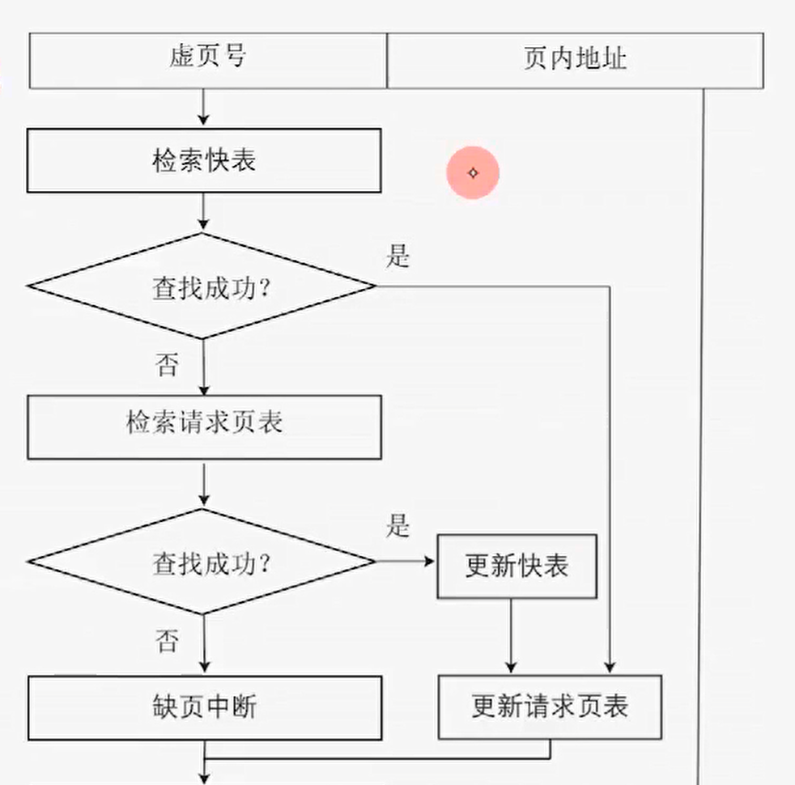
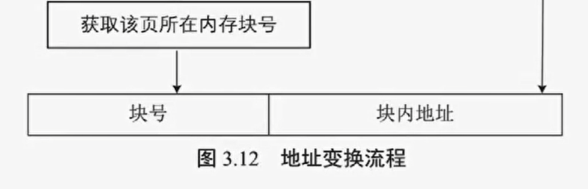

实存管理，要求作业一次性装入内存

- 一次性：大作业、多道性受限
- 驻留性：直到运行结束才释放内存
- 低效性

解决办法

- 从物理上增加内存容量
- 从逻辑上扩充内存容量，通过算法解决问题

因为不是所有程序段都要执行，我们选择性的将程序调入内存，即先部分装入肯定会执行的部分，其余部分需要时再装入

这种方式即通过虚拟存储管理实现，由操作系统提供

## 虚拟内存基本概念

> 基于实存管理，出应用

虚拟内存基于程序访问的局部性原理（cache 同样基于局部性原理）

- 时间局部性：刚被访问的数据可能不久后再次被访问
- 空间局部性：刚被访问的数据内存附近的数据很可能也要被访问

在实际执行时，先调入部分页（段）执行

- 请求调入：当发生缺页 / 段，利用操作系统的请求调页 / 段，将其调入内存
- 置换：当内存已满，利用 OS 置换功能，将暂时不用的页调入外存

于是，内存实际操作空间变得很大（从逻辑上假象扩充，粗略总和为内存和外存之和），但注意，这种技术一定是建立在非连续的内存管理方式之上，即页、段、页段式管理

特点

- 多次性：对应一次
- 对换性：对应驻留
- 虚拟性：扩充仅在用户的感受上

## 请求页式管理

在页式存储管理的基础上增加**请求调页和置换功能**后形成的虚拟存储管理方法

硬件支持：内存和外存；页表机制；缺页中断机构；地址变换机构

优点

- 离散性
- 高利用率
- 高多道性

缺点：需要更多硬件支持；可能发生抖动（置换算法有问题），降低系统效率；仍存在碎片问题

### 请求页表

| 页号     | 块号           | 状态位         | 访问次数       | 修改位                                                   | 外村存地址             |
| -------- | -------------- | -------------- | -------------- | -------------------------------------------------------- | ---------------------- |
| 进程页号 | 页对应内存块号 | 表示是否在内存 | 该页的访问次数 | 也叫脏位，表示该页内容是否被写过，表示内外存内容是否一致 | 该页内容对应的外存地址 |

查询时根据状态位判断是否在内存，若缺页，从对应外存地址进行调入，同时根据访问次数和修改位执行请求调入或置换算法

### 缺页中断机构

缺页中断机构：当发生缺页且请求页状态位为 0 时，触发缺页中断处理程序

- 保存现场：保存 PC 等寄存器内容
- 获取缺页：启动外存
- 置换页框：当内存已满，才会发生置换
- 读入内存：启动 I/O，将外存页调入内存
- 更新请求页表：有效位置 1
- 返回引起缺页中断的指令
- 恢复现场

缺页中断是一种特殊中断，设计用户态和内核态的切换，虚拟地址和物理地址的转换；最重要的，缺页中断产生在指令执行期间，并且可能产生多次缺页中断

### 地址变换机构

地址格式：虚页号 + 页内地址

当快表或页表查询成功，该页的访问次数将加 1

## 页框分配

进程是资源分配单位，OS 为进程分配内存块 / 页框时，通常需要满足**最少物理块数原则**，

### 物理块分配方法

常见的内存物理块分配方法有以下三种

- 平均分配：容量 / 进程数量，不可取
- 比例分配：按照进程大小按比例分配
- 优先权分配：按照优先级为重要、紧迫的作业分配较多内存块

### 物理块分配置换策略

请求页式存储管理具有**固定和可变**两种内存**物理块分配策略**，具有**全局和局部**两种**置换策略**

常见有三种分配和置换的策略

- 固定分配局部置换：进程内存块一经分配，整个运行期间不变，缺页时调用自身被分配的空闲内存块
- 可变分配全局置换：预分配物理块，若缺页，从全局的空闲物理块队列中取出一个为其分配
- 可变分配局部置换：预分配物理块，缺页时，从进程拥有的内存块中选出一个换出；若频繁缺页中断，将多分配内存块，反之将取回部分内存块

### 调页策略

操作系统常采用以下两种策略调入所缺页

- 预调页：在顺序结构下，一次性调入多个相邻页，当遇到分支结构可能造成浪费
- 请求调页：缺页时，发出缺页中断，调入缺页，一次仅调入一页，系统开销较大

### 外存管理

文件区：用于存放普通文件，离散存储，相对较慢

对换区：SWAP 分区（linux），存放从内存中换出的进程，连续存储

操作系统调入页的来源

- 全部从对换区调入：linux 建议为内存容量两倍，将内存执行完的进程复制到对换区
- 被修改部分从对换区调入
- UNIX 方式：访问过且换出的页存放在对换区，其余均放在文件区（UNIX 支持页面共享）

## 页置换算法

当发生缺页，进程所属内存空间又放满了，需要进行置换，从内存中选择一页将其置换的对换区

不恰当的置换算法可能导致**抖动 / 颠簸**，常见的算法有

- 最佳置换算法（OPT）：淘汰以后永不再用或最长时间内不再被访问的页面；理想化，难于实现
- 先进先出置换算法（First In First Out, FIFO）：淘汰最先进入内存的页面，直观，性能可能最差
- 最近最久未使用算法（Least Recently Used, LRU）
- CLOCK 置换算法：最近未使用算法（Not Recently Used, NRU）

以上算法中，除页面缓冲算法，其余均采用固定分配局部置换策略

内存映射文件

性能改进方法
