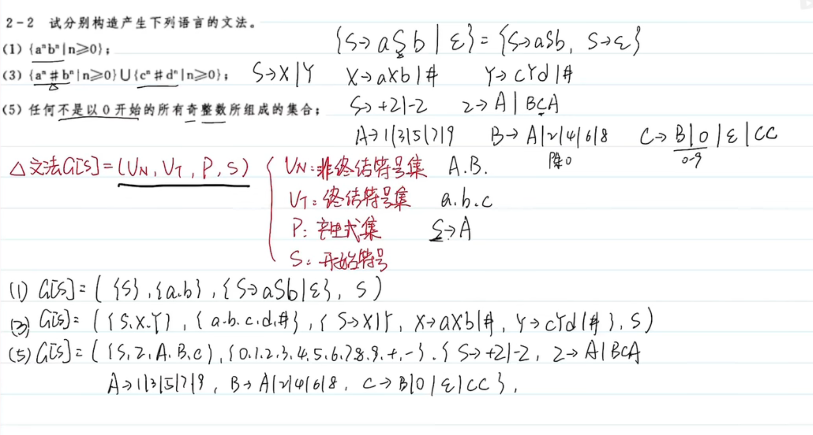

## 编译原理概述

## 前后文无关文法和语言

集合：集合元素不允许重复

集合相加：{1,2,3} + {3,4,5} = {1,2,3,4,5}

集合相乘：全相乘，集合乘自己称做集合的幂
$$
\{1,2,3\}\times\{4,5,6\} = \{4,5,6,8,10,12,15,18\}
$$
正闭包：集合幂的集合
$$
A^+=\sum_{i=1}^{n}A^i
$$
自反传递闭包：包含空集的正闭包
$$
A* = \sum_{i=0}^nA^i,A^0 = \empty
$$
文法

四元式：非终结符集，终结符集，产生式集，开始符号
$$
C[S] = (V_N,V_T,P,S)
$$

自顶向下：推导

- 最左推导（规范推导）：每次被替换的是最左的非终结符
- 最右推导

自底向上：规约
- 最右规约（规范规约）
- 最左规约

语法树

- 子树：任一结点及其全部后继
- 直接子树：子树高度为 2，即自身的下一层存在叶子结点

句子：可以通过语法树推导出的单词串

二义性

- 二义性文法：存在某个句子对应不止一棵语法树
- 无二义性文法：文法产生的每一个句子都只有一颗语法树

短语：每颗子树的叶子，如对于上题中的语法树，S 的短语为 abc，A 的短语为 a，B 的短语为 bc

- 若题目要求写出所有短语，从下层子树向上遍历就好，列出所有短语

直接短语：每颗直接子树的叶子

句柄：某句型的最左直接短语

举个栗子：`S -> {A,B}, A -> {a,b}, B -> {b, C}, C -> {c}`

| 子树根 | 句柄 | 短语 |
| ------ | ---- | ---- |
| S      | AB   | abbc |
| A      | ab   | ab   |
| B      | bC   | bc   |
| C      | c    | c    |

素短语：至少包含一个终结符且不包含更小素短语的短语

## 词法分析及词法分析程序

## 语法分析和语法分析程序

## 语法制导翻译及中间代码生成

