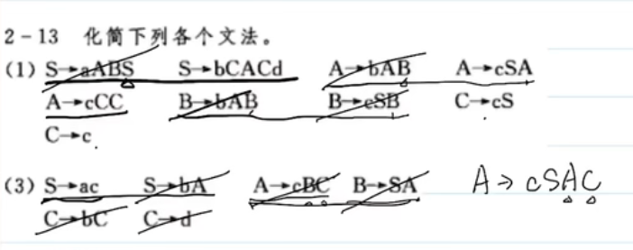
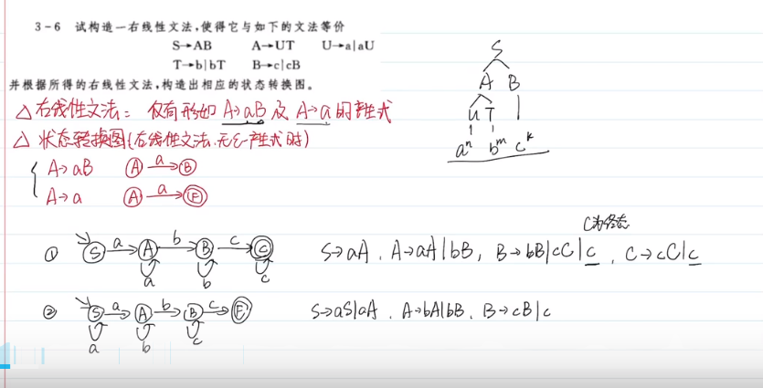
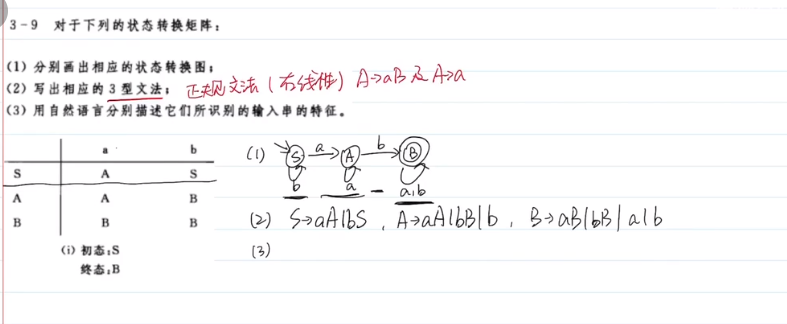

## 编译原理概述

## 前后文无关文法

集合：集合元素不允许重复

集合相加：{1,2,3} + {3,4,5} = {1,2,3,4,5}

集合相乘：全相乘，集合乘自己称做集合的幂
$$
\{1,2,3\}\times\{4,5,6\} = \{4,5,6,8,10,12,15,18\}
$$
正闭包：集合幂的集合
$$
A^+=\sum_{i=1}^{n}A^i
$$
自反传递闭包：包含空集的正闭包
$$
A* = \sum_{i=0}^nA^i,A^0 = \empty
$$
文法

四元式：非终结符集，终结符集，产生式集，开始符号
$$
C[S] = (V_N,V_T,P,S)
$$

自顶向下：推导

- 最左推导（规范推导）：每次被替换的是最左的非终结符
- 最右推导

自底向上：规约
- 最右规约（规范规约）
- 最左规约

## 语言

语法树

- 子树：任一结点及其全部后继
- 直接子树：子树高度为 2，即自身的下一层存在叶子结点

句子：可以通过语法树推导出的单词串

二义性

- 二义性文法：存在某个句子对应不止一棵语法树
- 无二义性文法：文法产生的每一个句子都只有一颗语法树

短语：每颗子树的叶子，如对于上题中的语法树，S 的短语为 abc，A 的短语为 a，B 的短语为 bc

- 若题目要求写出所有短语，从下层子树向上遍历就好，列出所有短语

直接短语：每颗直接子树的叶子

句柄：某句型的最左直接短语

举个栗子：`S -> {A,B}, A -> {a,b}, B -> {b, C}, C -> {c}`

| 子树根 | 句柄 | 短语 |
| ------ | ---- | ---- |
| S      | AB   | abbc |
| A      | ab   | ab   |
| B      | bC   | bc   |
| C      | c    | c    |

- 画一画就懂了

素短语：至少包含一个终结符且不包含更小素短语的短语

化简文法：合并文法

- 消去无限循环的状态（所有含该状态的产生式都要消去）
- 消去空产生式，如 A->空，将 A 去掉
- 消去纯非终结符推纯非终结符，如 A->B，可将 A 这一中间状态消去
- 删除推不出的符号和产生式

## 词法分析

右线性文法：非终结符总是在产生式的最右侧

状态转换图：如下图，弧上是条件，通过状态转换图能直接写出右线性文法

- 常通过语法树来推导状态转换图，再通过状态转换图写出右线性文法

栗子一：通过文法推出其右线性文法

栗子二：通过状态转换图推出其右线性文法并对其能产生的句子进行分析

栗子三：写出状态转换矩阵的 3 型文法，3 型文法即**正规文法**，也就是左线性 / 右线性文法

NFA：非确定有限状态自动机

DFA：确定有限状态自动机
$$
NFA=(K,\sum,f,S,Z)
$$
其中

- K 为所有状态集合
- Σ 为所有键入的符号集合
- f 为映射关系，即状态转换关系
- S 为初始状态
- Z 为终态集合

DFA 的确定性体现在

- 初始状态唯一
- 状态转换唯一，即一个状态键入同一个输入只能到达唯一的下一个状态（单值转换）
- 另外不能有空转换，如 A 收到 ε 转换为 B

NFA 确定化和最小化：确定化即将 NFA 转化为 DFA，最小化即把 DFA 文法化简

## 语法分析

## 语法制导翻译

## 中间代码生成

