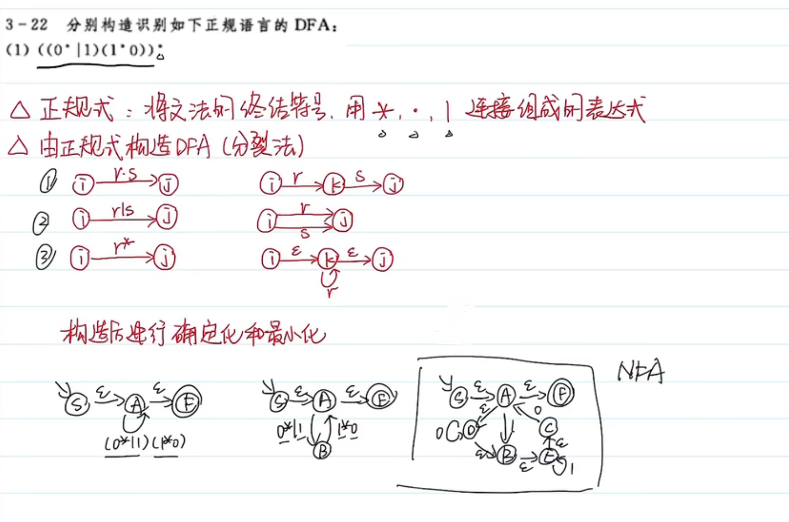

## 编译原理概述

## 语言和文法

### 集合及闭包

集合：集合元素不允许重复

集合相加：{1,2,3} + {3,4,5} = {1,2,3,4,5}

集合相乘：全相乘，集合乘自己称做集合的幂
$$
\{1,2,3\}\times\{4,5,6\} = \{4,5,6,8,10,12,15,18\}
$$
正闭包：集合幂的集合
$$
A^+=\sum_{i=1}^{n}A^i
$$
自反传递闭包：包含空集的正闭包
$$
A* = \sum_{i=0}^nA^i,A^0 = \empty
$$
### 四元式

文法的四元式表示：非终结符集，终结符集，产生式集，开始符号
$$
C[S] = (V_N,V_T,P,S)
$$
已知句子，用四元式描述其文法

自顶向下：推导

- 最左推导（规范推导）：每次被替换的是最左的非终结符
- 最右推导

自底向上：规约
- 最右规约（规范规约）
- 最左规约

### 语法树及其二义性

语法树：每个文法都对应一颗庞大的语法树，通过语法树可以生成该文法的所有句子

- 子树：任一结点及其全部后继
- 直接子树：子树高度为 2，即自身的下一层存在叶子结点

句子：可以通过语法树推导出的单词串集合

二义性

- 二义性文法：存在某个句子对应不止一棵语法树
- 无二义性文法：文法产生的每一个句子都只有一颗语法树

在实际做题时，举一个反例就行，就是说找到某一个句子，可以通过文法的两条路径推出，即可证明其为二义性文法

短语：每颗子树的叶子，如对于上题中的语法树，S 的短语为 abc，A 的短语为 a，B 的短语为 bc

- 若题目要求写出所有短语，从下层子树向上遍历就好，列出所有短语

直接短语：每颗直接子树的叶子

句柄：某句型的最左直接短语

举个栗子：`S -> {A,B}, A -> {a,b}, B -> {b, C}, C -> {c}`

| 子树根 | 句柄 | 短语 |
| ------ | ---- | ---- |
| S      | AB   | abbc |
| A      | ab   | ab   |
| B      | bC   | bc   |
| C      | c    | c    |

- 画一画就懂了

素短语：至少包含一个终结符且不包含更小素短语的短语

### 化简文法

化简文法：合并文法

- 消去无限循环的状态（所有含该状态的产生式都要消去）
- 消去空产生式，如 A->空，将 A 去掉
- 消去纯非终结符推纯非终结符，如 A->B，可将 A 这一中间状态消去
- 删除推不出的符号和产生式

## 词法分析

### 状态转移图 / 矩阵

右线性文法：非终结符总是在产生式的最右侧

状态转换图：如下图，弧上是条件，通过状态转换图能直接写出右线性文法

- 常通过语法树来推导状态转换图，再通过状态转换图写出右线性文法

栗子一：通过文法推出其右线性文法

画语法树，通过结果看文法，无限循环使用 C -> xC | x 的形式（产生无限个 x），即自身推出**要产生的无限循环字符以及自身**

栗子二：通过状态转换图推出其右线性文法并对其能产生的句子进行分析

就从初始节点开始对每个状态进行分析即可，就是得到什么然后变成什么

栗子三：写出状态转换矩阵的 3 型文法，3 型文法即**正规文法**，也就是左线性 / 右线性文法

通过状态转移矩阵推出对应状态转换图，分析**得到什么，变成什么**

再根据所得到的状态转换图分析句子或者直接看出其右线性文法

### NFA 和 DFA

NFA：非确定有限状态自动机

DFA：确定有限状态自动机
$$
NFA=(K,\sum,f,S,Z)
$$
其中

- K 为所有状态集合
- Σ 为所有键入的符号集合
- f 为映射关系，即状态转换关系
- S 为初始状态
- Z 为终态集合

DFA 的确定性体现在

- 初始状态唯一
- 状态转换唯一，即一个状态键入同一个输入只能到达唯一的下一个状态（单值转换）
- 另外不能有空转换，如 A 收到 ε 转换为 B

NFA 确定化和最小化：确定化即将 NFA 转化为 DFA，最小化即把 DFA 文法化简

先得到起始状态集合`ε-closure`，再通过状态转移矩阵分析，不断得到新的状态集合直到没有新状态产生

第一步：先将`ε-closure`状态集作为新结点，然后对其中每个旧结点进行映射分析，写出新的状态集

循环执行第二步：按照先来先处理的原则不断分析新的状态集直到没有新状态集产生

DFA 的化简：即 NFA 的最小化，消除 DFA 无用状态和合并等价状态

第一步：消去孤立状态，即不能被初态退出的状态

第二步：分割终态节点和非终态节点，在各区间内合并不可区分的状态

正规式和 DFA：给定正则表达式（句子），推出其对应 NFA / DFA

从结果推文法，通过**分裂法**对产生方法进行分解，逐渐扩大为一整个带 ε 的状态转移图，即 NFA，再通过 NFA 的确定化以及 DFA 的化简得到最简 DFA

## 语法分析

### 自顶向下

> 自顶向下语法分析采用最左推导方式
>
> LL(K) 分析：LL(1)
>
> 递归下降分析
>
> 预测分析

#### 左递归消除

左递归文法

- 直接左递归：S -> Sb | ε
- 间接左递归：S -> ASb | ε，A -> aA | ε；当 A 推出空时，S -> Sb | ε，左递归

消除左递归：A -> Aa | b

- A -> bA'
- A' -> aA' | ε

#### FIRST & FOLLOW

First 集：指所有能到达当前状态的起始终结符的集合

Follow 集：指跟在当前状态后的状态，跟不是达到，而是紧邻的意思，如 A -> BC

- 状态 C 就跟在状态 B 后面，则 C 在 B 的 Follow 集中
- 另外因为 C 后为空，所以 Follow(A) 也在 Follow(C) 中，注意若为 A-> BCD 且 D 能推出空 ε，这一条同样成立
- 一般，开始符的 Follow 集为 {#}

实际操作时，First 集好找，如要找 First(A)，就是找产生式左边为 A 的产生式，然后把能推出来的终结符一股脑写进集合就绪；Fllow 集则要找产生式右边有 A 的式子，推导 A 右边的状态（若为空，则要把当前产生式左侧状态的 Follow 集加入 A 的 Follow 集）

#### LL(1) 文法

判断 LL(1) 文法

- 已化简且无左递归

- 每个状态的所有产生式的 FIRST 集两两相交为空，就是一个状态不能推出同一个终结符开始的不同句子（若不满足推导过程中一定会产生回溯）

- 若状态 A 的候选式 r 能推出 ε，那么一定
  $$
  FIRST(A) ∩ FOLLOW(r) = \empty
  $$

LL(1) 分析表

| TABLE          | 终结符 a                  |
| -------------- | ------------------------- |
| **非终结符 S** | FIRST(S) = a 对应的产生式 |

### 自底向上

> 简单优先
>
> 算符优先
>
> 优先函数
>
> LR 分析

#### LR(0) 文法

LR(0) 项目：右侧带`·`的产生式，项目集闭包对应自动机的一个状态

- 规约项目：后继符号为空的项目称为归约项目
- 接受项目：当 S' -> S ·，称为接受项目，此时识别了整个字符串
- 移进项目：后继符号为终结符的项目称为移进项目
- 待约项目：后继项目为非终结符的项目，称为待约项目

拓广（增广）文法：添加一个初始状态 S' -> S

根据文法写出状态集及推导关系

判断 LR(0) 文法：无冲突项目（状态），并且只存在唯一一个起始状态（增广文法）

- 移进-规约冲突：在同一状态内同时存在规约项目和移进项目
- 规约-规约冲突：在同一状态内同时存在不同的规约项目

注意**接受和移进项目在同一状态里并不构成冲突**，接受项目指从 S' 直接规约的项目，即产生式左侧为唯一起始状态

以上推出的 DFA 中并不存在冲突，于是判断其为 LR(0) 文法

LR(0) 分析表

| TABLE    | Action：终结符 + #                      | Goto：非终结符 |
| -------- | --------------------------------------- | -------------- |
| **状态** | 下一状态 Si；规约项 Ri；Accept 接受项目 | 下一状态编号 i |

Action 表中，填写的是移进、规约或接受的项目

- Si 表示下一移进的状态 i
- acc 表示该状态为接受项目，无吓一跳
- ri 表示该项目为规约项目，i 为**初始文法（并非DFA状态编号）**中状态的编号

Goto 表中，填写的待规约的下一个状态

- 这里直接填编号就行，指的是 DFA 中状态的编号

上述 DFA - LR(0)文法 的分析表

#### SLR(1) 文法

判断 SLR(1) 文法

DFA 中存在**移进-规约**冲突且规约产生式的左侧状态 FOLLOW 集和移进终结符相交为空，即**当前规约的状态不能被当前移进的非终结符 Follow（跟随）**，否则会产生二义性

SLR(1) 文法中允许存在规约-规约冲突

#### LR(1) 文法

只要 DFA 没有规约-规约冲突，即为 LR(1) 文法

#### LALR

## 语法制导翻译

## 中间代码生成

