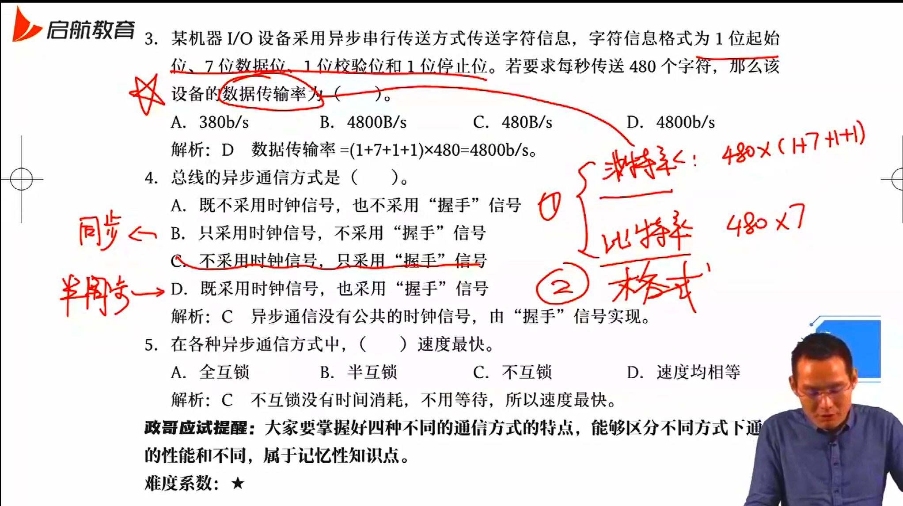
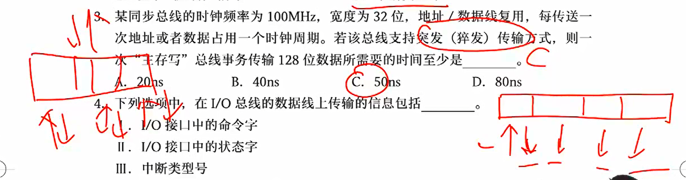

> 重点考察总线如何进行通信以及性能指标

## 总线概述

### 基本概念

冯的计算机各个部件并没有设计在同一区域，于是就涉及到了各部件的通信问题

总线：为计算机各模块之间和模块内部传输信息的公共通道，半双工通道，同一时间只能单向通行

总线主模块：工作于主控方式，主动发起的一方，控制和管理数据传送

总线从模块：工作于受控方式，只能在主模块的控制下完成操作

总线仲裁：当多个部件同时想在同一条总线上传输数据时，需要通过仲裁结构控制各部件传输的先后顺序

总线宽度：一次总线操作中总线传输的数据位数

总线周期：一次总线操作所需时间

总线频率：总线的工作频率，每秒钟可以传输数据的次数，单位是 MHz

总线带宽：单位时间内总线上可以传输的数据量，单位为 MB/s
$$
总线带宽 = \frac{数据量}{传输时间} = \frac{总线宽度\times总线工作频率}{8}
$$

其中总线工作频率即为：1 / 总线工作周期

总线定时：指事件出现在总线上的时序关系

总线标准：大纲已无，就是总线在传输时必须遵守的一些规范

波特率：每秒钟传输的二进制数据的位数

比特率：单位时间内传输的二进制有效数据的位数（只包含数据，不包括控制信息）

### 总线分类

按传输内容的不同，可分为

- 地址总线：CPU 发往 IO 或内存
- 数据总线：CPU 和内存、IO 双向通信，传输数据、指令
- 控制总线：分时双向通信，CPU 发往内存叫做控制信号，其他部件发给 CPU 的叫做反馈信号

栗子一

栗子二

根据数据传输方式，可分为

- 并行总线：可以同时传递多位
- 串行总线：相当于总线宽度为 1，只有一条线路，适合长距离通信（计算机网络构成常用串行）

根据总线位置，可分为

- CPU 内部总线：位于 CPU 内部，在 CPU 内各寄存器、ALU 之间传递数据，又叫片内总线
- 系统总线：计算机熊内部各功能部件之间相互连接的总线，也叫内总线
- 通信总线：计算机系统之间的通信总线，比如计算机网络，比如握手应答信号

### 总线组成

总线由以下三部分组成

- 传输线路：物理实体
- 接口逻辑：和各部件相连的电路，如三态门和缓冲寄存器
- 总线控制器：对总线的使用进行合理的分配管理

传输线路是物理部分，后两者常常是软件部分

### 总线性能指标

- 总线宽度

就是数据总线的根数，直接影响地址线（MAR）和数据线（MDR）的宽度，数据线的宽度指明了访问一次内存或外设能够交换的数据量

- 总线带宽

总线带宽 = 总线传输的数据量 / 传送时间
$$
总线带宽 = \frac{总线宽度}{8\times总线工作频率}
$$
每次过”总线宽度“辆车，每秒过”总线工作频率“次，二者一乘就得通过的总车数，再转化单位从 b 到 B

注意这里的总线工作频率并非 CPU 时钟频率，随着 CPU 的发展，后者远大于前者

另外，总线工作频率不同于总线时钟频率，往往总线工作周期等于若干个总线时钟周期，二者成倍数关系，以上公式中必须除以**总线的工作频率**

- 猝发 / 突发通信

给一个地址的情况下，连续读出多个数据，假设传输地址、数据时间为 t，若按顺序正常通信传输 n 个数据，需要时间 2nt，读 n 次地址，读 n 次数据；若突发通信，则需要时间 (n+1)t，即读一次地址，读 n 次数据

- 其他指标

总线复用：地址线与数据线复用，分时传输数据

总线负载：连接到总线上的最大的设备数

总线数量：地址总线、数据总线和控制总线的数量总和

注意：总线复用可以降低成本，但会降低数据传输速率

### 总线连接结构

单总线结构：只有一根总线，所有的设备接在同一根总线上

- 实现简单，管理控制复杂

双总线结构：在 CPU 和内存之间多了一根专用总线，CPU 访问内存时走专用通道即可

- 其余和单总线结构一样，所有设备均连在但总线上

多总线结构：低速总线和高速总线分开连接传输速度不同的设备

### 总线的特性

> 和计算机网络物理层的四个特性一模吊样

机械特性（物理特性）：总线在连接时，外形是怎样的，如 type-c 和 micro-c

电气特性：每根线上的电压、电平范围

功能特性：每根线是干嘛的

过程特性（时间特性）：数据传输的发生顺序

## 总线通信控制

> 如何进行数据传送

### 总线信息传送过程

总线仲裁之后，各部件按照**优先等级**获取总线的使用权并分时按照先后顺序使用总线

完成一次总线操作的时间称为**总线周期**，包括以下四个阶段

- 申请分配阶段：主模块申请，总线仲裁
- 寻址阶段：主模块向从模块给出地址和命令
- 传数阶段：主模块和从模块交换数据
- 结束阶段：主模块撤销有关信息

### 总线的定时方式

总线通信控制主要解决的是通信双方如何获知传输开始和传输结束，以及通信双方如何协调配合

#### 同步定时方式

总线上有一根设备公用的时钟信号线，每个信号出现在总线上的时刻由总线时钟信号来确定

- 传输频率较高，适用于总线较短且各功能模块进度相近的情况，否则会大大损失总线效率

#### 异步定时方式

通过应答信号，即“请求”和“响应”方式来实现同步，不需要统一的公共时钟信号，这一方式又叫做**握手方式**

分为

- 全互锁：请求需要从模块确认，结束需要主模块确认
- 半互锁：请求需要从模块确认，结束无需确认
- 不互锁：请求和结束均无需确认

就像医生拿刀，护士递刀，医生还刀：全互锁，拿刀护士确认医生拿稳了再松手，还刀医生确认护士拿稳了再松手；半互锁，护士确认医生拿稳，医生还刀直接丢；不互锁，拿刀还刀都是直接丢

#### 半同步方式

结合了同步通信和异步通信的优点，地址、命令、数据信号的发出时间都严格按照系统时钟；同时增设一条“等待”响应信号线，在数据传输过程插入等待时钟信号告知模块等待，允许不同速度的模块和谐的工作

- 优点：可靠性较高，同步结构简单
- 缺点：对系统时钟频率不能要求太高，系统工作的速度不是很高

就像你啥时候开始复习我不管，但到时候你必须参加考试

#### 分离式通信

从模块读取数据的过程并不使用总线，但在这段时间已经统一分配给了该主从模块，总线实际上被浪费

我们将整个阶段分为两个部分

- 主从模块获取总线使用权，主模块发送取数据命令，从模块准备数据，之后从模块准备数，主从模块放弃总线使用权，总线可以被别人使用
- 从模块数据准备完毕后，充当“主模块“，获取总线使用权，主动向主模块（现在是从模块）发送数据
