> 主存储器基本概念
> 主存储器构成和工作原理
> 改善存储器性能的途径

## 存储器概述

主存储器（内存）和辅存储器（外存），辅存储器在操作系统文件系统中讲解

考试重点，大题重灾区

### 存储器分类

主存储器

- RAM：SRAM / DRAM
- ROM：MROM / PROM / EPROM / EEPROM

其他存储器

- Flash Memory
- Cache
- 辅助存储器：磁盘、磁带、光盘

RAM(random access memory)，随机存取存储器，储存单元内容可按需随意存取，速度与存储单元的位置无关，断电内容将会丢失（就是电脑内存）

根据存储信息不同，分为静态 SRAM 和动态 DRAM

关于 ROM

- MROM(mask read-only memory)，又称掩模式 ROM，早期 BIOS 放在 MROM 中，其内容是烧录进去的，永远不能再改
- PROM，可编程只读存储器
- EPROM，可擦除只读存储器
- EEPROM，电可擦除只读存储器

按信息的存取方式，存储器可分为：RAM、ROM、SAM 和 DAM

按介质可分为：半导体、磁表面、磁心存储器和光盘存储器

按信息可保存性：易失性和非易失性

- 易失性即断电丢失，如 RAM
- 非易失性即断电不丢失：如 ROM、磁表面、磁心、光盘存储器

破坏性读出：读取的过程中破坏了原有信息形态

再生：如发生破坏性读出，需要立即重新写进去，这一过程叫做再生，典型的如 DRAM

### 存储器系统结构

存储器的三个重要指标：速度、容量和每位价格，速度越快，容量越小，价格越低，反之成立

存储器离 CPU 越近，容量越小，速度越快

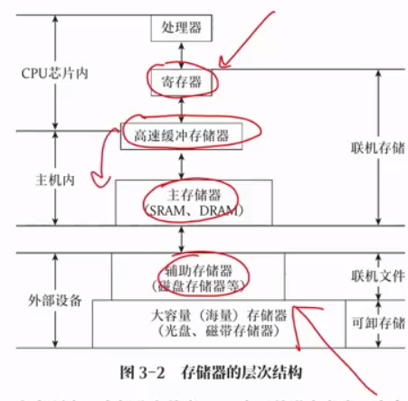

Cache-主存层次：通过硬件实现，解决内存速度和 CPU 速度的不匹配问题

主存-辅存层次：实现容量不足问题，其速度接近主存，容量接近辅存

## 半导体随机存储器和只读存储器

构成主存的半导体存储器分为 RAM 和 ROM

RAM 分为静态 S 和动态 D

ROM 根据可编程和可擦除分为 P、EP、EEP 和 FLASH

### SRAM 工作原理

SRAM 存储单元使用双稳态触发器，即六管 MOS 管来记忆信息（0 或 1），通常用于做高速缓冲存储器

优点：其结构简单、稳定、可靠性高、速度较快，在读出时不会破坏原有结构，不需要再生

缺点：占用元件较多，占硅片面积大，功耗大，集成度不搞，同时 SRAM 还是易失性存储器（RAM 就这特点），断电将丢失

### DRAM 工作原理

DRAM 存储单元有三管式和单管式两种，靠电容存储电荷的原理来寄存信息，即电容上有足够电荷表示 1，无电荷表示 0

优点：集成度更高，功耗低，价格便宜

缺点：因为是电容储存电荷，他的读出是破坏性的，需要进行重写；并且，即使不读，也会发生漏电，1-2ms 电荷也会消失，所以每 2ms 内都要进行一次恢复操作，速度较慢

因为需要不断恢复，速度低于 SRAM，一般用于主存储器

### DRAM 刷新

刷新即每隔 2ms 的恢复操作，DRAM 刷新只与行地址有关，因为按行刷新

- 集中刷新：在 2ms 内专门开辟一断时间用于完成刷新，即停止读写进行刷新，整个存取周期分为读写阶段和刷新阶段两段，刷新阶段也称为内存的死亡时间
- 分散刷新：将整个存取周期分为若干个小周期，每个小周期分为读写阶段和刷新阶段，无死亡时间，但读写变慢了，因为相当于每个小周期的存取时间加倍了（刷新一次相当于存取一次）
- 异步刷新：类似于数据库表的行锁定，每行独立进行刷新和读写

DRAM 刷新有一下特点

- 刷新对 CPU 是透明的，不依赖于外部访问
- 按行刷新，只需要行地址
- 不需要选片，因为对所有片进行刷新
- 电容的读出是破坏性的并且电容会自动消散，DRAM 采用读出再立即写入的方式进行刷新

常用结论：RAM 通常用来存储的是应用程序，即正在被使用的程序和数据，可以随机读写（存取）

### ROM 只读存储器

ROM 常用于存储系统程序和固件（出厂时写死的固化硬件，BIOS），断电信息不丢失

> ROM

只能读，不能改

> PROM

可编程只读存储器，可以改，但只能改一次，以熔丝的通和断表示 1/0，刚出厂全连通，可以根据自己需求烧断熔丝把 1 改为 0，显然断了之后就接不上了

> EPROM

可擦可编程只读存储器，以浮动栅 MOS 电路保存信息，使用紫外线擦除，且为整体擦除

> EEPROM

可电擦可编程只读存储器，可以局部擦除，重写次数有限，一般为 10 万次

> FLASH Memory

快速读写存储器，最近的技术，俗称 SD 卡，在 EPROM 和 EEPROM 的基础上发展而来，以块为存储单位

正确说法

- FM 具有 RAM 功能
- FM 具有随机存取功能

错误说法：FM 是随机存储器，随机存储器特指 RAM，但 FM 结构上是 ROM

注意单独说 ROM 的时候，指的就是最原始的只读存储器，而不是其他

### SRAM 和 DRAM

共同点

- 都属于 RAM
- 都属于易失性

|       | SRAM | DRAM |
| ----- | ---- | ---- |
| 存储信息  | 触发器  | 点容   |
| 破坏性读出 | 否    | 是    |
| 需要刷新  | 否    | 是    |
| 行列地址  | 同时送  | 分两次送 |
| 运行速度  | 快    | 慢    |
| 集成度   | 低    | 高    |
| 发热    | 大    | 小    |
| 存储成本  | 高    | 低    |

如何记忆？因为电容储存

- 集成度高于 MOS 管
- 不连通电路，发热小
- 电容读出会消失，所以读出具有破坏性
- 电容会消散，需要刷新
- 刷新，速度就慢
- 慢，意味着便宜，成本就低

SRAM 反过来就行

注意 SRAM 和 DRAM 的易失性和刷新性区分：SRAM 和 DRAM  在不断电时，所存信息是不易失的；同时 DRAM 还具有刷新性，即使不断电，其信息也在不断变化

## 主存储器与 CPU 的连接和控制

CPU 和主存储器根据数据总线、地址总线还有控制总线进行连接

### CPU 位/字扩展

> 位扩展

当芯片的计数单位小于主存的计数单位，同时计数数量相同

芯片的位扩展：指加大 CPU 字长，当芯片字长小于主存时，通过这种形式达到统一，如芯片字长为 64Kx1，主存位 64Kx8，这时就需要把每八个芯片的同一单元同时输送数据给主存

相当于把连续的 8 个芯片的同位置的计数单元串联，在选择到时统一输出

> 字扩展

芯片数据线位数等于主存数据线位数，但单元数量不够

芯片的字扩展：指通过加片的方式加大每个单位的单元数量，如 16Kx8 到 64Kx8，计数单元够但计数数量不够，于是将四片芯片视作一个单位，通过 2-4 译码器控制，达到 64Kx8
字

通过 2-4 译码器来选片，如 00 选择四片中第一片，01 选择第二片

> 位、字同时扩展

计数单元不够，计数数量也不够，注意一定先扩位，再扩字

### 片选信号的产生

使用高位的地址线去做片选的信号线，低位选择片内的具体单元，如 16Kx4 ——> 64Kx8，共四片，使用 A14/A15 作为片选信号线，A0-A13 作为单元信号线

如何界定这个高位的高？

首先要确定地址线，才能确定高位地址线

线选法

$$
地址线 = log_2芯片字长
$$
译码片选法（重合法）
$$
地址线 = \frac{1}{2}log_2芯片数量
$$

对于 M x N 位的存储器，用 L x K 位的芯片

- M = L, K < N：位扩
- L < M, K = N：字扩
- L < M, K < N：位字扩，先扩位再扩字

例题，用 2Kx4 位芯片组成一个 8K 位按字节储存的存储器

- 按字节储存，即位数为 8，即为 8Kx8 位的存储器
- 共需要芯片数量 n = 8x8 / 2x4 = 8 个
- 先位扩，使用两个芯片成一组，构成 2Kx8 位的芯片
- 再字扩，使用四组 2Kx8 位的芯片构成一个 8Kx8 位的存储器

字和位到底啥关系：字表示该芯片的**地址长度**，位表示每个地址位上二进制的大小。如 2x4K 位，即地址总长为 2K，每个地址上有 4 位二进制位

类比数据库表的横向纵向连接

- 在进行位扩展时，两个 2x4K 位扩展成 2X8K，这里实际上相当于数据库表的横向连接，即行数没变，但列数加倍
- 而字扩展就是在扩展行数，行数增加，而列数没变，但无论哪一种扩展，数据总量其实都在增加

在上述又 2Kx4 位芯片组成的 8Kx8 位存储器中，地址 0B1FH 所在芯片的最小地址为：0800H

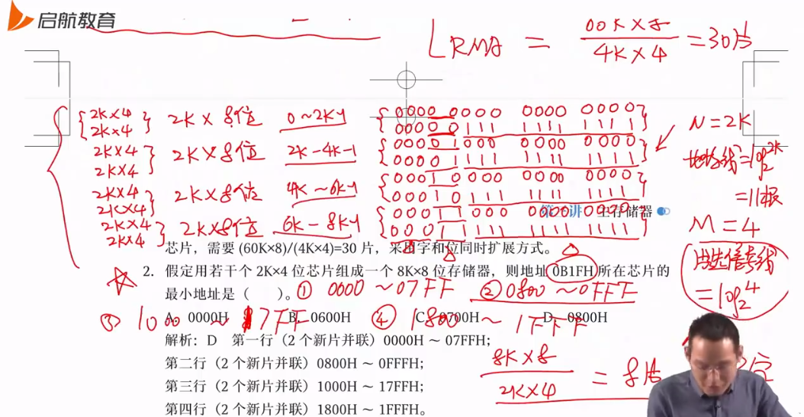

对于 NxM 的存储器（log 底数为 2）

- N 为每个芯片组的字长（地址长度）
- M 为存储器芯片的组数

如 2Kx4 组成的 8x8K 存储器，N = 2K，M = 4

|         | SRAM（线选法） | DSAM(重合法) |
| ------- | --------- | --------- |
| 片内地址线个数 | log N     | 1/2 log N |
| 片选线个数   | log M     | log M     |

一根线对应一位二进制，其中低位为片内地址线，高位为片选线，**二者相邻**，多出来的高位线充当读写线等

这里还注意一个问题，那就是这里的片选信号线个数是对外来说的，懂吗，就像 38 译码器，输入三根线，输出对应八种状态，这里也是一样，片选 3 跟线，对应 8 种输出，向内还要接 8 根线，这 8 根线就是芯片的地址线个数

更简单的判断地址的方法：将给出的 16 进制地址化为十进制，如 0B1FH 化为 十进制为 11x16^2 + 1x16^1 + 15 = 2847，在 2K~4K-1 之间，所以在第二片芯片组中，最低地址为 2K，即约为 0800H

请用第一道例题的解法解第(3)题

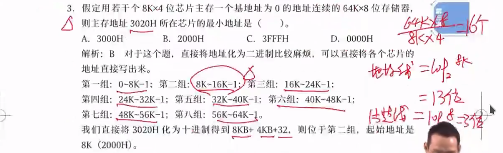

对于芯片本身：如一个 4Mx8 位的 DRAM 芯片，其数据线为 log8 = 3 根，地址线为 1/2 log 4M = 22/2 = 11 根

- 这里设计 DRAM 的地址线复用问题，需要除以 2，SRAM 则不用

对于 4Mx8 位的芯片

|         | DRAM | SRAM |
| ------- | ---- | ---- |
| Data    | 8    | 8    |
| Address | 11   | 22   |
| Read    | 1    | 1    |
| Write   | 1    | 1    |
| Slice   | 1    | 1    |

在已知存储器大小，计算单个芯片存储大小时，注意**位**到**字节**的转化，实际上就是一个简单的除法运算，存储器大小除以芯片个数

### 大端编址和小端编址

> 操作数在存储器中的存放方式，常考难点

内存的计量方式：位、字节和字长

- 位即比特，1/0
- 字节即B，八个位
- 字(word)，一个完整数据的比特数，字长是计算机一次操作处理的实际位数

> 端指开端，小端即以小地址开端，大端反之

小端编址：低位字节放在内存低地址端，高位字节放在高地址端

大端编址：低位字节放在高地址端，高位字节放在低地址端

- 注意不管哪种编址方式，内存编号都是从小到大进行编号
- 不管大端还是小端，字的编号永远是增加的，大端和小端关心的是一个字内该怎么编号
- 大端编址，一个字内从大到小存储；小端编址，一个字内从小到大存储
- 注意每个字节是不拆分的，视为一体，即一个地址

举例，当字长为 2 字节时，储存 `if a > b`，其中 if 为一号字，依此类推

- 小端存为 `[if][ a][ >][ b]`
- 大端存为`[fi][a ][> ][b ]`

编译器，代码，数组，结构体，字符串都以这种方式储存，即左边为低位，右边为高位

- 先按照 总数据长除以单个字长 分为 4 个字
- 每个字中按大小端排序储存

对于数字 0123456789ABCDEF H（十六进制），字长为 2B，其中 F 是最低位，0 是最高位，在给字编号时，从 F 开始，到 0 结束

- 第一个字 CD EF，第二个字 89 AB，第三个字 45 67，第四个字 01 23，在字中，数据又按字节进行分组（按照字节编址，一个字节一个地址）
- 小端为 `[EF CD][AB 89][67 45][23 01]`
- 大端为`[CD EF][89 AB][45 67][01 23]`

总结：数字从左往右是减小，代码从左往右是增大

- 机器码：操作码 + 操作值
- 一个十六进制数 = 四位二进制数 = 占 1/2 个字节数据

每个字找起始点都是从低地址位开始找，找到起始地址后，按照字长划分一个字出来，再在这个字内，按照低字节高字节进行大端小端排序

下一个字的起始点为上一个起始点+字长的地址

在计算大数的二进制时，如 7K，它并不是 2 的指数，采用 1k+2K+4K 的形式可得 1C00 H，约等于 1BFF H 而不是 1B00 H，注意在选项中选择最接近的一项

## 双端口 RAM 和多模块存储器

> 双端口 ARM 考纲已删掉，了解即可

双端口 RAM：给了两个端口可以同时进行进出，但当两个端口读相同地址时，会产生冲突

多模块存储器：最常用的提高存储器速度方案（希望和 CPU 速度相匹配），分为

- 单体多字存储器
- 多体低位交叉存储器

### 单体多字存储器

只有一个存储体，每个存储单元存储 m 个字，总线宽度也为 m 个字，每次存取，只获取一次存取单元的地址（首地址），然后顺序向后存取 m 个字数据

- 一般的存储器每存取一个字都要进行一次地址访问，即获取地址加寻址的过程，而这里将字的单位扩大了 m 倍

一旦遇到中断或者未按顺序存放的数据，就会出大问题

### 多体交叉存储器

就是把存储体分为很多模块，每个模块的容量和存取速度相同且拥有独立的读写控制电路、地址寄存器和数据寄存器，模块之间可以并行、交叉工作

#### 多体高位交叉

高位交叉编址的多体存储器：高位存体号（存储体编号），低位存体内地址

每个存储体内部的编号是顺序的，如共三个存储体，M0 编号从 0 到 n-1，M1 从 n 到 2n-1，M3 从 2n 到 3n-1

- 能够在任意时刻，让不同请求源去请求不同存储体
- 非常比较扩展，加存储体就行
- 对于单个请求源并不能加快访问速度
- 较好满足局部性原理

读取 m 个字需要 r+(m-1)T+r 的时间

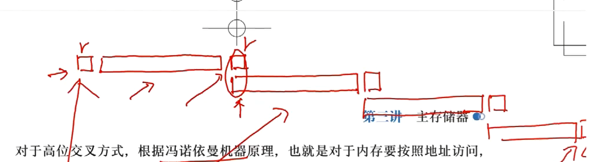

#### 多体低位交叉

低位交叉编址的多体存储器：低位为体号，高位为体内地址

这里的编址采用交叉的方式，如三个存储体，M1 的编号按顺序为 0,3,6...,3n，M2 为 1,4,...,3n+1，M3 为 2,5,...,3n+2

- 在任意时刻能够让一个请求源同时请求不同存储体
- 不容易扩展，因为编号固定不好分
- 没有较好的局部性

利用流水线的方式读取，能有效提高带宽

在低位交叉编址中，体号 = 内存编号 % 存储体数

存取一个字的周期为 T，总线传送周期为 r，T+r 完成一次读取，若要实现流水线作业，要求交叉模块数量（体数）大于等于 m = T/r，m 又被称为交叉存取度

- 就是在第一个存储体开始工作的 T 的时间中（存取过程中），不断地去读取地址（传地址时间即为总线传送时间），耗时为 r
- 这样在第一个 T 后的每一个 r 过后，都会完成一次读取

读取 m 个字需要时间 r+T+(m-1)r+r

- 和分组交换的原理、计算方法一模吊样

但在实际过程中，会发生冲突，就是说在同一轮流水线中访问同一存储体是冲突的，不可以的

- 一道例题

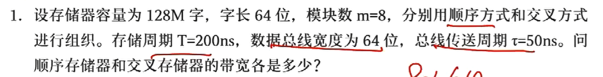

带宽 = 数据量 / 传输数据

假设我们现在传输了 m 个字的数据，总长度为 64x8 位

- 若是顺序方式，即高位交叉，需要时间 mT
- 若是交叉方式，即低位交叉，需要 T+(m-1)r

这里政政解题的时候均省略了那两个小 r

于是顺序方式带宽为
$$
\frac{64\times8}{200\times8}(bit/ns)
$$

交叉方式带宽为

$$
\frac{64\times8}{200+7\times50}(bit/ns)
$$

## 主存-Cache系统

> 5星重点，出大题

CPU 速度远大于内存速度，导致内存成为性能瓶颈，双端口和多模块并不能很大程度上解决这一问题

### Cache 概述

局部性原理

- 时间局部性：指令被执行后不久可能再次倍执行（大量的循环操作）
- 空间局部性：某个存储单元被访问，意味着它旁边的存储单元也很有可能被访问

在 CPU 和主存之间加一个容量较小的存储器，用于存放依据局部性使用频率较高的单元，这就是 Cache，在 CPU 读取时，先读取 Cache 内容，以此加快读取速度

- 实际工业中，Cache 利用率在 90% 以上

Cache 工作原理

在设计时，将主存和 Cache 分为大小相等的存储块（内存的存储块大小等于 Cache），自然 cache 的块数远小于主存的快数

cache 储存的是主存中最活跃的若干块的副本

Cache 由 Cache 存储体，地址映射变换机构和 Cache替换机构组成

- Cache 存储体：Cache 自身也是一个存储器，以块为单位和主存交换信息
- 地址映射变换机构：将主存地址映射为 Cache 地址
- 替换机构：当 Cache 内容已满，无法接受主存块的信息，就由 Cache 替换机构接管，确定应该移出 Cache 中的哪个块，同时将新内容移进 Cache

### Cache 基本操作

即读写操作，其流程如下

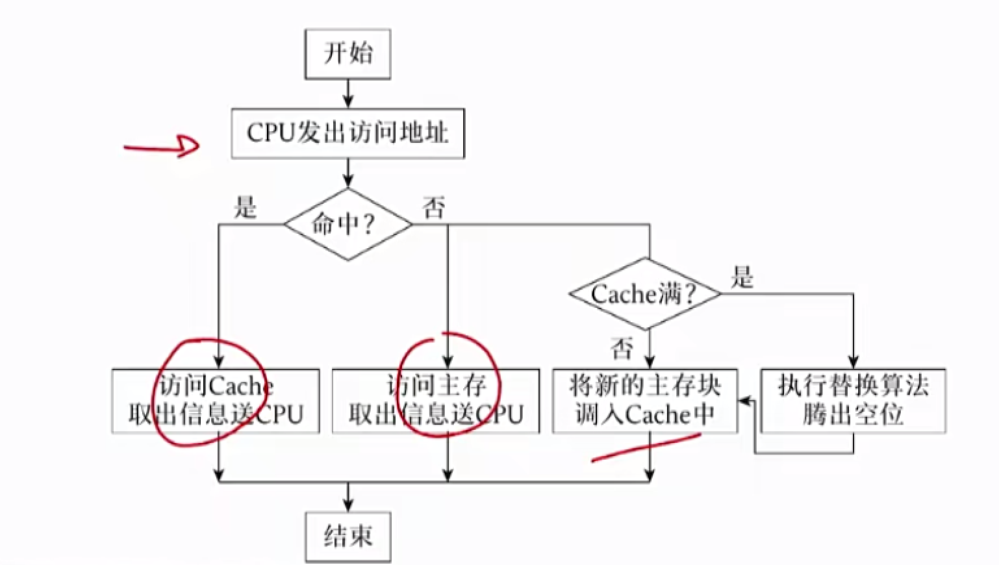

- Cache 和主存的计算单位：块
- CPU 和主存交换的计算单位：字

这意味着主存和 cache 之间交换数据是整块整块交换，CPU 读取 cache  或主存数据是一个单元一个单元读的（一个单元一个字）

命中率，访问Cache的次数 / 访问Cache次数+访问主存的次数：H = Nc / (Nc+Nm)

当命中率固定，且主存和cache同时访问，有平均访问时间：Ta = H x Tc + (1-H)Tm

- 当不同时访问时为 Ta = Tc + (1-H)Tm

整个系统效率：e = Tc / Ta

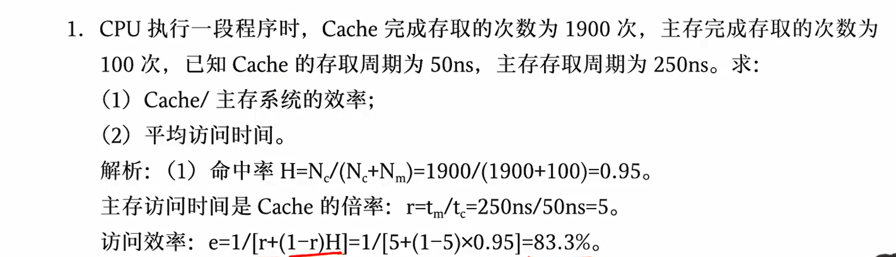

- 先算 Ta 再算 e 一样的

一个内存单元的大小为一个字，一个块的大小基本单位为字，是字的整数倍，字长由机器本身决定，若未标明，默认为字节编码，即一个字为一个字节长度，8 个比特

主存和 cache 进行交换时，基本单位为块

### Cache 和主存之间的映射方式

当要把主存块装在 Cache 时，选择 Cache 的规则

三种映射方式

- 全相联映射
- 直接映射
- 组相联映射

#### 直接映射

> 就是 hash 散列

分块时，主存和 Cache 都有块号，i = j % C 或 i = j % 2^c

- i 为 cache 块号，j 为主存块号，C 为cache 块数，c 为 chche 块号的位数
- 一个 cache 块映射多个主存块，如当快数为 8，主存块 0 号和 8 号都映射到 cache 块 0 号

主存编号和主存块号不是一个东西，主存编号除以 2^b 得到主存块号，b 为快内偏移

地址结构：地址结构是生命线，必须记牢

- 主存地址格式：主存标记 + cache 块号 + 块内偏移
- cache 地址格式：cache 块号 + 块内偏移

直接映射特点：简单，效率不行

#### 全相联映射

没有固定的映射关系，可以任意映射，主存块可以放在 cache 中任一位置

地址结构

- 主存地址结构：主存标记 + 块内地址
- cache 地址格式：cache 块号 + 块内偏移

特点：映射自由，管理困难

#### 组相联映射

先将 cache 存储空间分成组，每组使用直接映射，组内使用全相联映射

在实际映射时

- 蒋版：模组数，通过主存块数 j 和 cache 组数 n 进行映射，将主存先映射到组 j % n，这一步和直接映射一模吊样，进行哈希散列
- 唐版：模的 cache 块数，不是组数，但考试中都考过，优先考虑蒋版，但要甄别
- 再在 cache 组内进行自由映射，即全相联映射

地址结构

- 主存地址格式：主存标号 + cache 组号 + 块内偏移
- cache 地址格式：cache 组号 + 块内偏移

### Cache 主存地址结构和大小计算

> 主存标记号 [块号/组号] 块内地址号

#### 主存地址

直接映射主存地址结构：主存标记 + cache 块号 + cache 块内地址

全相联映射主存地址结构：主存标记 + cache 块内地址

组相联映射主存地址结构：主存标记 + cache 组号 + cache 块内地址

| 位             | 计算方法                                                              |
| ------------- | ----------------------------------------------------------------- |
| cache 地址位（直接） | log2 (cache 总容量) = cache 块号位 + cache 块内地址位                        |
| cache 块号位     | log2 (cache 块数) = log2 (cache 总大小 / cache 大小)                     |
| cache 块内地址位   | log2 (cache 大小)                                                   |
| cache 组数      | cache 块数 / 组相连路数 = cache 总容量 / (块大小 x 组相联路数)                      |
| cache 组位      | log2 (cache 组数)                                                   |
| 主机标记位（直接）     | log2 (主存总容量) - cache 地址位 = log2 (主存总容量) - cache 地址位 - cache 块内地址位 |
| 主机标记位（全相联）    | log2 (主存总容量) - cache 块内地址位                                        |
| 主机标记位（组相联）    | log2 (主存总容量) - cache 组位 - cache 块内地址位                             |

- 这里的大小的单位均为**字**

举个栗子：计算地址格式

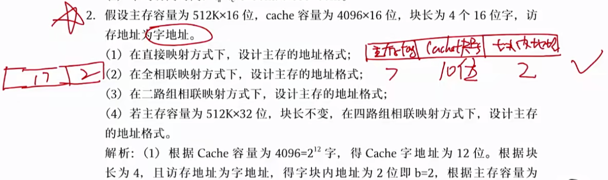

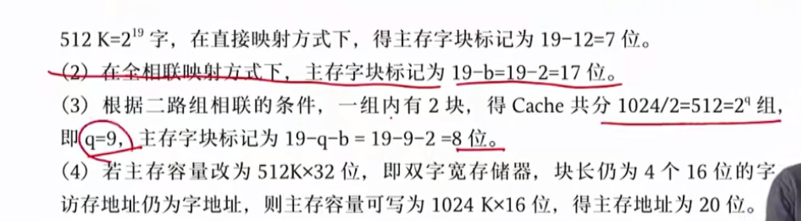

三种映射地址格式

- 直接映射：主存标记 + cache 块位 + 块内地址
- 全相联：主存标记 + 块内地址
- 组相联：主存标记 + cache 组位 + 块内地址

再举个栗子：组相联主存单元应装入的 cache 组号

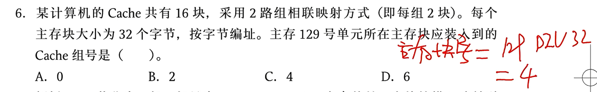

- 组号 = 主存块号 % 组数，4 % 8 = 4，选 C

思考一个问题：不同的主存映射到同一 cache 时，cache 如何区分其映射的是哪一个主存

答案：依靠主机标记位，在地址格式计算时，已经给主机标记分配了`log2(主存总容量)-组/块位-块内地址位`的位数用以区分映射到相同 cache 中的不同主存块

- 先找块号，再找标记

#### 缓冲地址

Cache 地址结构：Cache 组/块号 + Cache 块内偏移

Cache 组织结构：Cache 标记 + Cache 块内地址

- Cache 标记分为：主存标记位（和主存地址中的保持一致）、有效位（1位）、脏位（1位）、替换算法位（取决于替换算法）

直接映射的访问过程：

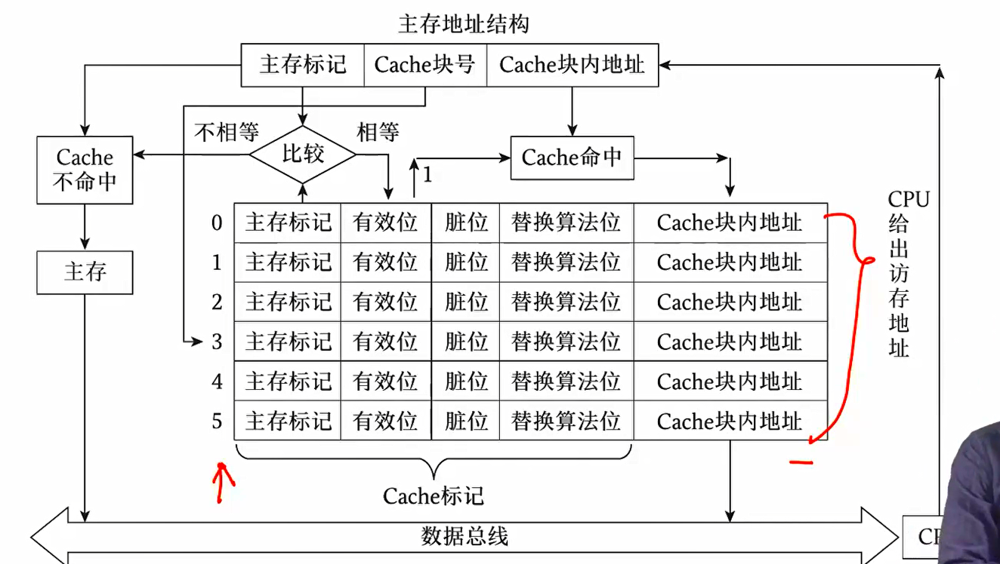

- 这个东西也叫地址变换表，一个缓冲块对应一行，即包含缓冲块个数个存储单元

Cache 地址中并不记录块号，cache 块相当于一个数组，其下标即为块号，CPU 通过主存地址的 cache 块号去找 cache 数组下标，访问 cache 块，再比较主存标记，若相同，则命中，直接读取该 cache，无需再访问主存

同时可以得知，Cache 大小计算方式是：

$$
Cache 块数\times(主存标记+有效位数+脏位+替换算法位+Cache数据位)
$$

其中

- cache 数据位实际上就是块内地址大小
- 只有使用回写法才有脏位，为 1 位，写直达法不需要
- 按字节编码，即 8 位一个字，编号时的基本单位是**字**
- 不同的映射策略的替换算法位不同
  - 直接映射：无替换算法位
  - 组相联映射：log2(N)，N 为 N 路组相联的 N
  - 全相联映射：log2(M)，M 为 cache 块数

栗题

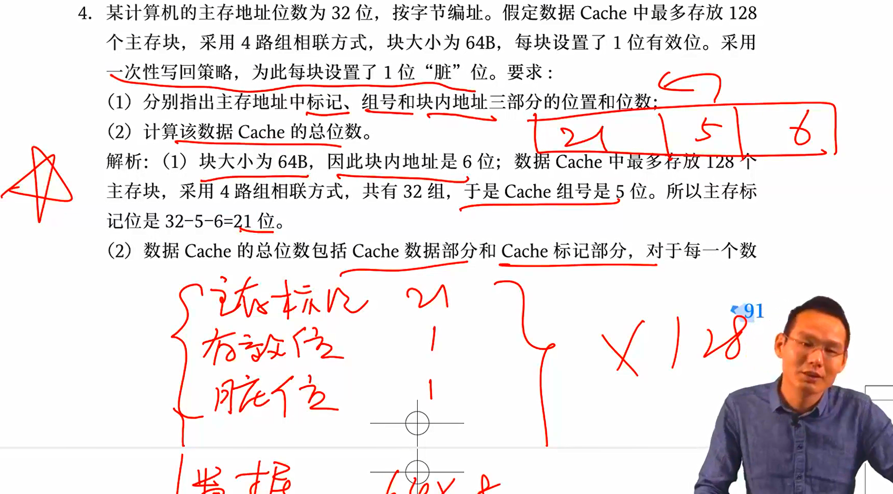

组相联映射的访问过程

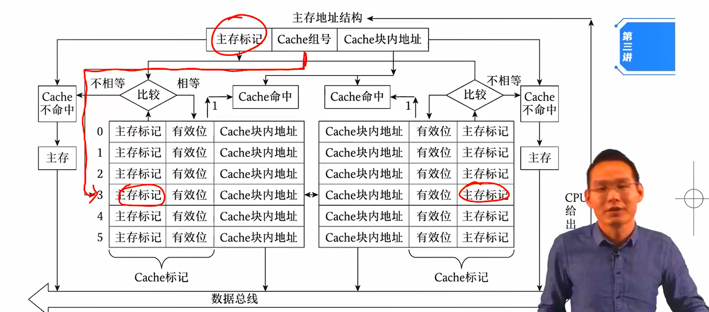

CPU 通过主存地址中的组号确定 cache 组，在该组中遍历比较主机标记，若相同且有效位为 1，则命中，直接读取该 cache；若未命中，则将主存中对应内容写入该 cache，再读取；若 cache 已满，则使用 LRU 算法写入

全相联的访问过程

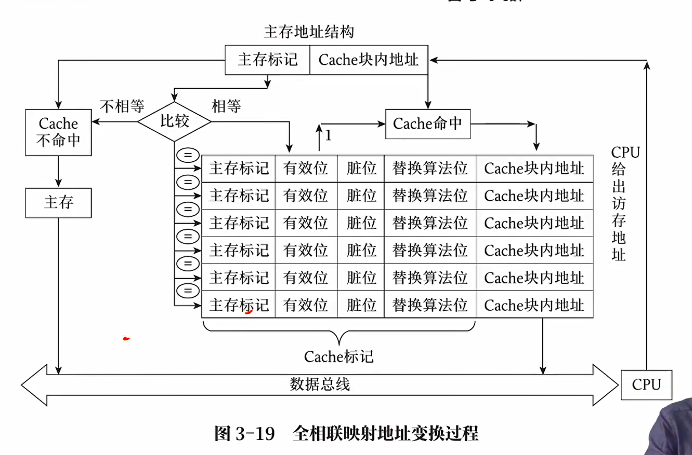

将主存地址解析为主存标记和块内地址，让主存标记和所有的 cache 的主机标记进行比较，这种方式叫做按照内容进行查找，主机标记相同则命中

如何区分三种映射方式？

主存地址分为两部分，一定是全相联映射。若是三部分，若一个组/块号对应单个 cache，则为直接相联，否则为组相联映射

举个栗子：计算 cache 地址总容量

- 通过主存地址的标记确定 cache 地址的标记位数
- 加上有效位和脏位
- 加上块内地址（和主存块内地址保持一致）
- 乘上需要 cache 的块数，即总数据量除以单个块数据量

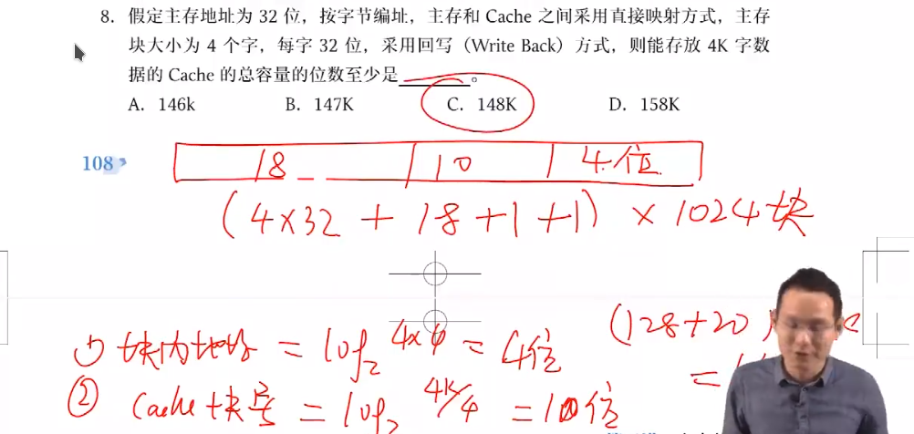

#### 一些栗题

例题一：单元到块，块到字，字到位的转化

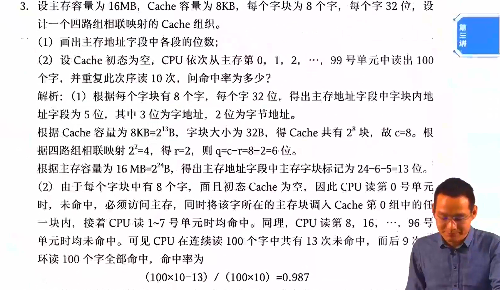

例题二：每一块不命中一次

注意 a[k] = a[k] +32 这一过程访问了两次地址 a[k]，第二次一定命中

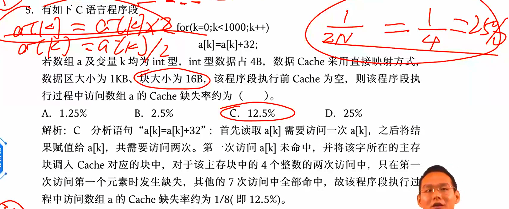

例题三：容量到块、字的转换

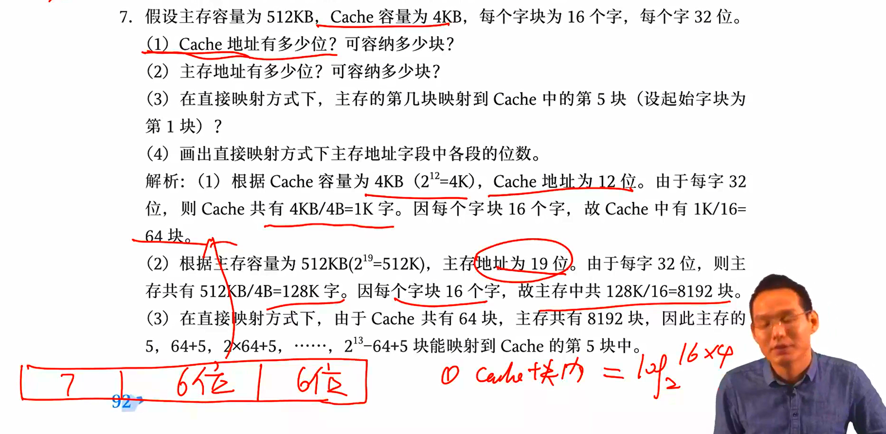

例题四：全相联映射的访问

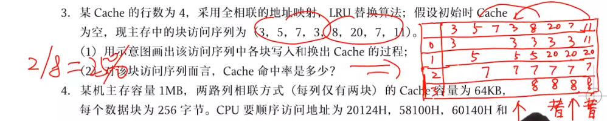

例题五：根据主存地址结构进行组相联映射访问

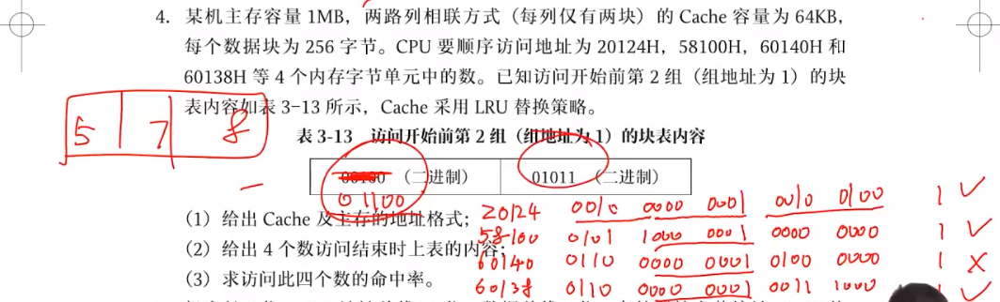

例题六：时间、空间局部性在代码上的表现

- 数组按行访问，沿着地址顺序访问符合时空局部性
- 而按列访问将降低读取效率
- sum 具有好的空间局部性，因为只有一个变量不断访问

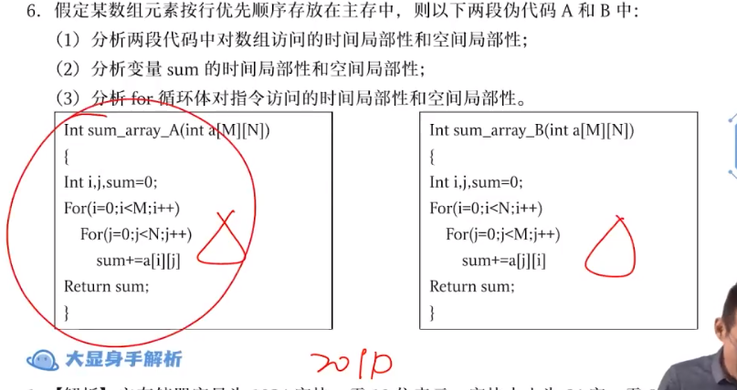

### Cache 替换策略和更新策略

#### 替换策略

主存不断往 cache 中映射，总会塞满，当满了之后需要对旧的数据进行替换

- 随机替换：简单，没依据局部性原则，命中率低
- 先进先出算法
- 近期最少使用算法：LRU 算法，最常使用
- 最不经常使用算法

类似于虚存调页

#### 写策略

> 更新策略

对 cache 块内的数据进行修改

- 写直达法：主存和 cache 完全同步，二者任一修改后，另一马上跟着修改
- 回写法：更新 cache 后，不立即写入主存，使用标志位（一致性）标识 cache 是否更新过，即版本领先主存，在替换时再更新主存

回写则有脏位

## 虚拟存储器系统

> 与操作系统交叉，单靠组原不太好学

### 概述及工作原理

主存-cache系统解决 cpu 和内存的速度问题，虚拟存储器系统解决内存大小问题

虚拟存储器由主存储器和辅助存储器联机工作共同组成，在逻辑上是一个统一的存储器

- 虚存空间：逻辑地址
- 主存空间：物理地址，容量为主存容量
- 辅存空间：对应辅存地址

工作原理：将主存和辅存地址空间统一编址，形成一个统一的存储空间，用户在这个逻辑地址中自由编程

- 逻辑地址远大于物理地址

操作系统先把程序和数据送入磁盘（辅存），再将当前所需的部分调入主存（将虚地址转化为实地址），供 CPU 使用，暂不使用的放在磁盘中，将磁盘当作主存的后备队列，将当前活跃的送入主存工作

### 实现方法

虚拟存储器分为以下几种，在组原中仅要求掌握页式虚拟存储器

- 页式虚拟存储器
- 段式虚拟存储器
- 段页式虚拟存储器

页式虚拟存储器的实现方法：将进程的逻辑空间分为**若干大小相等**的片，称为页，以 0 开始编号，在内存空间中，同样以这种**形式及大小**进行分片并编号，注意在内存中每片均是单例，为进程所共用，进程之间相互独立，也就是说有多个进程第 0 片，但只有一个内存第 0 片

逻辑空间中的每个页可装入主存中不同的实际块中，在划分时就已经规定，页内地址和块内地址是同样大的

- 逻辑地址 LA：页号 + 页内地址
- 物理地址 PA：实页号 + 页内地址
- 缓存地址 CA：标记 + 块号/组号 + 块内地址

其中物理地址和缓存地址的长度一样，逻辑地址和物理地址长度不一，其映射关系储存在页表中

不变特征：因为页内地址一样，逻辑地址到物理地址的映射实际上只有前面的页框号，页内地址直接拼接上即可，同理，这里的低位业内地址也会原封不动的从物理地址映射到缓存地址

每个进程中，都维护有一张**页表**存放页号和块号的对应关系，**页表寄存器**存放页表始址和页表长度，收到 CPU 发来的逻辑地址后，先**比较页号和页表长度**，若超出则**中断**，若不超出，则用**页表始址加上页号**在页表中查找其对应的物理块，再去物理块上存取数据

进程（CPU）去查找慢表是相对简单的

### 高速缓冲存储器 TLB

> 快表
> 
> 在主存系统中，除了 TLB 和 全相联 cache 按内容访问，其余均按地址访问

页表储存在内存中，这意味着 CPU 读取一次数据需要访问两次主存，这会造成极慢

解决办法：基于局部性原理，用一个高速缓冲存储器（往往是寄存器），称为**快表**，存储页表中经常使用的部分，避免多次访问内存

CPU 会优先查找快表，如果找不到再找页表（慢表），访问数据后再更新快表

- 如何根据虚地址找对应的 TLB？TLB 如何跟虚地址进行映射？

借用 cache 来实现

逻辑地址地址结构：映射均为虚地址

- 直接匹配模式：标记 + TLB 编号 + 页内地址
- 全匹配模式：标记 + 页内地址
- 组匹配模式：标记 + TLB 组号 + 页内地址

快表（TLB）和页表的组匹配等实现物理地址到逻辑地址的映射，Cahce 通过组相联等实现物理地址到 cache 地址的映射，二者映射的实现技术点是一样的

- CPU 先根据进程的虚地址去查他的实地址，通过 TLB 的全匹配、直接匹配、组匹配或查询页表
- 找到实地址后，再通过主存-Cache系统找到所需要的数据，这一过程需要使用到 cache 的组相联映射、直接相连或全相联

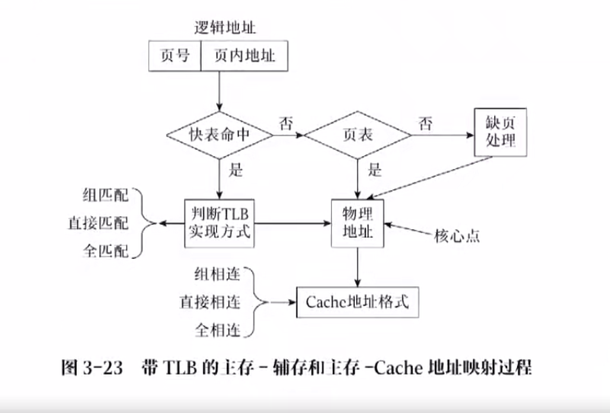

一个完整的映射过程：先从虚地址映射到物理地址，再根据物理地址映射 cache 地址

- 寻找虚地址为 0008 C040H 的数据，并判断是否命中 cache

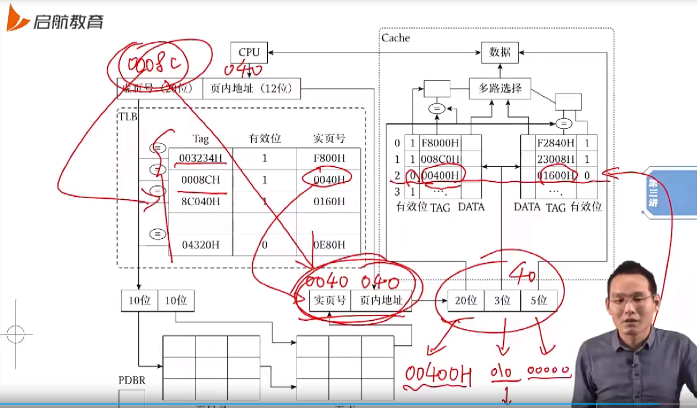

确实在 cache 中找到了对应数据，但因为有效位为 0，故未命中

### 虚拟存储器和 Cache 的异同点

1、cache 解决主存和 CPU 速度差异；虚拟存储器弥补主存和辅存的容量差距

2、cache 传输数据的基本单位为块，较小；虚拟存储器以页为单位，长度为几百~几百K字节

3、CPU 和 cache 以及主存都有直接访问的通道；而 CPU 和辅存之间没有，必须通过主存调块

4、cache 存取信息的过程均由硬件实现，对程序员是透明的；而虚拟存储器依赖于操作系统的存储管理软件，对系统程序员并非透明

**地址结构是生命线**
