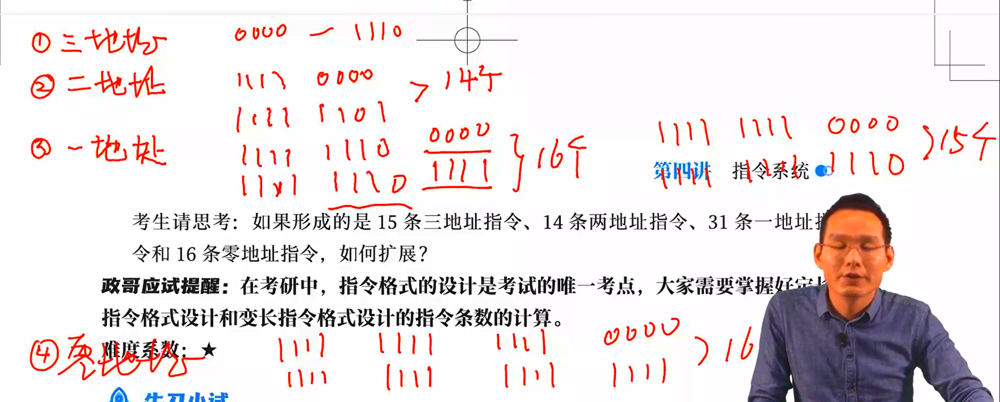
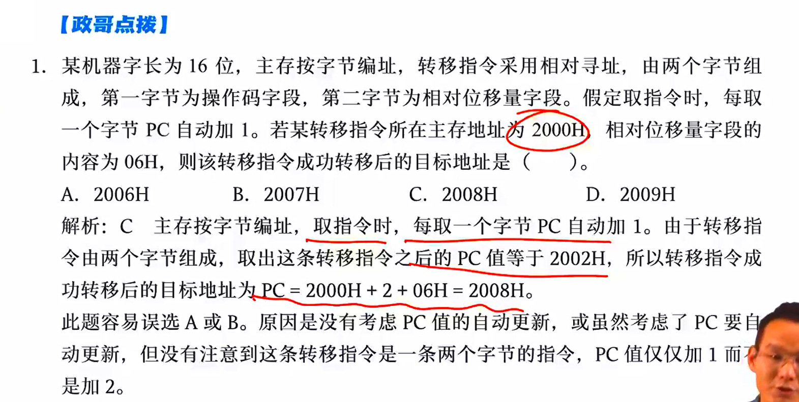

## 机器指令

> 以小题为主，2-4 分

### 指令格式

冯诺依曼计算机是受指令流控制的计算机，指令的一般格式：
$$
操作码（OP） + 地址码
$$

- 有点像汇编

### 地址码

零地址指令：指令中只有操作码，没有地址码，如汇编指令 aaa

- 无需任何操作数
- 其操作数默认：如堆栈，数据大多来自于此，暂存器、累加器、立即数均不可默认

一地址指令：包含操作码和一个地址码，寄存器或内存单元

- 单目运算：如取反、取负、取绝对值
- 做隐含寻址，即隐含约定目的地址的双操作数指令，默认有另一个操作数

二地址指令：包含操作码和两个地址码

三地址指令：操作码和三个地址码

- 往往 A1 、A2 提供运算数据，A3 是用于存放结果的地址

四地址指令：地址码和四个地址码

- A1、A2 提供数据，A3 存放结果，A4 是下一条指令的地址

隐指令：指令系统中没有的指令，由硬件催发

## 定长指令格式和变长指令格式

### 定长指令格式

定长指令格式是所有指令的操作码位数相同，并由操作码决定操作的类型

操作码位数为 n，则说明有 2^n 个操作码；反之，若指令系统有 n 条指令，则至少有 log2 (n) 位操作码

### 扩展操作码指令格式

高级语言中各指令的使用频率不同，如 goto 和赋值语句，扩展操作码指令格式将根据指令的使用频率划分不同位数的操作码以提高译码速度

- 短操作码不能作为长操作码的前缀

- 各指令的操作码不能重复

### 操作数类型和操作类型

举个栗子：操作码 4 位，地址码 A1,A2,A3 均为 4 位，请据此设计一个可变长的指令实现 15 条三地址指令、15 条二地址指令、15 条一地址指令、16 条零地址指令

- 三地址指令，操作码 0000 ~ 1110

- 二地址指令，借用地址码 A1，操作码 1111 0000 ~ 1111 1110，操作码从 4 位扩展到 8 位

- 一地址指令，借用地址码 A1,A2，操作码 1111 1111 0000 ~ 1111 1111 1110，操作码从 8 位扩展到 12 位

- 零地址指令，借用地址码 A1,A2,A3，操作码 1111 1111 1111 0000 ~ 1111 1111 1111 1111，操作码 16 位，共 16 种

可以注意到，由于上一次扩展是特地留了一位，用于区分前缀，方便下一次扩展

若改为 14 个二地址指令，31 个一地址指令，该如何设计？

结论：在写数据时，若每一位都是 n 位，上一级结构每留出一位，那么下一级结构将可以扩展 2^n 条指令

- 一个下阶梯的过程

## 寻址方式

> 较关键，汇编中学过：直接寻址、间接寻址、基址变址寻址。均为数据寻址方式

形式地址 A，有效地址 EA

### 指令寻址

指令寻址，寻找下一条将要执行的指令的内存地址，由 CPU 内的程序计数器 PC 的内容和指令中给出的偏移量求和得到，分为顺序寻址和跳跃寻址（转移寻址）

- 偏移量为有符号数，用补码表示

### 数据寻址

> 如何去寻找程序运行时所需的数据

立即寻址：指令中的地址码就是数据本身，即立即数，A 为数据本身，拿到指令即拿到数据

- 指令相对较短，不能储存大的立即数，这种方式的计算很有限，只适用于数很小的情况

直接寻址：操作数字段是操作数所在的内存地址，相当于指针

- 同样因为地址码位数有限，能够定位到的内存编号很少

间接寻址：指针的指针，指向一段存有数据地址的指针的地址

- 一次间址：指针的指针

- 多次间址：指针的指针的指针

- 多次间址会造成访问速度变慢

寄存器寻址：给出寄存器编号，CPU 根据编号去访问寄存器，从寄存器中拿出数据

- 成本高（寄存器贵），同时寄存器较少

寄存器间接寻址：给出寄存器编号，寄存器中存放的是指针而非数据，CPU 从寄存器给出的地址中去取数据

- 慢于寄存器寻址，快于间接寻址

隐含寻址：只给出一个数据，这个数据按照地址码给出，另一个数据在 ACC 中

- 减少字长

变址寻址：EA = (IX) + A，地址码给出的是变址寄存器的编号和偏移量，变址寄存器内容加上偏移量得到 EA

- A 不可变， IX 可变

- 常用于解决数组问题，用 A 给出寄存器编号（不可变），IX 给出数组下标（可变）

- 立足于用户

基址寻址：(BR) + A = EA，基址寄存器内容加上偏移量得到 EA

- A 可变，BR 不可变

- 和 IX+A 很像，但可变不可变的部分不同，于是 BR+A 常用于解决多道程序问题，用 A 切换寄存器编号

- 可以解决循环问题

- 面向系统

相对寻址：PC + A = EA，实现程序浮动，用于转移指令

堆栈寻址：分为硬堆栈和软堆栈

- 基于先进后出原则

- 硬堆栈即寄存器堆栈，纯用寄存器实现

- 软堆栈划分一块内存空间，实现栈功能

以下表格不包括取指令本身的访存次数

- 访存即访问内存

| 寻址方式      | 有效地址          | 访存次数 |
| --------- | ------------- | ---- |
| 隐含寻址      | 程序指定          | 0    |
| 立即寻址      | A 即是操作数       | 0    |
| 直接寻址      | EA = A        | 1    |
| 一次间接寻址    | EA = (A)      | 2    |
| N 次间接寻址   | EA = ((A))    | N+1  |
| 寄存器寻址     | EA = Ri       | 0    |
| 寄存器间接一次寻址 | EA = (Ri)     | 1    |
| 相对寻址      | EA = (PC) + A | 1    |
| 基址寻址      | EA = (BR) + A | 1    |
| 变址寻址      | EA = (IX) + A | 1    |
| 堆栈寻址      | 硬堆栈           | 0    |
| 堆栈寻址      | 软堆栈           | 1    |

- 访存次数越多，越慢

常用情形

| 寻址方式 | 特点          |
| ---- | ----------- |
| 立即寻址 | 执行期间不访存     |
| 隐含寻址 | 有效减少指令字长    |
| 变址寻址 | 解决数组问题      |
| 基址寻址 | 解决多道程序和循环问题 |
| 相对寻址 | 解决程序浮动问题    |

堆栈的先减后加，后减先加

- 栈顶指针 SP 先减，说明指向的是栈顶元素，减到空再压入数据，在取数据时，就要先取出栈顶元素，再令指针 SP+1
  
  指针 SP 始终指向栈顶元素

- 先压入栈再令指针 SP-1，说明 SP 本来就指向的空，于是在取出时，要先令 SP+1，指向栈顶元素后才能取出值

偏移寻址方式：即使用寄存器加偏移量的形式寻址，包括基址寻址、变址寻址、相对寻址

相对寻址示例

重点考虑题目 P16 00:11:00-00:40:00 两道题，其中第一道题尤为重要

## CISC 和 RISC

### 复杂指令系统计算机

### 精简指令系统计算机
