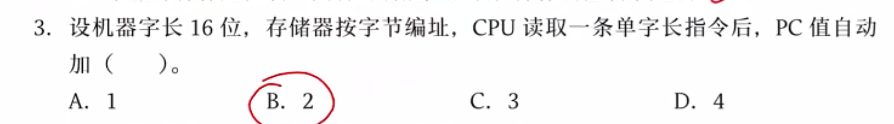
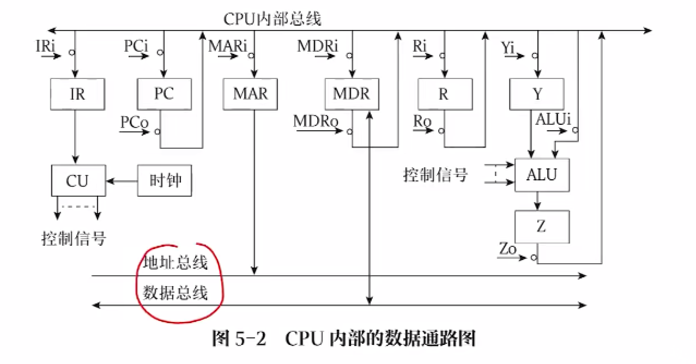
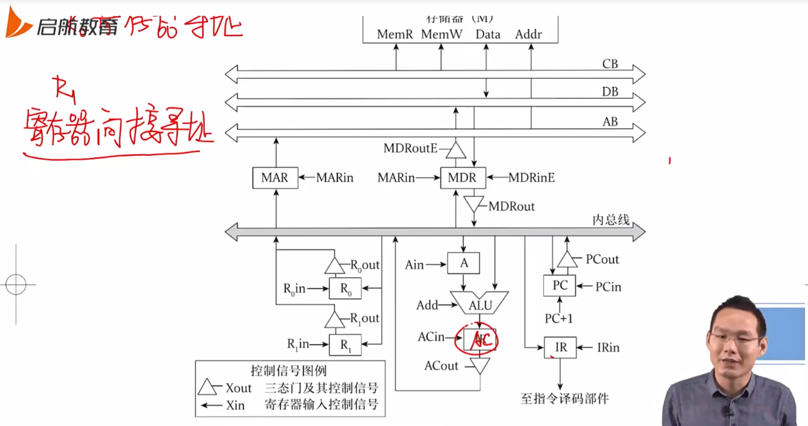
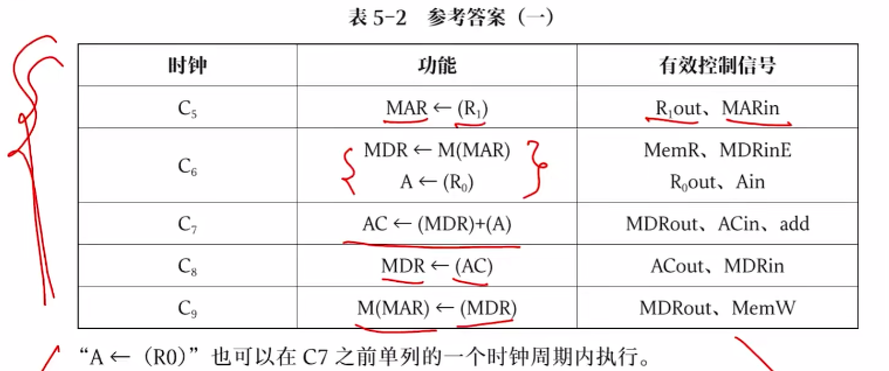
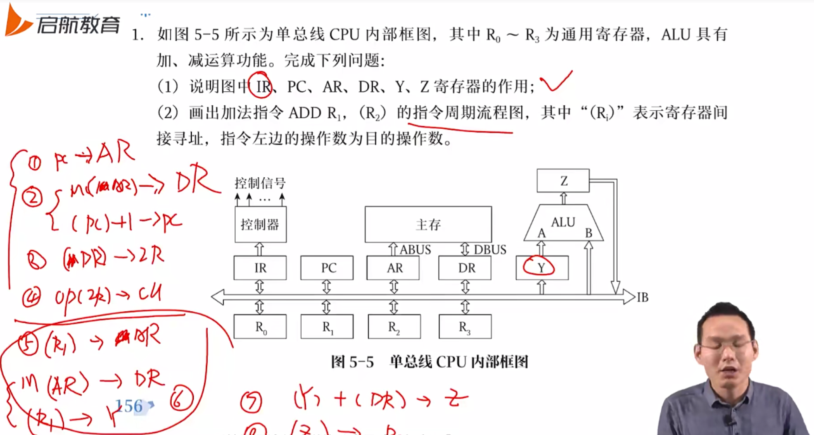

> 控制器和运算器，五星重点，408最难的一部分，出过三种大题
> 
> - CPU 功能和指令执行
> - 控制器的设计和工作原理
> - 指令流水线

## CPU 的功能和组成

### CPU 的组成和结构

冯诺依曼结构中，数据和指令均用二进制表示并按序依次存放在存储器中，计算机分为运算器、控制器、存储器、输入设备和输出设备五大部件，其中运算器和控制器合为中央控制其，即 CPU

CPU 包括算术逻辑单元 ALU、控制单元 CU、寄存器以及中断系统，与控制总线、数据总线、地址总线相连

- ALU 实现算术运算、逻辑运算
- CU 作为控制器，协调取数据、分析、读内存等工作，由程序计数器 PC、指令寄存器 IR、指令译码器 ID、时序产生器和操作控制器等组成

### CPU 中的寄存器

分为专用寄存器和通用寄存器

- 专用寄存器：程序计数器、指令寄存器、指令译码器、存储器数据寄存器、存储器地址寄存器
- 通用寄存器：数据寄存器、地址寄存器、通用寄存器

#### 专用寄存器

> 程序计数器 PC

也叫指令计数器，对指令条数进行计数

存放下一条将要执行的指令地址。执行指令时，CPU 会自动递增 PC 的内容，使其始终指向下一条指令；执行指令前，内存必须把第一条指令的首地址发送给 PC

有两种递增 PC 内容的途径：顺序执行和通过转移指令

- 顺序执行：即令 PC 地址加 1，PC = (PC) + 1，这里的 1 指的是一个指令的长度，单位为字，如一条指令 32 位，以字节（8bit）编码，那么每次就要**加一个指令的字数**，即 4 个字（指令字长 / 编址单位）
- 转移指令：即通过转移指令形成新地址再送往程序计数器，作为下一指令地址，PC = (PC) +1 + A，加的是 (1+A) 个指令的字数

如以下栗子，指令字长为 16 位，由于按字节编址，即长为 2 个字，所以 PC 要加 2

两个特点：任何程序要执行，必须把地址发给 PC；汇编语言可以直接对 PC 进行操作

> 指令寄存器

保存当前正在执行的指令。为了防止指令执行一半时指令发生变化，用指令寄存器 IR 保存当前正在执行的指令，执行指令的过程中，其内容不允许发生变化

> 指令译码器

分析指令的操作码字段

> 存储器数据寄存器：MDR，memory data register

用于暂存内存中读出的数据，存储字长

> 存储器地址寄存器：MAR，memory address register

用于保存当前 CPU 所访问的主存单元的地址

| 寄存器 | 存放内容    |
| --- | ------- |
| PC  | 下一条指令地址 |
| IR  | 当前指令本身  |
| MDR | 进出内存的数据 |
| MAR | 进出内存的地址 |

PC 位数等于 MAR，指令最终是要从内存中读出，也就是说 PC 中的地址在下一步是要取出的，取出则会放到 MAR 中，这就要求 MAR 的位数要大于等于 PC，否则放不下

IR 位数等于 MDR，与上同理，从内存中读出的指令（冯说，指令就是数据）始终要放在 IR 中的，所以 IR 大小必须大于等于 MDR

| 寄存器 | 大小                             |
| --- | ------------------------------ |
| PC  | log2 (指令条数) = log2 (内存大小/指令字长) |
| IR  | 指令字长，指令长度位数                    |
| MDR | 存储字长，就是字长位数                    |
| MAR | log2 (内存块数) = log2 (内存大小/编码方式) |

假设内存 4GB，按字节编码，指令字长 4B，则

- IR = 32 位
- MDR = 8 位
- MAR = log2 (4GB/1B) = log2 (4G) = 32 位
- PC = log2 (4GB/4B) = 30 位

这里的指令条数都是考虑的最大情况，即内存中只装指令只能装这么多条，最多就这么多条，PC 不可能超出，MAR 同理，内存中只装数据块，最多这么多块

> 状态标志寄存器

溢出和进/借位就是两种典型的状态标志；还有一种叫做控制标记：如中断标志、陷阱标志

条件转移指令执行时依据的条件来自于**标志寄存器**

常用的几种标志

| 标志           | 1     | 0   |
| ------------ | ----- | --- |
| Z（zero）      | 为零    | 非零  |
| C（进位）        | 有进/借位 | 无进位 |
| V（overflow位） | 有溢出   | 无溢出 |
| N（符号位）       | 正     | 负   |

各专用寄存器对程序员的可见性

| 寄存器\程序员  | 系统程序员 | 应用程序员 |
| -------- | ----- | ----- |
| PC       | 1     | 0     |
| MDR      | 0     | 0     |
| MAR      | 0     | 0     |
| IR       | 0     | 0     |
| PSWR（状态） | 1     | 0     |
| PSWR（控制） | 0     | 0     |
| 通用寄存器    | 1     | 1     |

- 只有 PC 和 PSWR 的状态标记对系统程序员可见，其余均透明

> 数据缓冲寄存器 DR

缓冲从内存中读出的数据，提高系统性能

> 地址缓冲寄存器 AR

存放地址缓冲

#### 通用寄存器

传送和暂存数据，也可以参与算术逻辑运算，通用寄存器均可见，即所有程序员均可以直接操纵通用寄存器

## CPU 的功能和数据通路

### CPU 功能

控制和运算功能：

- 取指令：控制功能之一

- 指令移码

- 控制指令执行

- 控制输入输出

- 异常处理

- 完成算术运算和逻辑运算

CPU 功能概括为指令控制、操作控制、时间控制、数据加工和中断处理

### CPU 中的数据通路

数据如何在 CPU、内存之间流通的？

- 不变：IR（存放当前指令）、PC、ALU、CU、MAR、MDR

- 变：名称
  
  - Z 也叫 ACC，累加器
  
  - Y，暂存器

- 数量：通用寄存器数量可能改变，但功能相同

- 作图方式：旋转跳跃

CPU 内部总线连接地址、数据总线和主存交互

指令周期：指令从取出到执行完成所需时间

机器周期：指令周期分为很多个阶段，每个阶段都叫一个机器周期，一个指令周期包含若干机器周期，一个机器周期包含若干时钟周期

取指周期：取指令过程，前三步即**读内存**

- (PC) ——> MAR， 将 PC 指令地址通过地址总线发给 MAR，存于 MAR 中

- 1 ——> R，CU 向存储器发一个读信号

- M(MAR) ——> MDR，将内存中 MAR 位置的数据读入 MDR

- (MDR) ——> IR，将指令调入 IR

- OP(IR) ——> CU，分析操作码

- (PC) + 1 ——> PC，计数器加一

间址周期：间址寻址过程

- Ad(IR) ——> MAR，将指令中的地址发到 MAR 中

- 1 ——> R，CU 发送读指令

- M(MAR) ——> MDR，将数据读入 MDR

- (MDR) ——> Ad(IR)，MDR 中的数据发给 Ad(IR)

加法周期 ADD X：但地址码默认另一数据在 ACC 中

- Ad(IR) ——> MAR

- 1 ——> R

- M(MAR) ——> MDR

- (MDR) + (ACC) ——> (ACC)

存数周期 STA X：存放数据

- Ad(IR) ——> MAR，Ad(IR) 就是 X

- 1 ——> W

- (ACC) ——> MDR

- (MDR) ——> M(MAR)

取数指令 LDA X：取出数据

- Ad(IR) ——> MAR，Ad(IR) 就是 X

- 1 ——> R

- M(MAR) ——> MDR

- (MDR) ——> (ACC)

转移指令 

- 无条件转移指令：JMX X

- 有条件转移 BAN X

中断指令：实际上就是保存 PC

- 程序断电存入 “0” 地址

- 程序断电进栈

以上周期和指令都是要背下来的噢（除了中断），在实际题目中不会蠢默写：第一步一定是取值；第二步确定指令功能，确认如何取数（运算方式）、如何运算；第三步根据题目开始默写上述内容

实现 (R0) + ((R1))，并将结果写入 (R1)

并行执行：要求线路和部件没有任何的交际

注意：取指令操作是控制器自动进行的，是控制器固有的 功能，无需在操作码控制下完成

- 这是一定的，如果取指令这一指令依赖于指令，那如何去取“取指令”的指令，就像操作系统的第一条指令（boot）是由硬件触发的

关于时钟信号

- 节拍 == 脉冲 == 时钟周期

- 每个指令的节拍固定，即 CPI（执行一个指令所化时钟周期数），计算机严格按照 CPI 掐断指令，进行分割 

栗子二

他写的有点问题，R1 为寄存器寻址，R2 为寄存器间接寻址，最后将运算结果送入 R1

## CPU 的设计原理

## 指令流水线
