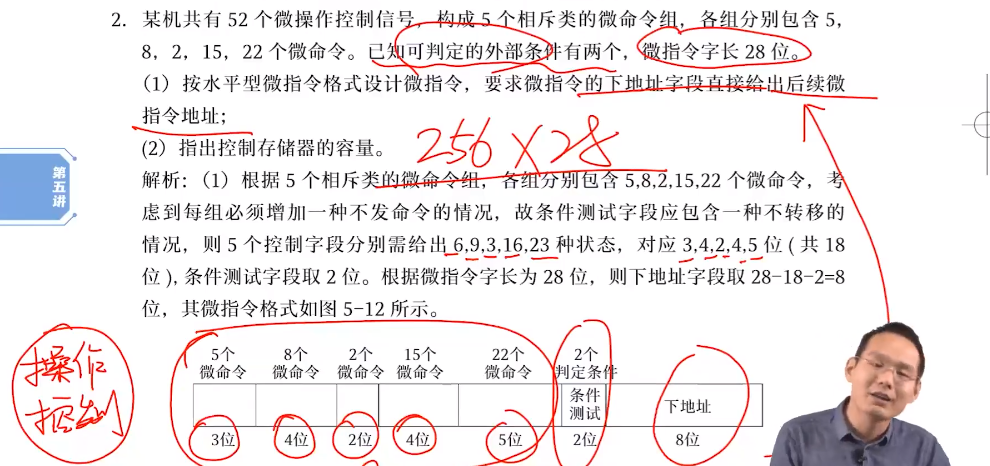

> 控制器和运算器，五星重点，408最难的一部分，出过三种大题
> 
> - CPU 功能和指令执行
> - 控制器的设计和工作原理
> - 指令流水线

## CPU 的功能和组成

### CPU 的组成和结构

冯诺依曼结构中，数据和指令均用二进制表示并按序依次存放在存储器中，计算机分为运算器、控制器、存储器、输入设备和输出设备五大部件，其中运算器和控制器合为中央控制其，即 CPU

CPU 包括算术逻辑单元 ALU、控制单元 CU、寄存器以及中断系统，与控制总线、数据总线、地址总线相连

- ALU 实现算术运算、逻辑运算
- CU 作为控制器，协调取数据、分析、读内存等工作，由程序计数器 PC、指令寄存器 IR、指令译码器 ID、时序产生器和操作控制器等组成

### CPU 中的寄存器

分为专用寄存器和通用寄存器

- 专用寄存器：程序计数器、指令寄存器、指令译码器、存储器数据寄存器、存储器地址寄存器
- 通用寄存器：数据寄存器、地址寄存器、通用寄存器

#### 专用寄存器

> 程序计数器 PC

也叫指令计数器，对指令条数进行计数

存放下一条将要执行的指令地址。执行指令时，CPU 会自动递增 PC 的内容，使其始终指向下一条指令；执行指令前，内存必须把第一条指令的首地址发送给 PC

有两种递增 PC 内容的途径：顺序执行和通过转移指令

- 顺序执行：即令 PC 地址加 1，PC = (PC) + 1，这里的 1 指的是一个指令的长度，单位为字，如一条指令 32 位，以字节（8bit）编码，那么每次就要**加一个指令的字数**，即 4 个字（指令字长 / 编址单位）
- 转移指令：即通过转移指令形成新地址再送往程序计数器，作为下一指令地址，PC = (PC) +1 + A，加的是 (1+A) 个指令的字数

如以下栗子，指令字长为 16 位，由于按字节编址，即长为 2 个字，所以 PC 要加 2

两个特点：任何程序要执行，必须把地址发给 PC；汇编语言可以直接对 PC 进行操作

> 指令寄存器

保存当前正在执行的指令。为了防止指令执行一半时指令发生变化，用指令寄存器 IR 保存当前正在执行的指令，执行指令的过程中，其内容不允许发生变化

> 指令译码器

分析指令的操作码字段

> 存储器数据寄存器：MDR，memory data register

用于暂存内存中读出的数据，存储字长

> 存储器地址寄存器：MAR，memory address register

用于保存当前 CPU 所访问的主存单元的地址

| 寄存器 | 存放内容    |
| --- | ------- |
| PC  | 下一条指令地址 |
| IR  | 当前指令本身  |
| MDR | 进出内存的数据 |
| MAR | 进出内存的地址 |

PC 位数等于 MAR，指令最终是要从内存中读出，也就是说 PC 中的地址在下一步是要取出的，取出则会放到 MAR 中，这就要求 MAR 的位数要大于等于 PC，否则放不下

IR 位数等于 MDR，与上同理，从内存中读出的指令（冯说，指令就是数据）始终要放在 IR 中的，所以 IR 大小必须大于等于 MDR

| 寄存器 | 大小                             |
| --- | ------------------------------ |
| PC  | log2 (指令条数) = log2 (内存大小/指令字长) |
| IR  | 指令字长，指令长度位数                    |
| MDR | 存储字长，就是字长位数                    |
| MAR | log2 (内存块数) = log2 (内存大小/编码方式) |

假设内存 4GB，按字节编码，指令字长 4B，则

- IR = 32 位
- MDR = 8 位
- MAR = log2 (4GB/1B) = log2 (4G) = 32 位
- PC = log2 (4GB/4B) = 30 位

这里的指令条数都是考虑的最大情况，即内存中只装指令只能装这么多条，最多就这么多条，PC 不可能超出，MAR 同理，内存中只装数据块，最多这么多块

> 状态标志寄存器

溢出和进/借位就是两种典型的状态标志；还有一种叫做控制标记：如中断标志、陷阱标志

条件转移指令执行时依据的条件来自于**标志寄存器**

常用的几种标志

| 标志           | 1     | 0   |
| ------------ | ----- | --- |
| Z（zero）      | 为零    | 非零  |
| C（进位）        | 有进/借位 | 无进位 |
| V（overflow位） | 有溢出   | 无溢出 |
| N（符号位）       | 正     | 负   |

各专用寄存器对程序员的可见性

| 寄存器\程序员  | 系统程序员 | 应用程序员 |
| -------- | ----- | ----- |
| PC       | 1     | 0     |
| MDR      | 0     | 0     |
| MAR      | 0     | 0     |
| IR       | 0     | 0     |
| PSWR（状态） | 1     | 0     |
| PSWR（控制） | 0     | 0     |
| 通用寄存器    | 1     | 1     |

- 只有 PC 和 PSWR 的状态标记对系统程序员可见，其余均透明

> 数据缓冲寄存器 DR

缓冲从内存中读出的数据，提高系统性能

> 地址缓冲寄存器 AR

存放地址缓冲

#### 通用寄存器

传送和暂存数据，也可以参与算术逻辑运算，通用寄存器均可见，即所有程序员均可以直接操纵通用寄存器

## CPU 的功能和数据通路

### CPU 功能

控制和运算功能：

- 取指令：控制功能之一

- 指令移码

- 控制指令执行

- 控制输入输出

- 异常处理

- 完成算术运算和逻辑运算

CPU 功能概括为指令控制、操作控制、时间控制、数据加工和中断处理

### CPU 中的数据通路

数据如何在 CPU、内存之间流通的？

- 不变：IR（存放当前指令）、PC、ALU、CU、MAR、MDR

- 变：名称
  
  - Z 也叫 ACC，累加器
  
  - Y，暂存器

- 数量：通用寄存器数量可能改变，但功能相同

- 作图方式：旋转跳跃

CPU 内部总线连接地址、数据总线和主存交互

指令周期：指令从取出到执行完成所需时间

机器周期：指令周期分为很多个阶段，每个阶段都叫一个机器周期，一个指令周期包含若干机器周期，一个机器周期包含若干时钟周期

取指周期：取指令过程，前三步即**读内存**

- (PC) ——> MAR， 将 PC 指令地址通过地址总线发给 MAR，存于 MAR 中

- 1 ——> R，CU 向存储器发一个读信号

- M(MAR) ——> MDR，将内存中 MAR 位置的数据读入 MDR

- (MDR) ——> IR，将指令调入 IR

- OP(IR) ——> CU，分析操作码

- (PC) + 1 ——> PC，计数器加一

间址周期：间址寻址过程

- Ad(IR) ——> MAR，将指令中的地址发到 MAR 中

- 1 ——> R，CU 发送读指令

- M(MAR) ——> MDR，将数据读入 MDR

- (MDR) ——> Ad(IR)，MDR 中的数据发给 Ad(IR)

加法周期 ADD X：但地址码默认另一数据在 ACC 中

- Ad(IR) ——> MAR

- 1 ——> R

- M(MAR) ——> MDR

- (MDR) + (ACC) ——> (ACC)

存数周期 STA X：存放数据

- Ad(IR) ——> MAR，Ad(IR) 就是 X

- 1 ——> W

- (ACC) ——> MDR

- (MDR) ——> M(MAR)

取数指令 LDA X：取出数据

- Ad(IR) ——> MAR，Ad(IR) 就是 X

- 1 ——> R

- M(MAR) ——> MDR

- (MDR) ——> (ACC)

转移指令 

- 无条件转移指令：JMX X

- 有条件转移 BAN X

中断指令：实际上就是保存 PC

- 程序断电存入 “0” 地址

- 程序断电进栈

以上周期和指令都是要背下来的噢（除了中断），在实际题目中不会蠢默写：第一步一定是取值；第二步确定指令功能，确认如何取数（运算方式）、如何运算；第三步根据题目开始默写上述内容

实现 (R0) + ((R1))，并将结果写入 (R1)

并行执行：要求线路和部件没有任何的交际

注意：取指令操作是控制器自动进行的，是控制器固有的 功能，无需在操作码控制下完成

- 这是一定的，如果取指令这一指令依赖于指令，那如何去取“取指令”的指令，就像操作系统的第一条指令（boot）是由硬件触发的

关于时钟信号

- 节拍 == 脉冲 == 时钟周期

- 每个指令的节拍固定，即 CPI（执行一个指令所化时钟周期数），计算机严格按照 CPI 掐断指令，进行分割 

栗子二

他写的有点问题，R1 为寄存器寻址，R2 为寄存器间接寻址，最后将运算结果送入 R1

## CPU 的设计原理

### CPU 的控制方式

同步控制方式：选取部件中最长的操作时间作为统一的时间间隔标准，即所有控制信号按这一间隔发出，实现同步控制，这样会产生空闲时间，降低效率

异步控制方式：每个指令、每个微操作需要多少时间就占用多少时间，没有统一的信号控制，通过应答信号实现，即每次完成操作后发回“结束”信号告知完成

联合控制方式：也叫混合控制方式，大多数计算机采用该种方式。同步异步相结合，很多操作按照异步进行，在少数关键点（CPU 内部时序）采用同步方式

### 微程序控制器原理

微程序设计技术：利用软件方法来设计硬件的一门技术

- 每个指令对应一个微程序，每个微程序由微指令构成
- 所有指令所对应的微程序放在一个只读存储器中，叫做控存（控制存储器），每个指令执行时，去执行其对应的微程序，逐条读出微指令，放入微指令寄存器，译码产生微命令，控制各步执行
- 采用微程序控制方法的控制器称为微程序控制器，微命令不是由组合逻辑电路产生，而是由微指令译码产生

关于微程序控制器的基本术语

- 相容性微操作：可并行执行的微操作
- 相斥性微操作
- 微地址：微指令在控存中的地址
- 微地址寄存器 CMAR：存放微地址字段的寄存器
- 微命令寄存器 CMDR：微程序控制器中的寄存器

微程序控制器基本原理：机器指令映射微程序

- 每条机器指令对应一个微程序
- 取值指令是相同，于是将取值指令同一编制成一个取值微程序，作为公共使用，同理还有间址指令、中断指令
- 因为取值指令公共，101 种操作对应存放了 102 个微程序；若没有 102，则将间址和中断也考虑进去，得 104 个微程序？

微程序控制器基本结构

- 控存是核心部件，属于 ROM（只读内存），按地址访问
- CMAR 控存地址寄存器，存放微指令地址
- CMDR 控存数据寄存器，存放读出的微指令

微指令序列地址的形成方式：即如何寻址

- 断定法：由微指令的下地址字段指出
- 机器指令的操作码形成
- 增量法：CMAR+1 ——> CMAR
- 网络测试形成
- 由硬件产生

微程序控制器工作过程

- 取机器指令：将机器指令送入指令寄存器
- 转微程序入口：指令操作码部分送入微地址形成电路，形成微程序入口，将微程序入口送入微地址寄存器，将微地址送入控存，从控存中找到微程序起始地址，将首条微指令送入微指令寄存器中
- 执行首条微指令：将控存地址寄存器微命令字段送入译码器，得到相应微命令并执行
- 取后续微命令：微地址形成电路 ——> 从控存取微命令 ——> 执行

### 微程序控制器设计

微指令的设计（编码 / 控制方式）：操作控制字段 + 下地址字段

直接编码方式

- 操作控制字段中一位对应一个微命令，控制字段长度为微命令个数，1 表示打开某控制门，0 表示禁止
- 每位表示一个命令，固定如此，如 000 表示连续三个命令全禁止

字段直接编码方法

- 对操作控制字段进行分段，每一段含互斥的微命令，同时还有一位有效位表示字段字否有效
- 因为字段内微命令互斥，所以可以进行编码，即 000 表示命令 1，001 表示命令 2，这样能够大大减小内存开销

字段间接编址方式：某些段的输出依赖于某些段的输出

控存的大小：如为 512x40 位，即表示有 512 条微指令，每条 40 位

水平型微指令和垂直性微指令

- 水平性并行性较好，执行时间较短
- 垂直型由微操作码规定微指令功能

栗子一：直接编码方法设计微指令格式

栗子二：字段直接编码方式设计微指令格式

### 组合逻辑控制器的原理和设计

由门电路和触发器构成的树型网络组成，组合逻辑也叫硬布线控制器，更快，但不易修改；微指令控制器易修改，易扩展

## 指令流水线

### 指令执行方案

一个指令周期分为很多步骤，如取值、分析、执行等，很多时候他们串行执行，但出于性能和硬件成本考虑，我们希望他们并行运行

指令之间可以并行执行的方案称为**流水线方案**，每个人只做其中一步，在操作上并行

### 指令流水线

我们将一条指令分为取值、分析、执行三个过程，假设每个步骤消耗时间 t

顺序执行方式：n 条指令则消耗时间 3nt

- 控制简单，硬件代价小，执行缓慢

一次重叠执行：即执行上一条指令的“执行过程”时，同时执行下一条指令的“取值过程”，重叠一次操作，这样 n 条指令将消耗时间 3t + (n-1)2t = (1+2n)t

- 3t 为第一条指令完成时间，之后每经过 2t，都会有一条指令完成（参考计网分组交换）
- 需要多硬件，并行重叠一次，则需要两个硬件，但时间缩短到原来的 2/3

二次重叠执行：执行上一个“分析”过程时，开始执行下一个“取值”过程，折叠两个过程，这样耗时将缩短至 3t + (n-1)t = (2+n)t

- 时间缩短至原来的 1/3

推广到一般，当步骤增多，我们在第一步骤结束后立马开始第二条指令，这种模式就叫做流水线模式

### 流水线的性能指标

吞吐率：单位时间内流水线完成的任务数量

- 对于 n 个任务，每个步骤耗时 t，共 k 个步骤
- 完成 n 个任务所需时间为 Tk = kt + (n-1)t
- 吞吐率 TP = n / Tk
- 当 n->无穷时，kt 被忽略，n/(n-1) = 1，得到最大吞吐率 n/t

加速比：流水线和等功能的非流水线的速度之比
$$
S = \frac{kn\times t}{kt+(n-1)t} = \frac{kn}{k+n-1}
$$
效率：各功能段的利用率
$$
E = \frac{n}{(k+n-1)t}
$$

### 影响流水线的因素

#### 结构相关

结构相关（资源冲突 / 资源冒险）因素：并行执行需要大量硬件资源，如果硬件不够就会出现资源冲突

有两种解决办法

- 前指令访存，使后一条相关指令暂停一个时钟周期
- 加入资源使之够用

#### 控制相关

流水线遇到转移指令改变了 PC 信号的指令而造成断流

解决办法

- 预测转移指令分支

- 预测转移成功和不成功两个控制流方向的目标指令

- 加快和提前形成条件码

- 提高转移方向的猜准率

前面指令阻塞，后续指令也被阻塞，属于控制相关 

#### 数据相关

> 重点

数据相关（数据冲突 / 数据冒险）因素：前一条指令和后一条指令同时执行并操作同一条数据

写后读（Write After Read）：前后相邻，编号相同，前写后读

- 前一条指令还未把新数据写入内存，下一条指令已经读出了旧数据，这种现象叫做写后读错误（写后于读）
- 解决办法：让读阻塞若干周期，等待写操作完毕

写后写（Write After Write）：前后相邻，编号相同，前写后写

- 后一个写指令执行太快，覆盖了前一个写操作，最终数据是前一个写操作的结果
- 为什么会出现后一个写快于前一个写？指令执行具有异步性，无法预判

读后写（Read After Write）：前后相邻，编号相同，前读后写

- 后面指令写的太快，导致前一条指令读到的是新数据

注意：

- 当按序发生按序执行时，只会发生 WAR 错误，WAW 和 RAW 均不会发生
- 无转发执行 == 按序执行
- 相邻的定义并不是紧挨着，而是相隔距离小于等于 n-2 为相邻，n 为流水线段数。如共五段，指令 I1 和 I4 相邻，I1 和 I5 不相邻

解决办法：

- 暂停周期

- 设置相关专用通路，数据旁路技术

- 编译器调整指令顺序

### 超流水线技术

三种超发技术

- 超标量

- 超流水线技术

- 超长指令字

均依赖于编译器的优化和多硬件支撑
