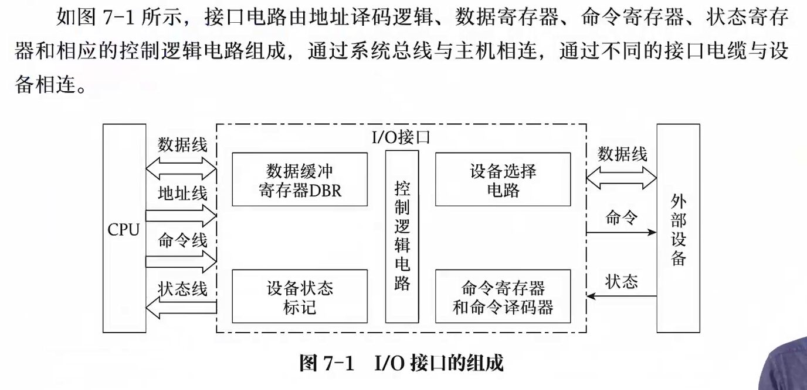
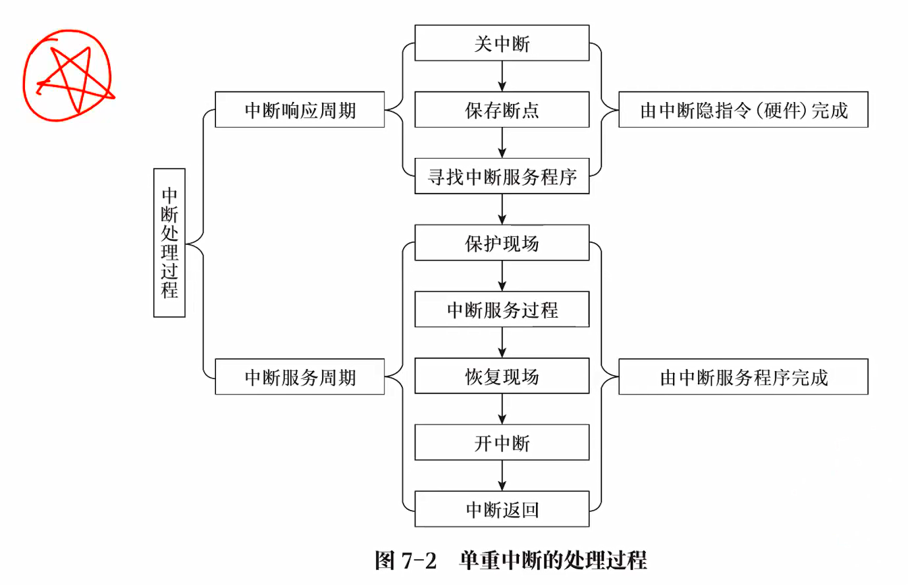

> 四星重点，考频较高，难度较小
> 
> 注意考察 I/O 方式：给 IO 时间和 CPU 时间计算比例；计算整个 IO 时间

## I/O 接口

也就是 I/O 控制器

### I/O 系统的组成

I/O 系统包括外围设备、输入/输出接口和输入/输出软件，主要功能为实现人机交互

设备多，种类繁杂，速度差异大

- 很显然 CPU 的速度太快，无法管理 IO 设备

计算机系统的输入输出接口实现主机和外设之间的信息交换

### I/O 接口的功能

- 实现主机和外设的通信联络控制：通过同步控制电路解决时间配合问题，通过联络信息管理外设和主机交换信息的时间

- 进习性地址译码和设备选择：解析 CPU 发来的地址码，转化为具体的 IO 设备

- 实现数据缓冲：在输入输出设备和主机之间有一层数据缓冲，由数据缓冲寄存器实现

- 数据格式的转换：如并串/串并转换、数模转换、二进制数和 ASCII 码转换

- 传递控制命令和状态信息

- 终端功能

### 接口的基本结构

控制逻辑电路，上面对接 CPU，下面对接外设

- 一个小型的 CPU，有一定的处理信息能力

可以发现，IO 接口中有多种寄存器，这些寄存器也叫 IO 端口

### 接口的类型

按照数据传送方式分类

- 串行接口

- 并行接口

按照主机对 IO 设备的控制方式

- 程序查询接口

- 程序中断接口

- DMA 接口

- 通道控制器

按功能选择的灵活性

- 可编程接口

- 不可编程接口

按照通用性

- 通用接口：扩展坞

- 专用接口

根据信号：数模转换器

- 数字接口

- 模拟接口

### I/O 端口

IO 端口就是接口电路中可以被 CPU 直接访问的寄存器，常分为

- 数据端口

- 命令端口

- 状态端口

CPU 发送的数据实际上是直接发送到各 IO 接口中

为了节省硬件，状态信息和控制信息可以共用一个端口（寄存器），称为控制状态寄存器

### I/O 端口的编址方式

IO 没有地址端口，那么他是如何进行地址选择？

地址将由 CPU 发送给设备选择电路，由该电路实现地址选择，因为 IO 设备可以随时装上拆除，如果用地址寄存器，总会有不够用的情况

于是用设备选择电路，通过当前的电路情况产生信号告知该操作读写哪个设备

#### 独立编址方式

又称 IO 映射方式，对外设端口单独编址，即与主存的编址完全无关

- 访存使用访存指令

- IO 指令使用 IO 指令
  
  - IO 指令是特权指令，只能由 CPU 执行，不能由用户执行

如在 8086 中，主存地址为 0000H~FFFFH，IO 端口地址范围为 0000H~FFFFH，二者相互独立，互不影响

#### 统一编址方式

存储器映射方式，外设端口和主存单元统一编址，占据相同的地址空间，但占据不同的地址范围

| 编址方式 | 定义                                  | 特点                                 |
| ---- | ----------------------------------- | ---------------------------------- |
| 统一编址 | 把 IO 端口当作存储器单元进行空间分配，采用统一的访存指令      | 优点：不需要专门的 IO 指令；占用了存储器地址空间，速度慢     |
| 独立编址 | IO 端口和存储器地址无关，需要设置专门的 IO 指令访问 IO 端口 | 优点：程序编址清晰，便于理解；缺点：IO 指令较少，增加了控制复杂性 |

前者依靠不同的地址码进行区分存储单元和 IO 端口，后者通过不同的指令进行区分

## 中断系统

### 基本原理

异常事件发生，如在上网课，志愿者上门做核酸，打断了上网课，做完之后再去上网课

- 其中做核酸就是一个中断

中断后再回到主程序停止处继续执行

### 中断分类

根据中断发起者，分为

- 软件中断：如 0X80 命令，由程序发起，使用中断指令使机器进入中断处理

- 硬件中断：由随机产生的硬件事件而产生的中断

根据中断发生位置，分为

内中断：也叫异常，CPU 内部硬件或软件原因引起的中断

- 在操作系统中，内中断分为错误（error）、陷入（trap）、异常（exception），均可由 CPU 检测到

- 引起内中断的栗子
  
  - 访存缺页：exception
  
  - 非法指令
  
  - 等待超时
  
  - 运行超时
  
  - 特权指令
  
  - 访存越界：error
  
  - 内存校验错误
  
  - 阶上溢
  
  - 非法运算

外中断：CPU 意外原因引起的中断，常指 IO 中断

- 程序 IO 中断

- DMA 中断

- 通道中断

根据中断的允许 / 禁止，可分为

- 可屏蔽中断：可被 CPU 通过指令限制某些设备发出中断请求的中断
  
  - CPU 关中断：CPU 将不响应任何中断
  
  - 设置中断屏蔽字：CPU 将响应优先级最高的中断（紧急的把不紧急的屏蔽掉）

- 不可屏蔽中断：电源断电

### 中断处理过程

中断处理系统需要解决以下几个问题

- 中断源如何向 CPU 提出请求

- 中断源同时提出请求如何处理

- CPU 在什么条件、时间、以什么方式响应中断

- 如何保护现场

- 如何寻址入口地址

- 如何恢复中断，如何返回

- 处理中断途中又遇到中断如何处理

中断处理过程分为两个阶段：中断响应周期和中断服务周期

中断响应周期

- 关中断

- 保存断点

- 寻找中断服务程序

中断服务周期

- 保护现场

- 中断服务过程

- 恢复现场

- 开中断

- 中断返回

### 中断请求标记

中断对于主机来说实际上是一个异常事件，我们给每一个中断源设置一个**比特**作为标识符表识其是否提出中断，该位 1 即提出了中断

多个中断请求设法其构成一个中断请求寄存器，就像微程序的直接编码设计方式，固定下每位对应的中断源，如 1100 对应 abcd 四个中断源，就表示 ab 发出了中断请求，而 cd 没有发出

### 中断优先级判断

当系统同时出现多个中断源，如何判断先实现哪个中断

- 硬件排队器实现

- 软件程序查询实现优先级判断，就是 if-else 语句

### 中断响应的条件

> 背住

四个条件，必须同时满足

- 中断源提出中断请求

- 在所有中断源中，有优先级最高的中断且当前没有更高级的中断服务程序正在执行

- CPU 允许中断：CPU 有两种状态，一种是关中断，此时允许触发器为 0；另一个是开中断，允许触发器为 1。只有访问允许触发器得到 1 时才允许触发中断

- 指令周期结束

### 中断响应周期和中断隐指令
