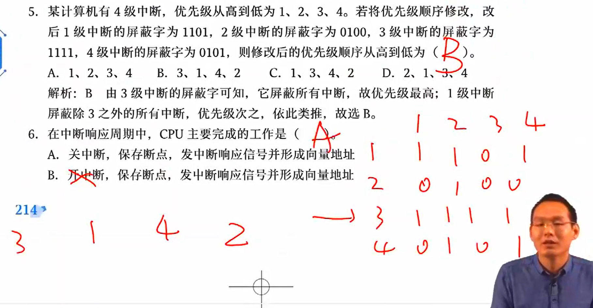
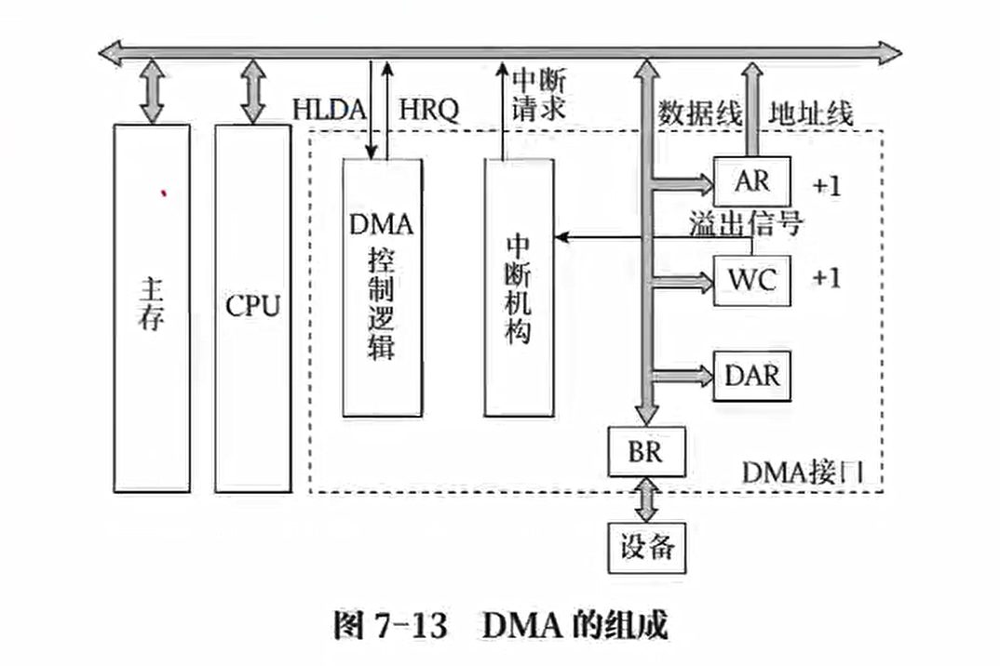

> 四星重点，考频较高，难度较小
> 
> 注意考察 I/O 方式：给 IO 时间和 CPU 时间计算比例；计算整个 IO 时间

## I/O 接口

也就是 I/O 控制器

### I/O 系统的组成

I/O 系统包括外围设备、输入/输出接口和输入/输出软件，主要功能为实现人机交互

设备多，种类繁杂，速度差异大

- 很显然 CPU 的速度太快，无法管理 IO 设备

计算机系统的输入输出接口实现主机和外设之间的信息交换

### I/O 接口的功能

- 实现主机和外设的通信联络控制：通过同步控制电路解决时间配合问题，通过联络信息管理外设和主机交换信息的时间

- 进习性地址译码和设备选择：解析 CPU 发来的地址码，转化为具体的 IO 设备

- 实现数据缓冲：在输入输出设备和主机之间有一层数据缓冲，由数据缓冲寄存器实现

- 数据格式的转换：如并串/串并转换、数模转换、二进制数和 ASCII 码转换

- 传递控制命令和状态信息

- 终端功能

### 接口的基本结构

控制逻辑电路，上面对接 CPU，下面对接外设

- 一个小型的 CPU，有一定的处理信息能力

可以发现，IO 接口中有多种寄存器，这些寄存器也叫 IO 端口

### 接口的类型

按照数据传送方式分类

- 串行接口

- 并行接口

按照主机对 IO 设备的控制方式

- 程序查询接口

- 程序中断接口

- DMA 接口

- 通道控制器

按功能选择的灵活性

- 可编程接口

- 不可编程接口

按照通用性

- 通用接口：扩展坞

- 专用接口

根据信号：数模转换器

- 数字接口

- 模拟接口

### I/O 端口

IO 端口就是接口电路中可以被 CPU 直接访问的寄存器，常分为

- 数据端口

- 命令端口

- 状态端口

CPU 发送的数据实际上是直接发送到各 IO 接口中

为了节省硬件，状态信息和控制信息可以共用一个端口（寄存器），称为控制状态寄存器

### I/O 端口的编址方式

IO 没有地址端口，那么他是如何进行地址选择？

地址将由 CPU 发送给设备选择电路，由该电路实现地址选择，因为 IO 设备可以随时装上拆除，如果用地址寄存器，总会有不够用的情况

于是用设备选择电路，通过当前的电路情况产生信号告知该操作读写哪个设备

#### 独立编址方式

又称 IO 映射方式，对外设端口单独编址，即与主存的编址完全无关

- 访存使用访存指令

- IO 指令使用 IO 指令
  
  - IO 指令是特权指令，只能由 CPU 执行，不能由用户执行

如在 8086 中，主存地址为 0000H~FFFFH，IO 端口地址范围为 0000H~FFFFH，二者相互独立，互不影响

#### 统一编址方式

存储器映射方式，外设端口和主存单元统一编址，占据相同的地址空间，但占据不同的地址范围

| 编址方式 | 定义                                  | 特点                                 |
| ---- | ----------------------------------- | ---------------------------------- |
| 统一编址 | 把 IO 端口当作存储器单元进行空间分配，采用统一的访存指令      | 优点：不需要专门的 IO 指令；占用了存储器地址空间，速度慢     |
| 独立编址 | IO 端口和存储器地址无关，需要设置专门的 IO 指令访问 IO 端口 | 优点：程序编址清晰，便于理解；缺点：IO 指令较少，增加了控制复杂性 |

前者依靠不同的地址码进行区分存储单元和 IO 端口，后者通过不同的指令进行区分

## 中断系统

### 基本原理

异常事件发生，如在上网课，志愿者上门做核酸，打断了上网课，做完之后再去上网课

- 其中做核酸就是一个中断

中断后再回到主程序停止处继续执行，注意 CPU 只有在指令执行周期结束后才会响应中断

### 中断分类

根据中断发起者，分为

- 软件中断：如 0X80 命令，由程序发起，使用中断指令使机器进入中断处理

- 硬件中断：由随机产生的硬件事件而产生的中断

根据中断发生位置，分为

内中断：也叫异常，CPU 内部硬件或软件原因引起的中断

- 在操作系统中，内中断分为错误（error）、陷入（trap）、异常（exception），均可由 CPU 检测到

- 引起内中断的栗子
  
  - 访存缺页：exception
  
  - 非法指令
  
  - 等待超时
  
  - 运行超时
  
  - 特权指令
  
  - 访存越界：error
  
  - 内存校验错误
  
  - 阶上溢
  
  - 非法运算

外中断：CPU 意外原因引起的中断，常指 IO 中断

- 程序 IO 中断

- DMA 中断

- 通道中断

根据中断的允许 / 禁止，可分为

- 可屏蔽中断：可被 CPU 通过指令限制某些设备发出中断请求的中断
  
  - CPU 关中断：CPU 将不响应任何中断
  
  - 设置中断屏蔽字：CPU 将响应优先级最高的中断（紧急的把不紧急的屏蔽掉）

- 不可屏蔽中断：电源断电

### 中断处理过程

中断处理系统需要解决以下几个问题

- 中断源如何向 CPU 提出请求

- 中断源同时提出请求如何处理

- CPU 在什么条件、时间、以什么方式响应中断

- 如何保护现场

- 如何寻址入口地址

- 如何恢复中断，如何返回

- 处理中断途中又遇到中断如何处理

中断处理过程分为两个阶段：中断响应周期和中断服务周期

中断响应周期

- 关中断

- 保存断点

- 寻找中断服务程序

中断服务周期

- 保护现场

- 中断服务过程

- 恢复现场

- 开中断

- 中断返回

### 中断请求标记

中断对于主机来说实际上是一个异常事件，我们给每一个中断源设置一个**比特**作为标识符表识其是否提出中断，该位 1 即提出了中断

多个中断请求设法其构成一个中断请求寄存器，就像微程序的直接编码设计方式，固定下每位对应的中断源，如 1100 对应 abcd 四个中断源，就表示 ab 发出了中断请求，而 cd 没有发出

### 中断优先级判断

当系统同时出现多个中断源，如何判断先实现哪个中断

- 硬件排队器实现

- 软件程序查询实现优先级判断，就是 if-else 语句

### 中断响应的条件

> 背住

四个条件，必须同时满足

- 中断源提出中断请求

- 在所有中断源中，有优先级最高的中断且当前没有更高级的中断服务程序正在执行

- CPU 允许中断：CPU 有两种状态，一种是关中断，此时允许触发器为 0；另一个是开中断，允许触发器为 1。只有访问允许触发器得到 1 时才允许触发中断

- 指令周期结束

### 中断响应周期和中断隐指令

隐指令指计算机中实际不存在于指令系统的指令，完全由硬件完成

中断响应周期中，**中断隐指令**主要完成以下操作

- 关中断：进入不可响应中断的状态

- 保存断点：保存 PC 的值

- 寻找中断服务程序：针对不同的中断源寻找不同的中断服务

寻找中断服务有两种方法，中断向量表存放中断服务程序的入口地址，中断向量指的是中断服务程序的入口地址在中断向量表中的地址

- 硬件向量法：在中断向量表中查询对应的中断服务程序的入口

- 中断向量法（软件查询法）：通过中断向量查询中断向量表（就像间接寻址）

### 中断服务程序流程

服务有以下操作，并不是由隐指令实现

- 保护现场：除了 PC，还要保护寄存器的状态等

- 中断处理：执行中断服务程序

- 恢复现场

- 开中断：由 ISR 实现

- 中断返回

### 多重中断

也叫中断嵌套，在处理中断的过程中出现新的更紧集的中断

实现多重中断的条件

- 提前设置开中断指令

- 设置中断的优先级，优先级高的中断有权中断优先级别低的中断源

中断屏蔽寄存器：记录各个中断源的中断屏蔽字，中断屏蔽字由一串二进制位构成，1 越多，表示优先级越高（全 1 的中断字优先级最高），如

- 1 表示可以屏蔽，0 表示被屏蔽，默认自己可以屏蔽自己

又如

中断的优先级分为两种

- 当中断响应次序由硬件排队电路实现，无法改变，该优先级称为响应优先级

- 当中断响应次序是中断服务的执行次序，可以由屏蔽码动态改变，该优先级称为处理优先级

引入多重中断后的中断处理流程

## I/O 方式

> 四星重点，常考答题

常用的 I/O 控制方式包括：程序查询方式、程序中断方式、直接存储器存取（DMA）方式、I/O 通道控制方式和 I/O 处理机方式

- 尽可能减少 CPU 参与 I/O，避免 I/O 拖慢 CPU

### 程序查询方式

通过 CPU 不断执行指令完成和 IO 设备的信息传送

- 查询指令：不断查询 IO 设备是否准备好，准备好了开始传送

- 传送指令：传送数据

- 转移指令：重复该过程

CPU 完全参与 IO 控制

优点：硬件简单，易实现

缺点：

- 查询过程 CPU 长期处于原地等待状态，系统效率低

- CPU 在一段时间内只能和一台外设交换信息，串行工作，无法并行执行

- 不能发现和处理错误和异常

特点：接口中至少有两个寄存器，一个数据缓冲寄存器存储指令，一个设备状态寄存器供 CPU 查询状态

大部分时间花费在查询状态这一步，IO 设备准备实在是太慢了，根本原因在于外设只能被动被查询状态，无法主动报告自身是否准备好

- 高速设备采用这种方式计算比例有可能大于 100%，这显然是不可能的，于是得到结论，高速设备无法使用程序查询方式

### 程序中断方式

使用中断处理程序和外设通信

以中断的方式主动报告自己的状态，当外设准备好后，发送中断请求，主机执行中断服务程序，完成和外设的数据传输

- 于是 CPU 不用串行查询外设状态，节省大量时间

处理过程：在程序中安排一条指令，向外设发出 START 信号，外设收到后进行准备，同时 CPU 可以进行其他工作，当外设准备好后，便发送中断请求（INT）信号，CPU 中断，执行和外设的中断服务程序，实现数据传输（通常是一个字或一个字节进行传送）

同样的，传输也是一个循环过程，和程序查询一样，需要重复传输，即重复执行中断处理程序

特点

- 传输的基本单位是字或字节

- 每传输一个单位都要中断以此

- IO 设备的启动需要 CPU 参与

### 直接存储器存取方式

直接存储器存取（Direct Memory Access, DMA）方式是单独在外设和主存间开辟一条“直接数据通道”，不需要 CPU 的参与，直接在主存和外设间高速传输数据

在 DMA 方式中，对数据传送过程进行控制的硬件叫做 **DMA 控制器**

DMA 的组成

核心结构

- DMA 控制逻辑

- 寄存器：需要寻址，包括内存地址寄存器、命令 / 状态寄存器、数据寄存器、数据计数器

- 中断机构：整个过程 CPU 不知道，需要 DMA 主动发出中断告知数据是否传输完成 ，需要 CPU 进行相应的后处理

DMA 控制器的功能包括

- 接受外设发出的 DMA 请求，并向 CPU 发出总线请求

- CPU 响应总线请求并发送响应信号后，CPU 接管对总线的控制，进入 DMA 操作周期

- 确定数据所在主存地址及长度，并能够自动动态修改

- 识别传输方向，内存向 IO 还是 IO 向内存

- 向 CPU 报告 DMA 操作的结束，即中断

四类寄存器

- 内存地址寄存器 MAR

- 命令状态寄存器 CR

- 数据寄存器 DR

- 数据计数器 DC

DMA 的工作阶段

- 预处理阶段：CPU 来做，启动 DMA，设置数据传输方向，初始化地址、数据寄存器内容

- 数据传输阶段：完全由 DMA 控制

- 后处理阶段：DMA 向 CPU 发出中断，CPU 通过中断响应程序完成，这一步主要由 CPU 完成

有一个问题：DMA 访存时 CPU 也想访问内存，怎么处理？

三种方法

- 停止 CPU 访问法：在 DMA 获得访问权限到结束之前，CPU 无访存权限

- 存储器分时法：将单位时间一分为二，CPU 和 DMA 交替访问内存，由于 CPU 频率远大于 DMA，这样均分会造成大量的 DMA 空访存，拖慢系统效率

- 周期挪用法（最常用）：CPU 对主存的访问居于主要地位，一旦外设获得 DMA 请求后（并获取 CPU 批准），DMA 将获得一个周期的访存权，传送一个字/字节，再把权限交回 CPU，CPU 继续自己的操作，同时等待下一个 DMA 请求的到来

周期挪用法的周期是什么周期？指令周期？存取周期还是时钟周期？

答案是存取周期，很明显一次传送一个字，就是一个存取周期的工作

DMA 请求到达时，其访存的优先级大于 CPU 的访存权，DMA 连接高速设备，如果不及时处理，很有可能发生数据丢失

DMA 的特点

- 将内存和 CPU 分开，既可以由 CPU 访问，又可以由外设（DMA）访问

- DMA 处理内存地址地址以及数据长度均使用硬件电路实现

- DMA 只有开始和结束需要 CPU 参与（预处理和后处理）

- DMA 传送数据快且与 CPU 并行工作

注意

- CPU 对中断的响应必须在每个指令周期结束，对于 DMA 请求是在每个存取周期（机器周期）结束

- DMA 对内存的访问权高于 CPU

- 数据传输过程不需要 CPU 控制，DMA 有自己的处理器

- 在 DMA 方式中，由外设发出 DMA 请求，由 DMA 控制器发出总线请求

### I/O 通道控制方式

在大型计算机系统中，IO 设备多，输入输出多，DMA 远不能满足要求，于是引入通道

通道，是一种更高级的 IO 控制部件，拥有自己的软件，即**通道程序**，相当于一个小型的 CPU，当然，通道受到 CPU 的管理，如开始和停止，并且要向 CPU 报告自己的状态

- 硬件：通道

- 软件：通道程序

- 相当于一个迷你 CPU
  
  - 和 CPU 共享内存
  
  - 指令较简单，只能做 IO

通道的功能

- 接收 CPU 的 IO 指令

- 从主存取出通道指令，经译码后向外设发送命令

- 实现内存和外设的数据传送

- 从外设获取状态信息并放在主存中，供 CPU 访问使用

- 外设和自己的中断请求按次序及时报告 CPU

通道的工作过程：通常几百万个字节传输 CPU 参与干扰一次

- 发出访管指令，进入内核态，编制通道程序

- 通道指令通道程序，组织 IO 操作

- IO 操作结束后，CPU 响应通道发出的中断请求

通道的类型

- 字节多路通道：带宽为求和

- 数组多路通道：带宽为 max

- 选择通道：带宽为 max

DMA 方式和通道方式的区别

- 通道可以控制多台设备，DMA 控制单个外设

- 通道方式中 CPU 的干预更少

- 通道程序可以使用指令灵活改变，DMA 是写死的

### I/O 处理机方式

IO 处理机也叫外围处理机，有内存、有自己的指令集、能独立完成 IO 控制，能纠错改错，就是一个仅负责 IO 的小 CPU

| IO 方式 | 实现原理         | 实现方式  | 适用范围      |
| ----- | ------------ | ----- | --------- |
| 程序查询  | CPU 执行输入输出指令 | 纯软件   | 中低速设备     |
| 程序中断  | 执行终端服务程序     | 软件+硬件 | 中低速设备     |
| DMA   | DMA 控制 IO    | 纯硬件   | 中高速且以高速为主 |
| 通道    | 通过通道执行通道程序   | 软件+硬件 | 高速和超高速设备  |

考试计算

- 计算 CPU 用于 IO 的时间

- CPU 用于 IO 时间和 IO 总时间的比例

栗题一

- 数据传输速率 / 字节单位 = 单位时间数据传输次数

- 数据传输次数 x 每次传输时间（时间周期） = IO 所花时间

- IO 所花时间 / CPU 频率 = IO 所占比例

栗题二：周期挪用法

- 挪用/窃取的是存取周期，每个字节均窃取一次，常常存取周期假定为时钟周期

- 后处理属于一次中断，每批需要处理一次

可以发现周期窃取中等待的存取周期占大头，在各种情况中均是如此，并且数据越大，这种占比会越高

中断的不同

| IO 方式 | 中断作用                   |
| ----- | ---------------------- |
| 中断 IO | 借助中断传输数据               |
| DMA   | 借助中断后处理                |
| 通道    | 第一次中断为了构造通道程序；第二次为了后处理 |
| 程序查询  | 无中断                    |

三个设备，两个阶段

- 三个设备：内存/CPU、IO 接口、IO 设备

- 两个阶段：IO 准备数据阶段、IO 指令阶段

其中 CPU 的作用范围仅仅作用于 IO 接口，外设也仅仅和 IO 接口打交道，这意味着：准备数据阶段和 CPU 其实无关，设备与 CPU 并行

请求内容

- 中断 IO 请求 CPU 处理时间

- DMA 请求总线事务

响应时间

- 中断 IO 发生在指令周期结束，这和中断是一致的

- DMA 和周期窃取发生在存取周期结束
