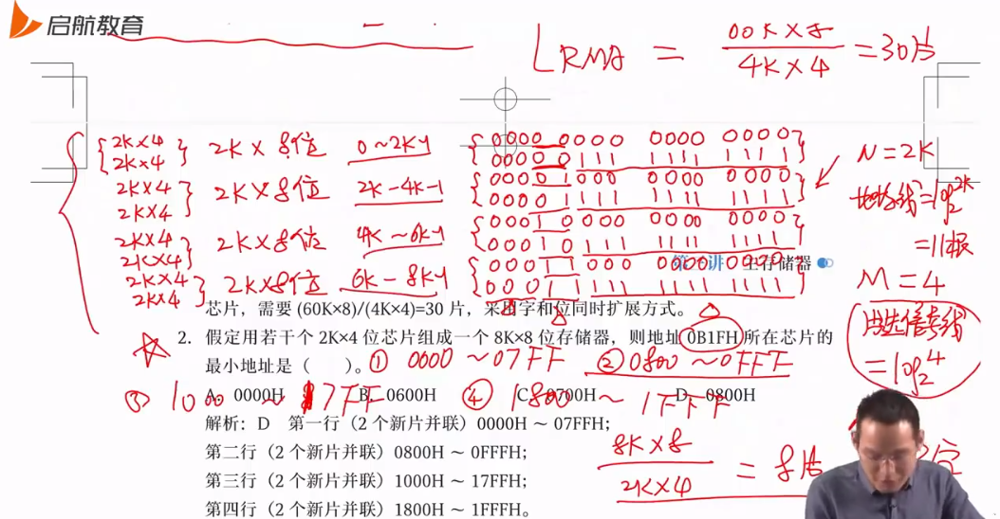
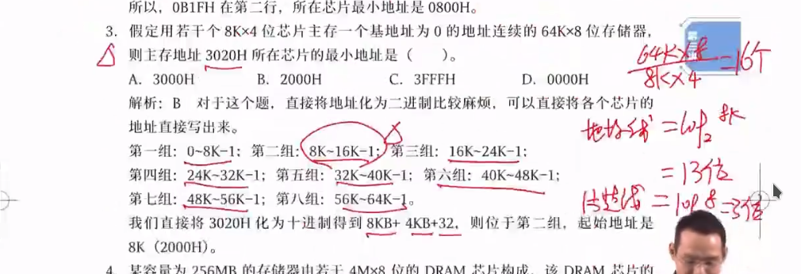

> 主存储器基本概念
> 主存储器构成和工作原理
> 改善存储器性能的途径

## 存储器概述

主存储器（内存）和辅存储器（外存），辅存储器在操作系统文件系统中讲解

考试重点，大题重灾区

### 存储器分类

主存储器

- RAM：SRAM / DRAM
- ROM：MROM / PROM / EPROM / EEPROM

其他存储器

- Flash Memory
- Cache
- 辅助存储器：磁盘、磁带、光盘

RAM(random access memory)，随机存取存储器，储存单元内容可按需随意存取，速度与存储单元的位置无关，断电内容将会丢失（就是电脑内存）

根据存储信息不同，分为静态 SRAM 和动态 DRAM

关于 ROM

- MROM(mask read-only memory)，又称掩模式 ROM，早期 BIOS 放在 MROM 中，其内容是烧录进去的，永远不能再改
- PROM，可编程只读存储器
- EPROM，可擦除只读存储器
- EEPROM，电可擦除只读存储器

按信息的存取方式，存储器可分为：RAM、ROM、SAM 和 DAM

按介质可分为：半导体、磁表面、磁心存储器和光盘存储器

按信息可保存性：易失性和非易失性

- 易失性即断电丢失，如 RAM
- 非易失性即断电不丢失：如 ROM、磁表面、磁心、光盘存储器

破坏性读出：读取的过程中破坏了原有信息形态

再生：如发生破坏性读出，需要立即重新写进去，这一过程叫做再生，典型的如 DRAM

### 存储器系统结构

存储器的三个重要指标：速度、容量和每位价格，速度越快，容量越小，价格越低，反之成立

存储器离 CPU 越近，容量越小，速度越快

Cache-主存层次：通过硬件实现，解决内存速度和 CPU 速度的不匹配问题

主存-辅存层次：实现容量不足问题，其速度接近主存，容量接近辅存

## 半导体随机存储器和只读存储器

构成主存的半导体存储器分为 RAM 和 ROM

RAM 分为静态 S 和动态 D

ROM 根据可编程和可擦除分为 P、EP、EEP 和 FLASH

### SRAM 工作原理

SRAM 存储单元使用双稳态触发器，即六管 MOS 管来记忆信息（0 或 1），通常用于做高速缓冲存储器

优点：其结构简单、稳定、可靠性高、速度较快，在读出时不会破坏原有结构，不需要再生

缺点：占用元件较多，占硅片面积大，功耗大，集成度不搞，同时 SRAM 还是易失性存储器（RAM 就这特点），断电将丢失

### DRAM 工作原理

DRAM 存储单元有三管式和单管式两种，靠电容存储电荷的原理来寄存信息，即电容上有足够电荷表示 1，无电荷表示 0

优点：集成度更高，功耗低，价格便宜

缺点：因为是电容储存电荷，他的读出是破坏性的，需要进行重写；并且，即使不读，也会发生漏电，1-2ms 电荷也会消失，所以每 2ms 内都要进行一次恢复操作，速度较慢

因为需要不断恢复，速度低于 SRAM，一般用于主存储器

### DRAM 刷新

刷新即每隔 2ms 的恢复操作，DRAM 刷新只与行地址有关，因为按行刷新

- 集中刷新：在 2ms 内专门开辟一断时间用于完成刷新，即停止读写进行刷新，整个存取周期分为读写阶段和刷新阶段两段，刷新阶段也称为内存的死亡时间
- 分散刷新：将整个存取周期分为若干个小周期，每个小周期分为读写阶段和刷新阶段，无死亡时间，但读写变慢了，因为相当于每个小周期的存取时间加倍了（刷新一次相当于存取一次）
- 异步刷新：类似于数据库表的行锁定，每行独立进行刷新和读写

DRAM 刷新有一下特点

- 刷新对 CPU 是透明的，不依赖于外部访问
- 按行刷新，只需要行地址
- 不需要选片，因为对所有片进行刷新
- 电容的读出是破坏性的并且电容会自动消散，DRAM 采用读出再立即写入的方式进行刷新

常用结论：RAM 通常用来存储的是应用程序，即正在被使用的程序和数据，可以随机读写（存取）

### 只读存储器

ROM 常用于存储系统程序和固件（出厂时写死的固化硬件，BIOS），断电信息不丢失

- ROM

只能读，不能改

- PROM

可编程只读存储器，可以改，但只能改一次，以熔丝的通和断表示 1/0，刚出厂全连通，可以根据自己需求烧断熔丝把 1 改为 0，显然断了之后就接不上了

- EPROM

可擦可编程只读存储器，以浮动栅 MOS 电路保存信息，使用紫外线擦除，且为整体擦除

- EEPROM

可电擦可编程只读存储器，可以局部擦除，重写次数有限，一般为 10 万次

- FLASH Memory

快速读写存储器，最近的技术，俗称 SD 卡，在 EPROM 和 EEPROM 的基础上发展而来，以块为存储单位

正确说法

- FM 具有 RAM 功能
- FM 具有随机存取功能

错误说法：FM 是随机存储器，随机存储器特指 RAM，但 FM 结构上是 ROM

注意单独说 ROM 的时候，指的就是最原始的只读存储器，而不是其他

### SRAM 和 DRAM

共同点

- 都属于 RAM
- 都属于易失性

| | SRAM | DRAM |
| - | --- | --- |
| 存储信息 | 触发器 | 点容 |
| 破坏性读出 | 否 | 是 |
| 需要刷新 | 否 | 是 |
| 行列地址 | 同时送 | 分两次送 |
| 运行速度 | 快 | 慢 |
| 集成度 | 低 | 高 |
| 发热 | 大 | 小 |
| 存储成本 | 高 | 低 |

如何记忆？因为电容储存

- 集成度高于 MOS 管
- 不连通电路，发热小
- 电容读出会消失，所以读出具有破坏性
- 电容会消散，需要刷新
- 刷新，速度就慢
- 慢，意味着便宜，成本就低

SRAM 反过来就行

注意 SRAM 和 DRAM 的易失性和刷新性区分：SRAM 和 DRAM  在不断电时，所存信息是不易失的；同时 DRAM 还具有刷新性，即使不断电，其信息也在不断变化

## 主存储器与 CPU 的连接和控制

CPU 和主存储器根据数据总线、地址总线还有控制总线进行连接

### CPU 位/字扩展

- 位扩展：当芯片的计数单位小于主存的计数单位，同时计数数量相同

芯片的位扩展：指加大 CPU 字长，当芯片字长小于主存时，通过这种形式达到统一，如芯片字长为 64Kx1，主存位 64Kx8，这时就需要把每八个芯片的同一单元同时输送数据给主存

相当于把连续的 8 个芯片的同位置的计数单元串联，在选择到时统一输出

- 字扩展：芯片数据线位数等于主存数据线位数，但单元数量不够

芯片的字扩展：指通过加片的方式加大每个单位的单元数量，如 16Kx8 到 64Kx8，计数单元够但计数数量不够，于是将四片芯片视作一个单位，通过 2-4 译码器控制，达到 64Kx8
字

通过 2-4 译码器来选片，如 00 选择四片中第一片，01 选择第二片

- 位、字同时扩展

计数单元不够，计数数量也不够，注意一定先扩位，再扩字

### 片选信号的产生

使用高位的地址线去做片选的信号线，低位选择片内的具体单元，如 16Kx4 ——> 64Kx8，共四片，使用 A14/A15 作为片选信号线，A0-A13 作为单元信号线

如何界定这个高位的高？

首先要确定地址线，才能确定高位地址线

- 线选法
$$
地址线 = log_2芯片字长
$$
- 译码片选法（重合法）

$$
地址线 = \frac{1}{2}log_2芯片数量
$$

对于 M x N 位的存储器，用 L x K 位的芯片

- M = L, K < N：位扩
-  L < M, K = N：字扩
- L < M, K < N：位字扩，先扩位再扩字

例题，用 2Kx4 位芯片组成一个 8K 位按字节储存的存储器

- 按字节储存，即位数为 8，即为 8Kx8 位的存储器
- 共需要芯片数量 n = 8x8 / 2x4 = 8 个
- 先位扩，使用两个芯片成一组，构成 2Kx8 位的芯片
- 再字扩，使用四组 2Kx8 位的芯片构成一个 8Kx8 位的存储器 

字和位到底啥关系：字表示该芯片的**地址长度**，位表示每个地址位上二进制的大小。如 2x4K 位，即地址总长为 2K，每个地址上有 4 位二进制位

类比数据库表的横向纵向连接

- 在进行位扩展时，两个 2x4K 位扩展成 2X8K，这里实际上相当于数据库表的横向连接，即行数没变，但列数加倍
- 而字扩展就是在扩展行数，行数增加，而列数没变，但无论哪一种扩展，数据总量其实都在增加

在上述又 2Kx4 位芯片组成的 8Kx8 位存储器中，地址 0B1FH 所在芯片的最小地址为：0800H

对于 NxM 的存储器（log 底数为 2）

- N 为每个芯片组的字长（地址长度）
- M 为存储器芯片的组数

如 2Kx4 组成的 8x8K 存储器，N = 2K，M = 4

|                | SRAM（线选法） | DSAM(重合法) |
| -------------- | -------------- | ------------ |
| 片内地址线个数 | log N          | 1/2 log N    |
| 片选线个数     | log M          | log M        |

一根线对应一位二进制，其中低位为片内地址线，高位为片选线，**二者相邻**，多出来的高位线充当读写线等

这里还注意一个问题，那就是这里的片选信号线个数是对外来说的，懂吗，就像 38 译码器，输入三根线，输出对应八种状态，这里也是一样，片选 3 跟线，对应 8 种输出，向内还要接 8 根线，这 8 根线就是芯片的地址线个数

更简单的判断地址的方法：将给出的 16 进制地址化为十进制，如 0B1FH 化为 十进制为 11x16^2 + 1x16^1 + 15 = 2847，在 2K~4K-1 之间，所以在第二片芯片组中，最低地址为 2K，即约为 0800H

请用第一道例题的解法解第(3)题

对于芯片本身：如一个 4Mx8 位的 DRAM 芯片，其数据线为 log8 = 3 根，地址线为 1/2 log 4M = 22/2 = 11 根

- 这里设计 DRAM 的地址线复用问题，需要除以 2，SRAM 则不用

对于 4Mx8 位的芯片

|         | DRAM | SRAM |
| ------- | ---- | ---- |
| Data    | 8    | 8    |
| Address | 11   | 22   |
| Read    | 1    | 1    |
| Write   | 1    | 1    |
| Slice   | 1    | 1    |

在已知存储器大小，计算单个芯片存储大小时，注意**位**到**字节**的转化，实际上就是一个简单的除法运算，存储器大小除以芯片个数

### 操作数在存储器中的存放方式

