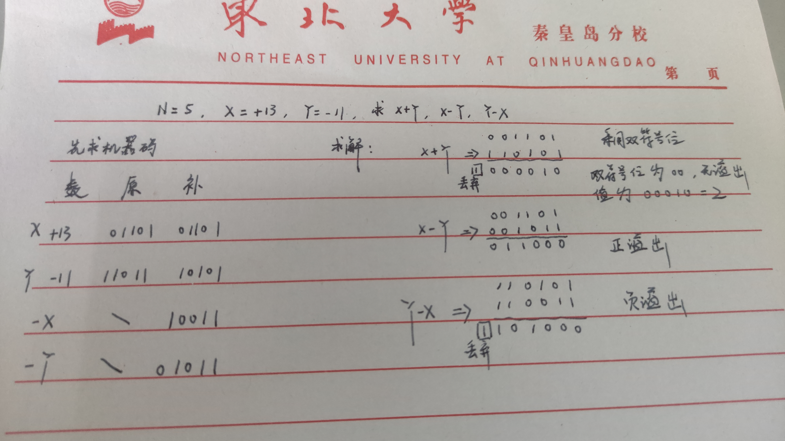

## 计算机组成原理概述

### 计算机系统组成

#### 硬件、软件系统

硬件系统和软件系统共同构成计算机系统，硬件是基础，软件是发挥硬件的条件

硬件系统主要包括：CPU、存储器、输入/输出控制系统

软件系统

- 系统软件：提供无差别服务，如操作系统、实用程序、编译程序等
- 应用软件：不关心，赚钱捏

硬件和软件具有逻辑等价性，即软件能完成的工作硬件也能完成，反之亦然。硬件实现更快，软件的迭代、修改更方便

#### 语言级别

机器语言：代码效率高，执行速度快，硬件可直接执行，可读性差，不易变成，不易维护

汇编语言：可读性较好（助记符），出错便于检查和修改。可移植性差，对程序员要求高，必须十分熟悉计算机硬件结构的配置、指令系统和寻址方式低级语言

- 也叫低级语言

高级语言：接近于自然语言，容易理解和掌握，与硬件无关。效率低，执行速度慢

- 解释型语言：python、js，一行行处理（line by line），一步到位
- 编译型语言：java、c、c++，需要编译器，编译得到目标代码，经过链接器形成链接模块，最后转化成机器语言

### 计算机系统层次结构

#### 划分层次结构

第 0 级机器：完全由硬件组成，是机器的硬件核心

第 1 级机器：根据指令操作所需的控制时序，利用微指令编出的微程序控制数据在寄存器之间传送

第 2 级机器：能运行机器语言的机器，程序员可以在其上编写机器语言程序利用第 1 级的微程序进行解释并运行

第 3 级机器：操作系统机器

第 4 级机器：汇编语言机器

第 5 级机器：高级语言机器

第 6 级机器：应用语言机器

#### 划分层次的意义

解耦计算机功能，硬件做下级，软件做上级

### 存储程序思想与冯诺依曼计算机

#### 存储程序思想

第一台通用计算机 ENIAC 出现于1946年情人节，每秒 5000 次运算，占地 150 平米

冯诺依曼提出存储程序的思想，把程序和数据不加区别的对待，从内存中读数据，都存放在存储器中

并将计算机分成5部分：运算器、控制器、存储器、输入输出设备、控制器

#### 冯诺依曼计算机

根据存储程序的概念和二进制原理设计的电子计算机统称为“冯诺依曼型结构”计算机

特点：

- 由五部分构成
- 程序、数据都在存储器中
- 数据以二进制表示
- 指令由操作码和地址码组成
- 指令在存储器中按执行顺序存放，并能自动执行

二进制简单、二进制稳态器好做，逻辑门电路实现逻辑运算简单

冯诺依曼计算机属于指令流驱动控制，并且属于串行结构，单指令流单数据流

早期，冯计算机以运算器为中心；现代计算机以寄存器为中心

#### 计算机的硬件组成

1、输入设备

2、存储器：用以存放程序和数据，分为内存和外存，CPU只直接读取内存

- 按地址进行存取，参考汇编
- 每个存储单元的大小取决于编址方式

编址方式：

- 比特，存 1/0
- 字节，存 8 个 bit
- 字，也叫 word，往往等于 n 倍的 B，即包含多个字节

这里的字节和字我们称作编址单元

为什么编制单元是字或者字节？

买鸡蛋

- 买200个，按个数
- 买2000个，按盘数
- 买20000个，按箱数

计数单位越大，计数次数越少

寻址时，回去地址寄存器 MAR 去找地址，若存储单位大，地址数量少，MAR 负担就小，反之 MAR 就要大

3、输出设备

4、运算器：执行部件，算数逻辑单元

5、控制器

#### 计算机的指令执行过程

取指令：从内存中寻址取出

分析指令：译码阶段

访存取数阶段：根据指令取出相应数据

执行指令：对数据进行相应操作并得到结果

结果写回阶段

### 计算机性能指标

#### 吞吐率

单位时间内处理请求的数量

#### 响应时间

给了一个请求以后，多久后能响应

#### CPU 时钟周期

主频的倒数，就是主频振动一个来回经历的时间，CPU最小的时间单位，每个动作至少需要一个时钟周期

#### 主频

由硬件决定，时间实际是一种约定（跨年的时候会停一秒左右校正），计算机只能通过石英单晶体的振动来计时，而主频实际上就是振动的频率。也可以理解为每秒中时间周期的个数

主频变高，时钟周期一定会变小，但时钟周期数CPI一定会变多，完成一件事的时间为：事的数量 x 时钟周期数 x 时钟周期

他们是矛盾的，需要结合场景计算

#### CPI

执行一条指令所需的时钟周期数

#### CPU 执行时间

CPU 执行一个程序所花时间

Tcpu = ln x CPI x Tc = ln x CPI x 1/Rc

- ln为指令数
- Rc为主频
- CPI为一条指令所耗时钟周期个数
- Tc为时钟周期长度

很明显可以看出主频越快，所用时间越短

#### MIPS 和 MFLOPS

MIPS：每秒钟指令的执行条数，以百万为单位

MIPS = ln / (Tcpu x 10^6) = 1 / (CPI x Tc x 10^6)

- 带入 Tcpu 的公式

MIPS 用于评价标量机

MFLOPS = 浮点操作次数 / (执行时间 x 10^6)

适用于衡量向量机

### 计算机体系和并行系统

#### 计算机的体系结构

Flynn 分类法，将计算机划分成四种基本类型，M(multi)指多，S指单(single)

- SISD：单指令流单数据流，完全的串行，冯诺依曼机
- MIMD：多指令流多数据流，同时执行多个指令流，指令流可以在单个时钟周期处理多个数据，一定是多核心
- SIMD：单指令流多数据流，现在的单核计算机基本属于该类，能够在单时钟周期内处理多个数据
- MISD：多指令流单数据流，鬼畜

#### 多核处理器

每个CPU是一个独立的处理器，可以有自己独立的cache，也可以共享cache

#### SMP 系统结构

对称多处理器技术，单处理器同时只能处理一个线程，若多线程，CPU数量必须达到多个，SMP技术使得多个CPU可以同时工作

各处理器之间的关系完全对等，共享相同的物理内存

但要注意并不是核越多越好，一味增加内存冲突加剧且CPU浪费增加，SMP利用率最好的情况是2-4个CPU

- 松耦合的多处理技术：早期分布式的雏形
- 紧耦合的多处理技术
- 对称多处理技术

## 数值系统

### 进制系统

#### 其他进制转十进制

基数和权的概念：如
$$
1234.56 = 1\times10^3+2\times10^2+3\times10^1+4\times10^0+5\times10^{-1}+6\times10^-2
$$
其中 1,2,3,4,5,6 叫做基数，10^n 叫做权，基数和权共同表示一个十进制数，若为 R 进制，则把 10 换成 R 即可

这种形式所对应的值为**十进制**的值

#### 十进制转二进制

整数部分采用除 2 取余法，余数序列即为十进制的 2 进制表示，注意最上层是最低位，最下层是最高位，即这个序列是从右往左排的

- 建议直接看出来，如 36 = 32 + 4，直接化为 100100

小数部分采用乘 2 取整法，将小数不断乘以 2，取出其整数位，剩余小数继续乘以 2，直到没有小数位位置，这样取出的整数序列即为该小数对应的 2 进制，注意这里的序列是从左往右排的

- 对于无限循环小数，采用取精度的方式，如

0.1 会化为 00011 的循环，若取 6 位精度，则为 000110，同理若取 4 位精度，则为 0001

#### 二进制转八/十六进制

以小数点为界，每三位 2 进制化为一个 8 进制数，每 4 位转化为一个 16 进制数

| 二 | 八 | 二 | 十六 | 二 | 十六 |
| --- | --- | --- | --- | --- | --- |
| 000 | 0 | 0000 | 0 | 1000 | 8 |
| 001 | 1 | 0001 | 1 | 1001 | 9 |
| 010 | 2 | 0010 | 2 | 1010 | A |
| 011 | 3 | 0011 | 3 | 1011 | B |
| 100 | 4 | 0100 | 4 | 1100 | C |
| 101 | 5 | 0101 | 5 | 1101 | D |
| 110 | 6 | 0110 | 6 | 1110 | E |
| 111 | 7 | 0111 | 7 | 1111 | F |

转化过程遵循整数左补零，小数右补零的原则

### 定点数表示和运算

定点数分为定点整数和定点小数，定点整数是纯整数，定点小数是纯小数，没有整数部分

#### 机器数和真值

真值：以正负号带绝对值来表示一个数的真值

机器数：把符号数字转化为 0/1 码，这样的机器码叫做机器数，分为原码、补码、反码和移码

- 原码

带符号的绝对值表示，最高位 0 为正，1 为负

1. 看正负，定最高位 1/0
2. 加绝对值，将绝对值化为二进制
3. 将符号位和绝对值拼接

将数变为原码是所有变化的第一步

- 反码

正数的反码为本身，负数的反码符号位不变，其余位按位取反，反码不具有任何意义，只是从原码到补码的一种中间状态

- 补码

正数的补码为其本身，负数的补码符号位不变，其余位按位取反并加一

- 移码

只能表示整数，规定最小值为 0，解决数据大小无法直观判断的问题

无论正负，把补码的符号位取反，即为移码

- 无符号数

无符号数的表示：每一位都用于表示数值的大小，即没有符号位，二进制长 n 位的无符号数的十进制表示范围为 0~2^n-1

- 十进制 2^n-1 ——> 二进制 n 个 1
- 对于无符号数，其最小值 -1 为最大值，最大值 +1 等于最小值
  - 最小值 -1 时，从更高位借位，借位标志记为 1
  - 最高值 +1 时，丢弃最高位，剩余位均为 0，进位标志记为 1

无符号数常用于表示内存概念

总结：快速转化

- 对于正数，原 = 反 = 补，符号位为 0，数值位等于其真值
- 对于负数，原码符号位为 1，数值部分等于其绝对值，反码为数值位取反，补码为反码加一
- 关于移码，无论正负，补码符号位取反得其移码
- 关于小数，在对二进制小数进行转化时，可以忽略其小数点，转化后按位加上即可

小技巧：求 36/128 的原码，相当于求 36/2^7 的原码，即先求 36 的原码，再将小数点左移 7 位，得 0.0100100，-36/128 同理，得 1.0100100

注意：0 的表示，+0 和 -0 的原码和反码并不一样，而补码和移码一样

#### 三种机器数的表示范围

> 重点

二进制的比特数为 n+1，范围大小由十进制表示

| 机器码形式 | 整数 | 小数 |
| --------- | --- | ----- |
| 原码 | -(2^n-1), (2^n-1) | -(1-2^-n), (1-2^-n) |
| 补码 | -2^n, (2^n-1) | -1, (1-2^-n) |
| 反码 | -(2^n-1), (2^n-1) | -(1-2^-n), (1-2^-n) |

补码比原、反码范围多一个数，是因为补码的 +0/-0 使用同一二进制表示，多出 100...000

注意整数 -1 和小数 -1 的补码表示并不相同？

#### 移位运算

有符号数的移位称为算术移位，对无符号数的移位称为逻辑移位

左、右移会出现丢失位和空位的问题

- 逻辑移位

对于逻辑移位，即无符号数，左移时，高位丢低位补，右移时，低位丢高位补，以无效位(0)填充空位值

- 算术移位

符号不变，正数补 0；负数原码添 0，反码添 1，补码低位补 0，高位补 1

对于不进位的情况，取反和加一的结果是一样的，补码取反再加一，相当于右边某些位没有改变，相当于原码，而左侧即为反码，所以左移补低位为 0，右移补高位为 1

#### 加减运算

> 补码加减

真正意义上只有加法没有减法，减法能够化为加法

由 [B]补 到 [-B]补 的转化：连同符号位，按位取反再加 1

二进制的加法逐位加即可，但这里涉及到溢出的问题，即运算结果超出合法表示范围

一位符号位：将符号位进位 Cs 和最高位进位 C1 进行异或（不同为 1），结果为 1 则为溢出

双符号位：正数符号 00，负数符号 11，若计算结果中符号位不为 00/11，则发生溢出

- 01 为正溢出
- 10 为负溢出

低位符号位参与移位，高符号位代表真正的符号

丢掉和溢出到底啥区别？

丢掉时直接将多的丢掉，啥也不管

溢出不考虑丢掉的位，考虑保存下的位数，比较最高位进位和符号位进位进行异或，判断是否溢出

小技巧 1：对于负数补码，用最小负数加上数值位即为其真值，如 10011011 = -128+1+2+8+16 = -101，或者化为原码再做判断

小技巧 2：对于补码，无论正负，1 多值大，1 靠左值大，其中 1 靠左优先级更大

### 浮点数表示和运算

定点数是纯整数或纯小数，浮点数指既有小数又有整数的数值，标准表示为：X = M x R^E

- M 是定点小数
- E 是定点整数
- R 是底数，和进制有关，2 或 10

浮点数的一般格式

- k+1 位阶码，其中 1 位符号位，在阶码的最高位，0 为正，1 为负，表示 E
- n+1 位尾数，1 位符号为，n 位数值位，表示 M
