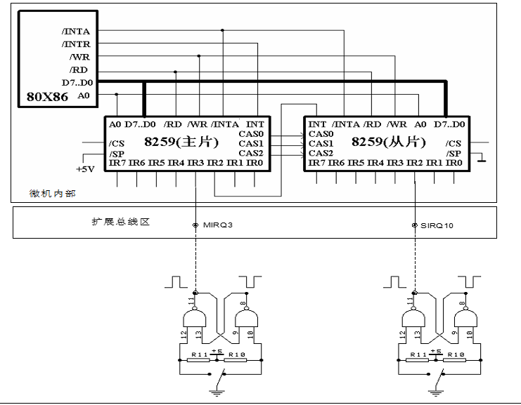
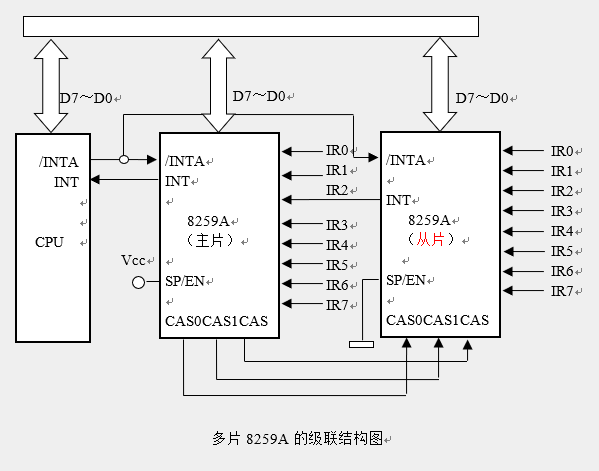
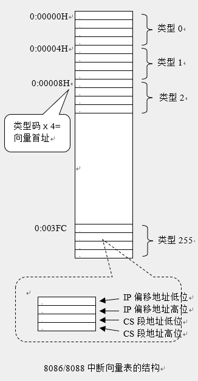
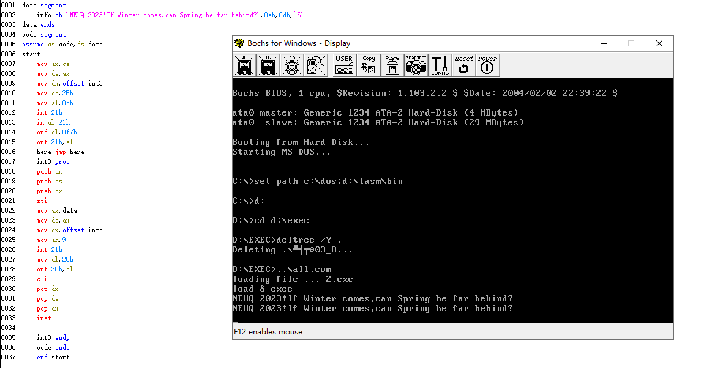

| <center>学院       | <center>计算机与通信工程学院 |
| ------------------ | ---------------------------- |
| <center>**专业**   | <center>**计算机科学与技术** |
| <center>**班级号** | <center>**200523**           |
| <center>**学号**   | <center>**202012143**        |
| <center>**姓名**   | <center>**熊舟桐**           |

## 系统中断实验

### 实验目的

掌握PC机中断处理系统的基本原理

学会编写中断服务程序

实验电路如图，直接用手动产单脉冲作为中断请求信号（只需连接一根导线），要求每按一次开关产生一次中断，在屏幕上显示`NEUQ 2023!If Winter comes,can Spring be far behind?`



### 实验环境

`Tpc-zk-II`集成开发环境

微机原理与接口技术实验箱

### 实验原理

系统上电时，ROM BIOS对8259A的主片和从片要执行初始化命令、惊醒初始化操作



中断向量和中断向量表



CPU 获取中断类型码的方法

- CPU内部中断时，由硬件电路自动提供
- 软中断INT n在指令的代码中提供
- 可屏蔽的外中断INTR通过硬件（8259A）提供

对于 PC/AT 及 286 以上微机内又扩展了一片 8259 中断控制，IRQ2 用于两片 8259 之间级连，对外可以提供 16 个中断源

| 中断源 | 中断类型号 | 中断功能   |
| ------ | ---------- | ---------- |
| IRQ0   | 08H        | 时钟       |
| IRQ1   | 09H        | 键盘       |
| IRQ2   | 0AH        | 保留       |
| IRQ3   | 0BH        | 串行口2    |
| IRQ4   | 0CH        | 串行口1    |
| IRQ5   | 0DH        | 硬盘       |
| IRQ6   | 0EH        | 软盘       |
| IRQ7   | 0FH        | 并行打印机 |
| IRQ8   | 70H        | 实时时钟   |
| IRQ9   | 71H        | 用户中断   |
| IRQ10  | 72H        | 保留       |
| IRQ11  | 73H        | 保留       |
| IRQ12  | 74H        | 保留       |
| IRQ13  | 75H        | 协处理器   |
| IRQ14  | 76H        | 硬盘       |
| IRQ15  | 77H        | 保留       |

### 实验步骤及结果分析

1、连接仪器

插上实验箱电源，`USB`接口连接主机，连接实验箱`总线/MIRQx`和`单脉冲1/正脉冲`，开启实验箱电源，在`Tpc-zk-II集成开发环境`中进行硬件检测

2、编写汇编代码

experiment_one.asm

```assembly
data segment
    info db 'NEUQ 2023!if Winter comes,can Spring be far behind?', 0ah, 0ah, '$'
data ends
code segment
assume cs:code, ds:data
start:
    mov ax,cs
    mov ds,ax
    mov dx,offset int3
    mov ah,25h
    mov al,0bh
    int 21h
    in al,21h
    and al,0f7h
    out 21h,al
here:jmp here
int3 proc
    push ax
    push ds
    push dx
    sti
    mov ax,data
    mov ds,ax
    mov dx,offset info
    mov ah,9
    int 21h
    mov al,20h
    out 20h,al
    cli
    pop dx
    pop ds
    pop ax
    iret
int3 endp
code ends
end start
```

编译运行

3、实验结果

每次按下单脉冲开关将在屏幕上显示



### 实验心得疑问建议

事先检查各种插线是否稳固，如`USB`接口，电路板是否插稳（会亮灯指示），实验前在`IDE`中不要少硬件检测这一步骤，`IDE`对于汇编代码的报错详细到行，认真仔细检查即可

通过本次实验，我基本上掌握PC机中断处理系统的基本原理以及学会编写中断服务程序
