> Integrated Circuit, IC：集成电路，芯片

## 环境配置

### Vivado 安装

[Downloads (xilinx.com)](https://www.xilinx.com/support/download.html)

官网下载安装包，需要登陆注册 AMD 账号（密码要求大小写、特殊字符以及数字）

这里老师强烈推荐版本 2019.2，不知为何，下载安装包后双击安装包运行

一路 continue / next，途中需要输入一次 AMD 账号，选择产品时勾选 VIVADO，Devices 默认即可，安装路径可自定义

总共大小二十多 GB，约需下载安装两个多小时

### Vivado 使用

新建项目或打开项目（.xpr 文件）

新建文件

- 设计代码
- 测试代码

仿真：将需要仿真的测试代码 set as top 后 Run Simulation

仿真设置：设置仿真时间和 log_all_signals

停止仿真：右键 Run Simulation 或叉掉正上方 Simulation 的提示框停止仿真

## 组合逻辑电路设计

### 编码器

将输入的二进制数编为独热码，如 38 编码器，将`000`编码为`00000001`，`001`编为`00000010`，`011`编为`00001000`，`111`编为`10000000`

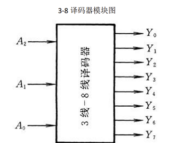

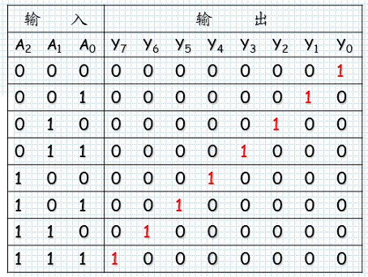

decoder_3_8

```verilog
// 时间精度 timescale
`timescale 1ns / 1ps

module decoder_3_8(
    input [2:0] in,
    output [7:0] out
    );
    // 定义输入输出关系
    assign out[0] = (in==3'd0);
    assign out[1] = (in==3'd1);
    assign out[2] = (in==3'd2);
    assign out[3] = (in==3'd3);
    assign out[4] = (in==3'd4);
    assign out[5] = (in==3'd5);
    assign out[6] = (in==3'd6);
    assign out[7] = (in==3'd7);
endmodule
```

decoder_5_32

```verilog
`timescale 1ns / 1ps

module decoder_5_32(
    input[4:0] in,
    output[31:0] out
    );
    assign out[0] = (in==5'd0);
    assign out[1] = (in==5'd1);
    assign out[2] = (in==5'd2);
    assign out[3] = (in==5'd3);
    assign out[4] = (in==5'd4);
    assign out[5] = (in==5'd5);
    assign out[6] = (in==5'd6);
    assign out[7] = (in==5'd7);
    assign out[8] = (in==5'd8);
    assign out[9] = (in==5'd9);
    assign out[10] = (in==5'd10);
    assign out[11] = (in==5'd11);
    assign out[12] = (in==5'd12);
    assign out[13] = (in==5'd13);
    assign out[14] = (in==5'd14);
    assign out[15] = (in==5'd15);
    assign out[16] = (in==5'd16);
    assign out[17] = (in==5'd17);
    assign out[18] = (in==5'd18);
    assign out[19] = (in==5'd19);
    assign out[20] = (in==5'd20);
    assign out[21] = (in==5'd21);
    assign out[22] = (in==5'd22);
    assign out[23] = (in==5'd23);
    assign out[24] = (in==5'd24);
    assign out[25] = (in==5'd25);
    assign out[26] = (in==5'd26);
    assign out[27] = (in==5'd27);
    assign out[28] = (in==5'd28);
    assign out[29] = (in==5'd29);
    assign out[30] = (in==5'd30);
    assign out[31] = (in==5'd31);
endmodule
```

### 解码器

编码器的反向操作，将独热码解为一个个对应数字，如`10000000`解为`111`

- 三目运算符，优先级逐级下降，若`in[i] == 1`则`out = 3'di`
- `3'd1`表示 3 位的十进制数 1
- `3'b010`表示 3 位二进制数 010，也就是十进制 2 

```verilog
`timescale 1ns / 1ps

module encoder_8_3(
    input [7:0] in,
    output [2:0] out
);
assign out = in[0]?3'd0:
             in[1]?3'd1:
             in[2]?3'd2:
             in[3]?3'd3:
             in[4]?3'd4:
             in[5]?3'd5:
             in[6]?3'd6:
             3'd7;
endmodule
```

### 选择器

五路选择器：根据输入信号`select`在输入信号`in0,in1,in2,in3,in4`中选择一个作为输出

- `sel == 000`则选择`in0`，`sel == 001`则选择`in1`

```verilog
`timescale 1ns / 1ps

module mux5_8a(
    input [7:0] in0 , in1 , in2 , in3 , in4 ,
    input [2:0] sel,
    output [7:0] out
    );
    assign out = (sel == 3'd0)?in0:(sel == 3'd1)?in1:
                 (sel == 3'd2)?in2:(sel == 3'd3)?in3:
                 (sel == 3'd4)?in4:7'd0;
endmodule
```

## 时序逻辑电路设计

### D 触发器

在时钟信号的上升沿触发，使输出等于输入，其余时刻均保持输出不变

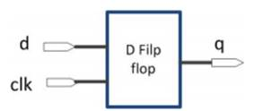

使用 always 关键字捕捉时钟信号 clk 的上升沿 posedge（下降沿为 negedge）

- `<=`为非阻塞赋值，在 always 中通常使用该种赋值方法，需要统一

```verilog
`timescale 1ns / 1ps

// D 触发器（反相器）
module dff(
    input wire d,
    input wire clk,
    output reg q
    );
    always@(posedge clk)begin
        q <= d;
    end
endmodule
```

测试代码

- forever begin end：表示死循环执行
- `#10` 表示延迟 10ns 执行
- `$finish;` 调用内置函数结束本次仿真

```verilog
`timescale 1ns / 1ps
module dff_tb(
    );
    reg clk;
    reg d;
    wire q;
    dff dff1(.clk(clk),.d(d),.q(q));
    initial begin
        clk = 0;
        forever begin
            #10 clk=~clk;
        end
    end
    initial begin
        d = 1;
        forever begin
            #15 d=~d;
        end
    end
    initial begin
        #200 $finish;
    end
endmodule
```

### 带同步复位信号的 dff

多一个输入：复位信号 rst，rst 为 0 时有效，复位信号有效时，D 触发器失效，输出始终为 0

同步指复位信号 rst 的生效时刻和时钟信号同步，均在 clk 的上升沿进行判断并对输出赋值

```verilog
`timescale 1ns / 1ps
module dffSyn(
    input wire d,
    input wire clk,
    input wire reset,
    output reg q
    );
    always @(posedge clk)begin
        if(!reset)begin // 低电平生效，将输出置零
            q<=0;
        end
        else begin
            q<=d;
        end
    end
endmodule
```

测试代码

```verilog
`timescale 1ns / 1ps
module dffSyn_tb(
    );
    reg clk;
    reg d;
    reg reset;
    wire q;
    dffSyn dffSyn1(.clk(clk),.d(d),.reset(reset),.q(q));
    initial begin
        clk = 0;
        forever begin
            #10 clk=~clk;
        end
    end
    initial begin
        d = 1;
        forever begin
            #15 d=~d;
        end
    end
    initial begin
        reset = 1;
        #5
        reset = 0;
        #25
        reset = 1;
    end
    initial begin
        #200 $finish;
    end
endmodule
```

### 带异步复位信号的 dff

复位信号工作在其自身的下降沿，即一旦 rst 从 1 变为 0，此时触发对输出 q 的赋值（赋值为 0）

同时也工作在时钟信号 clk 的上升沿，rst 为 0 时 q 始终为 0，只有当 clk 的上升沿同时 rst = 1 时，输出 q 等于输入 d

```verilog
`timescale 1ns / 1ps
module dffAsyn(
    input wire d,
    input wire clk,
    input wire reset,
    output reg q
    );
    always @(posedge clk or negedge reset)begin
        if(!reset)begin
            q<=0;
        end
        else begin
            q<=d;
        end
    end
endmodule
```

### 带使能端的 dff

没有复位信号，但多了一个使能信号，只有当使能信号为 1（即使能时），D 触发器正常工作，否则不做处理

```verilog
`timescale 1ns / 1ps
module dffEn(
    input wire d,
    input wire clk,
    input wire en,
    output reg q
    );
    always @(posedge clk)begin
        if(en)begin
            q <= d;
        end
     end
endmodule
```

### 32 位除法器


设计代码：div32.v

- temp_a 为被除数的两倍扩展，为了合拍同理要把除数扩展
- temp_a 高 32 位存的余数，低 32 位存的商，运算过程如上图
- 当 temp_a >= temp_b 时，商 1，填补到 temp_a[0]，再整体左移一位，进行下一轮运算，当小于时，商 0 再左移

```verilog
`timescale 1ns / 1ps

module div32(
    input [31:0] a,
    input [31:0] b,
    output [31:0] result,
    output [31:0] remainder
    ); 
    reg[63:0] temp_a;
    reg[63:0] temp_b;
        
    integer i;
    always @ (*) begin
        temp_a = {32'd0, a};
        temp_b = {b, 32'd0};
        for(i = 0; i < 32; i = i+1) begin
            temp_a = temp_a << 1;
            if(temp_a >= temp_b) begin
                temp_a = temp_a - temp_b + 1;
            end
        end
    end
    assign result = temp_a[31:0];
    assign remainder = temp_a[63:32];
endmodule
```

测试代码：div32_tb.v

```verilog
`timescale 1ns / 1ps

module div32_tb(
    );
    reg [31:0] a;
    reg [31:0] b;
    wire [31:0] result;
    wire [31:0] remainder;
    
    div32 div320(a, b, result, remainder);
    
    integer i;
    initial begin
        b = 32'd7;
        for(i = 102; i < 152; i = i+1) begin
            #20
            a = i;
        end
        #1000 $finish;
    end
endmodule
```

## 寄存器设计

### 程序计数器 pc

就是一个指向指令地址的指针，

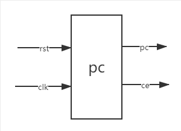

| 序号 | 接口名 | 宽度（bit） | 输入/输出 | 作用               |
| ---- | ------ | ----------- | --------- | ------------------ |
| 1    | rst    | 1           | 输入      | 复位信号           |
| 2    | clk    | 1           | 输入      | 时钟信号           |
| 3    | pc     | 32          | 输出      | 要读取的指令地址   |
| 4    | ce     | 1           | 输出      | 指令存储器使能信号 |

根据时钟信号复位信号**输出当前指令的地址以及使能信号**，将送往取值模块作为取值模块的输入，取值模块根据这个指令地址将指令和使能信号取出指令，作为取值模块的输出

```verilog
`timescale 1ns / 1ps

module pc(
    input wire clk, // 时钟信号
    input wire rst, // 复位信号
    output reg [31:0] pc, // 要读的指令地址
    output reg ce // 使能信号
    );
    
    always@ (posedge clk) begin
        if(rst == 1)begin
            ce <= 0;
        end else begin
            ce <= 1;
        end
    end
    
    // 只有当复位信号无效时，使能信号有效，才给地址赋值，否则为 0
    always@(posedge clk)begin
        if(ce == 0)begin
            pc <= 32'b0;
        end else begin 
            pc <= pc + 4;
        end
    end
endmodule
```

### 宏定义

宏定义：提高代码可读性

- 定义变量：``define a 31:0`
- 引用文件：``include "./defines.v"`

defines.v

```verilog
// 寄存器读写
`define RegAddrBus 4:0
`define RegDataBus 31:0
`define RegNum 31:0
`define RstDisable 0
`define RstEnable 1
`define ZeroWord 32'h0

`define ReadEnable 1
`define ReadDisable 0
`define WriteEnable 1
`define WriteDisable 0

// 取值模块 inst 地址线长度和使能信号
`define InstAddrBus 31:0
`define InstBus 31:0
`define CeDisable 0

`define ZeroRegAddr 5'd0

// 指令 5:0 编号
`define FuncAdd  6'b100000
`define FuncAddu 6'b100001
`define FuncSub  6'b100010
`define FuncSubu 6'b100011
`define FuncSlt  6'b101010
`define FuncSltu 6'b101011
`define FuncAnd  6'b100100
`define FuncOr   6'b100101
`define FuncXor  6'b100110
`define FuncNor  6'b100111
`define FuncZero 6'b000000
`define FuncSll  6'b000000
`define FuncSrl  6'b000010
`define FuncSra  6'b000011
// 算数、逻辑运算
`define OpZero   6'b000000
`define Op1Zero  5'b00000
`define SaZero   5'b00000
`define OpLui    6'b001111

// 操作符地址长度
`define Aluop_OnehotBus 13:0
// 译码结果，操作符
`define AluopAdd  14'b10_0000_0000_0000
`define AluopAddu 14'b01_0000_0000_0000
`define AluopSub  14'b00_1000_0000_0000
`define AluopSubu 14'b00_0100_0000_0000
`define AluopSlt  14'b00_0010_0000_0000
`define AluopSltu 14'b00_0001_0000_0000
`define AluopAnd  14'b00_0000_1000_0000
`define AluopOr   14'b00_0000_0100_0000
`define AluopXor  14'b00_0000_0010_0000
`define AluopNor  14'b00_0000_0001_0000
`define AluopSll  14'b00_0000_0000_1000
`define AluopSrl  14'b00_0000_0000_0100
`define AluopSra  14'b00_0000_0000_0010
`define AluopLui  14'b00_0000_0000_0001
`define AluopZero 14'b00_0000_0000_0000
```

### MIPS 寄存器堆 regfile

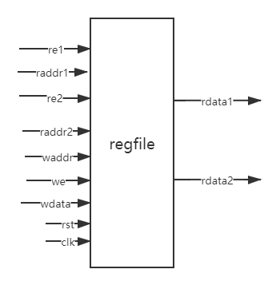

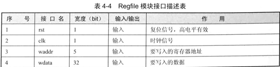

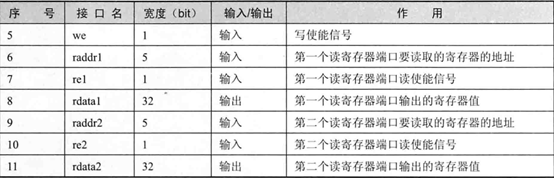

寄存器具有**读/写**两个功能：根据**复位信号**和**时钟信号**开展工作

- 写需要输入写地址、写数据、写使能，共三个端口
- 读需要读地址、读使能，共四个端口
- 寄存器的输出为读出的具体数据，共两个端口

共输入端口 9 个，输出端口 2 个，只有在读的时候，输出端口才有读数据

数据为 32 位，所以需要 5 位地址线进行寻址，于是读写地址均为 5 位，读写数据均为 32 位，使能信号、复位信号以及时钟信号均为 1 位

regfile.v

```verilog
`timescale 1ns / 1ps
`include "./defines.v"

module regfile(
    input wire rst,
    input wire clk,
    
    // 一个写
    input wire[`RegAddrBus] waddr,
    input wire[`RegDataBus] wdata,
    input wire we,
    
    // 两个读
    // 读 1
    input wire[`RegAddrBus] raddr1,
    input wire re1,
    output reg[`RegDataBus] rdata1,
    // 读 2
    input wire[`RegAddrBus] raddr2,
    input wire re2,
    output reg[`RegDataBus] rdata2
    );
    reg[`RegDataBus] regs[`RegNum];
    // 写端口
    always@(posedge clk) begin
        if(rst ==`RstDisable) begin // 当置零端无效时，读写端口才生效
            if((we == `WriteEnable) && (waddr != 0)) begin // 当写端口开启且写地址合法，写入数据
                regs[waddr] <= wdata;
            end
        end 
    end
    // 读端口 1
    always@(*) begin
         if(rst == `RstEnable) begin // 当置零端无效时，读写端口才生效
            rdata1 <= `ZeroWord;
         end else if((re1 == `ReadEnable) && (raddr1 == 0)) begin // 当读地址为 0，返回空数据
            rdata1 <= 32'h0;
         end else if((re1 == `ReadEnable) && (raddr1 == waddr) && (we == 1)) begin // 当读到正在写的端口，直接返回要写入的数据
            rdata1 <= wdata;
         end else if(re1 == `ReadEnable) begin // 当正常读数据，直接返回读地址的数据即可
            rdata1 <= regs[raddr1];
         end else begin
            rdata1 <= 32'h 0;
         end
    end
    // 读端口 2
    always@(*) begin
         if(rst == `RstEnable) begin
            rdata2 <= `ZeroWord;
         end else if((re2 == `ReadEnable) && (raddr2 == 0)) begin
            rdata2 <= 32'h0;
         end else if((re2 == `ReadEnable) && (raddr2 == waddr) && (we == 1)) begin
            rdata2 <= wdata;
         end else if(re2 == `ReadEnable) begin
            rdata2 <= regs[raddr2];
         end else begin
            rdata2 <= 32'h 0;
         end
    end
endmodule
```

## 指令存 / 取

### 指令存储器 inst_rom

指令存储器，指令将存在这个模块的`reg [31:0] inst_mem[0:127]`中，这是一个长度为 128 的指令数组，每个指令长度为 32 位，最多可以存 128 条指令

存储器接受取值地址和一个使能信号，返回（输出）地址下标处对应的指令

| 序号 | 接口名 | 宽度（bit） | 输入/输出 | 作用             |
| ---- | ------ | ----------- | --------- | ---------------- |
| 1    | ce     | 1           | 输入      | 使能信号         |
| 2    | addr   | 32          | 输入      | 要读取的指令地址 |
| 3    | inst   | 32          | 输出      | 读出的指令       |

inst_rom.v

- 通过`$readmemh(path, reg)`函数将路径 path 的文件内容读入信号 reg 中，以此来初始化存储器指令内容
- 只有当使能信号为 1 时，能够正常取值，即令输出`inst = inst_mem[addr[31:2]]`

```verilog
`timescale 1ns / 1ps
`include "./defines.v"

module inst_rom(
    input wire ce,
    input wire [`InstAddrBus] addr,
    output reg [`InstBus] inst
    );
    reg [`InstBus] inst_mem[0:127];
    
    initial begin
        $readmemh("C:/File/vivado/inst_rom.data", inst_mem);
    end
    
    always@(*) begin
        if(ce == `CeDisable) begin
            inst <= `ZeroWord;
        end else begin
            inst <= inst_mem[addr[31:2]];
        end
    end
endmodule
```

### 取值模块 inst_fetch

将 pc 和指令存储器 inst_rom 耦合，即把 pc 的输出（取值地址和使能信号）作为 inst_rom 的输入（取值地址和使能信号），统一输出一条 pc 从 inst_rom 取出来的 32 位指令 inst_o

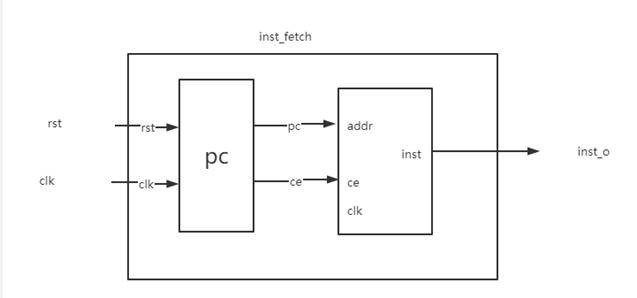

inst_fetch.v：通过内部实例化将 pc 和 inst_rom 耦合在一起

```verilog
`timescale 1ns / 1ps
`include "defines.v"

// 将 pc 模块和 inst_mem 通过内部实例化相连接。形成大的 inst_fetch 模块
module inst_fetch(
    input wire clk,
    input wire rst,
    output wire [`InstBus] inst_o
    );
    // 内部信号通过pc的输出，inst_rom的输入相连接
    wire [`InstAddrBus]pc;
    wire ce;
    pc pc0(.ce(ce), .clk(clk), .pc(pc), .rst(rst));
    inst_rom inst_rom0(.ce(ce), .addr(pc), .inst(inst_o));
endmodule
```

测试代码：inst_fetch_tb.v

```verilog
`timescale 1ns / 1ps

module inst_fetch_tb(
    );
    reg rst;
    reg clk;
    wire [`InstBus] inst_o;
    inst_fetch inst_fetch0(.rst(rst),.clk(clk),.inst_o(inst_o));
    
    initial begin
        clk = 1;
        forever  #10 clk = ~clk;
    end
    
    initial begin
        rst = 0;
        #10 rst = 1;
        #100 rst = 0;
        #500 $finish;
    end
endmodule
```

## 译码器 ID

译码器，也叫 id，负责**进一步处理取值模块和寄存器的输出**，接收取值模块输出的指令和寄存器两个读出的数据，处理成供运算器 alu 处理的多个信号数据

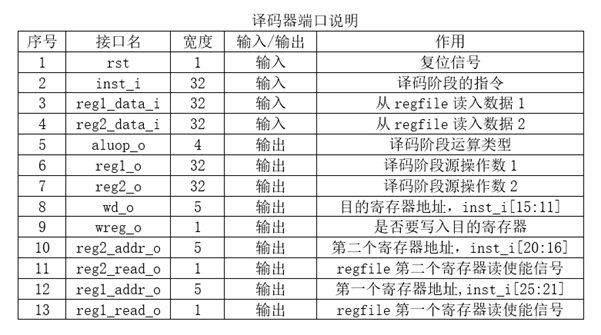

其中

- 输入 inst_i 即为取值模块 inst_fetch 的输出，即从存储器取出的一条指令
- reg1_data_i 和 reg2_data_i 为寄存器 regfile 的两个输出，为从寄存器里读出的两个数据

译码器 id 将处理这条从取值模块传来的指令 inst_i，解析出

- 第一个寄存器地址 reg1_addr_o 及其读使能信号 reg1_read_o
- 第二个寄存器地址 reg2_addr_o 及其读使能信号 reg2_read_o 
- 目的寄存器地址 wd_o 及其写使能信号 wreg_o
- 指令算术运算类型 aluop_o

同时 id 处理从寄存器传来的读数据 reg1_data_i 和 reg2_data_i，令 id 的操作数输出 reg1_o 和 reg2_o 分别等于这两个读数据（将送入运算器进行算术操作），此外，译码器的工作受复位信号 rst 影响

译码器的输出一部分将送到运算器 alu（操作数、操作符、写地址和写使能），另一部分送往寄存器 regfile（读地址和读使能）

id.v

- 运算类型 aluop_o 以独热码的形式存储，共 14 条指令，所以需要 14 位信号进行存储
- 这里用到 6-64 位和 5-32 位编码器（decoder）对指令 inst_i 中的各个分段进行解析

```verilog
`timescale 1ns / 1ps
`include"./defines.v"

module id(
    input wire rst,
    input wire[`InstBus] inst_i,        // 指令  
    input wire[`RegDataBus]reg1_data_i, // 输入操作码1
    input wire[`RegDataBus]reg2_data_i, // 输入操作码2
    output wire[`Aluop_OnehotBus]aluop_o, // 指令类别，用独热码存
    output wire[`RegDataBus]reg1_o, // 就是输入的 reg1_data_i
    output wire[`RegDataBus]reg2_o, // 输入的 reg2_data_i
    output wire[`RegAddrBus]wd_o,   // 目的写寄存器地址
    output wire wreg_o,             // 写权限
    output wire[`RegAddrBus]reg1_addr_o,    // 读寄存器地址1
    output wire[`RegAddrBus]reg2_addr_o,    // 读寄存器地址2
    output wire reg1_read_o,        // 读权限1
    output wire reg2_read_o         // 读权限2
    );
    // 先用四个解码器解析 32 位指令，获取操作数、指令以及目的地址
    wire[5:0] op;
    wire[4:0] op1;
    wire[4:0] sa;
    wire[5:0] func;
    wire[63:0] op_d;
    wire[31:0] op1_d;
    wire[31:0] sa_d;
    wire[63:0] func_d;
    assign op = inst_i[31:26]; // 运算数 1
    assign op1 = inst_i[25:21]; // 运算数 2
    assign sa = inst_i[10:6];
    assign func = inst_i[5:0]; // 运算类型
    decoder_6_64 dec0(.in(op) , .out(op_d));
    decoder_5_32 dec1(.in(op1) , .out(op1_d));
    decoder_6_64 dec2(.in(sa) , .out(sa_d));
    decoder_5_32 dec3(.in(func) , .out(func_d));
    // 独热码分辨 14 种不同指令
    wire inst_add;
    wire inst_addu;
    wire inst_sub;
    wire inst_subu;
    wire inst_slt;
    wire inst_sltu;
    wire inst_and;
    wire inst_or;
    wire inst_xor;
    wire inst_nor;
    wire inst_sll;
    wire inst_srl;
    wire inst_sra;
    wire inst_lui;
    assign inst_add = op_d[`OpZero]&&sa_d[`SaZero]&&func_d[`FuncAdd];
    assign inst_addu = op_d[`OpZero]&&sa_d[`SaZero]&&func_d[`FuncAddu];
    assign inst_sub = op_d[`OpZero]&&sa_d[`SaZero]&&func_d[`FuncSub];
    assign inst_subu = op_d[`OpZero]&&sa_d[`SaZero]&&func_d[`FuncSubu];
    assign inst_slt = op_d[`OpZero]&&sa_d[`SaZero]&&func_d[`FuncSlt];
    assign inst_sltu = op_d[`OpZero]&&sa_d[`SaZero]&&func_d[`FuncSltu];
    assign inst_and = op_d[`OpZero]&&sa_d[`SaZero]&&func_d[`FuncAnd];
    assign inst_or = op_d[`OpZero]&&sa_d[`SaZero]&&func_d[`FuncOr];
    assign inst_xor = op_d[`OpZero]&&sa_d[`SaZero]&&func_d[`FuncXor];
    assign inst_nor = op_d[`OpZero]&&sa_d[`SaZero]&&func_d[`FuncNor];
    assign inst_sll = op_d[`OpZero]&&op1_d[`Op1Zero]&&func_d[`FuncSll];
    assign inst_srl = op_d[`OpZero]&&op1_d[`Op1Zero]&&func_d[`FuncSrl];
    assign inst_sra = op_d[`OpZero]&&op1_d[`Op1Zero]&&func_d[`FuncSra];
    assign inst_lui = op_d[`OpZero]&&op1_d[`Op1Zero];
    assign aluop_o = (rst == `RstEnable) ? 14'b0 :
        {
            inst_add,
            inst_addu,
            inst_sub,
            inst_subu,
            inst_slt,
            inst_sltu,
            inst_and,
            inst_or,
            inst_xor,
            inst_nor,
            inst_sll,
            inst_srl,
            inst_sra,
            inst_lui
         };
    assign reg1_addr_o = (rst == `RstEnable) ? `ZeroRegAddr : inst_i[25:21];
    assign reg2_addr_o = (rst == `RstEnable) ? `ZeroRegAddr : inst_i[20:16];
    assign reg1_read_o = (rst == `RstEnable) ? `ReadDisable : !(inst_sll || inst_srl || inst_sra || inst_lui);
    assign reg2_read_o = (rst == `RstEnable) ? `ReadDisable : !(inst_lui);
    wire[`RegDataBus]imm;
    assign imm = rst ? `ZeroWord : 
        (inst_lui ? {inst_i[15:0],16'b0} : {27'b0,inst_i[10:6]});
    assign reg1_o = rst ? `ZeroWord :
        (reg1_read_o ? reg1_data_i : imm);
    assign reg2_o = rst ? `ZeroWord : 
        (reg2_read_o ? reg2_data_i : imm);
    assign wd_o = rst ? `ZeroRegAddr : 
        (inst_lui ? inst_i[20:16] : inst_i[15:11]);
    assign wreg_o = rst ? `WriteDisable : `WriteEnable;
endmodule
```

测试代码：id_tb.v

```verilog
`timescale 1ns / 1ps

module id_tb(
    );
    reg rst;
    reg[`InstBus]inst_i;
    reg[`RegDataBus]reg1_data_i;
    reg[`RegDataBus]reg2_data_i;
    wire[`Aluop_OnehotBus]aluop_o;
    wire[`RegDataBus]reg1_o;
    wire[`RegDataBus]reg2_o;
    wire[`RegAddrBus]wd_o;
    wire wreg_o;
    wire[`RegAddrBus]reg1_addr_o;
    wire[`RegAddrBus]reg2_addr_o;
    wire reg1_read_o;
    wire reg2_read_o;
    id id0(rst,inst_i,reg1_data_i,reg2_data_i,aluop_o,reg1_o,reg2_o,wd_o,wreg_o,reg1_addr_o,reg2_addr_o,reg1_read_o,reg2_read_o);
    reg[`InstBus]inst_mem[0:127];
    initial begin
        $readmemh("C:/File/vivado/inst_rom.data" , inst_mem);
    end
    integer i;
    initial begin
        rst = `RstEnable;
        #50;
        rst = `RstDisable;
        reg1_data_i = 32'h12345678;
        reg2_data_i = 32'h87654321;
        for(i = 0 ; i <= 20 ; i = i+1)begin
            inst_i = inst_mem[i];
            #20;
        end
        #50 $finish;
    end
endmodule
```

## 运算器 ALU

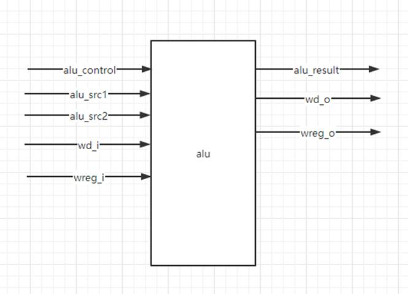

运算器接受从译码器传过来的两个操作数和操作符，计算出结果 alu_result，同时接收译码器传来的写地址和写使能，最终将输出计算结果、写地址以及写使能，送往寄存器 regfile，作为其输入

```verilog
`timescale 1ns / 1ps
`include"defines.v"

module alu(
    input wire[31:0]alu_src1, // 第一个操作数
    input wire[31:0]alu_src2, // 第二个操作数
    input wire[13:0]alu_control,    // 操作码
    input wire[4:0]wd_i, //写地址
    input wire wreg_i,  //写使能
    output reg[31:0]alu_result, // 运算结果
    output wire[4:0]wd_o, // 写地址
    output wire wreg_o // 写使能
    );
    assign wd_o = wd_i;
    assign wreg_o = wreg_i;
    wire[`RegDataBus]alu_src2_mux;
    wire[`RegDataBus]result_sum;
    wire[`RegDataBus]result_slt;
    assign alu_src2_mux = ((alu_control == `AluopSub) || (alu_control == `AluopSubu) || (alu_control == `AluopSlt))?
                            (~alu_src2 + 1) : alu_src2;
    assign result_sum = alu_src1 + alu_src2_mux;
    assign result_slt = (alu_src1[31] && !alu_src2[31]) ||
                        (!alu_src1[31] && !alu_src2[31] && result_sum[31]) ||
                        (alu_src1[31] && alu_src2[31] && result_sum[31]);
    always @(*)begin
        case(alu_control)
            `AluopAdd,`AluopAddu,`AluopSub,`AluopSubu:begin
                alu_result = result_sum;
            end
            `AluopSlt:begin
                alu_result = result_slt;
            end
            `AluopSltu:begin
                alu_result = (alu_src1 < alu_src2);
            end
            `AluopAnd:begin
                alu_result = alu_src1 & alu_src2;
            end
            `AluopOr:
                alu_result = alu_src1 | alu_src2;
            `AluopXor:
                alu_result = alu_src1^alu_src2;
            `AluopNor:
                alu_result = ~(alu_src1^alu_src2);
            `AluopSll:
                alu_result = alu_src2 << alu_src1[4:0];
            `AluopSrl:
                alu_result = alu_src2 >> alu_src1[4:0];
            `AluopSra:
                alu_result = ({32{alu_src2[31]}} << (6'd32 - {1'b0,alu_src1[4:0]})) | 
                (alu_src2 >> alu_src1[4:0]);
            `AluopLui:
                alu_result = alu_src2;
            default:
                alu_result = `ZeroWord;
        endcase
    end
endmodule
```

测试代码

```verilog
`timescale 1ns / 1ps
module alu_tb(
    );
    reg [31:0]alu_src1;
    reg [31:0]alu_src2;
    reg [13:0]alu_control;
    reg [4:0]wd_i;
    reg wreg_i;
    wire [31:0]alu_result;
    wire [4:0]wd_o;
    wire wreg_o;
    alu alu0(alu_src1,alu_src2,alu_control,wd_i,wreg_i,alu_result,wd_o,wreg_o);
    integer i;
    integer j;
    initial begin
        alu_control = 14'b00_0000_0000_0001;
        alu_src1 = 32'h0101_0101;
        alu_src2 = 32'h1010_1010;
        wreg_i = 1;
        wd_i = 5'd10;
        for(i = 0 ; i < 14 ; i = i + 1)begin
            $monitor("alu_control = %b,alu_src1 = %h,alu_src2 = %h,alu_result = %h",
            alu_control,alu_src1,alu_src2,alu_result);
            #20;
            alu_control = alu_control << 1;
        end
        $finish;
    end
endmodule
```

## 单周期 CPU

### single_cycle_cpu

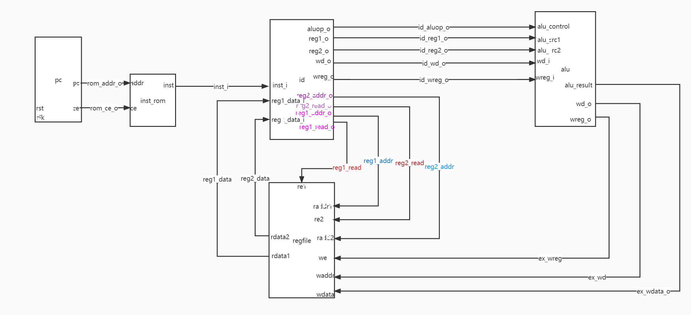

在这里的 singlecycle_cpu 实际上并没有包含 inst_rom，上图只是展示了单周期 CPU 的工作流程，在实际操作时，指令寄存器以外接的方式接入 singlecycle_cpu，如之后的 SOPC

singlecycle_cpu.v

```verilog
`timescale 1ns / 1ps
`include "./defines.v"

module singlecycle_cpu(
    input wire rst,
    input wire clk,
    input wire[`InstBus] inst_i,
    output wire rom_ce_o,
    output wire[`InstAddrBus]rom_addr_o
    );
    pc pc0(rst,clk,rom_addr_o,rom_ce_o);
    
    wire[`RegDataBus]reg1_data;
    wire[`RegDataBus]reg2_data;
    wire[`Aluop_OnehotBus]id_aluop_o;
    wire[`RegDataBus]id_reg1_o;
    wire[`RegDataBus]id_reg2_o;
    wire[`RegAddrBus]id_wd_o;
    wire id_wreg_o;
    wire[`RegAddrBus]reg1_addr;
    wire[`RegAddrBus]reg2_addr;
    wire reg1_read;
    wire reg2_read;
    id id0(rst,inst_i,reg1_data,reg2_data,id_aluop_o,id_reg1_o,id_reg2_o,
            id_wd_o,id_wreg_o,reg1_addr,reg2_addr,reg1_read,reg2_read);
    
    wire[`RegAddrBus]ex_wd;
    wire[`RegDataBus]ex_wdata_o;
    wire ex_wreg;
    regfile regfile0(rst,clk,ex_wd,ex_wdata_o,ex_wreg,reg1_addr,reg1_read,reg1_data,
                        reg2_addr,reg2_read,reg2_data);
    alu alu0(id_reg1_o,id_reg2_o,id_aluop_o,id_wd_o,id_wreg_o,ex_wdata_o,ex_wd,ex_wreg);
    
endmodule
```

### SOPC

SOPC：System on programmable chip

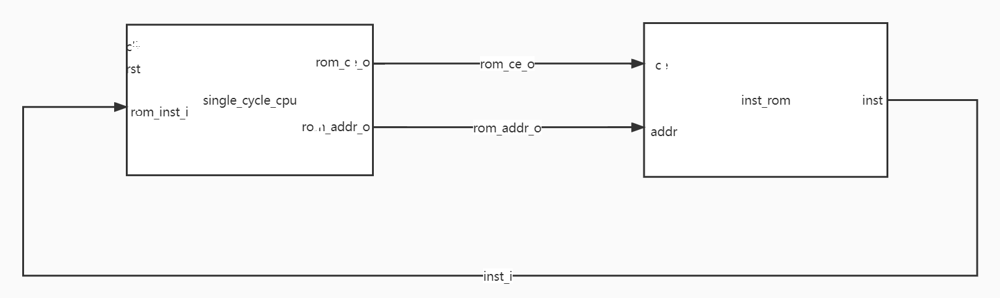

将 inst_rom 接入单周期 CPU，完成闭环

mips_sopc.v

```verilog
`timescale 1ns / 1ps
`include "./defines.v"

module mips_sopc(
    input wire clk,
    input wire rst
    );
    wire rom_ce;
    wire[`InstAddrBus]inst_addr;
    wire[`InstBus]inst;
    singlecycle_cpu singlecycle_cpu0(rst,clk,inst,rom_ce,inst_addr);
    inst_rom inst_rom0(rom_ce,inst_addr,inst);
endmodule
```

测试代码：mips_sopc_tb.v

```verilog
`timescale 1ns / 1ps
module mips_sopc_tb(
    );
    reg clk;
    reg rst;
    mips_sopc mips_sopc0(clk,rst);
    initial begin
        rst = 1;
        #100;
        rst = 0;
        #1000 $finish;
    end
    initial begin
        clk = 1'b0;
        forever #10 clk = ~clk;
    end
    
endmodule
```

