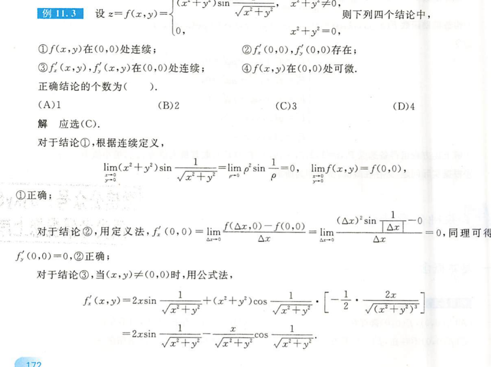
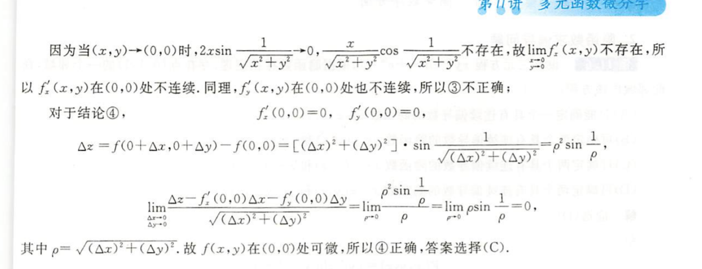
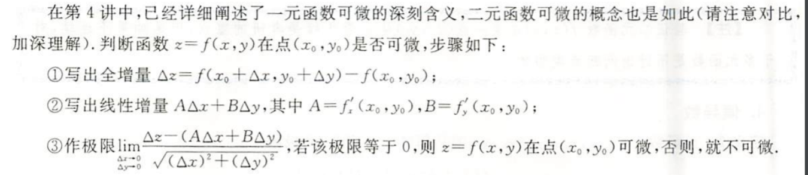
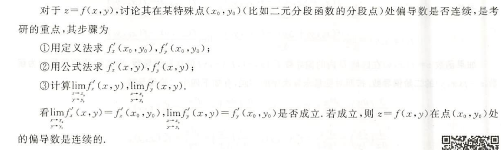
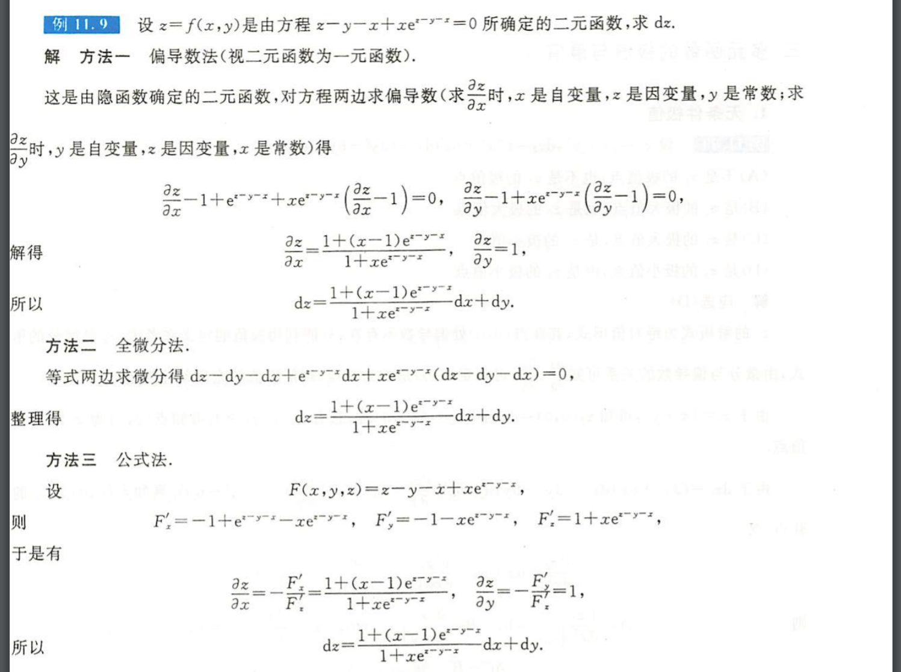

## 多元函数积分学

##### 第一题

​	对于此题，考察多元函数的连续性，多元函数的偏导数存在判断，多元函数偏导数连续判断，多元函数是否可微判断。

​	其中判断是否可微可根据下面方法

​	判断偏导数是否连续可根据下面方法

​		对于偏导数连续，有一系列很重要的性质：

- 一阶偏导数连续==>>多元函数可微
- 多元函数可微可以推出==>> 偏导数存在且连续
- 多元函数连续==>>多元函数极限存在

##### 第二题

对于隐函数求偏导或者求微分一般有上图的三种方法

- 偏导数法 其实就是链式求导法则

- 全微分法  这个利用了全微分形式不变性
  $$
  dz=\frac{\partial z}{\partial u}du +\frac{\partial z}{\partial v}dv=\frac{\partial z}{\partial x}dx+\frac{\partial z}{\partial y}dy
  $$

- 公式法 感觉对于此题最容易解决，应该熟练掌握。

