> 原函数和不定积分的概念，不定积分的基本性质，基本积分公式，定积分的概念和基本性质，定积分中值定理，积分上限的函数及其导数，牛顿-莱布尼茨（Newton - Leibniz）公式，不定积分和定积分的换元积分法与分部积分法，反常(广义)积分，定积分的应用(平面图形的面积、平面曲线的弧长、旋转体的体积及侧面积、平行截面面积为已知的立体体积、功、引力、压力、质心、形心等)，函数的平均值
>
> 有理函数、三角函数的有理式和简单无理函数的积分

## 不定积分与定积分概念性质

### 原函数、不定积分和定积分

主要涉及一个原函数到导函数的转换问题，也就是微分、积分、导数的转换
$$
dy = y'dx \\
\int dy = \int y'dx = y+C \\
\int f(x)\,dx = \int dF(x) = F(x) + C 
$$
然后是定积分的连续性
$$
\int_a^b f'(x)dx = \int_a^c f'(x)dx + \int_c^b f'(x)dx
$$
通过导数大小，可以判断同区间内不同函数定积分的大小（定积分大小取决于高度差和跨度，同区间跨度相同，高度差取决于函数变化快慢，导数越大，原函数变化越快，自然高度差越大，定积分越大）
$$
f'(x) \geq g'(x) \Rightarrow \int_a^b f'(x)dx \geq \int_a^b g'(x)dx
$$
这里可以加入中间函数对不同导数进行一个判断，如在`0-π/2`之间判断`sin(sinx) / cos(sinx)`，可以明确的是在这一区间内，`x > sinx`（相减求最值）

- 因为`sint`在区间内递增，`x`和`sinx`作为自变量`t`，前者更大，由于递增，自然`sin(sinx) < sinx`
- 又因为`cost`在区间内递减，`x`和`sinx`作为自变量，前者更大，由于递减，所以`cos(x) < cos(sinx)`

我们分别求出`sinx`和`cosx`的定积分（基础积分），均为 1，则有`sin(sinx) < 1 < cos(sinx)`
，作为导数，后者在区间内始终大于前者，自然其定积分也更大，判断完毕

### 变限积分

一类很重要的定积分，其积分上或下界为自变量`x`的定积分，会积出一个原函数加减一个原函数值的形式，对这个定积分重新求导会得到原导函数
$$
\int_a^xf(t)dt = F(x)-F(a)\\
[F(x)-F(a)]' = f(x)
$$
积分中值定理
$$
\exist\,\xi \in (a,b) \,使得\, f(\xi) = \frac{\int_a^bf(x)dx}{b-a}
$$
即：在区间`(a,b)`内始终存在一点函数值等于其函数均值

## 不定积分与定积分计算

### 基本积分公式

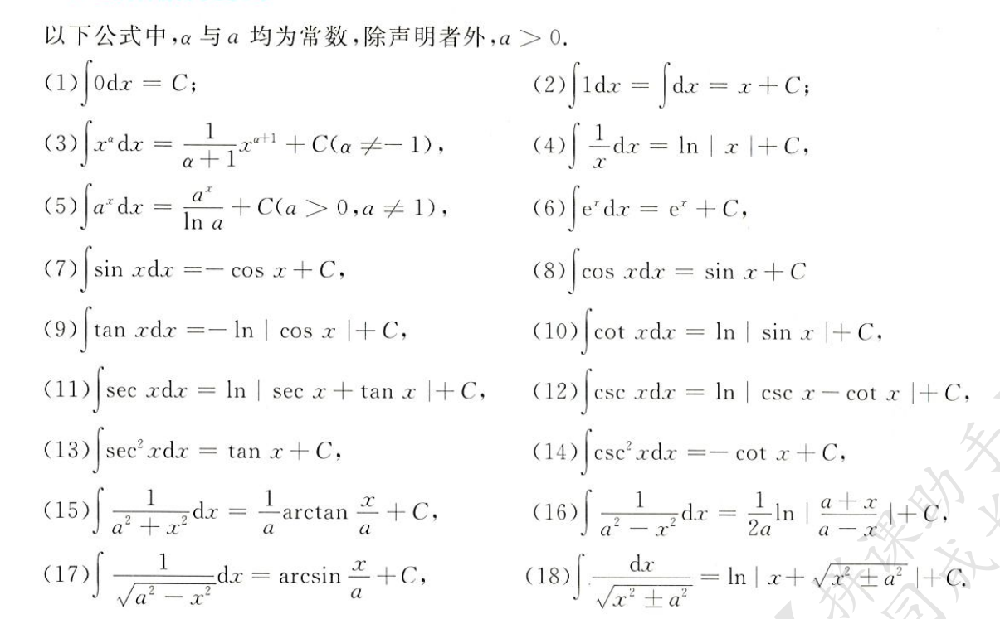

### 基本积分方法

> 换元法

第一类换元法（凑微分法）：将 d 左边的项积分化到 d 右边，并将其试做一个整体 u 对剩下部分进行积分

第二类换元法（换元积分法）：将 d 右边的项，如 x 化为 log t，同样的要将 d 左边的 x 进行替换，然后将 log t 微分，d 右边仅保留 t（即 dt，对 t 进行积分）

常见几种典型类型的换元法

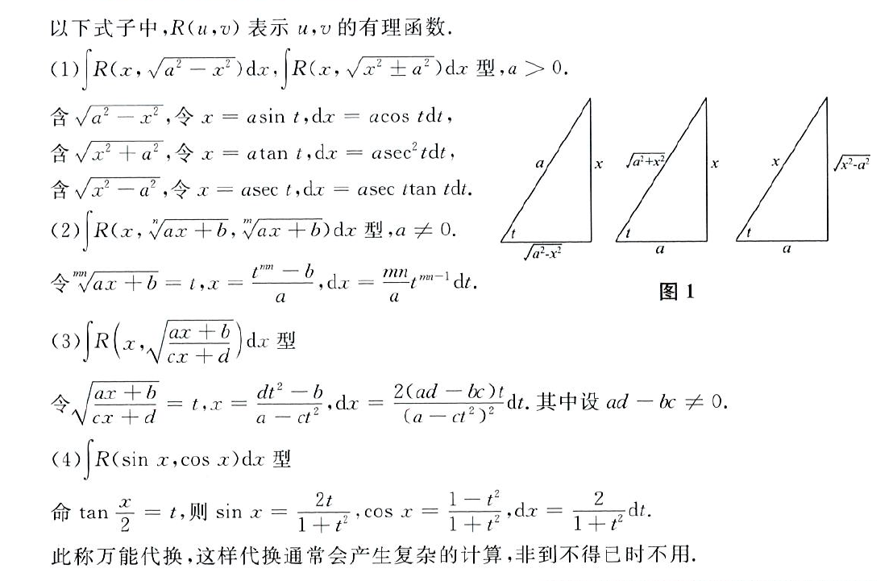

万能代换
$$
令\,tan\frac{x}{2} = t \Rightarrow sinx = \frac{t}{1+t^2}\,\,,\,\, cosx = \frac{1-t^2}{1+t^2}\\
dx = 2d(arctant) = \frac{2}{1+t^2}dt
$$
定积分的换元积分：就是`第二类换元法 ＋ 第一类换元法 ＋ 牛顿莱布利兹公式`求解定积分

牛顿莱布利兹公式
$$
\int _a^bf(x)dx = F(a)-F(b)
$$
分部积分法
$$
\int u(x)dv(x) = u(x)v(x) - \int v(x)du(x)
$$

几个好用的定积分公式

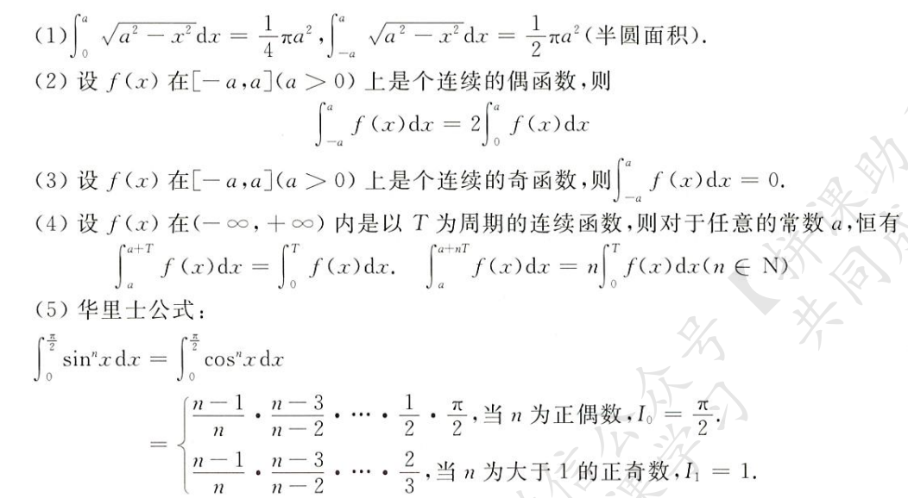

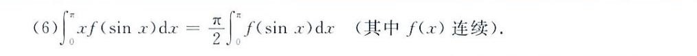

## 反常积分及其计算

### 反常积分

对于定积分，若上下界至少有一个为无穷，则称该积分为无穷区间上的反常积分

- 若自变量趋于无穷时，被积函数极限值存在，则称该反常积分收敛
- 若极限值不存在，即被积函数函数值趋于无穷，则称其发散

瑕积分：对于被积函数`f(x)`若其在`x=a`处发散（即函数值趋于无穷），对该函数进行定积分时上下界包含了 a 点，则该积分为瑕积分，也是一种反常积分

- 当`lim f(a) = 无穷`时，该瑕积分发散；若为常数，则收敛
- 点 a 也被称作瑕积分 f(x) 的奇点

### 对称区间上奇偶函数的反常积分

一定要注意这里奇偶函数反常积分的规律都是建立在收敛的基础上，一旦发散，各种规律将不存在，一定要先判断反常积分的收敛性

一个误解：对于偶函数`f(x)`，`F(+∞) - F(-∞) != 0`，一定不能有这种幻觉，这显然是不对的，因为`+∞ + 1 = +∞`，你无法对其划等号
$$
\int _{-∞}^{+∞} 2xdx = x^2 |_{-∞}^{+∞} = 0
$$
一个重要的反常积分
$$
\int_{-∞}^{+∞} e^{-x^2} = \sqrt{\pi}
$$

## 定积分的应用

> 物理题

### 基本方法

就是微分法：要求某个量的积量（积分），如`w`，首先找他的微分，即`dw`，然后在给定区间上对`dw`进行积分求值，即为微分法

### 重要几何公式和物理应用

> 平面图形面积

极坐标系下，自变量为角度，因变量为线段长度

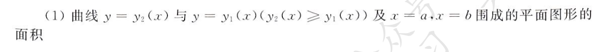

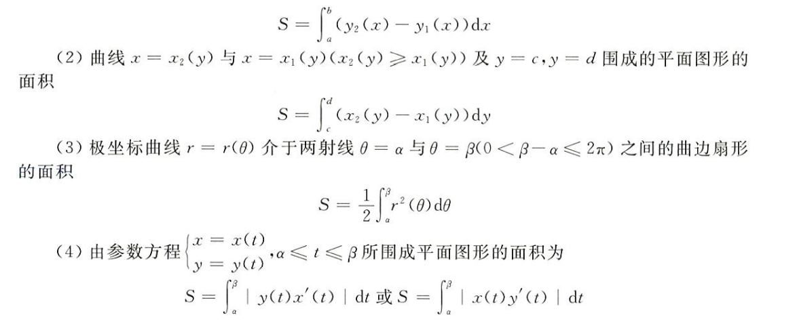

> 旋转体体积

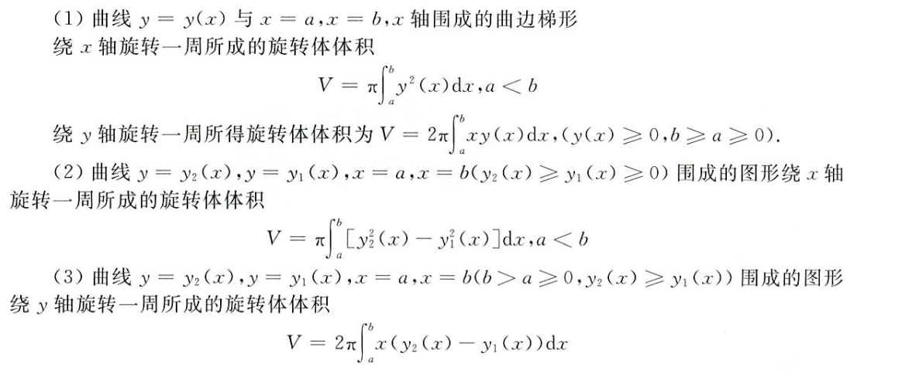

> 函数的平均值

将函数在区间内视作一个长方形，长为区间长度，平均值即为其平均宽度
$$
f_均 = \frac{\int_a^bf(x)dx}{b-a}
$$

> 已知横截面积求体积

就是对截面积分，求得体积
$$
V = \int_a^bS(x)dx
$$

> 平面曲线的弧长

已知弧长公式，就是加了一个定积分，注意极坐标系下的公式

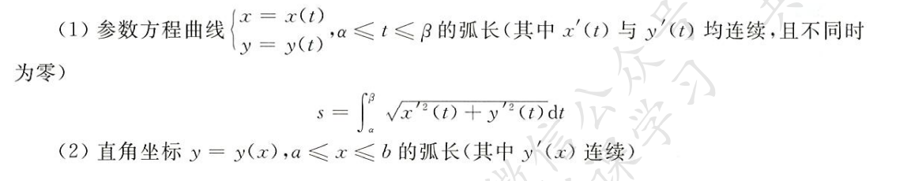

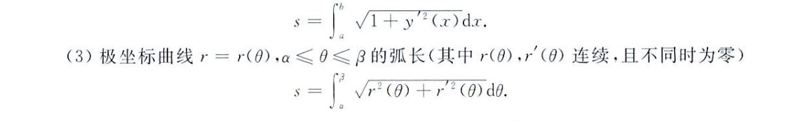

> 旋转曲面面积

和旋转曲面体积完全不同，一个是面积，一个是体积

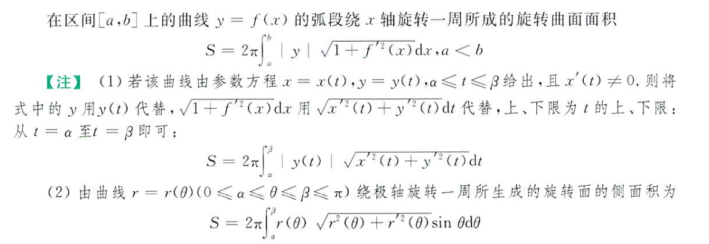

相较于旋转曲面体积，明显不同捏
$$
V = \pi\int_a^by(x)^2dx
$$
在求绕 y 轴旋转的曲面面积时，实际上是在对圆周长进行积分，所以用到了 2π，和这里还是有点点像
$$
V = 2\pi\int_a^b xy(x)dx
$$

> 其他物理应用：变力做功；液体静压力；引力；物体的质心（球心）

再说，要深刻理解微分法思想

## 定积分的综合题

结合函数性质（单调性、奇偶性）、极限、夹逼定理、中值定理考察不定积分、定积分、反常积分、变限积分，一整个大锅汇

考察定积分的奇偶性

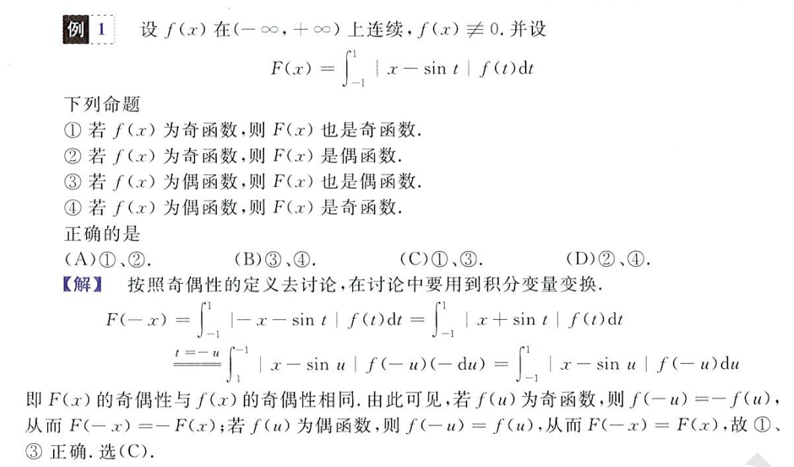

结合夹逼定理考察定积分

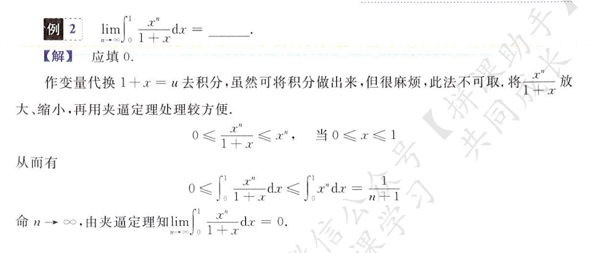

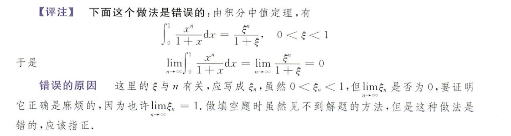

结合中值定理和单调性考察定积分应用

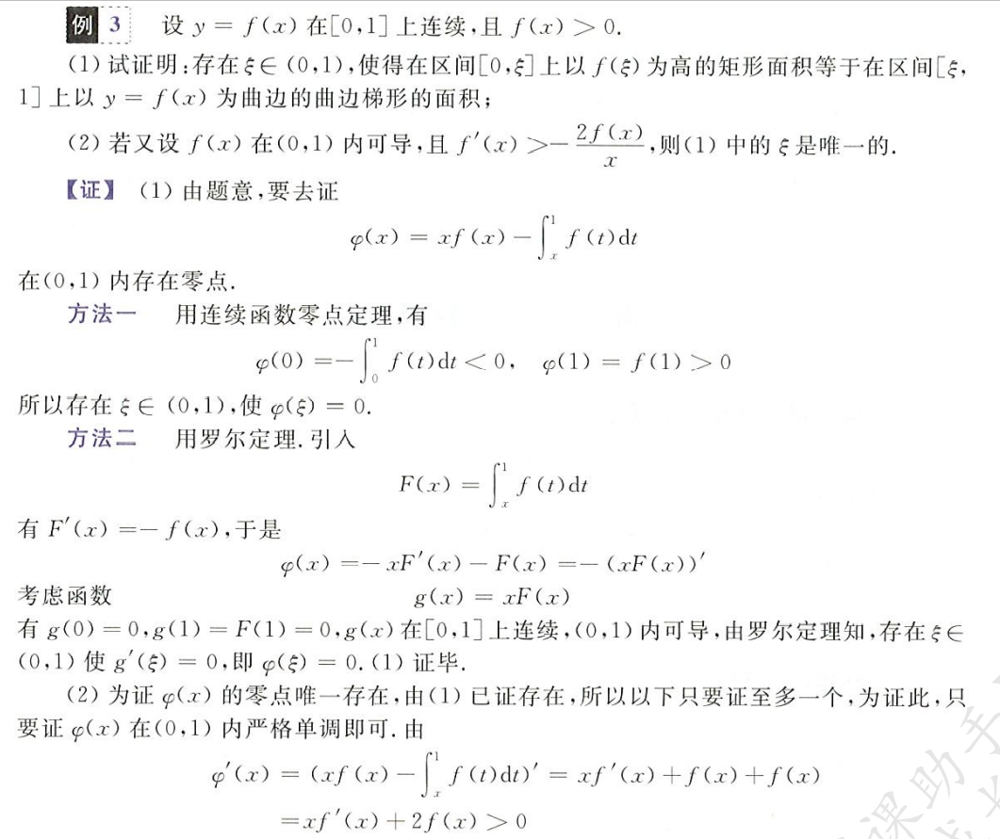
