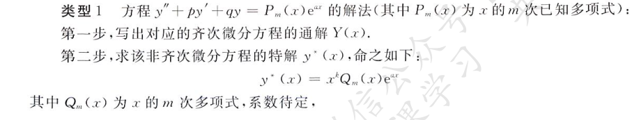
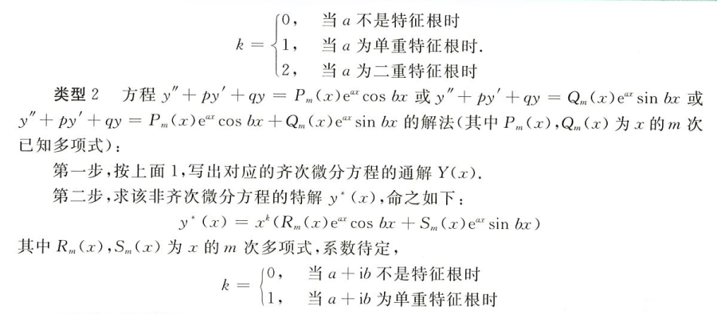
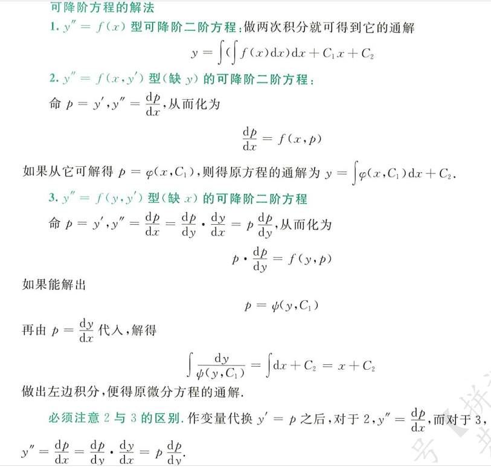
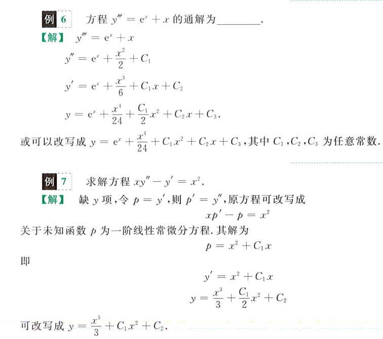
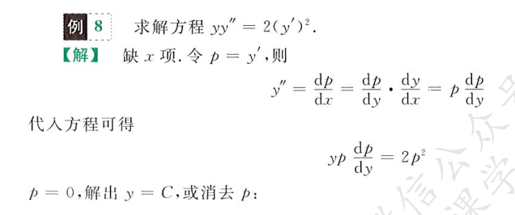
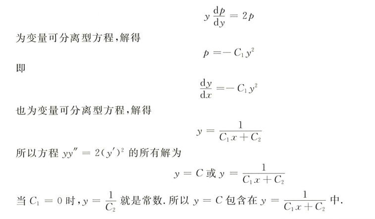
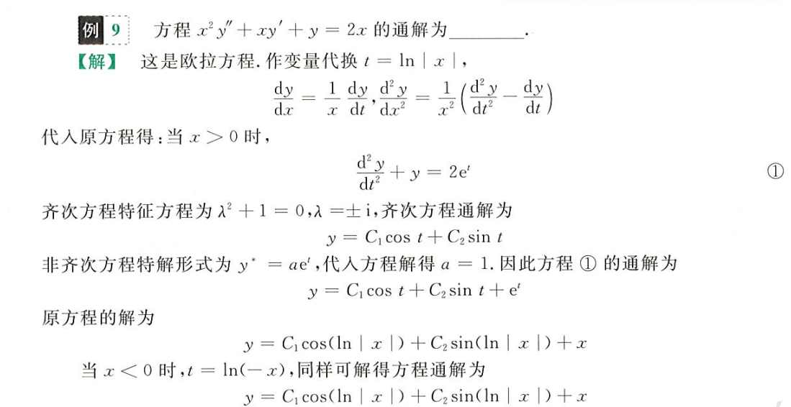

## 一阶微分方程

微分方程：顾名思义，就是含有微分的方程，其自变量为`x`，当然，高阶微分方程的自变量为矩阵，要解的结果为微分的原函数，即**求出能令其微分满足方程等式的函数**

这里不可避免得要涉及到积分（因为要求原函数），在无条件时求出来的原函数，叫做微分方程的**通解**（可以理解为不定积分结果，存在任意常数 C）；在给定的初值条件下，可以确定任意常数 C，从而得到一个确定的原函数（定积分），叫做微分方程在初值条件下的**特解**

### 变量可分离的微分方程

形如
$$
y' = f(x)g(y)
$$
的微分方程（这里 y 是一个关于 x 的一元函数），可以拆解为两个积分的等式
$$
\frac{dy}{g(y)} = f(x)dx
$$
于是我们可以对方程两侧同时积分，从而解出原函数`y(x)`

### 齐次微分方程

> 齐次指因变量`y`和自变量`x`的指数齐次，如`y/x, y^2/x^2`就是齐次的

令`y = ux`，让原微分方程的变量由`x,y`变为`x,u`，从而让该齐次微分方程转变为一个可分离变量的微分方程，然后积分求解

其中，`u`也是一个关于`x`的函数，有
$$
y' = (ux)'= u'x + u
$$
如对于齐次方程
$$
y' = \frac{y}{x} + tan\frac{y}{x}
$$
显然，y 和 x 耦合在一起，不可分离，于是我们令`y = ux`，则原式为
$$
u'x + u = u + tanu \Rightarrow u'x = tanu
$$
此时，神奇的事情发生了，y 和 x 成功解耦，分离得
$$
\frac{du}{tanu} = \frac{dx}{x}
$$
积分求解得（`tanu`分之一是`cosu/sinu`）
$$
\int \frac{cosu}{sinu}du = \int \frac{1}{x}dx \\
\Rightarrow ln|sinu| = ln|x| + C_1
$$
指得
$$
sinu = e^{ln|x|+C_1} = e^{ln|x|} e^{C_1} = xe^{C_1}\\
\Rightarrow u = arcsin\,xe^{C_1}
$$
最后代回`y`（要求得本来就是函数`y`），`u`只是工具人，`y = ux`
$$
y = xarcsin\,xe^{C}
$$
得到原齐次方程的通解，若告知初值条件，可解得特解，如
$$
y(1) = arcsin\,e^C = \frac{\pi}{2} \Rightarrow C = 0
$$
故在初值条件`y(1) = π/2`下的特解为
$$
y = xarcsinx
$$

### 一阶线性微分方程

形如
$$
y' + p(x)y = q(x)
$$
的微分方程，称为一阶线性微分方程，有公式
$$
y = e^{-\int p(x)dx}[\int q(x)e^{\int p(x)}dx + C]
$$
其中 C 为任意常数，以此解出原微分方程的通解，再通过初值条件可解出特解，这个吊公式怎么推的不知道，有时间再看看

### 伯努利方程

形如
$$
y' + p(x)y = q(x)y^n
$$
可以化为
$$
y^{-n}\frac{dy}{dx} + p(x)y^{1-n} = q(x)
$$
就是一阶线性微分方程的特殊情况，在微分方程中，存在`y`的两个幂，且其指数只相差`1`，此时可以用高阶的`y`的微分代替低阶的`y`
$$
d{y^{n}} = ny^{n-1}\frac{dy}{dx}dx = ny^{n-1}dy\\
\Rightarrow y^{n-1} = \frac{dy^n}{ndy}
$$
带入伯努利方程
$$
\frac{dy^{1-n}}{(1-n)dy}\frac{dy}{dx} + p(x)y^{1-n} = q(x)
$$
化简为
$$
\frac{dy^{1-n}}{(1-n)dx} + p(x)y^{1-n} = q(x)
$$
令`y^{1-n} = z`，则`dz/dx = z'`，原式为
$$
\frac{z'}{(1-n)} + p(x)z = q(x)
$$
是不是很眼熟，就是一个一阶线性微分方程，然后就可以代公式
$$
y = e^{-\int p(x)dx}[\int q(x)e^{\int p(x)}dx + C]
$$
注意原公式的`y'`前面是没有多余系数的，就是要把那个`1-n`乘上去系数化为`1`，然后才能无脑代公式

### 全微分方程

形如
$$
du(x,y) = P(x,y)dx + Q(x,y)dy = 0
$$
的二元微分方程，称作全微分方程，要求的解为原函数`u(x,y)`，其中
$$
P(x,y) = \frac{∂u}{∂x}\quad Q(x,y) = \frac{∂u}{∂y}
$$
这个方程成立的充要条件是
$$
\frac{∂P}{∂y} = \frac{∂Q}{∂x}
$$
即二阶偏导相同
$$
\frac{∂^2u}{∂x∂y} = \frac{∂^2u}{∂y∂x}
$$
以此可以消除某些变量，再通过
$$
\frac{∂u}{∂x} = P(x,y)
$$
对方程两边`x`不定积分得到一个`u`的变式，记作`u0`，再对这个`u0`
$$
\frac{∂u_0}{∂y} = Q(x,y)
$$
消除所有变量，得到最终的通解`u(x,y)`

## 二阶及高阶线性微分方程

> 自此发现，不定积分其实是微分方程的一个子集，实际上就是缺省中间阶导数的微分方程，而定积分就是在不定积分的基础上应用牛顿莱布尼兹公式所得
>
> 题目的侧重不同，一个重积分过程，一个求解

### 线性微分方程及线性无关

n 阶线性微分方程
$$
y^{(n)}+a_1y^{(n-1)}+...+a_{n-1}y'+a_ny = f(x)
$$
其中`f(x)`为自由项

- 自由项为 0，该线性微分方程为齐次
- 否则，该线性微分方程非齐次

线性相关和无关
$$
k_1y_1(x)+k_2y_2(x)+...+k_ny_n(x)=0
$$
若存在不全为 0 的系数组合`ki`使得等式成立，则说明`yi(x)`是线性无关的，否则我们说`yi(x)`线性相关

线性无关也意味着**任意两个项的商不为常数**，即
$$
\frac{k_iy_i(x)}{k_jy_j(x)} \neq C\in R\,\,\,,i\neq j
$$

### 齐次线性微分方程

齐次线性微分方程解的性质：解和解的线性相关项仍是解，譬如`y1,y2`是齐次线性方程的解，则
$$
y_3 = y_1+y_2\quad y_4 = y_3-4y_1+y_2
$$
`y3,y4`仍是原方程的解，当然`y3,y4`是线性相关的

齐次线性微分方程的通解：其中`yi`均线性无关
$$
Y(x) = \sum_{i=1}^{m}C_iy_i
$$
求解二阶齐次线性微分方程的通解，对于方程
$$
y'' + py' + q = 0
$$
有其特征方程
$$
r^2 + pr + q = 0
$$
这是一个一元二次方程，通过公式求解可得解`r`，根据`r`的不同，原方程的通解可分为
$$
y = 
\begin{cases}
C_1e^{r_1x}+C_2e^{r_2x}\quad r = r_1/r_2(双根)\\
(C1+C2x)e^{r_0x}\quad r = r_0(重根)\\
e^{ax}(C_1cosbx + C_2sinbx)\quad r = a\pm bi(复数根)
\end{cases}
$$
所谓非齐次微分线性方程对应的齐次微分线性方程就是把非齐次方程的自由项手动化为 0 的齐次方程

### 非齐次线性微分方程

非齐次线性微分方程的解 = 对应齐次方程的通解 + 非齐次方程的一个特解
$$
y = Y(x) + y^*(x)
$$
自然，也可以视作 n 个线性无关的齐次方程解加上一个非齐次方程特解
$$
y = \sum_{i=1}^{m}C_iy_i + y^*(x)
$$
解叠加原理

对于非齐次线性方程
$$
y^{(n)}+a_1y^{(n-1)}+...+a_{n-1}y'+a_ny = f(x) \\
y^{(n)}+a_1y^{(n-1)}+...+a_{n-1}y'+a_ny = g(x)
$$
若已知其特解分别为`y1*`和`y2*`

则对于自由项为两个方程自由项之和的非齐次线性微分方程
$$
y^{(n)}+a_1y^{(n-1)}+...+a_{n-1}y'+a_ny = f(x) + g(x)
$$
有特解为
$$
y^* = y_1^* + y_2^*
$$
下面开始抽象起来了

### 特殊自由项二阶方程

这里这个多项式`Q(x)`如何确定？

### 可降阶方程

基本思路：令`p = y' = dy/dx`，带入原方程求解，最后代回再积分得到`y(x)`

举个栗子

### 欧拉方程

令`x = e^t`，则`t = ln|x|`，`dt/dx = 1/x`，带入原方程，消去 x，解关于`y`和`t`的微分方程，最后将`t = ln|x|`代回通解，得到答案

其中，有
$$
y' = \frac{dy}{dx} = \frac{dy}{dt}\frac{dt}{dx} = \frac{1}{x}\frac{dy}{dt}
$$
以及
$$
y'' = \frac{d^2y}{dx^2} = \frac{d}{dx}(\frac{1}{x}\frac{dy}{dt}) = -\frac{1}{x^2}\frac{dy}{dt} + \frac{1}{x}\frac{d}{dx}(\frac{dy}{dt}) = -\frac{1}{x^2}\frac{dy}{dt} + \frac{1}{x^2}\frac{d^2y}{dt^2}
$$
将上述所有带入原微分方程消去 x，譬如

## 微分方程应用

### 几何问题

### 变化率问题

## 差分方程
