> 高等数学：函数、极限、连续、一元函数微积分学、多元函数的微积分学、常微分方程
>
> 同济六版高等数学中除了第七章微分方程考带`*`号的伯努利方程外，其余带`*`号的都不考；所有“近似”的问题都不考；第四章不定积分不考积分表的使用；不考第八章空间解析几何与向量代数；第九章第五节不考方程组的情形；到第十章二重积分、重积分的应用为止，后面不考了

> 线性代数：行列式、矩阵、向量、线性方程组、 矩阵的特征值和特征向量、二次型
>
> 数学二用的教材是同济五版线性代数，1-5章：行列式、矩阵及其运算、矩阵的初等变换及其方程组、向量组的线性相关性、相似矩阵及二次型

## 函数

### 函数的定义

复合函数：`f[g(x)]`，注意`g(x)`的值域对应`f(x)`的定义域，`f(g(x))`的定义域是`x`的取值范围，但一般规范的是`g(x)`的取值范围

反函数：注意类似`y=x^2`这样的函数并没有反函数，因为一个`y`对应多个`x`，并不符合函数要求（但可以说是曲线）
$$
f^{-1}[f(x)] = x\\
f[f^{-1}(x)] = x
$$
#### 基本初等函数

- 幂函数：x 为底数
- 指数函数：x 为指数
- 对数函数
- 三角函数：正割等于余弦分之一
  - sin-cos：正弦余弦，定义域`R`，值域`[-1,1]`
  - tan-cot：正切余切，注意分母不为零，值域`R`
  - sec-csc：正割余割，注意分母不为零，值域`(-∞,-1]∪[1,+∞)`
- 反三角函数
  - arcsin：反正弦，定义域`[-1,1]`，值域`[-π/2, π/2]`
  - arccos：反余弦，定义域`[-1,1]`，值域`[0,π]`
  - arctan：反正切，定义域`R`，值域`(-π/2,π/2)`
  - arccot：反余切，定义域`R`，值域`(0,π)`

这里 tan 函数的定义域是 R 去掉分母为 0 的部分，而反函数 arctan 定义域为 R（因为 tan 函数值域为 R），但值域只能在 tan 函数的一个周期内，不然就不会满足函数定义，其余反三角函数同理

#### 三角函数

转换
$$
sin^2x+cos^2x=1\\
sec^2x=1+tan^2x\\
csc^2x=1+cot^2x\\
arcsinx+arccosx=\pi/2\\
arctanx+arccotx=\pi/2\\
$$
导数
$$
(sinx)'=cosx\\
(cosx)'=-sinx\\
(tanx)'=sec^2x\\
(cotx)'=-csc^2x\\
(arcsinx)'=x\\
$$

### 函数的性质

单调性；奇偶性；周期性；有界性

奇偶

- 奇函数乘除奇函数，偶数个结果为偶，奇数个结果为奇
- 偶函数乘除偶函数结果总是为偶
- 奇函数乘除偶函数结果为奇
- 奇函数若在 x=0 有定义，则 y 一定为 0

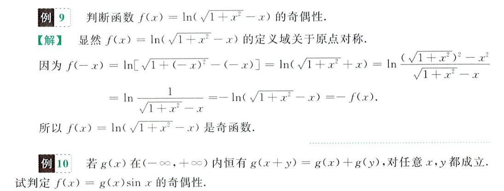

周期

- 若自变量变化速度增加两倍（系数乘以 2），则周期减半
- 周期函数相加减，新函数也具有周期性，且周期为两个周期的最小公倍数

有界：多涉及放缩或极大极小值判断

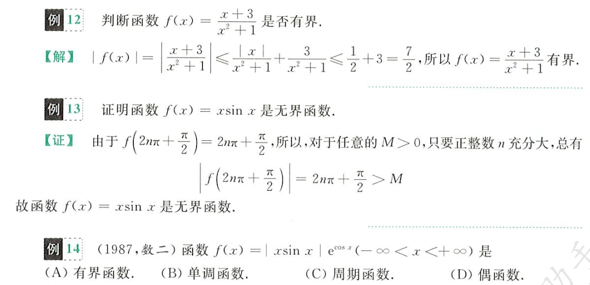

## 极限

> 重点

### 极限概念及性质

#### 数列极限

定义
$$
\exist N\in R,\,当\,n>N,\,有\,|a_n-b|<\varepsilon\in Z^{+}\\
则\,b\,为数列\,a_n\,的极限
$$
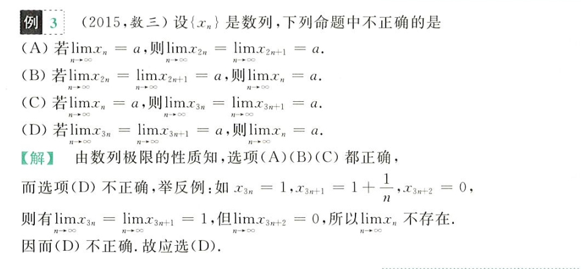

3n 和 3n+1 没有包含所有情形，还应加上 3n+2

同理，若为 4n，则必须要有`4n+1, 4n+2, 4n+3`才能充分证明

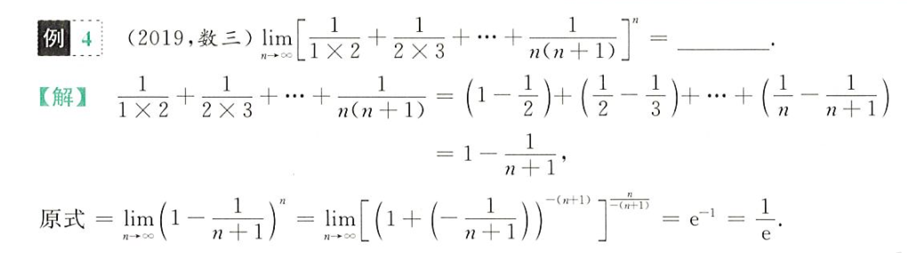

首先是一个经典的`1/(2x3) = 1/2-1/3`转换消去中间项

第二用到对数转换和等价无穷小
$$
\mathop{lim}_{n\rightarrow\infty}\,\,log_a(1+\frac{1}{n}) = \frac{1}{n\times lna}
$$
将中括号中内容加对数得`T = ln(1+1/t)^t`，将指数`t`提出，将对数部分`1+1/t`利用等价无穷小转换为`1/t`， 求得`T = 1`，还原对数得原式为`e`，再对指数`e^m`进行极限运算，得出最终结果

#### 函数极限

函数无穷极限，定义
$$
\mathop{lim}_{x\rightarrow\infty}f(x) = \mathop{lim}_{x\rightarrow+\infty}f(x) = \mathop{lim}_{x\rightarrow-\infty}f(x)
$$
极限不存在情形
$$
\mathop{lim}_{x\rightarrow\infty}f(x) = \infty\\
\mathop{lim}_{x\rightarrow+\infty}f(x) \not= \mathop{lim}_{x\rightarrow-\infty}f(x)
$$
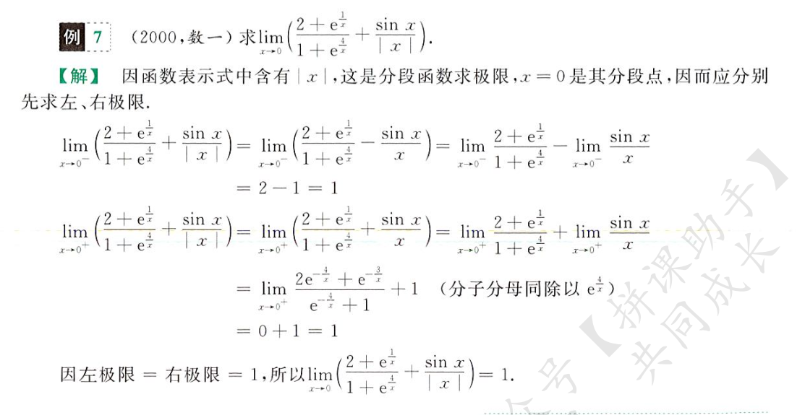

- 不管有没有绝对值，一定要分段讨论，分别判断左右极限，最终才能得出结论

- 当 x 趋于 0 时，除了绝对值，诸如
  $$
  e^{\frac{1}{x}}\,,\,arctan\frac{1}{x}
  $$
  均要左右求极限，很明显左右极限不等

函数在有限值的极限，和无穷极限同理，一样分左右（不等或任有一个等于无穷则极限不存在），自变量趋近的值为有限值 A

左右不等的极限

- 表达式带绝对值，自变量趋于 0

- `e - ∞`型
  $$
  \mathop{lim}_{x\rightarrow0}e^{\frac{1}{x}}\,,\,
  \mathop{lim}_{x\rightarrow\infty}e^x\,,\,
  \mathop{lim}_{x\rightarrow\infty}e^{-x}
  $$

- `arctan - ∞` 型
  $$
  \mathop{lim}_{x\rightarrow0^-}arctan\frac{1}{x} = -\frac{\pi}{2}\\
  \mathop{lim}_{x\rightarrow0^+}arctan\frac{1}{x} = \frac{\pi}{2}\\
  $$

极限的保号性

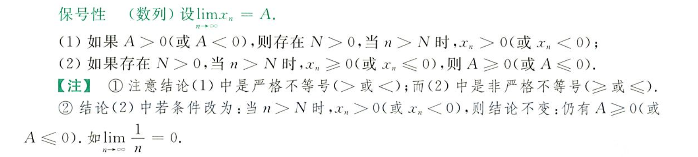

- xn > 0 恒成立，只能推出其极限 A >= 0（并非 A > 0）
- 若极限 A > 0，可以推出 xn > 0 恒成立

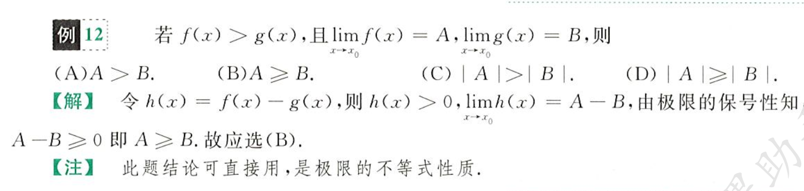

向答案靠拢，令 ε = a/2，通过不等式以及保号性推算结果，不要臆想

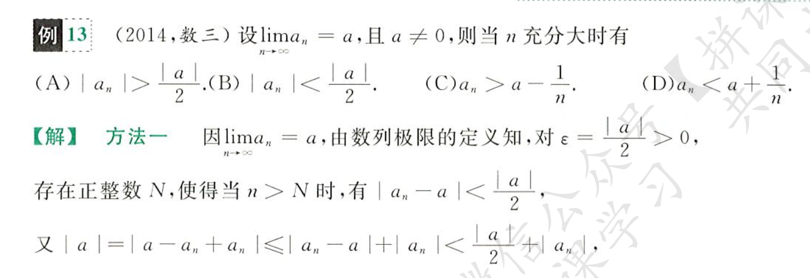

### 无穷小量和无穷大量

无穷小和无穷大

- 有界量（如 4sinx + 3）和无穷小的乘积为无穷小

- k 阶无穷小，若
  $$
  lim\frac{\beta}{\alpha^k}=c\in R
  $$
  则称 β 是 α 的 k 阶无穷小（β 远比 α 要小）

- 高阶无穷小：若相除为 0，说明分子比分母更快趋于 0，分子是分母的高阶无穷小；相对的，分母是分子的低阶无穷小

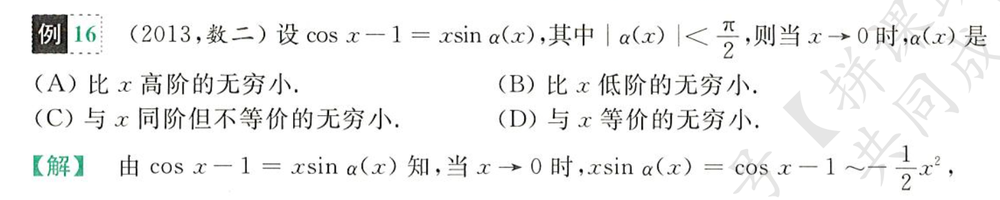

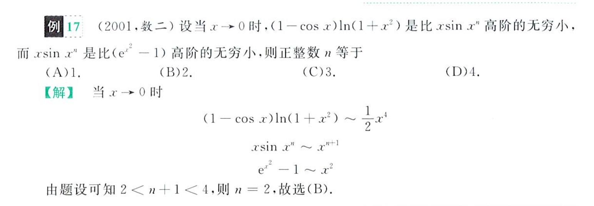

上题用到的几个等价无穷小
$$
cosx-1\sim-\frac{1}{2}x^2\\
e^{x}-1\sim x\\
ln(1+x)\sim x\\
^n\sqrt{1+x}-1\sim \frac{x}{n}
$$
连续洛必达中根据分子/分母趋于 0 解未知数

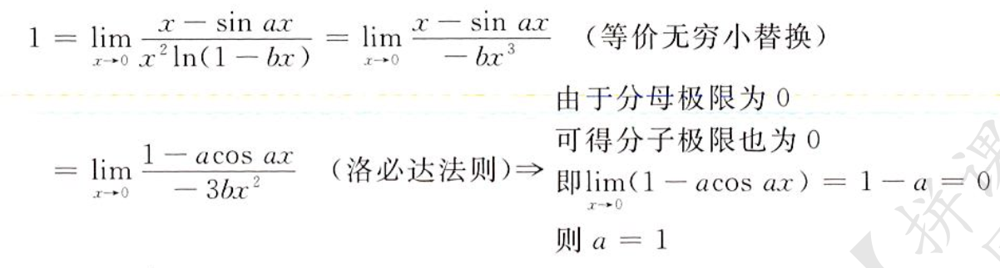

- 这里继续洛可以得到 -6b = a^3，根据这里的 a-1 = 0 可解出答案

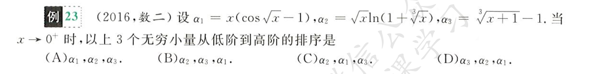

- 三个等价无穷小

极限值与无穷小的关系
$$
limf(x) = A <=> f(x) = A+\alpha(x)\\
lim\,\alpha(x) = 0
$$
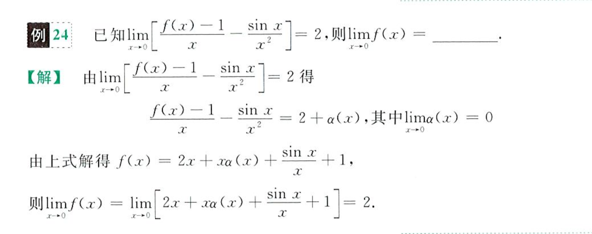

无穷大：无穷大乘以非零常数仍为无穷大

无穷大的比较：通过除法以及洛必达法则可证明

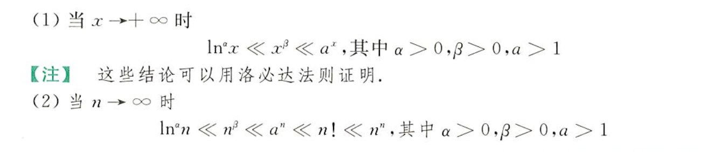

注意**无界变量**和无穷大量的区别，如对于数列`xn = {1,0,3,0,...,2n+1,0,...}`，其在奇数位为 x，在偶数位恒为 0，当 n->∞ 时，你不能说他是一个无穷大量，而是一个无界变量

### 极限的计算

重中重

#### 朴素求极限

常用结论

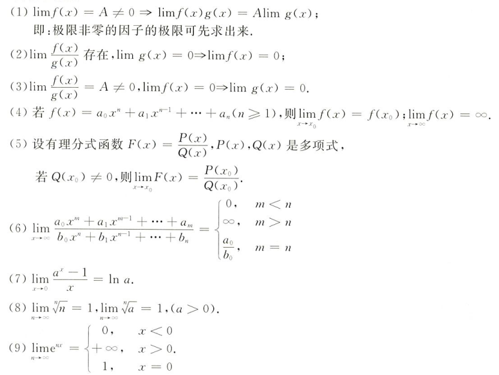

对于`根号-无穷`型极限

- 根号有理化
- 提出公因子，将根号中转化为 0（跟号外为无穷）（注意计算）
- 带入极限

$$
\mathop{lim}_{x\rightarrow+\infty}(\sqrt{x^2+x+1}-\sqrt{x^2-x+1})
$$

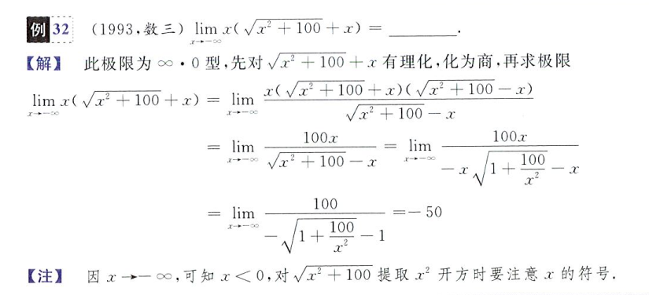

- 先有理化，再提公因子，比较稳妥
- 提公因子的时候还要注意符号

#### 两个重要极限

1、0/0 型：一般可以直接洛
$$
\mathop{lim}_{a\rightarrow0}\frac{sina}{a} = 1
$$
经典错误

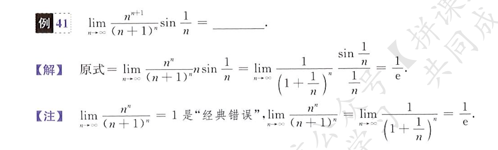

2、1-∞ 型：常用于幂指函数，刻意去凑 1
$$
\mathop{lim}_{a\rightarrow0}(1+a)^{1/a} = e
$$
注意两个重要极限均有趋于 0 的限制，在无穷小时才成立

对于幂指函数，还可以直接采用把指数化为 e 的对数指数的形式求解极限，如
$$
\mathop{lim}_{x\rightarrow0}(\frac{1+2^x}{2})^\frac{1}{x} =
\mathop{lim}_{x\rightarrow0}\,e^{\frac{1}{x}ln(\frac{1+2^x}{2})}\\
e^{lnx} = x
$$
回顾一下指数、对数求导
$$
(2^x)' = 2^x\times ln2\\
(log_2x)' = \frac{1}{x\times ln2}
$$
幂指函数求解极限一般方法

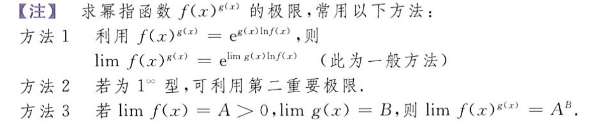

#### 等价无穷小

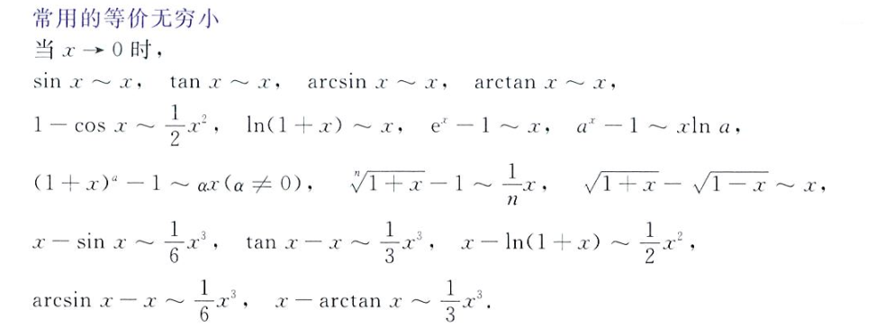

这个故事告诉我们不能一味的追求替换，当算则算

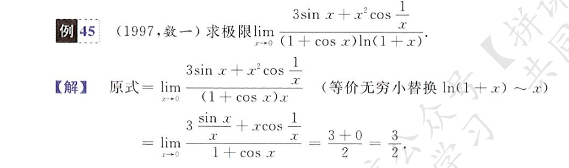

无穷小的和差项不要轻易拆开，尽力化为乘积项统一约分

证明题：证明两个极限等价，即证明这两个极限相除为 1

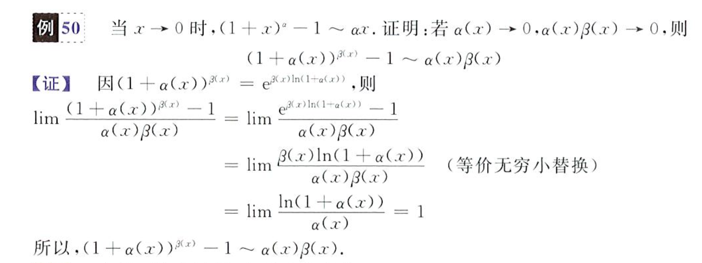

不要怕化出 1，`a+b`不如`a/b+1`

#### 洛必达

灵活的在**洛必达、无穷小替换、等价变换、直接求值**之间转换，不要拘泥于一种方法

- 先判断是否需要换元（转换为除法更好运算，全是乘法不好操作）
- 若有指数，考虑幂指转换
- 时刻注意分子分母有理化和算术变换（如三角函数变换，凑 1）
- 时刻注意是否可以**提出极限为常数的项**
- 判断是否有等价无穷小
- 碰到僵局尝试考虑洛必达

一些逆天
$$
\mathop{lim}_{x\rightarrow0}\frac{arctanx-sinx}{x^3}=-1/6\\
\mathop{lim}_{x\rightarrow0}\frac{e^x-e^{-x}-2x}{x-sinx}=2\\
\mathop{lim}_{n\rightarrow\infty}\,n\,tan\frac{1}{n}=e^{1/3}\\
\mathop{lim}_{x\rightarrow0}\frac{\sqrt{1+2sinx}-x-1}{x^2}=-1/2\\
\mathop{lim}_{x\rightarrow0}\frac{e^{x^{2}}-e^{2-2cosx}}{x^4}=1/12\\
$$
极限和无穷小的联系，α(x) 是一个虚构的未知的函数，在已知极限中某一项为 0 且不影响极限构成时（如 0-0 就不行），可以单独提出极限然后悄无声息地消去

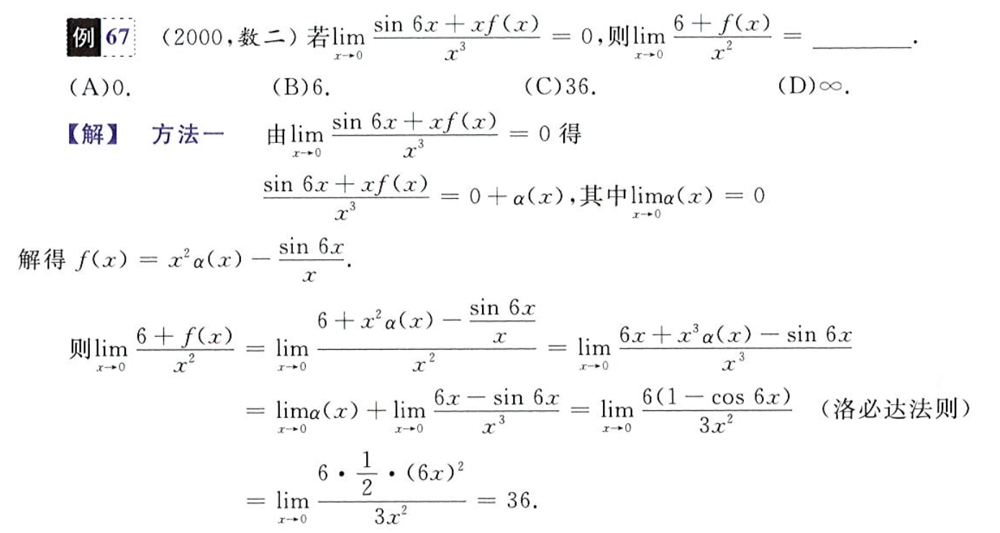

#### 夹逼准则 - 放缩

$$
若\,g(x)\leq f(x)\leq h(x)\,,\,
lim\,g(x) = lim\,h(x) = A\\
则\,lim\,f(x)=A
$$

涉及一个放缩，需要亿点灵感

- 阶乘直接展开
- 乘法注意大于一和小于 1 的部分，分开看

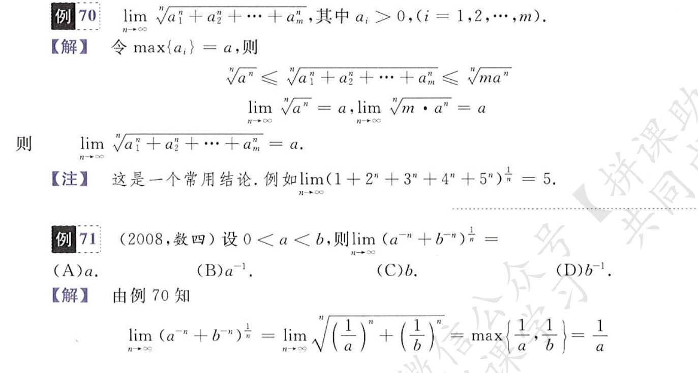

分式永远比乘式要好用

取整函数（向下取整），向上取整同理

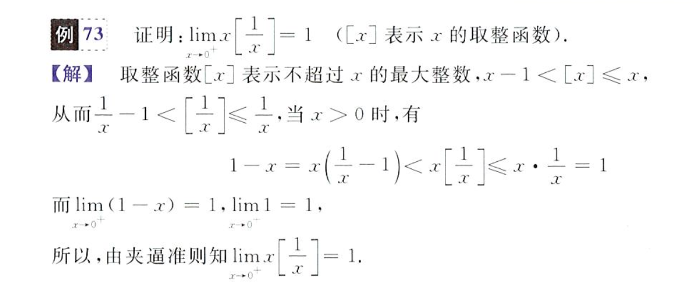

#### 单调有界数列极限准则

单调递增数列有界 <=> 必有极限

- 证明单调有界：数学归纳法

- 令
  $$
  lim\,x_n = a\\
  lim\,x_{n+1}=lim\,f(x_n)=f(a)=a
  $$
  因为已经到极限了，`xn+1`是等于`xn`的，以此建立等式

怎么说，就是靠一手递推公式列出关于极限的等式反向求解

注意你在观察这个递推公式的时候，应该是能有感觉的，什么感觉呢，就是上下界的感觉，他既然给出这个题，说明肯定是有界的，你譬如
$$
x_{n+1} = \sqrt{6+x_n}
$$
这样的一看就是有下界，那么有意识地就要往递减上去**归纳**，又譬如
$$
x_{n+1} = \sqrt{6-x_n}
$$
这样就是有上界，数学归纳时向递增上靠拢

#### 利用无穷小性质求极限

就是 无穷小乘以有限量 仍为无穷小（即 0），如
$$
\mathop{lim}_{x\rightarrow \infty}\frac{x^2-3x+5}{2x^3}\times(5+cos3x)
$$
分母高次，第一项为无穷小，第二项绝对值始终小于等于 6，相乘结果极限为 0

#### 利用函数连续性求极限

若函数连续，则
$$
\mathop{lim}_{x\rightarrow a}f(x) = f(a)
$$
在此基础上，可以复合其他连续函数

其实在很多时候自然的就用到了初等函数的连续性，糅杂在**朴素求极限**的过程中，伴随各种求极限方法同时使用

- 对**指数的乘除和对数的加减**一定要敏感

#### 泰勒公式

常用泰勒展开式：o(x^n) 指 x 的 n 阶无穷小，意思是该项相对于 x^n 为无穷小（下一阶无穷小）

1. $$
   e^x = 1+x+\frac{x^2}{2!}+...+\frac{x^n}{n!}+o(x^n)
   $$

2. $$
   sinx = x-\frac{x^3}{3!}+...+(-1)^n\frac{x^{2n}}{(2n)!}+o(x^{2n})
   $$

   

3. $$
   cosx = 1-\frac{x^2}{2!}+...+(-1)^n\frac{x^{2n}}{(2n)!}+o(x^{2n})
   $$

4. $$
   ln(1+x) = x-\frac{x^2}{2}+...+(-1)^{n-1}\frac{x^n}{n}+o(x^n)
   $$

5. $$
   (1+x)^a = 1+ax+\frac{a(a-1)}{2!}x^2+...+\frac{a(a-1)...(a-n+1)}{n!}x^n+o(x^n)
   $$

其实进一步看，**极大无穷小就是把泰勒式的第三阶展开便视作无穷小**，当然这只在 x 趋于 0 的时候才成立

## 函数的连续性

### 连续性概念

连续原始定义
$$
\mathop{lim}_{\triangle x\rightarrow0}\triangle y = 
\mathop{lim}_{\triangle x\rightarrow0}[f(x_0+\triangle x)-f(x_0)]=0
$$
直观定义：极限等于函数值即为连续，左右都连续就连续
$$
\mathop{lim}_{\triangle x\rightarrow x_0}f(x) = 
\mathop{lim}_{\triangle x\rightarrow x_0^-}f(x) =
\mathop{lim}_{\triangle x\rightarrow x_0^+}f(x) =
f(x_0)
$$
区间连续：函数在区间`(a,b)`内处处连续，则函数在区间`(a.b)`内连续
$$
\mathop{lim}_{x\rightarrow0}\,x^asin\frac{1}{x} = 0\,\,(a>0)
$$

- 当 a <=0 时，该极限不存在

提供了一个新思路，多项式求极限时，**能直接求得的项作为常数单独提出**，处理不能直接求出的项（换元需要灵感）

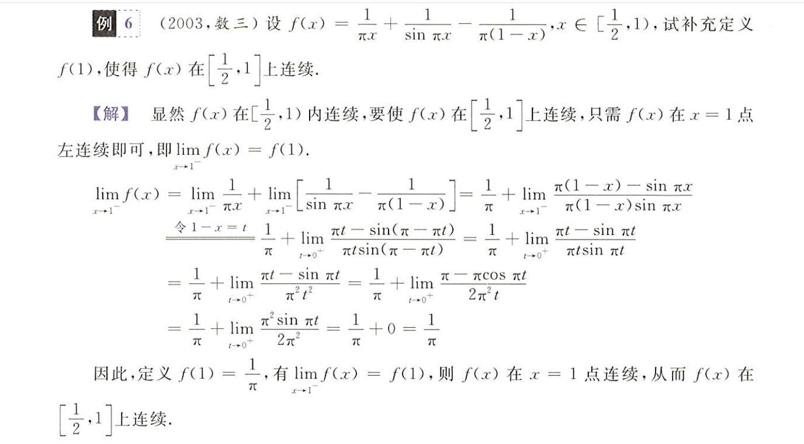

### 连续函数运算

四则运算：若两个函数在同一点均连续，则他们的加减乘除均连续（但注意分母不能为 0）

复合函数的连续性：
$$
\varphi(x)在x_0处连续且\varphi(x_0)=u_0\,\,,\,\,
同时f(u)在u_0处连续\\
则f(\varphi(x))在x_0处连续
$$
反函数的连续性：当原函数在区间内连续且单调，则其反函数在对应区间也连续且具有单调性（但相反）

### 初等函数连续性

初等函数连续性：初等函数在定义域内均连续

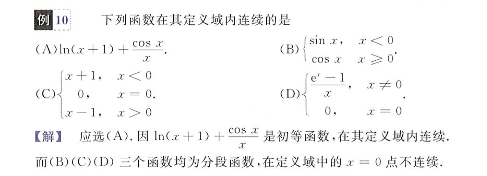

在定义域内其实就略去了函数不存在的情况，如`tanx, 1/x`，其在定义域中一定不存在`Π/2`和`0`

在讨论函数的连续区间时

- 着重处理断点：如分段函数的分段点，不存在的点
- 判断断点的连续性：分别计算左右极限，若不相等或不存在，确认在该点不连续
- 在讨论连续区间时，要把这个点去掉，不能包含

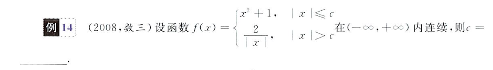

找出两个函数的交点，画图求解

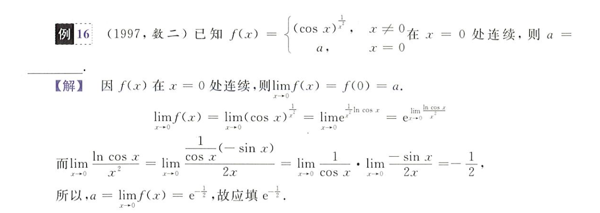

不要想当然的令`cosx (x->0)`等于 1，其实是趋于 1
$$
\mathop{lim}_{x\rightarrow0}(cosx)^{1/x^2} = e^{-1/2}
$$
### 间断点及其分类

x0 为 f(x) 的间断点 <=> f(x) 在 x0 点不连续

以下三个条件必有一个不成立

- f(x0) 有定义
- 当 x->x0，limf(x) 存在，
- x->x0，limf(x) = f(x0)

间断点的分类

- 第一类间断点：左右极限均存在
  - 可去间断点：左右极限相等
  - 跳跃间断点：左右极限不等
- 第二类间断点：左右极限至少有一个不存在
  - 无穷间断点：有至少一个极限趋于无穷
  - 震荡间断点：x->x0，limf(x) 震荡

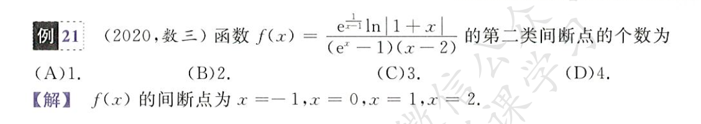

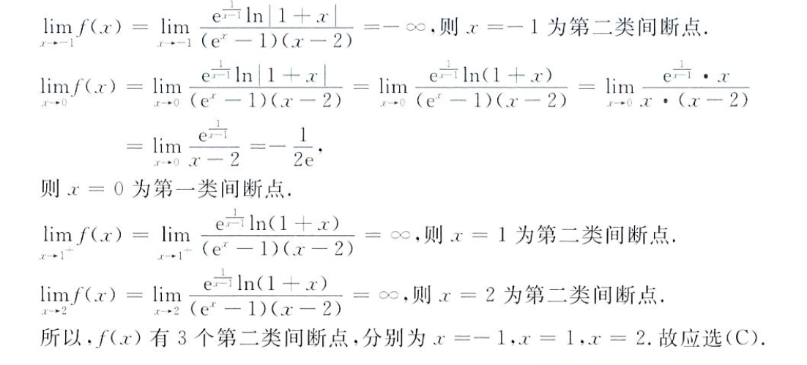

像这种判断间断点的题目的求极限很多都可以直接带，如果最后约不掉出现了分母为 0 或者分子无穷大的情况，直接判断其极限不存在（为无穷），属于第二类间断点

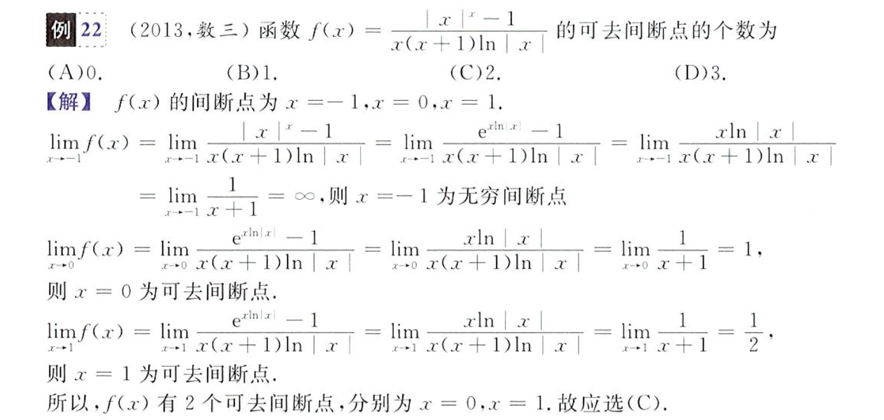

绝对值的处理必须慎重但简约，能晚则晚处理

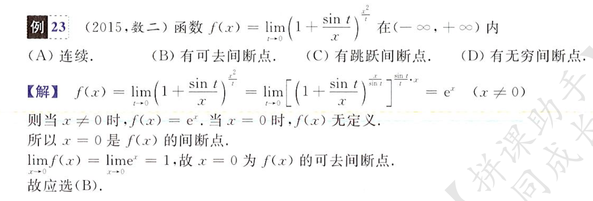

一定要注意定义域的界限，很多时候判断间断点不仅仅是求极限，还有一些基本的问题；在处理分式时，一定要把分母为 0 和不为 0 的情况分开讨论并求极限

可去间断点和连续的区别：

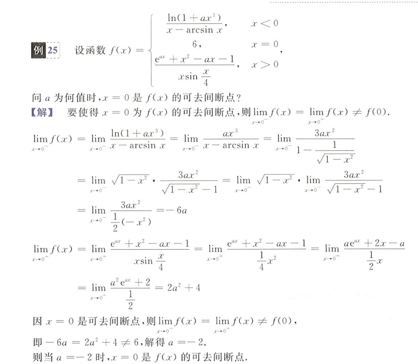

这个地方`x-arcsinx`的处理，要么用洛必达洛几次，能洛出来
$$
(arcsinx)' = \frac{1}{\sqrt{1-x^2}}
$$
要么背一下泰勒展开（等价无穷小）
$$
arcsinx-x \sim \frac{1}{6}x^3\,\,,\,\,x\rightarrow0
$$
不要求极限求蠢了，看到 lim 就搁这疯狂代换，有的时候简单讨论一下就行

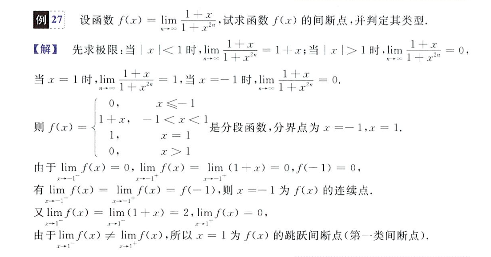

### 闭区间上连续函数的性质

最值定理：若函数在闭区间`[a,b]`内连续，必有最大值最小值

有界性定理：若函数在闭区间`[a,b]`内连续，必在区间内有界（最值定理推论）

介值定理：若函数在闭区间`[a,b]`内连续且`f(a) != f(b)`，对于`min < cur < max`，必存在`c∈(a,b)` 使得`f(c) = cur`

- 就是说一旦连续，从最小到最大的过程一定会有一个自变量对应函数值 C

零点定理：若函数在闭区间`[a,b]`内连续且`f(a)f(b) < 0`，必存在`c`使得`f(c) = 0`（介值定理推论）

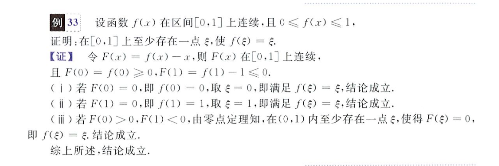

求解闭区间上零点定理题目一般步骤：

- 根据等式建立函数
- 判断临界点函数值
  - 直接和 0 比较
  - 相乘比较是否小于 0
  - 若能等于 0，需要对结果分类讨论，如上题
- 根据零点定理（介值定理）得出结论

介值定理在使用时

- 假设区间内最大值 M 和最小值 m
- **对已给出的值进行和要求的值带入最大最小值建立不等式**
- 将不等式两侧化为简单的 m 和 M 形式
- 根据介值定理带入 f(ξ)，对不等式移项一定可以得到要求的值

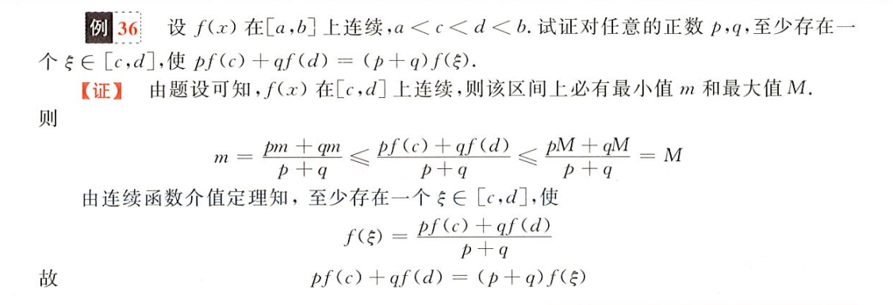

利用介值定理证明积分中值定理

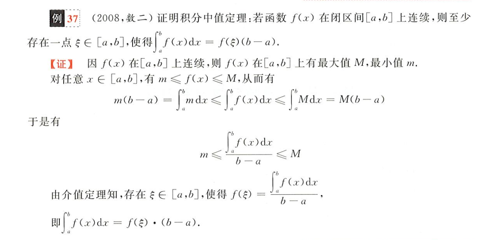

