## 导数和微分概念

### 导数的概念及几何意义

#### 导数概念

导数概念：若`f(x0)`有定义，则函数`f`在`x0`的导数为
$$
f(x_0)' = 
\mathop{lim}_{\triangle x\rightarrow0}\frac{\triangle y}{\triangle x} = 
\mathop{lim}_{\triangle x\rightarrow0}\frac{f(x_0+\triangle x) - f(x_0)}{\triangle x}
$$
左导数和右导数：求极限的时候取正反，右极限对应右导数，左极限对应左导数，记作
$$
f'_{-}(x_0)\,,\,f'_{+}(x_0)
$$
可导

- 函数在某处可导：函数在该处左右导数均存在且相等（充要）
- 函数区间可导：函数在区间内任意一点均可导

对于求单点的导数，多采用定义求解

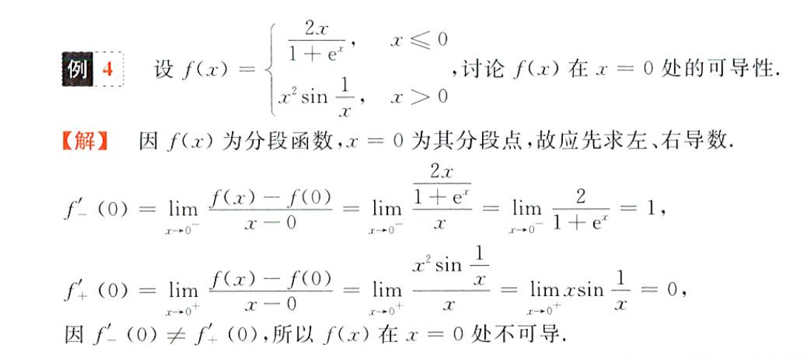

- 根据定义求导数，如
  $$
  求\,f(x)\,在\,x=1\,的导数\\
  则求\,\mathop{lim}_{x\rightarrow0}\frac{f(1+x)-f(1)}{x}
  $$
  左导数则`x->0-`，右导数则`x->0+`，等价于
  $$
  \mathop{lim}_{x\rightarrow1}\frac{f(x)-f(1)}{x-1}
  $$

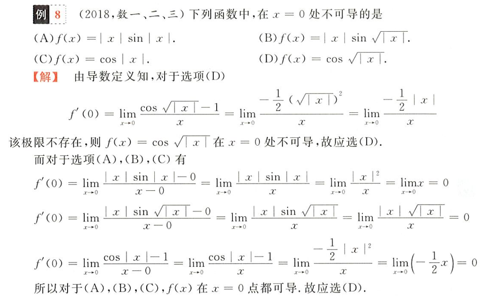

- 不需要看到绝对值就一定分情况讨论，直接不化绝对值求解，最后一步化开绝对值可能简便无数倍

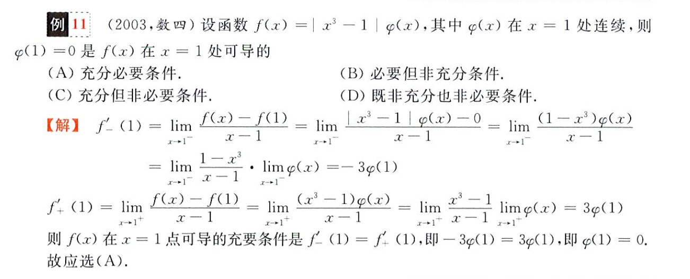

- 分割极限式，分别计算再相乘
- 这里定义求导数令`x->0 -/+`也可，我倾向于设变化的 x 趋于 0 来求极限

已知函数在 x0 连续，基于此进行一些个代换
$$
\mathop{lim}_{\triangle x\rightarrow0}\frac{f(x_0+\triangle ax)-f(x_0)}{\triangle x} = af'(x_0)
$$

- 分母也乘以 a 后等于`f'(x0)`，所以原式为 a 倍的`f'(x0)`

凑分母 - 自变量，纯尼玛流氓解法

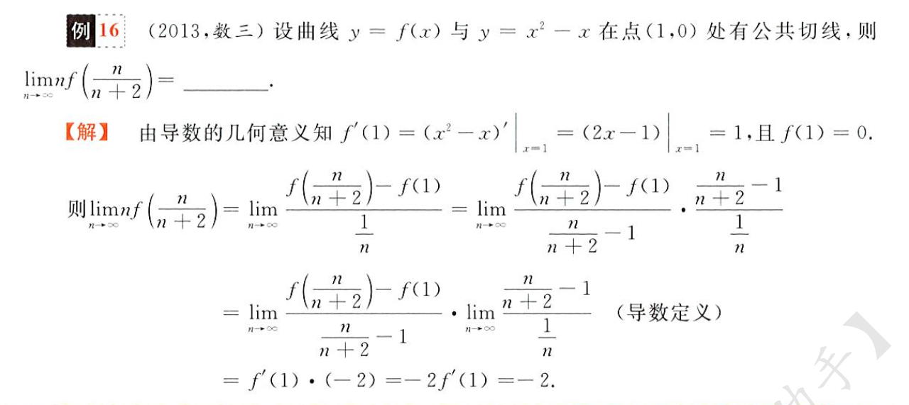

一定要明确下面两种定义，**力求令函数括号内等于分母**，进行这一个从极限到导数的替换，但要时刻**注意需满足这里趋近条件**
$$
\mathop{lim}_{🐕\rightarrow x_0}\frac{f(🐕)-f(x_0)}{🐕-x_0}\\
\mathop{lim}_{🐕\rightarrow 0}\frac{f(x_0+🐕)-f(x_0)}{🐕}\\
$$
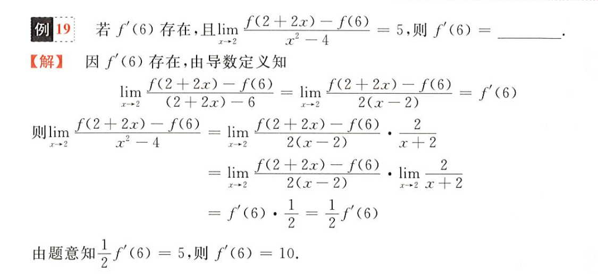

#### 导数几何意义

导数即为切线斜率

切线方程
$$
y-f(x_0) = f'(x_0)(x-x_0)
$$
法线：和切线垂直，斜率为导数的倒数的负数
$$
y-f(x_0) = \frac{-1}{f'(x_0)}(x-x_0)
$$

注意若导数为 ∞ 但函数连续，说明该点的切线为一条平行于 x 轴的直线

结合导数的定义考察，无非在求导的基础上加了一条直线定义

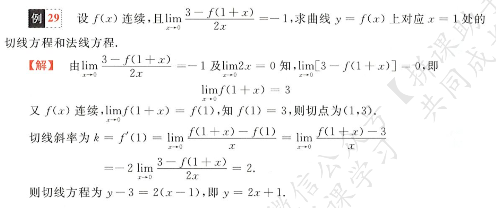

### 微分的概念及几何意义

#### 微分概念

***微分，即微小的变化量***

先考虑因变量 y 在自变量 x 微小变化时的变化量 ▲y
$$
\triangle y = f(x_0+\triangle x)-f(x_0)
$$
若上式可以表示为这样的多项式形式，则称**该函数在x0点可微**
$$
\triangle y = A\triangle x + o(\triangle x)
$$

- 其中 A 为一个表达式（多项式）
- o(x) 为 ▲x 的高阶无穷小，即当 x 趋于 0 时该项被视为 0

理所当然的，当 x 微小变化时，y 的变化仅由`Ax`决定，于是我们定义微分
$$
dy = A\triangle x
$$
在实际函数中，这个 A 就是导数，x 即为 dx
$$
dy = f'(x_0)\triangle x = f'(x_0)dx
$$

- 这个`d`有取无穷小的意思，如`dx`表示`x, x->0`，也就是所谓**微分**

给我狠狠地代入定义

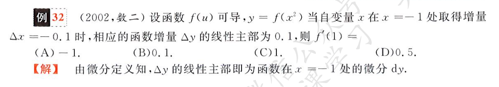

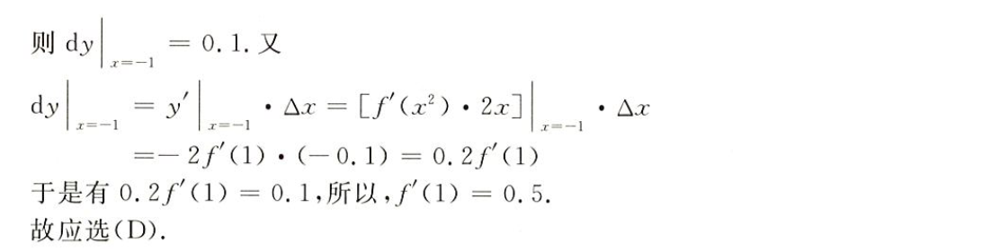

注意，这两种写法是完全等价的
$$
\mathop{lim}_{\triangle x\rightarrow0}\triangle x\sim dx
$$
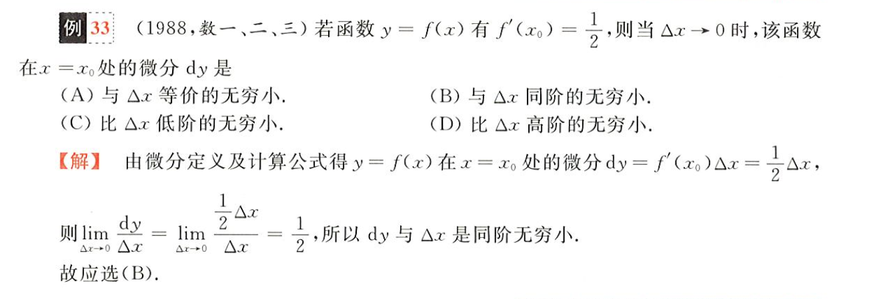

#### 微分几何意义

微分的几何意义：就是当自变量微小变化时，纵坐标的**增量**

但要注意**增量总是大于微分**，除了当自变量趋于 0 时

### 连续、可导、可微的关系

可导是可微的充分必要条件，连续不一定可导，可导一定连续

- 连续是函数值极限相等
- 可导是函数值变化量极限相等

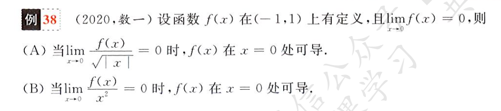

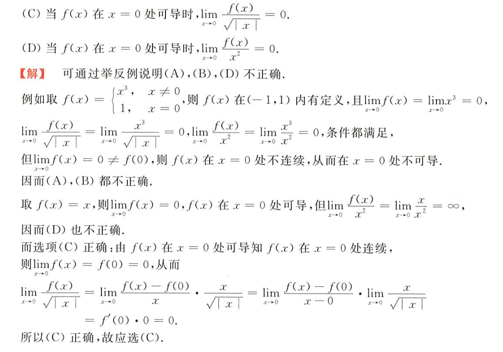

其实也没有这么麻烦，从直觉上来说，如果`f(x)`在`x=0`处可导，也就是说下式存在

- 已经假设可导，所以连续，故`f(0) = limf(x) = 0`

$$
\mathop{lim}_{\triangle x\rightarrow0}\frac{f(\triangle x)}{\triangle x}
$$

换一个说法，`f(x)`和`x`是同阶无穷小，于是可以直接根据无穷小的阶数判断选项是趋于 0 还是无穷

这里一定要注意在**分子分母都趋于 0 时，分母阶数越高，整体将趋于无穷**，不要想当然的觉得更高阶就会趋于 0，越高表示越小

## 导数和微分的计算

### 导数的计算

#### 初等函数求导公式

实际上就是泰勒展开的第一项

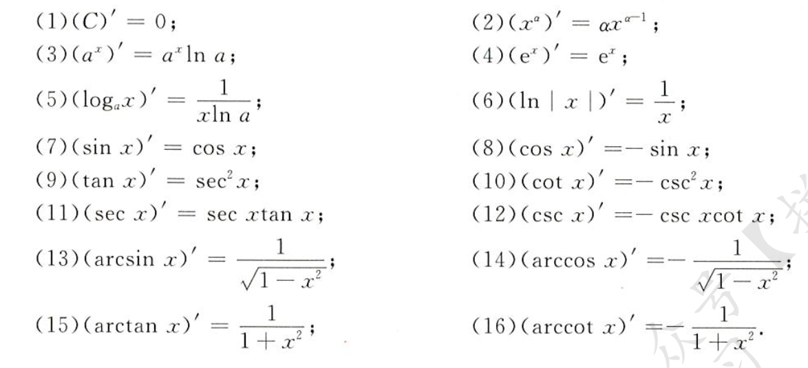

复合函数求导
$$
[f(x)g(x)]' = f'(x)g(x) + f(x)g'(x)\\
[\frac{f(x)}{g(x)}]' = \frac{f'(x)g(x)-f(x)g'(x)}{g(x)^2}\\
f[g(x)]' = f'(u)g'(x)\,,\,\,u = g(x)
$$
对复杂函数求导，尽量先化简，特别对于对数中套指数，将指数作为系数提出，对数乘除化为对数加减，同底指数乘除化为指数加减

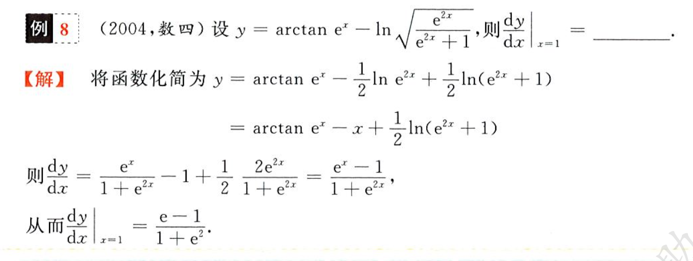

带有极限的函数求导，把 x 视作常数，运用第二个重要极限化简

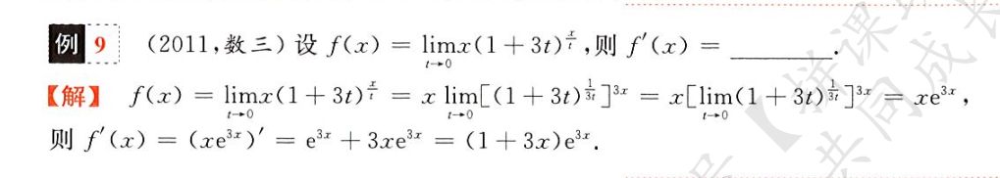

#### 复合函数求导

复合函数求导，严格遵守展开规律

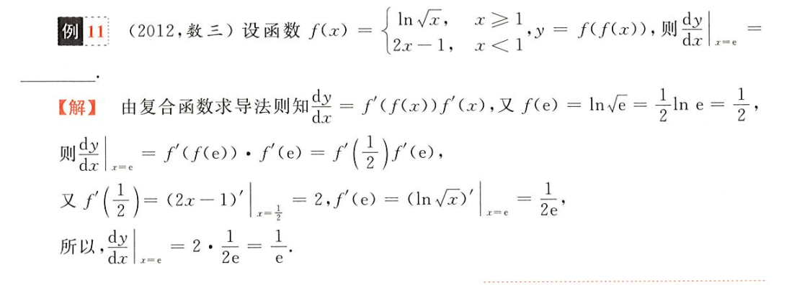

#### 反函数求导

反函数：将自变量和因变量的关系置换，但不改变原函数等式，如`y = arccosx`的反函数为`x = cosy`，`y = arctanx`的反函数为`x = tany`

反函数求导法则，设`f(x)`为原函数`g(y)`为其反函数，则
$$
f(x)' = 1/g(y)'
$$
如
$$
arcsinx' = \frac{1}{sixy'} = \frac{1}{cosy} = \frac{1}{(1-sin^2y)^{1/2}} = \frac{1}{(1-x^2)^{1/2}}
$$
重点在于反函数为`x = siny`，且该等式可以把 y 代换为 x

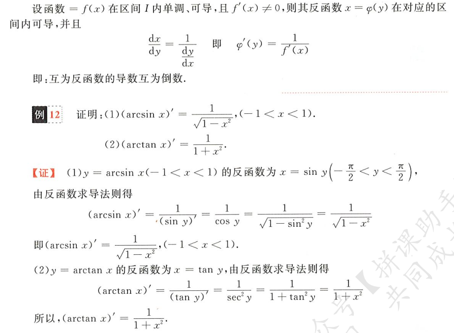

#### 隐函数求导

所谓隐函数，就是在函数表达式中，隐藏了一个以 x 为自变量的函数，这个函数可以是其自身，如`tany = ln(x+y)+2x`，在这要求其导数`y'`，则要对等式两侧同时对 x 求导，得
$$
(1+y^2)y' = \frac{y'}{x+y}+2 \Rightarrow y' = \frac{2}{1+y^2-\frac{1}{x+y}}
$$
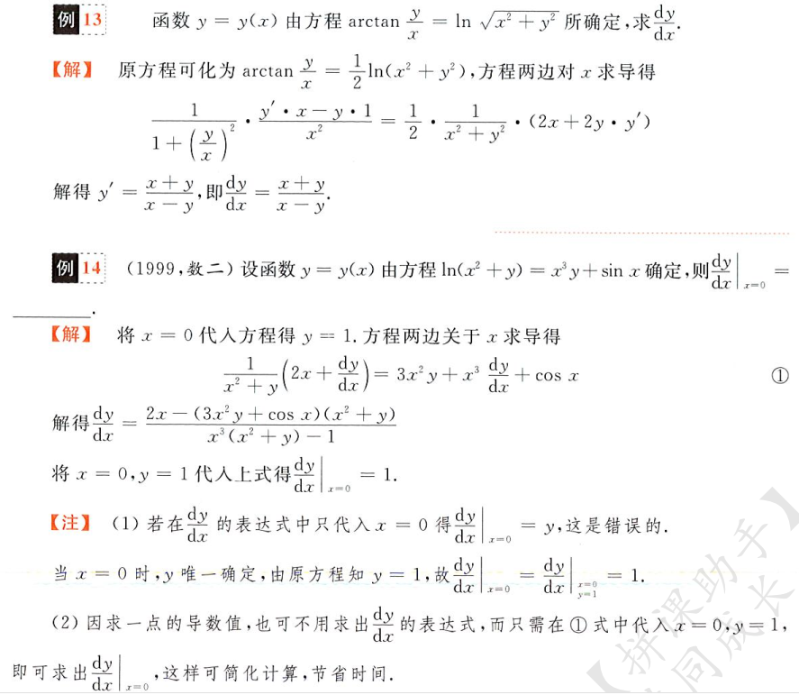

结合导数定义考察
$$
f(x)' = \mathop{lim}_{\triangle x\rightarrow0}\frac{f(x+\triangle x)-f(x)}{\triangle x}
$$
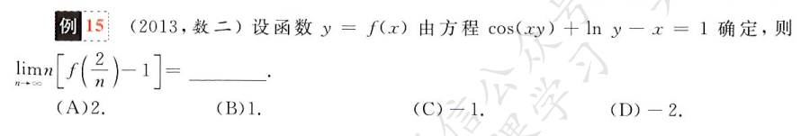

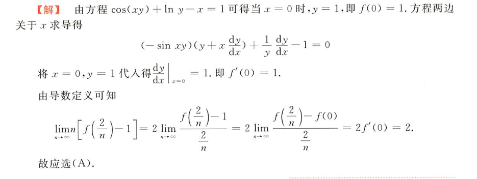

#### 对数求导法

### 高阶导数的计算

### 微分的计算

中值定理、不等式和零点问题

导数应用

一元函数积分学：

- 不定积分与定积分概念性质
- 不定积分与定积分计算
- 反常积分及其计算
- 定积分的应用
- 定积分综合题
