> 高等数学：函数、极限、连续、一元函数微积分学、多元函数的微积分学、常微分方程
>
> 同济六版高等数学中除了第七章微分方程考带`*`号的伯努利方程外，其余带`*`号的都不考；所有“近似”的问题都不考；第四章不定积分不考积分表的使用；不考第八章空间解析几何与向量代数；第九章第五节不考方程组的情形；到第十章二重积分、重积分的应用为止，后面不考了

> 线性代数：行列式、矩阵、向量、线性方程组、 矩阵的特征值和特征向量、二次型
>
> 数学二用的教材是同济五版线性代数，1-5章：行列式、矩阵及其运算、矩阵的初等变换及其方程组、向量组的线性相关性、相似矩阵及二次型

## 函数 极限 连续

### 函数的定义及性质

复合函数：`f[g(x)]`，注意`g(x)`的值域对应`f(x)`的定义域，`f(g(x))`的定义域是`x`的取值范围，但一般规范的是`g(x)`的取值范围

反函数：注意类似`y=x^2`这样的函数并没有反函数，因为一个`y`对应多个`x`，并不符合函数要求（但可以说是曲线）
$$
f^{-1}[f(x)] = x\\
f[f^{-1}(x)] = x
$$
基本初等函数

- 幂函数：x 为底数
- 指数函数：x 为指数
- 对数函数
- 三角函数：正割等于余弦分之一
  - sin-cos：正弦余弦，定义域`R`，值域`[-1,1]`
  - tan-cot：正切余切，注意分母不为零，值域`R`
  - sec-csc：正割余割，注意分母不为零，值域`(-∞,-1]∪[1,+∞)`
- 反三角函数
  - arcsin：反正弦，定义域`[-1,1]`，值域`[-π/2, π/2]`
  - arccos：反余弦，定义域`[-1,1]`，值域`[0,π]`
  - arctan：反正切，定义域`R`，值域`(-π/2,π/2)`
  - arccot：反余切，定义域`R`，值域`(0,π)`

这里 tan 函数的定义域是 R 去掉分母为 0 的部分，而反函数 arctan 定义域为 R（因为 tan 函数值域为 R），但值域只能在 tan 函数的一个周期内，不然就不会满足函数定义，其余反三角函数同理

三角函数性质

转换
$$
sin^2x+cos^2x=1\\
sec^2x=1+tan^2x\\
csc^2x=1+cot^2x\\
arcsinx+arccosx=\pi/2\\
arctanx+arccotx=\pi/2\\
$$
导数
$$
(sinx)'=cosx\\
(cosx)'=-sinx\\
(tanx)'=sec^2x\\
(cotx)'=-csc^2x
$$
函数性质：单调性；奇偶性；周期性；有界性

奇偶

- 奇函数乘除奇函数，偶数个结果为偶，奇数个结果为奇
- 偶函数乘除偶函数结果总是为偶
- 奇函数乘除偶函数结果为奇
- 奇函数若在 x=0 有定义，则 y 一定为 0

周期

- 若自变量变化速度增加两倍（系数乘以 2），则周期减半
- 周期函数相加减，新函数也具有周期性，且周期为两个周期的最小公倍数

有界：多涉及放缩或极大极小值判断

### 极限概念及无穷小/大

> 重点

数列极限，定义
$$
\exist N\in R,\,当\,n>N,\,有\,|a_n-b|<\varepsilon\in Z^{+}\\
则\,b\,为数列\,a_n\,的极限
$$
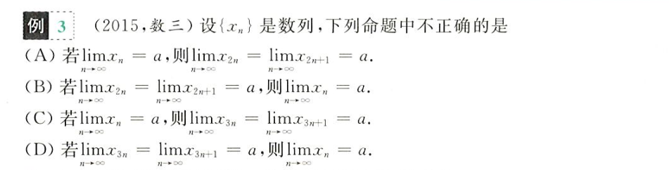

- 3n 和 3n+1 没有包含所有情形，还应加上 3n+2
- 同理，若为 4n，则必须要有`4n+1, 4n+2, 4n+3`才能充分证明

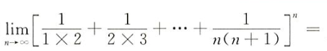

- 首先是一个经典的`1/(2x3) = 1/2-1/3`转换消去中间项

- 第二用到对数转换和等价无穷小
  $$
  \mathop{lim}_{n\rightarrow\infty}\,\,log_a(1+\frac{1}{n}) = \frac{1}{n\times lna}
  $$
  将中括号中内容加对数得`T = ln(1+1/t)^t`，将指数`t`提出，将对数部分`1+1/t`利用等价无穷小转换为`1/t`， 求得`T = 1`，还原对数得原式为`e`，再对指数`e^m`进行极限运算，得出最终结果

函数无穷极限，定义
$$
\mathop{lim}_{x\rightarrow\infty}f(x) = \mathop{lim}_{x\rightarrow+\infty}f(x) = \mathop{lim}_{x\rightarrow-\infty}f(x)
$$
极限不存在情形
$$
\mathop{lim}_{x\rightarrow\infty}f(x) = \infty\\
\mathop{lim}_{x\rightarrow+\infty}f(x) \neq \mathop{lim}_{x\rightarrow-\infty}f(x)  
$$
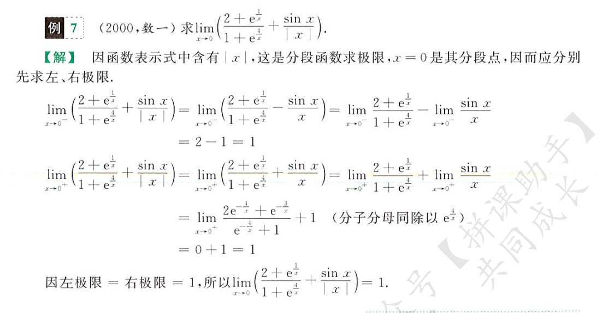

- 不管有没有绝对值，一定要分段讨论，分别判断左右极限，最终才能得出结论

- 当 x 趋于 0 时，除了绝对值，诸如
  $$
  e^{\frac{1}{x}}\,,\,arctan\frac{1}{x}
  $$
  均要左右求极限，很明显左右极限不等

函数在有限值的极限，和无穷极限同理，一样分左右（不等或任有一个等于无穷则极限不存在），自变量趋近的值为有限值 A

左右不等的极限

- 表达式带绝对值，自变量趋于 0

- `e - ∞`型
  $$
  \mathop{lim}_{x\rightarrow0}e^{\frac{1}{x}}\,,\,
  \mathop{lim}_{x\rightarrow\infty}e^x\,,\,
  \mathop{lim}_{x\rightarrow\infty}e^{-x}
  $$

- `arctan - ∞` 型
  $$
  \mathop{lim}_{x\rightarrow0^-}arctan\frac{1}{x} = -\frac{\pi}{2}\\
  \mathop{lim}_{x\rightarrow0^+}arctan\frac{1}{x} = \frac{\pi}{2}\\
  $$

极限的保号性

- xn > 0 恒成立，只能推出其极限 A >= 0（并非 A > 0）
- 若极限 A > 0，可以推出 xn > 0 恒成立

向答案靠拢，令 ε = a/2，通过不等式以及保号性推算结果，不要臆想

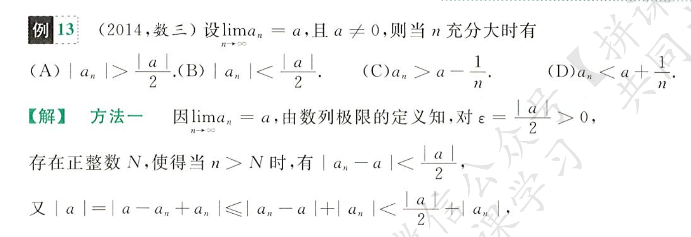

无穷小和无穷大量

- 有界量（如 4sinx + 3）和无穷小的乘积为无穷小

- k 阶无穷小，若
  $$
  lim\frac{\beta}{\alpha^k}=c\in R
  $$
  则称 β 是 α 的 k 阶无穷小（β 远比 α 要小）

- 高阶无穷小：若相除为 0，说明分子比分母更快趋于 0，分子是分母的高阶无穷小；相对的，分母是分子的低阶无穷小

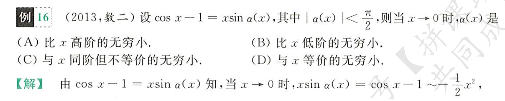
$$
cosx-1\sim-\frac{1}{2}x^2
$$

$$
e^{x}-1\sim x\\
ln(1+x)\sim x\\
^n\sqrt{1+x}-1\sim \frac{x}{n}
$$
连续洛必达中根据分子/分母趋于 0 解未知数

- 这里继续洛可以得到 -6b = a^3，根据这里的 a-1 = 0 可解出答案

- 三个等价无穷小

极限值与无穷小的关系
$$
limf(x) = A <=> f(x) = A+\alpha(x)\\
lim\,\alpha(x) = 0
$$

无穷大：无穷大乘以非零常数仍为无穷大

无穷大的比较：通过除法以及洛必达法则可证明

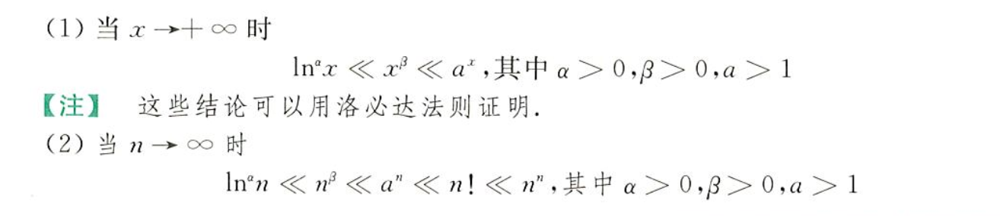

注意**无界变量**和无穷大量的区别，如对于数列`xn = {1,0,3,0,...,2n+1,0,...}`，其在奇数位为 x，在偶数位恒为 0，当 n->∞ 时，你不能说他是一个无穷大量，而是一个无界变量

### 极限的计算

> 重中重

#### 朴素求极限

常用结论

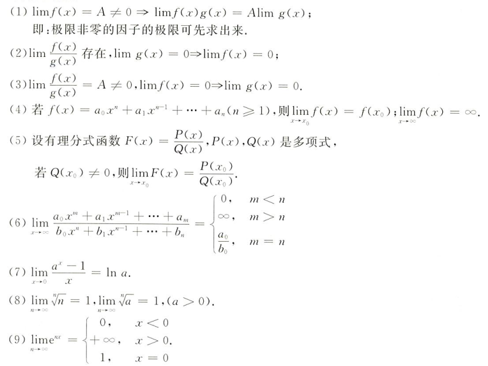

对于`根号-无穷`型极限

- 根号有理化
- 提出公因子，将根号中转化为 0（跟号外为无穷）（注意计算）
- 带入极限

$$
\mathop{lim}_{x\rightarrow+\infty}(\sqrt{x^2+x+1}-\sqrt{x^2-x+1})
$$

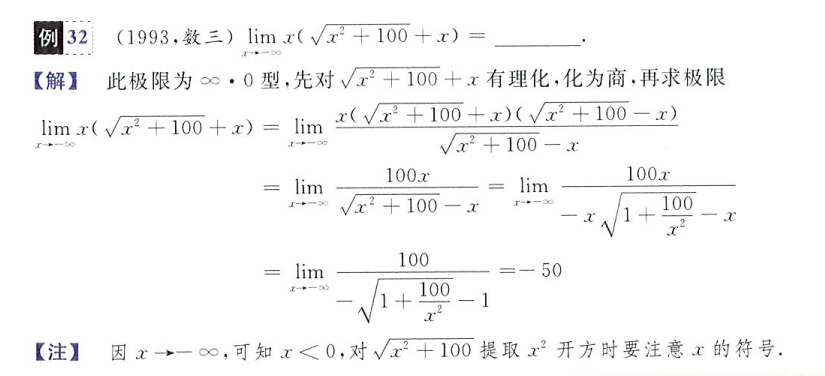

- 先有理化，再提公因子，比较稳妥
- 提公因子的时候还要注意符号

#### 两个重要极限

1、0/0 型：一般可以直接洛
$$
\mathop{lim}_{a\rightarrow0}\frac{sina}{a} = 1
$$
经典错误

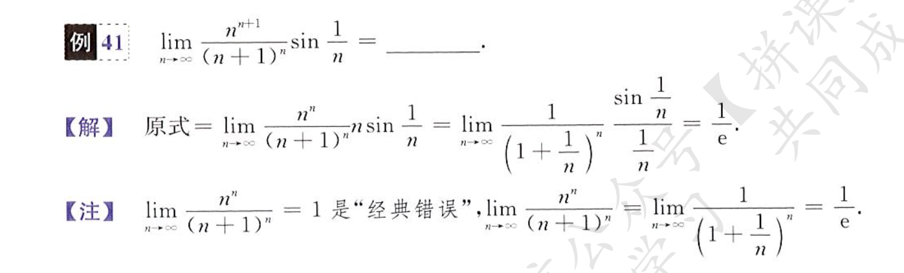

2、1-∞ 型：常用于幂指函数，刻意去凑 1
$$
\mathop{lim}_{a\rightarrow0}(1+a)^{1/a} = e
$$
注意两个重要极限均有趋于 0 的限制，在无穷小时才成立

对于幂指函数，还可以直接采用把指数化为 e 的对数指数的形式求解极限，如
$$
\mathop{lim}_{x\rightarrow0}(\frac{1+2^x}{2})^\frac{1}{x} =
\mathop{lim}_{x\rightarrow0}\,e^{\frac{1}{x}ln(\frac{1+2^x}{2})}\\
e^{lnx} = x
$$
回顾一下指数、对数求导
$$
(2^x)' = 2^x\times ln2\\
(log_2x)' = \frac{1}{x\times ln2}
$$
幂指函数求解极限一般方法

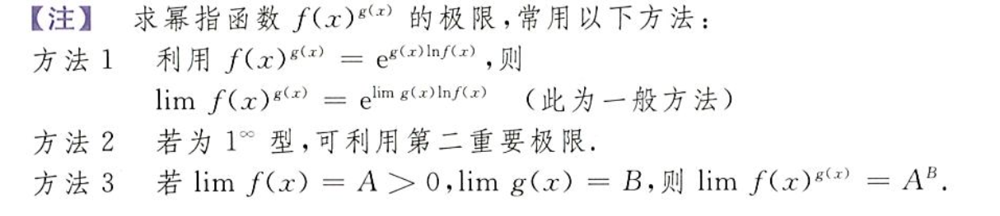

#### 等价无穷小

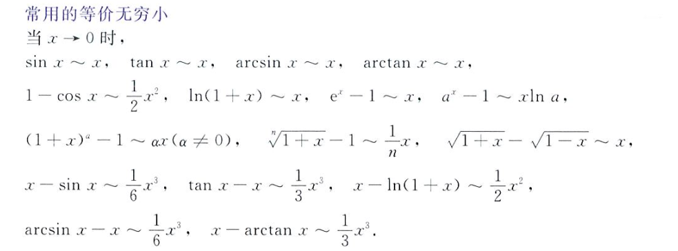

这个故事告诉我们不能一味的追求替换，当算则算

无穷小的和差项不要轻易拆开，尽力化为乘积项统一约分

证明题：证明两个极限等价，即证明这两个极限相除为 1

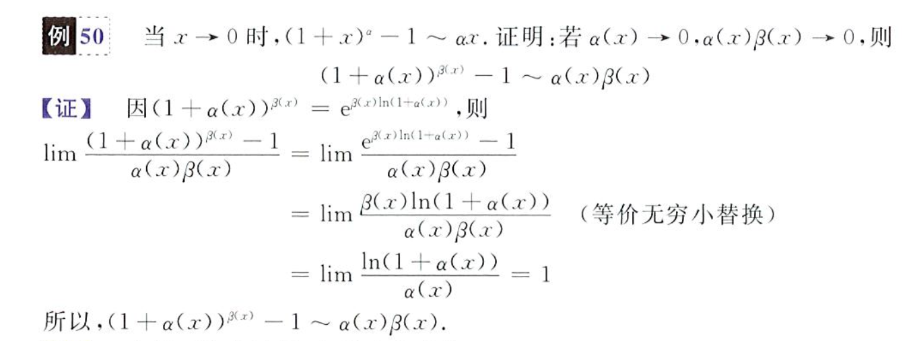

不要怕化出 1，`a+b`不如`a/b+1`

#### 洛必达

灵活的在**洛必达、无穷小替换、等价变换、直接求值**之间转换，不要拘泥于一种方法

- 先判断是否需要换元（转换为除法更好运算，全是乘法不好操作）
- 若有指数，考虑幂指转换
- 时刻注意分子分母有理化和算术变换（如三角函数变换，凑 1）
- 时刻注意是否可以**提出极限为常数的项**
- 判断是否有等价无穷小
- 碰到僵局尝试考虑洛必达

一些逆天
$$
\mathop{lim}_{x\rightarrow0}\frac{arctanx-sinx}{x^3}=-1/6\\
\mathop{lim}_{x\rightarrow0}\frac{e^x-e^{-x}-2x}{x-sinx}=2\\
\mathop{lim}_{n\rightarrow\infty}\,n\,tan\frac{1}{n}=e^{1/3}\\
\mathop{lim}_{x\rightarrow0}\frac{\sqrt{1+2sinx}-x-1}{x^2}=-1/2\\
\mathop{lim}_{x\rightarrow0}\frac{e^{x^{2}}-e^{2-2cosx}}{x^4}=1/12\\
$$
极限和无穷小的联系，α(x) 是一个虚构的未知的函数，在已知极限中某一项为 0 且不影响极限构成时（如 0-0 就不行），可以单独提出极限然后悄无声息地消去

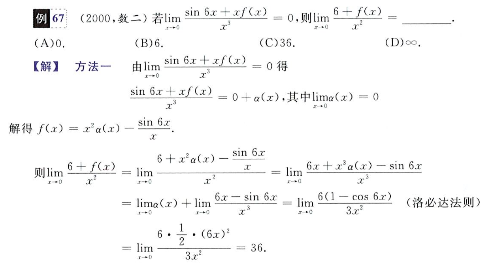

#### 夹逼准则

### 函数连续性

## 一元函数微分学

导数和微分概念

导数和微分计算

中值定理、不等式和零点问题

导数应用

## 一元函数积分学

不定积分与定积分概念性质

不定积分与定积分计算

反常积分及其计算

定积分的应用

定积分综合题
