## 动态规划

> Dynamic programming：使多阶段决策过程最优的通用方法
>
> 动态规划不仅是应用数学中用来解决某类**优化问题**的重要工具，而且在计算机领域被当作一种通用的算法设计技术

总体思想：分治思想

- 将待求解问题分解成若干个子问题，如果分解得到的子问题重复出现，可用表格将已计算出的结果保存以节省重复计算，从而降低时间复杂度
- 动态规划适用于解决包含重叠子问题的优化问题
- 重叠子问题一般出现在对给定问题求解的递归关系中，递归关系包含了更小子问题的解

动态规划基本步骤

- 分析问题最优解的结构，找出最优解的性质
- 递归地定义最优解的代价
- 以自底向上的方式计算出最优解的代价并保存
- 根据计算最优解的代价信息构造最优解

基本要素：最优子结构和重叠子问题

**最优子结构**，如果一个问题的最优解包含了它的子问题的最优解，则称此问题具有最优子结构

- 即该问题的最优解同时是其子问题的最优解

**重叠子问题**，递归算法中求解子问题，若重复求解同一子问题，则称该问题存在重叠子问题

**备忘录方法**，对子问题的求解结果进行保存，每向下求一步，保存一次，是自顶向下的；而动态规划不是，动态规划是自底向上的

应用范例：矩阵连乘问题，最长公共子序列，背包问题，最优二叉搜索树问题

### 矩阵连乘

> 将一个矩阵连乘不断分割，找到乘法次数最少的排列
>
> `p[]`数组记录矩阵阶数；`m[i][j]`数组记录从矩阵`i`乘到矩阵`j`的乘法次数；`s[i][j]`数组记录`m[i][j]`的分割位置 k

矩阵连乘问题，对于`pxq`乘以`qxr`的矩阵乘法，将得到一个`pxr`的结果矩阵，结果矩阵的每个元素需要`q`个元素相乘并相加，即共执行`prq`次乘法
$$
T(n) = T(pqr)
$$
在连乘时，不同的乘法次序将得到不同的新矩阵，从而总复杂度有多有少，如何找到复杂度最小的连乘

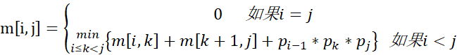

```c
void MatrixChain(int p[], int n, int m[][] ,int s[][]) {
    for(int i = 1; i <= n; i++) {
        m[i][i]=0; //最小的子问题，连乘矩阵个数为1
    }
    for(int r = 2; r <= n; r++) { //r代表连乘的矩阵个数，从2到n
        for(int i = 1; i <= n-r+1; i++) {  //枚举左边界
            // 确定右边界
            int j = i+r-1;
            // 将矩阵分为 m[i:i] 和 m[i+1, j] 作为本轮初始分割
            m[i][j] = m[i][i]+m[i+1][j]+p[i-1]*p[i]*p[j]; // m[i][i] == 0
            // 记录第几轮
            s[i][j] = i;
            for(int k = i+1; k < j; k++) {  // 讨论k的所有可能情况
                int t = m[i][k]+m[k+1][j] + p[i-1]*p[k]*p[j];
                if(t < m[i][j]) {
                    m[i][j]=t;
                    s[i][j]=k; // 选择数乘次数最小的情况，并将相关数据覆盖于表中的相应位置
                }
            }
        }
    }
}
```

举个栗子

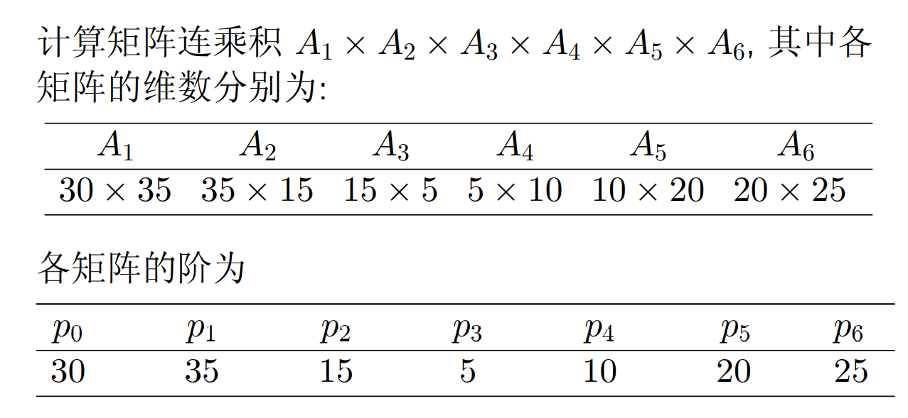

p 表比矩阵数大一轮，第三个矩阵的行数实际上就是第二个矩阵的列数，于是我们只需要存每个矩阵的行数，然后单独存最后一个矩阵的列数

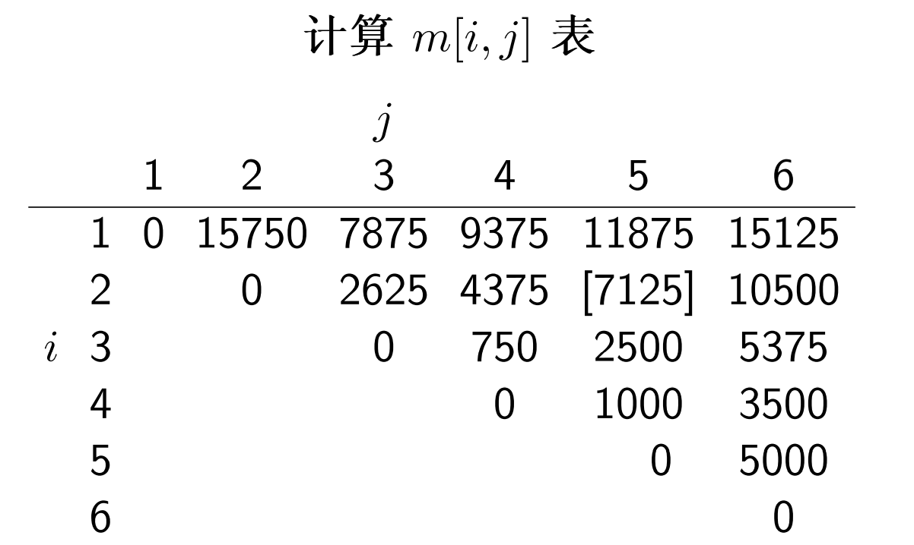

在计算时，严格根据子问题的大小逐级提升

- 先确定`m[i:i]`，均为 0
- 再算长度为 2 的子问题，如`m[1:2], m[2,3]`，这一步很好算，因为只有一种分割方法，其值实际上就等于`m[i:j] = p[i-1]p[i][j]`，因为`k = i`
- 再计算长度为 3 的序列，这里就有两种分割方法，如`m[2,4] = m[2:2] + m[3:4]`和`m[2,4] = m[2:3] + m[4:4]`，需要一一计算比对赋予`m[2:4]`最小的一个值

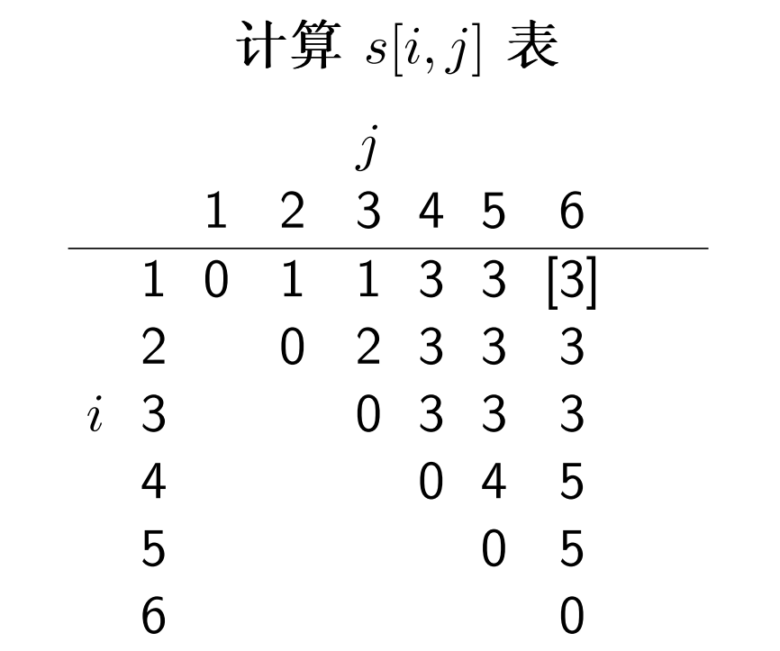

这个 s 表实际上记录的是子问题`m[i,j]`最佳的分割点，如`s[1,6] = 3`，就表示矩阵连乘问题`m[1:6]`的最佳分割点`k = 3`，该问题可被最佳分解为`m[1,3]`和`m[4,6]`

根据这个 s 表，我们可以输出得到最佳的连乘序列

```c
void print_optimal_parens(int s[], int i, int j){
    // i j 分别表示左右边界
    if(i == j){
        cout << 'A' << i << ' ';
    }
    cout << '(';
    print_optimal_parens(s, i, s[i][j]);
    print_optimal_parens(s, s[i][j]+1, j);
    cout << ')';
}
```

### 最长公共子序列

> longest common subsequence，LCS

求两个数组最长公共子序列的长度，注意子序列的定义：对于序列`[a,b,c,d,e]`，`[a,c,e]`是其子序列，因为顺序没有发生改变

递归定义

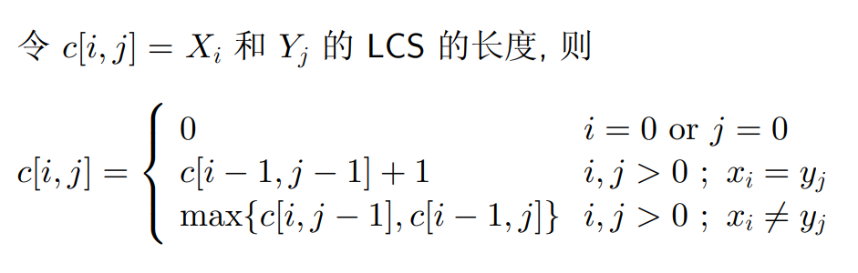


在实际求解时，先将“边框”全部置零，然后一点点向右下方遍历求解，

- 在遍历过程中，可以记录移动的方向，如`xi = yi`时，说明向右下方移动，`c[i,j-1] > c[i-1,j]`时说明向下方移动

```c
lcs-length(X, Y){
	m = length[X]
	n = length[Y]
    for i = 1 to m // 初始化“边框”
		c[i, 0] ← 0
	for j = 0 to n
		c[0, j] ← 0
 	for i = 1 to m
		for j = 1 to n
			if xi == yj
 				c[i, j] = c[i − 1, j − 1] + 1
 				b[i, j] = "↖"
 			else if c[i − 1, j] ≥ c[i, j − 1]
 				c[i, j] = c[i − 1, j]
 				b[i, j] = "↑"
			else
 				c[i, j] = c[i, j − 1]
 				b[i, j] = "←"
	return c and b
}
```

根据返回的 b 数组，构造最优解（最长公共子序列）

```c
print-lcs(b, X, i, j)
	if i = 0 or j = 0
		return
	if b[i, j] = '↖'
		print-lcs(b, X, i − 1, j − 1)
		print xi
	else if b[i, j] = '↑'
		print-lcs(b, X, i − 1, j)
	else if b[i, j] = '←'
		print-lcs(b, X, i, j − 1)
```

只有当碰到`↖`时，说明当前字符一样，作为公共子序列的一部分输出

时间复杂度，因为在构造`dp[][]`数组时用了外层`m`内层`n`的双重嵌套，所以复杂度为：`O(mn)`

### 最长递增子序列

> Longest Increasing Subsequence，LIS

```c
lis-length(A)
	for i = 0 to len(A)
		L[i] = 1 // 初始化每位最长长度为 1
		for j = 0 to i // 遍历A[i]之前的元素，找到当前元素的最长递增子序列，并记录长度于L[i]
			if A[j] > A[i] and L[i] + 1 > L[j]
				L[j] ← 1 + L[i]
	return max(L) // 返回L数组中的最大值
```

### 0/1 背包问题

> Knapsack 问题

就是往背包里放东西使价值最大，限制条件是容量

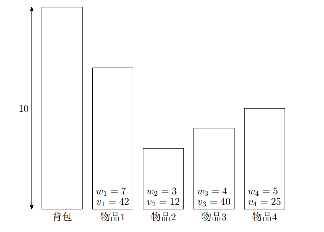

线性规划问题

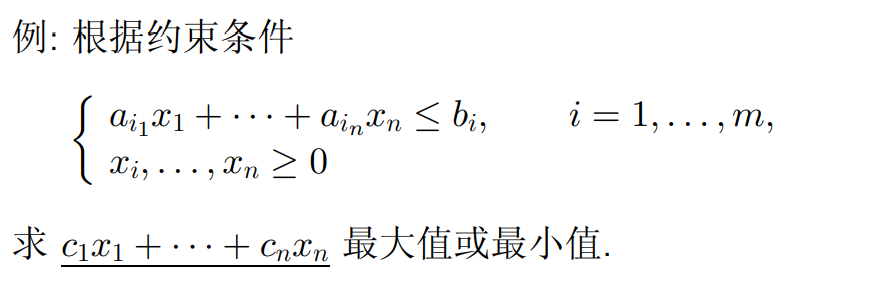

递归关系（状态转移方程）

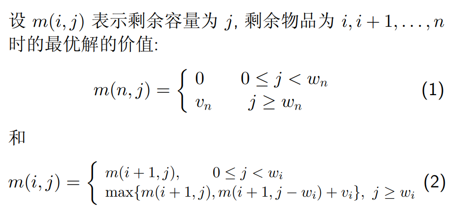

j 就是当前背包空余，w 为物品重量，若 j < w，物品装不进去，为空，向后继续判断，实际上就是一个根据 w 和 j 填表格的事

i 是指从第几个物品开始往背包中放，若 j < w 即容量不够将向后递归

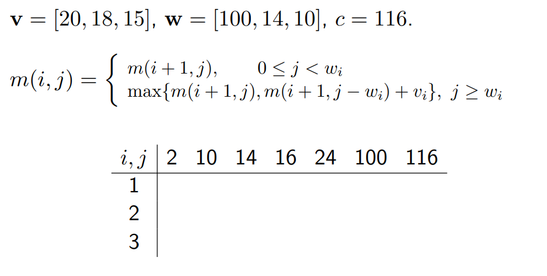

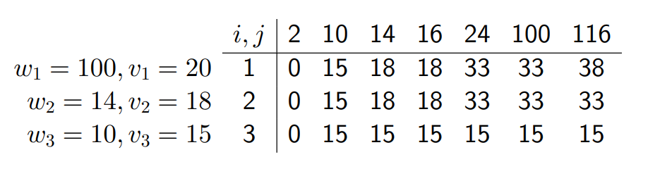

根据上表判断每个物品的 0/1 值（取了或者没取哪些物品）

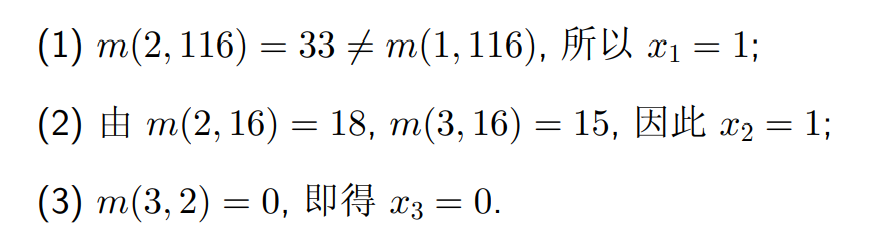

- 就是看最终结果和哪一列匹配（列表示当前背包容量）

时间复杂度：O(nc)

补充背包问题：物品可以被重复取出

### 最优二叉搜索树

> 二叉搜索树：左节点小于根，右节点大于根，没有平衡限制

每个键有一个被搜索概率，要让平均搜索次数最少，这样的二叉搜索树叫做最优二叉搜索树

如

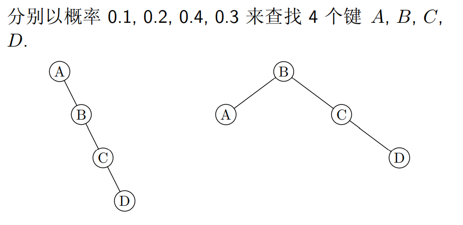

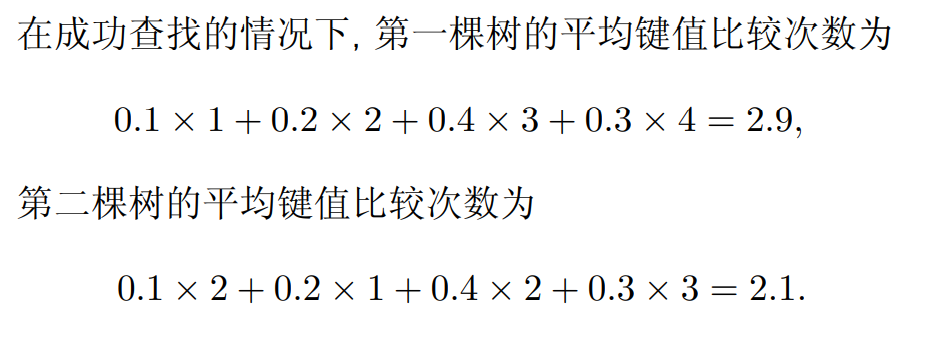

构造最优二叉搜索树递推公式

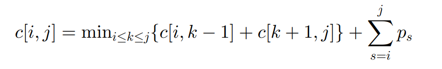

示例

- 查找键值：`A,B,C,D`
- 查找概率：`0.1, 0.2, 0.4, 0.3`

得到 c 表和 r 表

- `c[i,j]`表示从键值`i-j`构造的最优二叉搜索树的平均搜索次数
- `r[i,j]`表示从键值`i-j`构造的最优二叉搜索树的根，并且其左子树为`r[i,k-1]`，右子树为`r[k+1, j]`

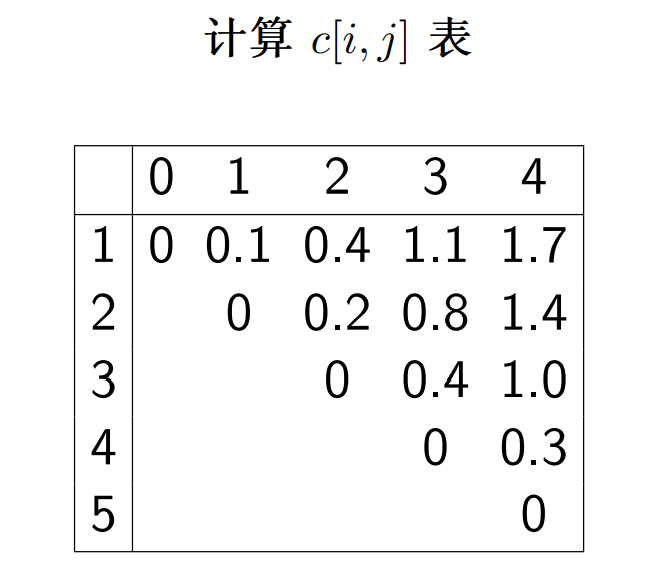

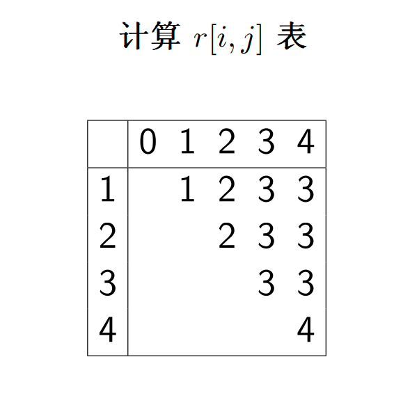

根据 r 表构造最优二叉搜索树

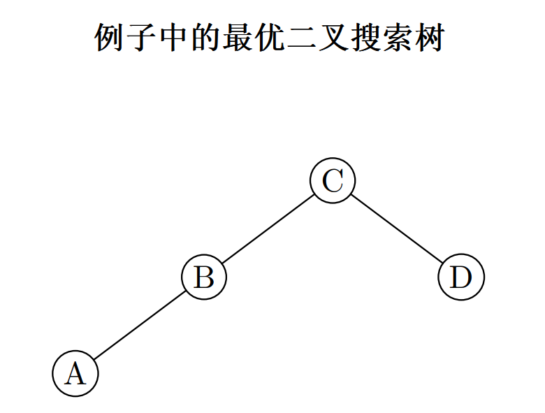

伪代码

```c
OptimalBST(p[1..n])
	for i ← 1 to n
		c[i, i − 1] ← 0
		c[i, i] ← p[i]
		r[i, i] ← i
		c[n + 1, n] ← 0
	for l ← 1 to n
		for i ← 1 to n − l + 1
			j ← i + l − 1
			minval ← ∞
			for k ← i to j
				if c[i, k − 1] + c[k + 1, j] < minval
					minval ← c[i, k − 1] + c[k + 1, j]
  					kmin ← k
				r[i, j] ← kmin
  				psum ← p[i]
				for s ← i + 1 to j
					psum ← psum + p[s]
				c[i, j] ← minval + psum
	return c[1, n], r
```

时间复杂度：O(n^3)

## 贪心算法

经典算法：活动选择问题，装载问题，哈夫曼编码，单源最短路径，最小生成树

概述：一步一步构建问题的最优解决方案，其中每一步只考虑眼前的最佳选择，不是为了找到全部解，而只是找出一种可行解（众所周知局部最优解叠加不一定是全局最优解）

贪心算法产生最优解的条件

- 贪心选择性：若一个优化问题的全局最优解可以通过局部最优选择得到，则该问题称为具有贪心选择性
- 最优子结构：若一个优化问题的最优解包括它的子问题的最优解，则称其具有最优子结构
- 局部最优选择

动态规划和贪心算法的明显区别：动态规划每一步做出一个选择，该选择**依赖**于子问题的解；贪心算法每一步做出一个选择，该选择**不依赖**于子问题的解

### 活动安排问题

就是无重叠区间，找出一系列活动中，活动区间不重叠的活动，返回不重叠的活动数量

力扣 435：[无重叠区间](https://leetcode.cn/problems/non-overlapping-intervals/)

将活动按照结束时间从小到大排序，以满足**贪心选择性**，遍历一次得到结果

```c
class Solution {
public:
    int eraseOverlapIntervals(vector<vector<int>>& intervals) {
        if(intervals.empty()){
            return 0;
        }
        int n = intervals.size();
        sort(intervals.begin(), intervals.end(), [](const auto& u, const auto& v){
            return u[1]<v[1];
        });
        int ans = 1;
        int right = intervals[0][1];
        for(int i = 1; i < n; i++){
            if(intervals[i][0] >= right){
                ans++;
                right = intervals[i][1];
            }
        }
        return n-ans;
    }
};
```

因为要根据每个活动的结束时间对活动进行排序后再遍历，所以时间复杂度为
$$
T(n) = Θ(n) + Θ(nlogn) = Θ(nlogn)
$$

### 最优装载

n 为集装箱总数，c 为船载重，w 数组记录每个集装箱的重量，要求往穿上装载最多的集装箱

示例：假设 n = 3，c = 50，且 w = [10, 40, 40]

- 则可以将集 装箱 1 和 2 装到轮船上
- 如果 w = [60, 70, 70]，则无法装船，即该装载问题无解

就是把重量从小到大排序，使问题满足贪心选择性，然后遍历，若可以装，则加一，否则退出

```c
int opt_loading(int c, int[] w, int n){
    sort(w.begin(), w.end());
    int count = 0;
    for(int i: w){
        if(i <= c){
            count++;
            c -= i;
        }
    }
    return count;
}
```

### 哈夫曼编码

> 哈夫曼编码广泛用于数据文件压缩的十分有效的编码方法
>
> 哈夫曼编码算法使用字符在文件中出现的频率表来建立一个用 0, 1 串表示各字符的最优表示方式

就是用一个`0,1`串表示某个字符，如用`000`表示`a`，用`001`表示`b`

定长表示：用长度固定的 01 串表示字符

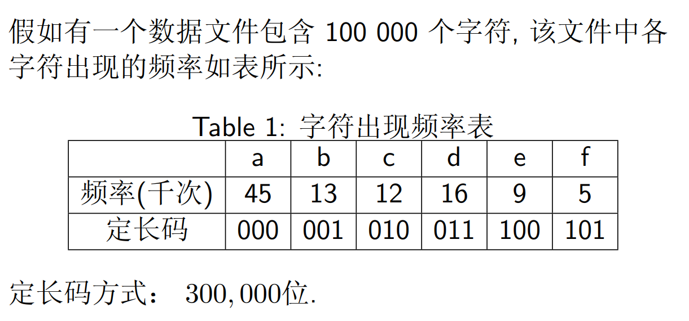

共需 (45+13+12+16+9+5) x 1000 x 3 = 300000 位码来表示这个文件

变长表示

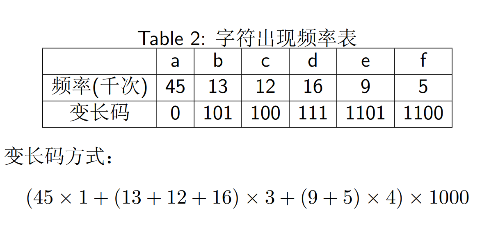

前缀码：使得一个 0/1 串可以被唯一分解（同计网划分子网）

如

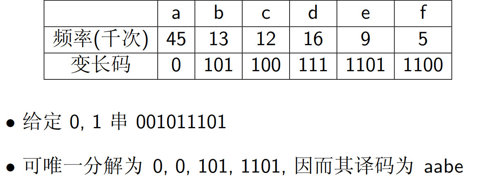

二叉编码树

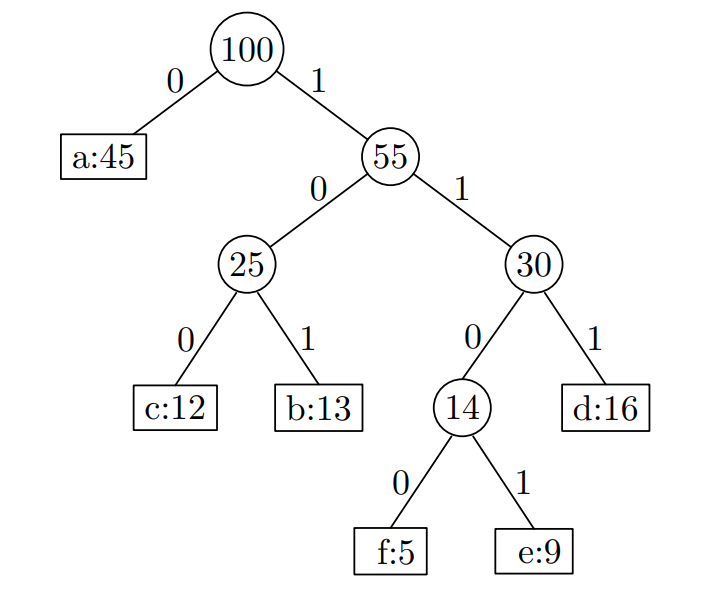

编码树 T 的代价 B(T) 为

- C 为字母表
- f(c) 为字母 c 出现次数
- d(c) 为字母 c 在编码树 T 的深度

$$
B(T) = \sum_{c∈C}f(c)d_T(c)
$$

Huffman 算法：产生最优前缀编码树令 B(T) 最小，**每次选取出现次数最少的两个字符组成一颗子树并作为当前最小生成树**，这颗子树的值为两个字符出现次数之和，不断执行这一过程直到只剩一个分支

同样的，因为每次都要选取最小的两颗子树，涉及到排序，哈夫曼算法的时间复杂度：O(nlogn)

### 单源最短路径 - Dijkstra

> Dijkstra 算法

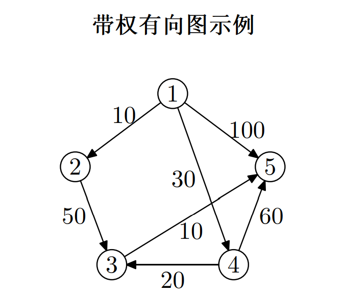

Dijkstra 算法

从起点 1 开始，每次**选取距离最近的节点进行迭代**，每次迭代都要更新所有节点到起点 1 的距离，若更近则更新，**直到终点被迭代到**

- 被选取就意味其到起点的最短距离已被确定

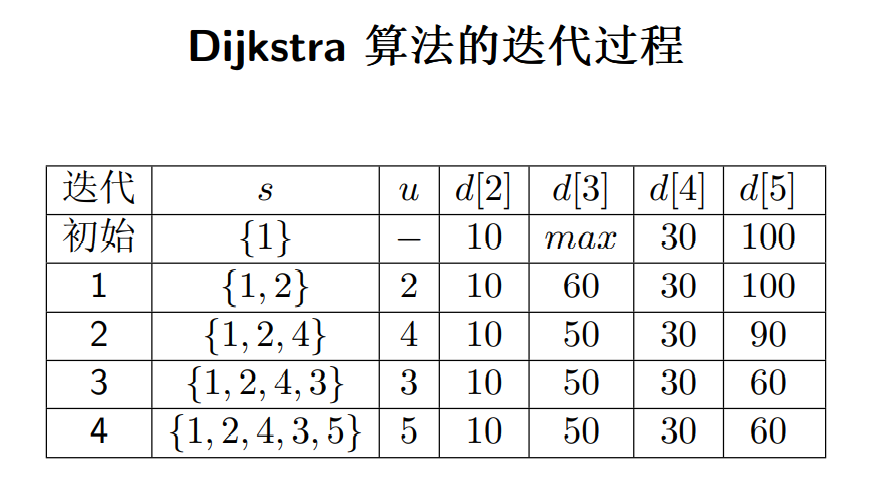

### 最小生成树

将一个无向带权图 G 转化为一棵树 G'，G' 包含 G 的所有顶点，G‘ 为 G 的生成树

- 生成树 T 上各边权的总和称为该生成树的代价，记作 c(T) = P (u,v)∈T c(u, v)
- 在 G 的所有生成树中, 代价最小的生成树称为 G 的最小生成树

如

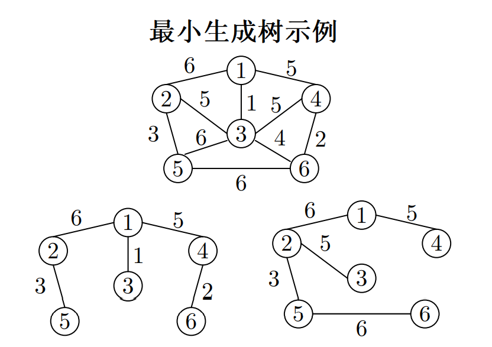

生成树 1 代价为 17，生成树 2 的代价为 25

MST 性质：最小生成树一定包含当前图中权最小的一条边

#### PRIM 算法

PRIM 算法，基于 MST 性质，根据已有的节点扩展边和节点

- 每次扩展当前权重最小的边：边的一个节点属于已有的生成树，另一个属于无向图中还未加入到生成树的节点
- 将当前最小的边和节点加入生成图，删除原图中的节点和边，继续下一轮扩展

示例

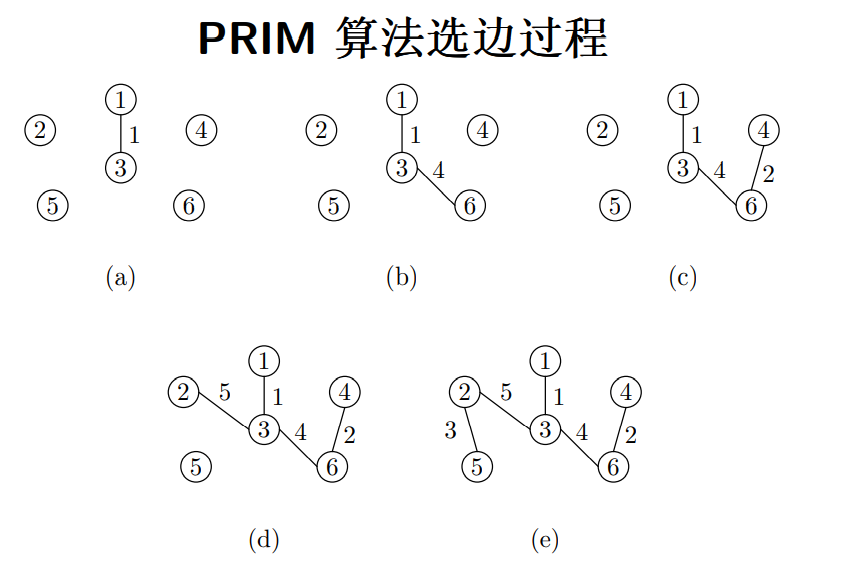

####  KRUSKAL 算法

Kruskal 算法：从无向图出发，每次寻找权重最小的边，将其**联合**进最小生成树

示例

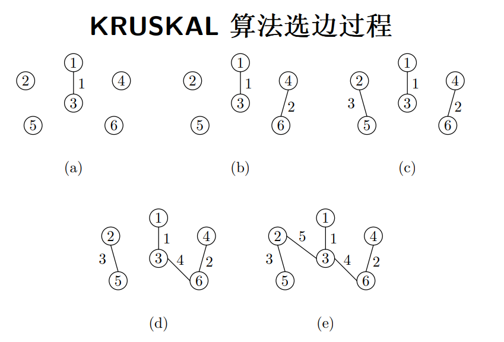

两种算法时间复杂度均为：`O(ElogE)`

当输入规模不同时（和 n^2 为对比），两算法有所差距
$$
E = Ω(n^2)\,\,Kruskal<Prim\\
E = O(n^2)\,\,Kruskal>>Prim\\
$$
