## 回溯法

基于 DFS，带有回退功能的深度优先搜索，可以提前结束一次错误的搜索或提前返回最优解

经典问题：装载问题，n 后问题，0-1 背包问题，旅行商问题

智能穷举法（intelligent exhaustive search）

- 回溯法（backtracking）
- 分支限界法（branch-and-bound）

回溯法的算法框架

- 按深度优先策略，从根结点出发搜索问题解空间树
- 算法搜索至解空间树的任意节点时，先判断该结点是否包含问题的解
  - 如果肯定不包含，则跳过对该结点为根的子树的搜索，逐层向其祖先结点回溯
  - 否则进入该子树，继续按深度优先策略搜索
- 回溯法求问题的所有解时，要回溯到根节点，且根节点的所有子树都已被搜索遍才结束

在最坏的情况下，还是要面对穷举查找中遇到的指数级爆炸问题

死节点和活节点：碰到死节点回溯至祖先活结点，重新进行扩展，直到解空间没有活节点

剪枝函数

- 约束函数：在扩展结点处剪去不满足约束的子树
- 限界函数：剪去得不到最优解的子树

回溯实现类型

- 递归回溯：对解空间作深度优先搜索
- 迭代回溯：采用树的**非递归**深度遍历算法

解空间树类型

- 子集树
- 排列树

### 装载问题

装载策略

- 首先将第一艘轮船**尽可能**装满
- 将剩余的集装箱装上第二艘轮船

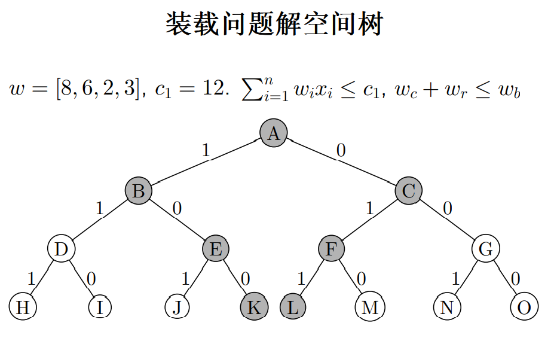

### n 皇后问题

n 皇后问题要求把 n 个皇后放在一个 n × n 的棋盘上，使得任何两个皇后都不能相互攻击，即它们不能同行，不能同列，也不能位于同一条对角线上（相当于象棋`士`和`帅`的移动），问一共有多少 种摆放方法

算法设计

- 对于`n`后问题, 用`n`元组`x[1..n]`表示它的解
- `x[i]`表示皇后`i`放在棋盘的第`i`行的第`x[i]`列，即坐标为`(i, x[i])`
- 约束条件
  - 解向量中的诸`x[i]`互不相同，即`x[i] != x[j]`
  - 任意 2 个皇后不在同一斜线，转化为`|i-x[i]| != |j-x[j]|`

### 0/1 背包问题

解空间：子集树

算法过程

- 无脑扩展左子树，即令当前`x[i]`为 1
- 设 Vr 是当前剩余物品价值总和，Vc 是当前价值，Vb 是当前最优价值，当 Vc + Vr ≤ Vb 时，可剪去右子树

计算最优值上界：按照性价比排序，优先装入性价比高的物品，装不下的时候装入部分当前性价比最高的物品，计算总价值

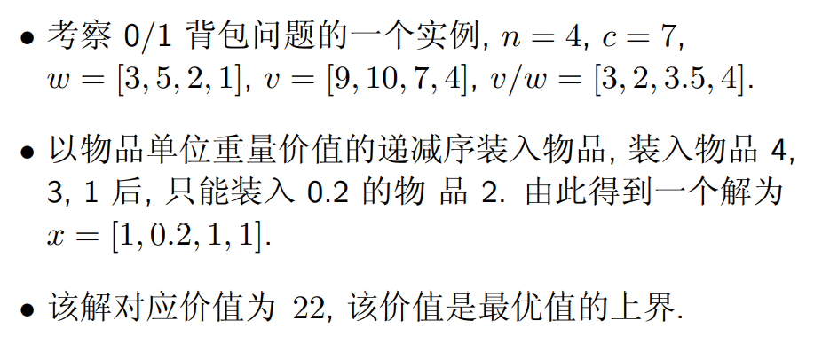

### 旅行商问题

给定一张带权图，**周游路线**指包括图每个节点的一条回路，**周游费用**指这条路线上的权之和，旅行商问题即找出周游费用最小的周游路线

解空间：排列树

算法设计

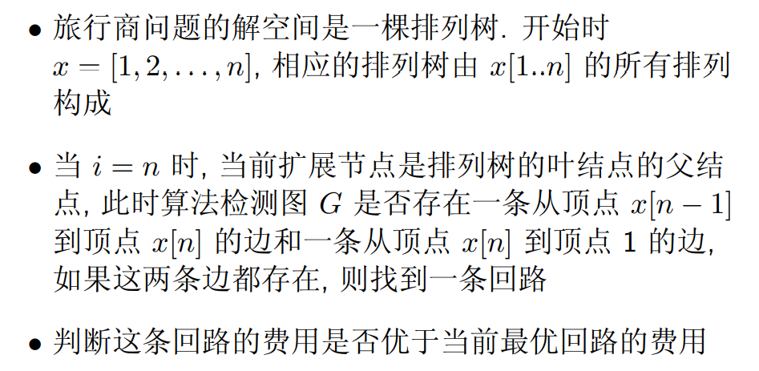

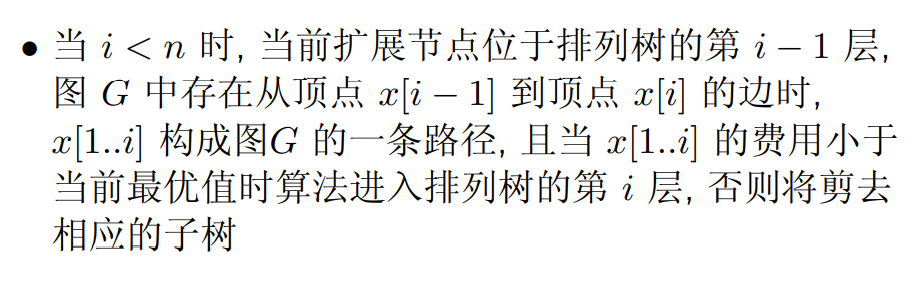

## 分枝限界法

基于 BFS，在扩展结点的过程中，边搜索边减去树的某些分支，在当前节点的儿子节点中找到最优的一个向下扩展

经典问题：单源最短路径问题，装载问题，0-1 背包问题

剪枝策略

- 节点不能构成可行解
- 该节点的边界值不优于目前最优解的解，有两种情况
  - 第一种：其边界值小于某来自**同一直系父节点**的兄弟节点
  - 第二种：多次访问到该节点，删除边界值较大的节点分支

两种分枝限界方式

- 队列式分支限界法：按照队列先进先出原则选取下一 个节点为扩展节点
- 优先队列式分支限界法：按照优先队列中规定的优先级选取优先级最高的节点成为当前扩展节点

### 单源最短路径问题

剪枝策略：优先级判定条件为当前节点到起点的路长

- 当不小于（大于等于）当前节点的最短路长，删去
- 当第二次经过该节点，删去路径较长的那一颗子树

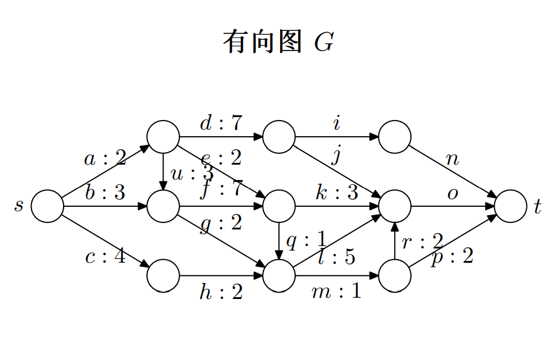

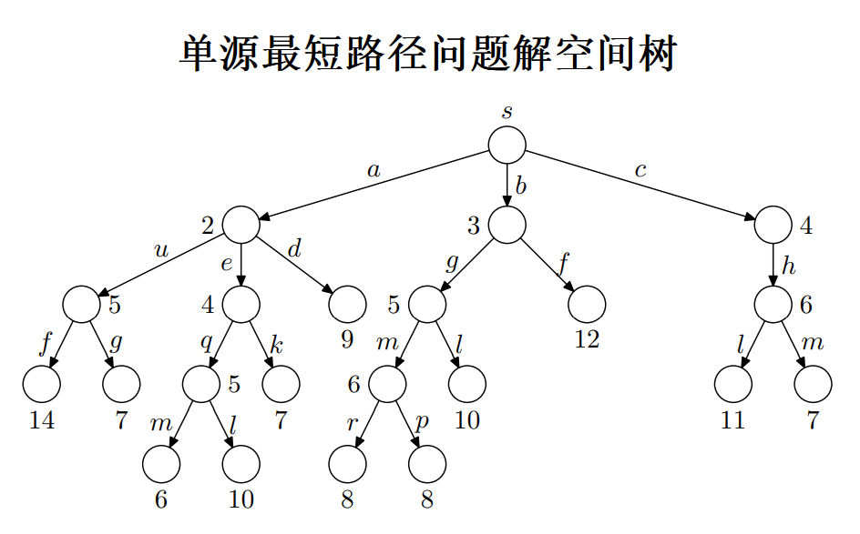

其中，经过路径 p 以最小的长度到达了终点 t

### 装载问题

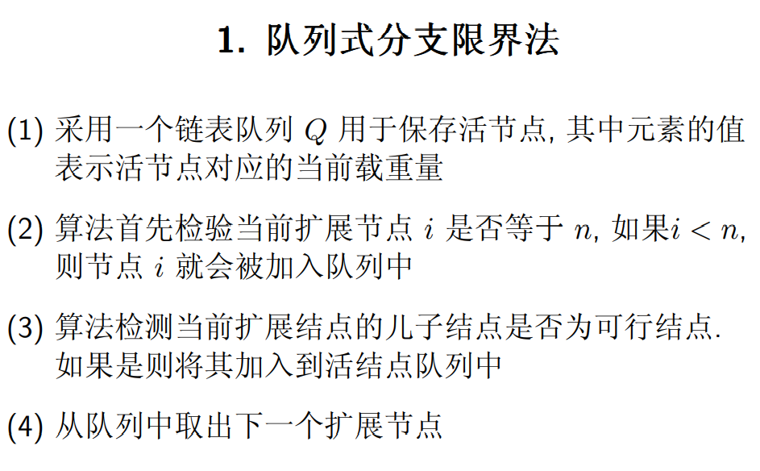

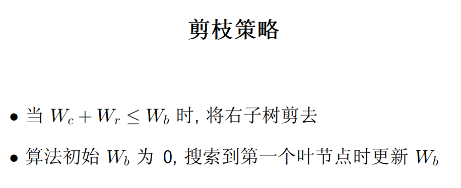

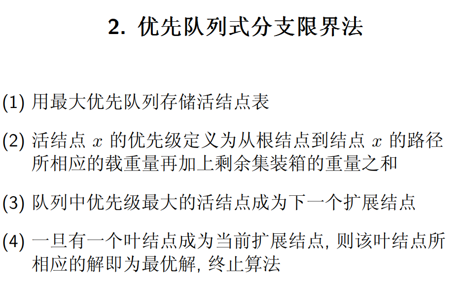

### 0/1 背包问题

考虑 0/1 背包问题：n = 3, w = [16, 15, 15], v = [45, 25, 25], c = 30

- 队列式分枝限界利用一个队列来记录活节点，节点将按照顺序从队列中取出
- 优先队列分枝限界使用一个最大堆，该队列的优先级定义为活节点所获得的价值

以这样的方式，可以列出所有背包装载的情况

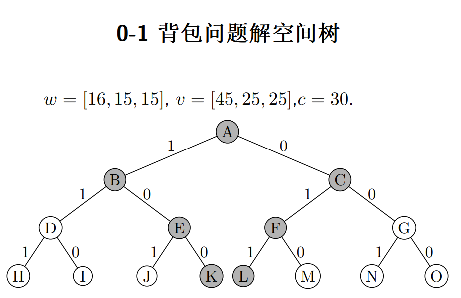

定义第 i 个物品的上界 ub（性价比）
$$
ub = v_i + (C − w_i)(v_{i+1}/w_{i+1})
$$
C 是当前还能装载的重量

对上述空间树进行剪枝，剪枝策略为

- 删除当前层直系兄弟节点中`ub`大于等于当前最小`ub`的节点分支
- 删除装不进的分支

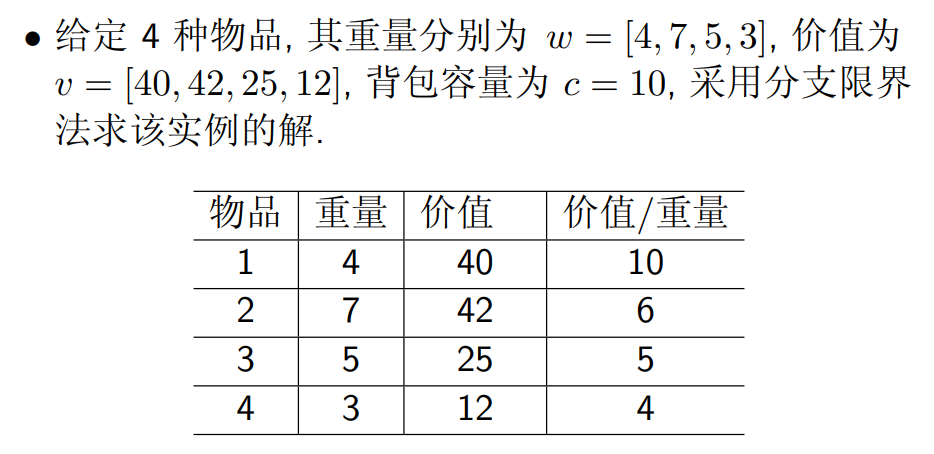

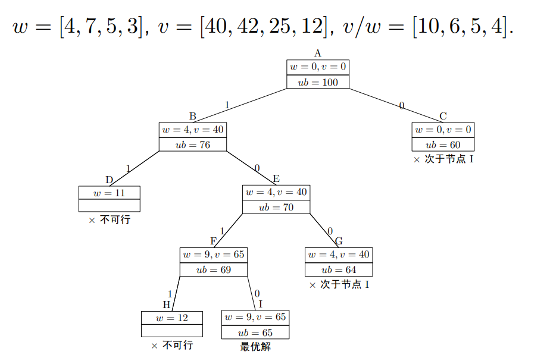

## 线性规划与网络流

### 线性规划算法模型

线性规划问题是一个多变量线性函数的最优化问题，参考高中的平面线性规划

- 所有可行解构成的集合为线性规划问题的可行区域
- 目标函数取得极值的可行解称为最优解, 在最优解 处目标函数的值称为最优值
- 有些情况下可能不存在最优解
  - 可行域不存在
  - 目标函数在可行域没有极值，即无界

举个栗子

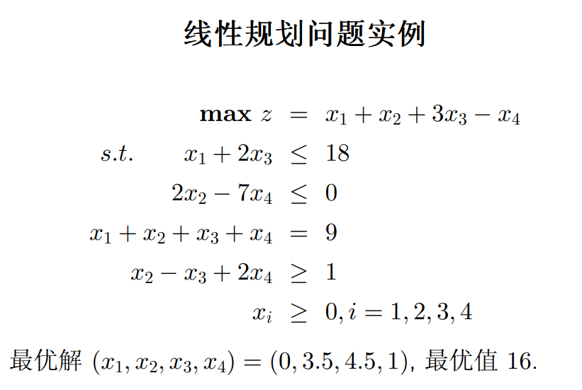

### 单纯形算法

> 求解线性规划问题

极点定理：可行区域非空的任意线性规划问题有最优解，而且最优解总是能够在其可行区域的一个极点上找到

于是产生朴素想法：穷举可行域中所有极点，找出最大值，但极点数是指数增长的

单纯形法的几何描述

- 先在可行区域内找到一个极点，然后检查一下邻接极点处是否可以让目标函数取值更佳
  - No，当前顶点就是最优点，算法停止
  - Yes，处理下个能让目标函数取值更佳的邻接顶点
- 有限步之后，该算法可以找到一个最优解的极点，或证明最优解不存在

线性规划问题的约束标准型，限制条件均为等式的线性规划问题称为约束标准型

在解决线性规划问题是添加一组**基变量**将限制条件全化为等式的形式，转化为约束标准型，再通过单纯形法进行求解

一个栗子：要求最大值的 z 的式子的各项系数是始终不变的；检验数均小于等于 0 时迭代完成，其中

$$
Z_j = C_B\times x_i\,,\,\,
如\,Z_1
=
[0,0,0]\times
\begin{bmatrix}
1\\
2\\
1
\end{bmatrix}
= 0
\\
δ_j = C_{B_j} - Z_j
$$
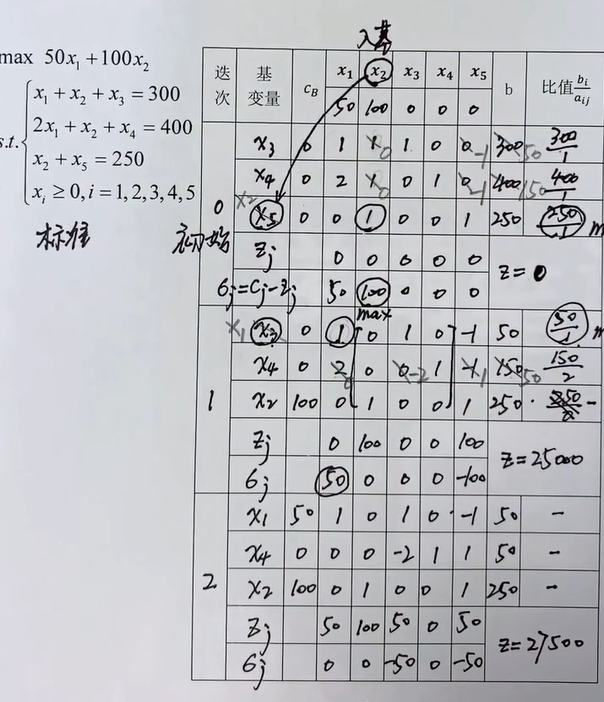

### 增广路算法

> 网络最大流

网络：即一张有向带权图，每条边有最大容纳流量`cap(v,w)`，表示从节点 v 到节点 w 这条边的最大容纳量

边的分类

- 零流边：flow = 0
- 饱和边：flow = cap
- 弱流边：flow < cap

最大流问题：每条边的输入输出流**没有浪费**

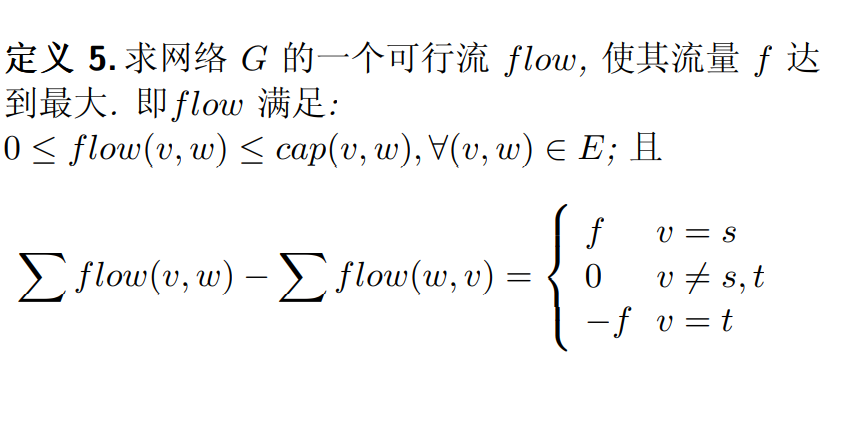

从起点 s 到终点 t，边的分类

- 向前边：边和路的方向一致
- 向后边：反之

可增广路定义：从 s 到 t 的一条路 P 中，所有向前边的 flow 均小于 cap，所有向后边 flow > 0（向前边非饱和，向后边非零流）

- 可增广路指，可以通过修正边流量使之成为流值更大的可行流

可增广路增流：就是向前边增多少，相关联的向后边就要减多少

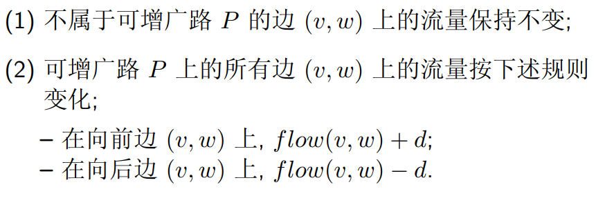

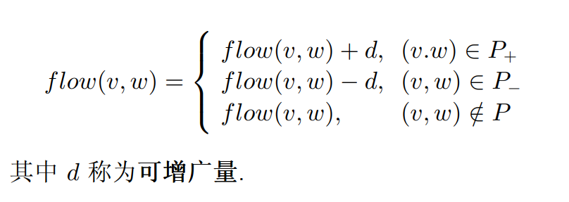

可增广量 d 必然是有限制的

- 他不会使任一向前流的 flow 超过其 cap
- 同时不会使任一向后流的 flow 小于 0

增广路定理：若 flow 是一条 G 的可行流，且不存在任何可增广路，则 flow 是网络 G 的一个最大流

一个栗子

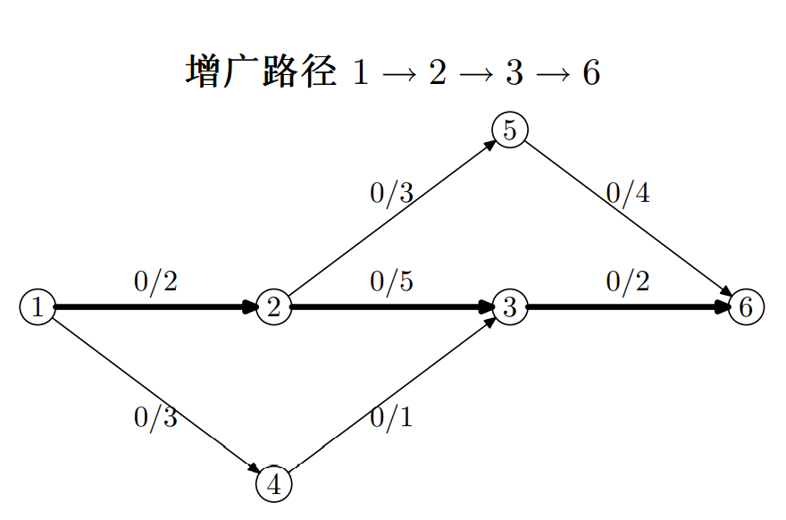

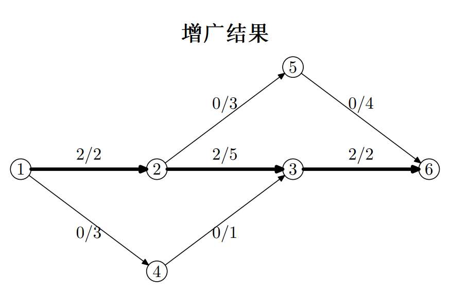

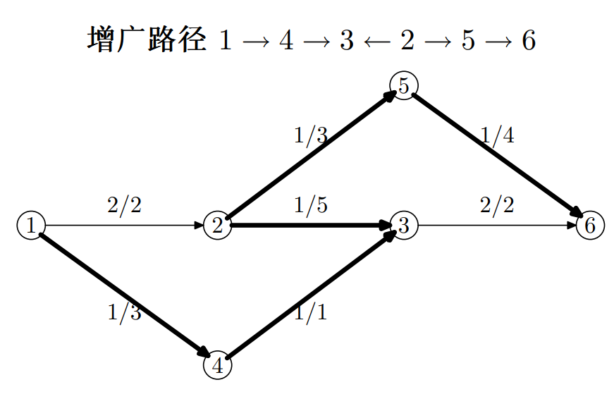

复杂度分析

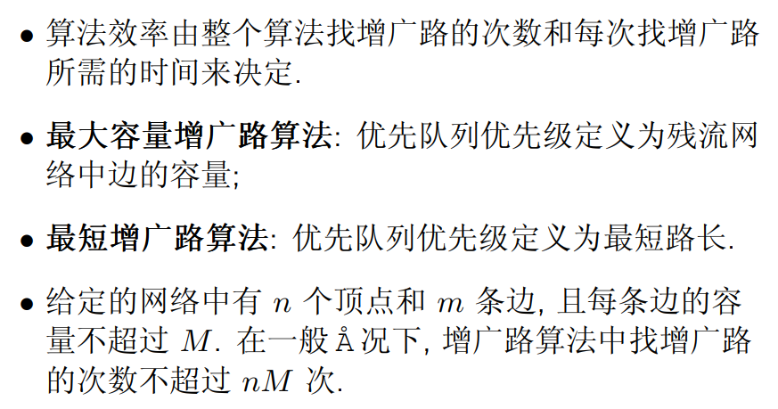