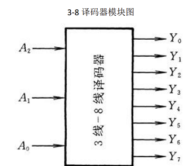
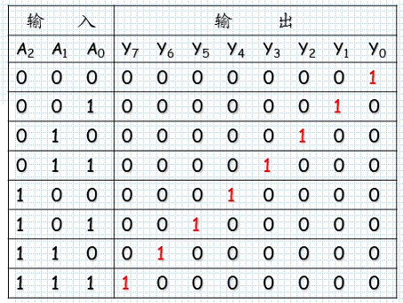
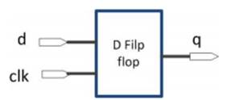

> Integrated Circuit, IC：集成电路，芯片

## 环境搭配

### Vivado 安装

[Downloads (xilinx.com)](https://www.xilinx.com/support/download.html)

官网下载安装包，需要登陆注册 AMD 账号（密码要求大小写、特殊字符以及数字）

这里老师强烈推荐版本 2019.2，不知为何，下载安装包后双击安装包运行

一路 continue / next，途中需要输入一次 AMD 账号，选择产品时勾选 VIVADO，Devices 默认即可，安装路径可自定义

总共大小二十多 GB，约需下载安装两个多小时

### Vivado 使用

新建项目或打开项目（.xpr 文件）

新建文件

- 设计代码
- 测试代码

仿真：将需要仿真的测试代码 set as top 后 Run Simulation

仿真设置：设置仿真时间和 log_all_signals

停止仿真：右键 Run Simulation 或叉掉正上方 Simulation 的提示框停止仿真

## 电路设计

### 组合逻辑电路设计

#### 编码器

将输入的二进制数编为热独码，如 38 编码器，将`000`编码为`00000001`，`001`编为`00000010`，`011`编为`00001000`，`111`编为`10000000`





decoder_3_8

```verilog
// 时间精度 timescale
`timescale 1ns / 1ps

module decoder_3_8(
    input [2:0] in,
    output [7:0] out
    );
    // 定义输入输出关系
    assign out[0] = (in==3'd0);
    assign out[1] = (in==3'd1);
    assign out[2] = (in==3'd2);
    assign out[3] = (in==3'd3);
    assign out[4] = (in==3'd4);
    assign out[5] = (in==3'd5);
    assign out[6] = (in==3'd6);
    assign out[7] = (in==3'd7);
endmodule
```

decoder_5_32

```verilog
`timescale 1ns / 1ps

module decoder_5_32(
    input[4:0] in,
    output[31:0] out
    );
    assign out[0] = (in==5'd0);
    assign out[1] = (in==5'd1);
    assign out[2] = (in==5'd2);
    assign out[3] = (in==5'd3);
    assign out[4] = (in==5'd4);
    assign out[5] = (in==5'd5);
    assign out[6] = (in==5'd6);
    assign out[7] = (in==5'd7);
    assign out[8] = (in==5'd8);
    assign out[9] = (in==5'd9);
    assign out[10] = (in==5'd10);
    assign out[11] = (in==5'd11);
    assign out[12] = (in==5'd12);
    assign out[13] = (in==5'd13);
    assign out[14] = (in==5'd14);
    assign out[15] = (in==5'd15);
    assign out[16] = (in==5'd16);
    assign out[17] = (in==5'd17);
    assign out[18] = (in==5'd18);
    assign out[19] = (in==5'd19);
    assign out[20] = (in==5'd20);
    assign out[21] = (in==5'd21);
    assign out[22] = (in==5'd22);
    assign out[23] = (in==5'd23);
    assign out[24] = (in==5'd24);
    assign out[25] = (in==5'd25);
    assign out[26] = (in==5'd26);
    assign out[27] = (in==5'd27);
    assign out[28] = (in==5'd28);
    assign out[29] = (in==5'd29);
    assign out[30] = (in==5'd30);
    assign out[31] = (in==5'd31);
endmodule
```

#### 解码器

编码器的反向操作，将热独码解为一个个对应数字，如`10000000`解为`111`

- 三目运算符，优先级逐级下降，若`in[i] == 1`则`out = 3'di`
- `3'd1`表示 3 位的十进制数 1
- `3'b010`表示 3 位二进制数 010，也就是十进制 2 

```verilog
`timescale 1ns / 1ps

module encoder_8_3(
    input [7:0] in,
    output [2:0] out
);
assign out = in[0]?3'd0:
             in[1]?3'd1:
             in[2]?3'd2:
             in[3]?3'd3:
             in[4]?3'd4:
             in[5]?3'd5:
             in[6]?3'd6:
             3'd7;
endmodule
```

#### 选择器

五路选择器：根据输入信号`select`在输入信号`in0,in1,in2,in3,in4`中选择一个作为输出

- `sel == 000`则选择`in0`，`sel == 001`则选择`in1`

```verilog
`timescale 1ns / 1ps

module mux5_8a(
    input [7:0] in0 , in1 , in2 , in3 , in4 ,
    input [2:0] sel,
    output [7:0] out
    );
    assign out = (sel == 3'd0)?in0:(sel == 3'd1)?in1:
                 (sel == 3'd2)?in2:(sel == 3'd3)?in3:
                 (sel == 3'd4)?in4:7'd0;
endmodule
```

### 时序逻辑电路设计

#### D 触发器

在时钟信号的上升沿触发，使输出等于输入，其余时刻均保持输出不变



使用 always 关键字捕捉时钟信号 clk 的上升沿 posedge（下降沿为 negedge）

- `<=`为非阻塞赋值，在 always 中通常使用该种赋值方法，需要统一

```verilog
`timescale 1ns / 1ps

// D 触发器（反相器）
module dff(
    input wire d,
    input wire clk,
    output reg q
    );
    always@(posedge clk)begin
        q <= d;
    end
endmodule
```

