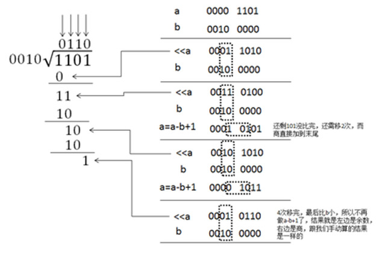

## 32 位除法器



设计代码：div32.v

- temp_a 为被除数的两倍扩展，为了合拍同理要把除数扩展
- temp_a 高 32 位存的余数，低 32 位存的商，运算过程如上图
- 当 temp_a >= temp_b 时，商 1，填补到 temp_a[0]，再整体左移一位，进行下一轮运算，当小于时，商 0 再左移

```verilog
`timescale 1ns / 1ps

module div32(
    input [31:0] a,
    input [31:0] b,
    output [31:0] result,
    output [31:0] remainder
    ); 
    reg[63:0] temp_a;
    reg[63:0] temp_b;
        
    integer i;
    always @ (*) begin
        temp_a = {32'd0, a};
        temp_b = {b, 32'd0};
        for(i = 0; i < 32; i = i+1) begin
            temp_a = temp_a << 1;
            if(temp_a >= temp_b) begin
                temp_a = temp_a - temp_b + 1;
            end
        end
    end
    assign result = temp_a[31:0];
    assign remainder = temp_a[63:32];
endmodule
```

测试代码：div32_tb.v

```verilog
`timescale 1ns / 1ps

module div32_tb(
    );
    reg [31:0] a;
    reg [31:0] b;
    wire [31:0] result;
    wire [31:0] remainder;
    
    div32 div320(a, b, result, remainder);
    
    integer i;
    initial begin
        b = 32'd7;
        for(i = 102; i < 152; i = i+1) begin
            #20
            a = i;
        end
        #1000 $finish;
    end
endmodule
```

## 五级流水 CPU

在单周期 CPU 里，一个 clk 上升沿将完成以下内容：取值 - 译码 - 执行 - 回写

在流水 CPU 中，首先过程增加一级，为：取值 - 译码 - 执行 - 访存 - 回写；第二，它把每个过程通过时钟周期分隔开，如

| 时钟周期 | 取值  | 译码  | 执行  | 访存  | 回写  |
| -------- | ----- | ----- | ----- | ----- | ----- |
| 1        | 取值1 |       |       |       |       |
| 2        | 取值2 | 译码1 |       |       |       |
| 3        | 取值3 | 译码2 | 执行1 |       |       |
| 4        | 取值4 | 译码3 | 执行2 | 访存1 |       |
| 5        | 取值5 | 译码4 | 执行3 | 访存2 | 回写1 |
| 6        | 取值6 | 译码5 | 执行4 | 访存3 | 回写2 |
| ...      |       |       |       |       |       |

以这样的形式对每条指令进行执行，在一定数量后，每个时钟周期均有指令完成，效率更高，当减少 clk 的时间长度（相较于单周期，流水线 CPU 在一个时钟周期内要做的事更少），指令的执行频率将越高，此之谓提高主频

要实现这样的过程，需要在每个步骤之间加一层流水线传输级，用 clk 的上升沿控制数据的传输，以实现步骤的分割


将存储器和 CPU 解耦，和单周期类似，以 SOPC 的形式将五级流水 CPU 和存储器 inst_rom 连接，如下所示


为了防止流水线停滞以及读后写的情况发生，需要做流水线延迟槽和数据前推

流水线延迟槽：当 id 模块，及译码器分析出跳转指令时，由于译码器处于第二模块，此时第一模块取值 pc 已经调入了下一条指令，显然是顺序调入的，此时我们选择保留这条指令继续执行，而在下一个时钟周期再调入要跳转的指令，从识别出跳转指令到调入跳转指令之间，相隔了一条指令，这就叫延迟槽

读后写：由于指令流水线执行，有这样一种可能，前一条指令向 a 地址写入数据，后一条指令要从 a 地址读取数据，但数据的回写在第五模块才会执行，也就是说，执行第二条指令时，一定会读到以往的数据（并非是前一条指令更新的数据），造成脏读

数据前推：为了解决“读后写”，在 ex 模块（alu）和 mem 访存模块做了一个**数据前推**，即提前将执行结果回送到寄存器 regfile，注意是回送，并不是回写，当下一条指令读数据时，提前进行判断，若读地址和上一条指令的写地址相同，不从实际的 a 地址取数据，而是直接把后续模块回送的数据赋值给要读的数据 reg_data，实现实时更新

### SOPC

> System on programmable chip

mips_sopc.v

```verilog
`timescale 1ns / 1ps
`include"defines.v"
module mips_sopc(
    input wire clk,
    input wire rst//高电平复位
    );
    wire rom_ce = 1;//使能，高电平允许使用
    wire[`instaddrbus]inst_addr;//指令地址为32位
    wire[`instbus]inst;//返回指令
    cpu cpu0(rst,clk,inst,rom_ce,inst_addr);
    inst_rom inst_rom0(rom_ce,inst_addr,inst);
endmodule
```

### 五级流水 CPU

cpu.v

```verilog
`include "defines.v"
`timescale 1ns/1ps
module cpu(
    //pc有两个id来的输入
    //id5个输入一个输出
    input wire rst,
    input wire clk,
    input wire[`instbus] rom_data_i,//rom返回的指令
    output wire rom_ce_o,//给rom的使能0代表ron返回全零指令
    output wire [`instaddrbus] rom_addr_o//给rom的指令地址
);
//////////////////////////////////////////////二次增加连线的集合
//pc
//output reg [`instaddrbus] pc_o,//给ifid地址
wire [`instaddrbus]pcifidpc;//
//    input wire branch_flag_i,
wire idpcbranch;//
//    input wire[`regbus] branch_target_address_i
wire [`regbus]idpcbranchaddr;//
//ifid
//input  wire [`instaddrbus] pc_i,//给ifid地址
//        output reg  [`instaddrbus] pc_o//给ifid地址
wire [`instaddrbus] ifididpc;//
//id
//input wire is_in_delayslot_i,//当前处于译码阶段的指令是否位于延迟操
wire idexiddelayslot;//
//    output wire next_inst_in_delayslot_o,//下一条进入译码阶段的的指令是否位于延迟槽
wire ididexnextdelayslot;//
//    output wire branch_flag_o,   //告诉pc是否有转移

//    output wire [`regbus]branch_target_address_o,//告诉pc转移的指令在指令存贮器的地址
//    output wire [`regbus]link_addr_o,//转移指令要保存的返回地址
wire [`regbus]ididexlinkaddr;//
//    output wire is_in_delayslot_o,//告诉alu当前译码阶段的指令是否位于延迟槽
wire ididexisindelayslot;  //
//    input wire [`instaddrbus]pc_i,//pc来的指令地址
//    output wire [`regbus] inst_o //将指令输出
wire [`regbus] ididexinst;//
//idex
//input wire[`regbus]id_link_address,
//        input wire id_is_in_delayslot,
//        input wire next_inst_in_delayslot_i,
//        output reg[`regbus] ex_link_address,
wire [`regbus] idexexlinkaddress;//
//        output reg  ex_is_in_delayslot,
wire  idexexdelayslot;//
//        output reg is_in_delayslot_o,   
//     ////////////////////////////////////////////
//        input wire [`regbus] id_inst,//id 给的指令     
//        output reg [`regbus] ex_inst
wire [`regbus]idexexinst;//

//alu
//    input wire [`regbus] link_address_i,
//    input wire  is_in_delayslot_i,
//    //存储指令
//    input wire [`regbus] inst_i,//当前处于执行阶段的指令
//    output wire [`aluop_onehotbus] aluop_o,//指令运算子类型
wire [`aluop_onehotbus] exexmemaluop;//
//    output wire [`regbus] mem_addr_o,//加载存储指令对应的存储器地址
wire [`regbus] exexmemaddr;//
//    output wire [`regbus] reg2_o ,//存储指令要存储的数据
wire [`regbus] exexmemreg2;//
//    ///////////////////////////数据前推
//        output wire[`regdatabus] wb_wdata,
wire[`regdatabus] exregdata;//
//        output wire[`regaddrbus] wb_wd,
wire[`regaddrbus] exregwaddr;//
//        output wire wb_wreg 
 wire exregwe;//
//exmem
///////////存储指令
//        input wire [`aluop_onehotbus] ex_aluop, 
//        input wire [`regbus] ex_mem_addr,
//        input wire [`regbus] ex_reg2,
//        output reg [`aluop_onehotbus] mem_aluop, 
wire [`aluop_onehotbus] exmemmemaluop;//         
//        output reg [`regbus] mem_mem_addr,
wire [`regbus] exmemmemaddr;//
//        output reg [`regbus] mem_reg2 
wire [`regbus] exmemmemreg2;//
//mem
/////////////////////////////////
//        input wire [`aluop_onehotbus] aluop_i,//指令独热码
//        input wire [`regbus] mem_addr_i,//地址，lw从中间取并保存到wd_o，sw将reg2_i存入mem_addr_i.
//        input wire [`regbus] reg2_i,//访存阶段存储指令要存储的地址//sw将rt的值取出。
//        input wire [`regbus] mem_data_i,//从instrom读取的的数据
wire [`regbus] regmemdata;          
//        output reg [`regbus] mem_addr_o,//要访问的数据存储器的地址
wire [`regbus] memregaddrs;
//        output reg mem_we_o,//是否是写操作，1表示写操作
wire memregwes;      
//        output reg [`regbus] mem_data_o,//要写入数据存储器的数据
wire [`regdatabus] memregdatas;
//        ////////////数据前推
//        output wire[`regdatabus] wb_wdata,
wire[`regdatabus] memregdata;//
//        output wire[`regaddrbus] wb_wd,
wire[`regaddrbus] memregwaddr;//
//        output wire wb_wreg 
wire memregwe;//
//memwb
//regfile

//////////////////////////////////////////////////////////    
    pc pc0(rst,clk,rom_addr_o,ce,pcifidpc,idpcbranch,idpcbranchaddr);
    wire [`instbus] id_inst_i;
    if_id if_id0(clk,rst,rom_data_i,id_inst_i,pcifidpc,ifididpc);
    wire [`aluop_onehotbus] id_aluop_o;
    wire [`regdatabus] id_reg1_o;
    wire [`regdatabus] id_reg2_o;
    wire [`regaddrbus] id_wd_o;
    wire id_wreg_o;
    wire [`regdatabus] reg1_data;
    wire [`regdatabus] reg2_data;
    wire reg1_read;
    wire reg2_read;
    wire [`regaddrbus]reg1_addr;
    wire [`regaddrbus]reg2_addr;
    id id0(rst,id_inst_i,reg1_data,reg2_data,
    id_aluop_o,id_reg1_o,id_reg2_o,id_wd_o,id_wreg_o,reg1_addr,reg2_addr,
    reg1_read,reg2_read
    ,idexiddelayslot ,ididexnextdelayslot ,idpcbranch ,idpcbranchaddr ,ididexlinkaddr ,ididexisindelayslot ,ifididpc , ididexinst );
    wire [`aluop_onehotbus] ex_aluop_i;
    wire [`regdatabus] ex_reg1_i;
    wire [`regdatabus] ex_reg2_i;
    wire [`regaddrbus] ex_wd_i;
    wire ex_wreg_i;
    id_ex id_ex0(rst,clk,id_aluop_o,id_reg1_o,id_reg2_o,id_wd_o,id_wreg_o,
    ex_aluop_i,ex_reg1_i,ex_reg2_i,ex_wd_i,ex_wreg_i,
    ididexlinkaddr , ididexisindelayslot,ididexnextdelayslot ,idexexlinkaddress ,idexexdelayslot , idexiddelayslot,ididexinst , idexexinst);
    wire [`regdatabus] ex_wdata_o;
    wire [`regaddrbus] ex_wd_o;
    wire ex_wreg_o;
    alu alu0(ex_reg1_i,ex_reg2_i,ex_aluop_i,ex_wd_i,ex_wreg_i,
    ex_wdata_o,ex_wd_o,ex_wreg_o,
    idexexlinkaddress,idexexdelayslot ,idexexinst ,exexmemaluop ,exexmemaddr , exexmemreg2,exregdata ,exregwaddr , exregwe);
    wire [`regdatabus] mem_wdata_i;
    wire [`regaddrbus] mem_wd_i;
    wire mem_wreg_i;
    ex_mem ex_mem0(clk,rst,ex_wdata_o,ex_wd_o,ex_wreg_o,
    mem_wdata_i,mem_wd_i,mem_wreg_i
    ,exexmemaluop,exexmemaddr,exexmemreg2,exmemmemaluop , exmemmemaddr,exmemmemreg2 );
    wire [`regdatabus] mem_wdata_o;
    wire [`regaddrbus] mem_wd_o;
    wire mem_wreg_o;
    mem mem0(rst,mem_wdata_i,mem_wd_i,mem_wreg_i,
    mem_wdata_o,mem_wd_o,mem_wreg_o
    ,exmemmemaluop,exmemmemaddr , exmemmemreg2,regmemdata, memregaddrs ,memregwes ,memregdatas ,memregdata ,memregwaddr , memregwe);
    wire [`regdatabus] wb_wdata_i;
    wire [`regaddrbus] wb_wd_i;
    wire wb_wreg_i;
    mem_wb mem_wb0(clk,rst,mem_wdata_o,mem_wd_o,mem_wreg_o,
    wb_wdata_i,wb_wd_i,wb_wreg_i);
    
    regfile regfile0(rst,clk,wb_wd_i,wb_wdata_i,wb_wreg_i,
    reg1_addr,reg1_read,reg1_data,reg2_addr,reg2_read,reg2_data
    , memregaddrs,memregwes ,memregdatas ,regmemdata ,exregdata ,exregwaddr , exregwe,memregdata ,memregwaddr ,memregwe );
endmodule
```

### 存储器 ROM

inst_rom.v

```verilog
`timescale 1ns / 1ps
`include "defines.v"

module inst_rom(
    input wire ce,
    input wire [`instaddrbus] addr,//指令地址
    output reg [`instbus] inst
    );
    reg [`instbus] inst_mem[0:127];
    // 将指令读入 inst_mem
    initial begin
           $readmemh("c:/file/vivado/inst_rom.data",inst_mem);  
    end
    
    always @(*)begin
        if(ce==0)begin
            inst<=`zeroword;//返回的指令为全0
        end else begin
            inst<=inst_mem[addr[31:2]];//老师写的麻烦，就改了
             //inst<=inst_mem[addr[6:0]];
            //instmem大小为128*4B只需要7位地址线，所以用addr的6到0位作为地址就可以了，addr的数每次+1`b1.
            //instmem的单位地址大小位4B，所以存取的内容为32位
        end
    end
endmodule
```

### 程序计数器 PC

pc.v

```verilog
`timescale 1ns / 1ps
`include "defines.v"

module pc(
	input rst,
	input clk,
    output reg [`instaddrbus] pc,// 当前指令地址，传给存储器进行取值
    output reg ce,
    
    output wire [`instaddrbus] pc_o,// 给if_id地址
    input wire branch_flag_i, // 当为1，说明为跳转指令
    input wire[`regbus] branch_target_address_i // 跳转指令地址
    );
    
    assign pc_o=(rst)? 32'h00000000:pc;
    always @(posedge clk)begin
        if(rst==`rstenable)begin
            ce<=`chipdisable;
            //rst为高，表休息。
            //ce为低，pc置0，表取出的指令为全零
        end else begin 
            ce<=`chipenable;
        end
    end
    
    always @(posedge clk)begin
        if(ce==`chipdisable)begin 
            pc<=32'h00000000;
        end else if (branch_flag_i==`branch)begin
            pc<=branch_target_address_i; // 如果是跳转指令，跳转到跳转指令要到达的地址
        end else begin
            pc<=pc+4'h4; // 否则 pc 指针顺序增加，顺序执行
        end
    end
endmodule
```

### 译码器 ID

id.v

```verilog
`timescale 1ns / 1ps
`include"defines.v"

module id(
    input wire rst,
    input wire[`instbus] inst_i,//进指令
    input wire[`regdatabus]reg1_data_i,//进regfile来的数据
    input wire[`regdatabus]reg2_data_i,
    output wire[`aluop_onehotbus]aluop_o,//21位独热码，表明是哪个指令
    
    output wire[`regdatabus]reg1_o,//操作数1.2
    output wire[`regdatabus]reg2_o,
    output wire[`regaddrbus]wd_o,//要吧结果写入的地址
    output wire wreg_o,//要不要写入regfile
    output wire[`regaddrbus]reg1_addr_o,//要调用的regfile的地址
    output wire[`regaddrbus]reg2_addr_o,
    output wire reg1_read_o,//允许写
    output wire reg2_read_o,
    // 跳转指令接口
    input wire is_in_delayslot_i,//当前处于译码阶段的指令是否位于延迟操
    output wire next_inst_in_delayslot_o,//下一条进入译码阶段的的指令是否位于延迟槽
    output wire branch_flag_o,   //告诉pc是否有转移
    output wire [`regbus]branch_target_address_o,//告诉pc转移的指令在指令存贮器的地址
    output wire [`regbus]link_addr_o,//转移指令要保存的返回地址
    output wire is_in_delayslot_o,//告诉alu当前译码阶段的指令是否位于延迟槽
    // 存储指令接口
    input wire [`instaddrbus]pc_i,//pc来的指令地址
    output wire [`regbus] inst_o //将指令输出
    
     );
     assign inst_o=inst_i;
    //有3种格式的指令
    //共需要4个段的指令段的判定来确定代码是那个指令
    //进译码器
    wire[5:0] op;//头6为
    wire[4:0] op1;//之后的5位
    wire[4:0] sa;//中5位
    wire[5:0] func;//最后6位
    //出译码器
    wire[63:0] op_d;
    wire[31:0] op1_d;
    wire[31:0] sa_d;
    wire[63:0] func_d;
    
    assign op = inst_i[31:26]; // 6位
    assign op1 = inst_i[25:21]; // 5位
    assign sa = inst_i[10:6]; // 5
    assign func = inst_i[5:0]; // 6
    
    decoder_6_64 dec0(.in(op) , .out(op_d));
    decoder_5_32 dec1(.in(op1) , .out(op1_d));
    decoder_5_32 dec2(.in(sa) , .out(sa_d));
    decoder_6_64 dec3(.in(func) , .out(func_d));
   //定义14个线来组成14位独热码来为之后的部件表示这是什么指令
    wire inst_add;
    wire inst_addu;
    wire inst_sub;
    wire inst_subu;
    wire inst_slt;
    wire inst_sltu;
    wire inst_and;
    wire inst_or;
    wire inst_xor;
    wire inst_nor;
    wire inst_sll;
    wire inst_srl;
    wire inst_sra;
    wire inst_lui;
    wire inst_addiu;
    wire inst_lw;
    wire inst_sw;
    wire inst_beq;
    wire inst_bne;
    wire inst_jr;
    wire  inst_jal;
    //当译码器的输出op_d的第opzero位输出为1
    // 而且sa_d[`sazero]和func_d[`funcadd]的输出为1
    //则inst_add为1，其他的inst_x则为0，
    //要实现的指令少时可以不用编码器，直接对对inst_i的各位进行判断
    assign inst_add = op_d[`opzero]&&sa_d[`sazero]&&func_d[`funcadd];
    assign inst_addu = op_d[`opzero]&&sa_d[`sazero]&&func_d[`funcaddu];
    assign inst_sub = op_d[`opzero]&&sa_d[`sazero]&&func_d[`funcsub];
    assign inst_subu = op_d[`opzero]&&sa_d[`sazero]&&func_d[`funcsubu];
    assign inst_slt = op_d[`opzero]&&sa_d[`sazero]&&func_d[`funcslt];
    assign inst_sltu = op_d[`opzero]&&sa_d[`sazero]&&func_d[`funcsltu];
    assign inst_and = op_d[`opzero]&&sa_d[`sazero]&&func_d[`funcand];
    assign inst_or = op_d[`opzero]&&sa_d[`sazero]&&func_d[`funcor];
    assign inst_xor = op_d[`opzero]&&sa_d[`sazero]&&func_d[`funcxor];
    assign inst_nor = op_d[`opzero]&&sa_d[`sazero]&&func_d[`funcnor];
    
    assign inst_sll = op_d[`opzero]&&op1_d[`oplzero]&&func_d[`funcsll];
    assign inst_srl = op_d[`opzero]&&op1_d[`oplzero]&&func_d[`funcsrl];
    assign inst_sra = op_d[`opzero]&&op1_d[`oplzero]&&func_d[`funcsra];
    assign inst_lui = op_d[`oplui]&&op1_d[`oplzero];
    
    assign inst_addiu = op_d[`opaddiu];
    assign inst_lw = op_d[`oplw];
    assign inst_sw = op_d[`opsw];
    assign inst_beq = op_d[`opbeq];
    assign inst_bne = op_d[`opbne];
    assign inst_jr = op_d[`opzero]&&sa_d[`sazero]&&func_d[`funcjr];
    assign inst_jal = op_d[`opjal];
    //wire [13:0] aluop_o;
    //14位中只有一位为1，表示是那个指令这就是独热码
    assign aluop_o = (rst == `rstenable) ? 21'b0 :
        {
            inst_add,
            inst_addu,
            inst_sub,
            inst_subu,
            inst_slt,
            inst_sltu,
            inst_and,
            inst_or,
            inst_xor,
            inst_nor,
            inst_sll,
            inst_srl,
            inst_sra,
            inst_lui,
            inst_addiu,
            inst_lw,
            inst_sw,
            inst_beq,
            inst_bne,
            inst_jr,
            inst_jal
         };
    
    // 从指令中读出读地址
    assign reg1_addr_o = (rst == `rstenable) ? `zeroregaddr : inst_i[25:21];
    assign reg2_addr_o = (rst == `rstenable) ? `zeroregaddr : inst_i[20:16];
    // 除 lui sll srl sra jal 外，均需要取第一个数，读使能赋值为 1
    assign reg1_read_o = (rst == `rstenable) ? `readdisable : !(inst_lui||inst_sll || inst_srl || inst_sra||inst_jal);
    // 除 lui addiu jr jal lw 指令外，均需要读第二个操作数，读使能赋为 1
    assign reg2_read_o = (rst == `rstenable) ? `readdisable : !(inst_lui||inst_addiu||inst_jr||inst_jal||inst_lw);
    
    // 立即数
    reg [`regdatabus]imm;
    // 根据指令类型从指令中取立即数
    always @(*)begin
        if(inst_lui==1'b1)begin
            imm <= {inst_i[15:0],16'b0};
        end else if(inst_addiu==1'b1)begin
            imm <= {{16{inst_i[15]}},inst_i[15:0]};
        end else begin//偏移指令要用的偏移位数
            imm<= {27'b0,inst_i[10:6]};
        end
    end
        
    wire[`regbus]pcplus8;
    wire[`regbus]pcplus4;
    wire[`regbus]imm_s112_signedext;
    assign pcplus8=pc_i+5'h8;
    assign pcplus4=pc_i+5'h4;
    assign imm_s112_signedext={{14{inst_i[15]}},inst_i[15:0],2'b00};//跳转指令用的
    //输向ex单元的操作数是刚从regfile读到的data还是立即数？根据使能信号reg1_read_o reg2_read_o判断
    //是lui指令时两个都不赋能，两个操作数都是立即数，
    //当是sll，srl，sra，的指令时操作数2赋能，是reg数据，操作数1是立即数
    
    assign reg1_o = rst ? `zeroword :
        (reg1_read_o ? reg1_data_i : imm);
    assign reg2_o = rst ? `zeroword : 
        (reg2_read_o ? reg2_data_i : imm);
        
        
   // 判断写使能，是否需要回写
    assign wd_o = rst ? `zeroregaddr : 
        ((inst_lui||inst_addiu||inst_lw) ? inst_i[20:16] : 
        (inst_jal) ?5'b11111: 
        inst_i[15:11]);      
    // 是否需要ex单元将结果写入regfile，14条指令都需要将结果写入regfile
    assign wreg_o = rst ? `writedisable :
        ((inst_jr||inst_beq||inst_bne||inst_sw)?`writedisable:`writeenable);//sw通过mem直接写入rom，不通过mem_wb写入rom，所以writedisable

    // 只有 jal 指令需要用到 link_addr_o 接口
    assign link_addr_o = rst ? `zeroword :
                        ((inst_jal)?pcplus8:`zeroword);
                        
    // 跳转地址，只有当 jr jal，或 beq 指令且两个操作数相等。或 bne 指令且两个操作数不等
    // 需要回写跳转地址
    assign branch_target_address_o = rst ? `zeroword :
                (inst_jr)?reg1_o:
                (inst_jal)?{pcplus4[31:28],inst_i[25:0],2'b00}:
                (inst_beq&&(reg1_o==reg2_o))?{pcplus4+imm_s112_signedext}:
                (inst_bne&&(reg1_o!=reg2_o))?{pcplus4+imm_s112_signedext}:
                `zeroword;
    // 跳转信号，是否需要跳转                             
    assign branch_flag_o = rst ? `notbranch :
                        ((inst_jr||inst_jal||(inst_beq&&(reg1_o==reg2_o))||(inst_bne&&(reg1_o!=reg2_o)))
                        ?`branch:`notbranch);
    assign next_inst_in_delayslot_o = rst ? `notindelayslot :
                        ((inst_jr||inst_jal||(inst_beq&&(reg1_o==reg2_o))||(inst_bne&&(reg1_o!=reg2_o)))
                        ?`indelayslot:`notindelayslot);
    assign is_in_delayslot_o = rst ? 1'b0 :is_in_delayslot_i;
endmodule
```

### 运算器 ALU

alu.v

```verilog
`timescale 1ns / 1ps
`include "defines.v"

module alu(
    input wire[31:0]alu_src1,
    input wire[31:0]alu_src2,
    input wire[`aluop_onehotbus]alu_control,
    input wire[4:0]wd_i,
    input wire wreg_i,
    output reg[31:0]alu_result,
    output wire[4:0]wd_o,
    output wire wreg_o,
    //转移指令
    input wire [`regbus] link_address_i,
    input wire  is_in_delayslot_i,
    //存储指令
    input wire [`regbus] inst_i,//当前处于执行阶段的指令
    output wire [`aluop_onehotbus] aluop_o,//指令运算子类型
    output wire [`regbus] mem_addr_o,//加载存储指令对应的存储器地址
    output wire [`regbus] reg2_o ,//存储指令要存储的数据
    ///////////////////////////数据前推
    output wire[`regdatabus] wb_wdata,
    output wire[`regaddrbus] wb_wd,
    output wire wb_wreg 
    );
    assign wd_o = wd_i;
    assign wreg_o = wreg_i;
    
    //访存要用
    assign aluop_o=alu_control;
    assign mem_addr_o=alu_src1+{{16{inst_i[15]}},inst_i[15:0]};//lw指令的存储地址=base内容加扩展的32位
    
    //读取一个字保存到rt                                       //sw指令的访问地址=base内容加扩展的32位
    assign reg2_o=alu_src2;//sw指令这读的是rt的值，要存入 mem_addr_o中。
    //////////////////       lw中  reg2_o无意义
    wire[`regdatabus]alu_src2_mux;
    wire[`regdatabus]result_sum;
    wire[`regdatabus]result_slt;
    
    
    
    //需要进行取反+1吗？sub subu slt需要将 操作数2 取反加一
    assign alu_src2_mux = ((alu_control == `aluopsub) || (alu_control == `aluopsubu) || (alu_control == `aluopslt))?
                            (~alu_src2 + 1) : alu_src2;
    
    //为了之后代码简洁，可以提前算出来（尽管可能用不到）
    assign result_sum = alu_src1 + alu_src2_mux;
    //比较运算
    assign result_slt = (alu_src1[31] && !alu_src2[31]) ||
                        (!alu_src1[31] && !alu_src2[31] && result_sum[31]) ||
                        (alu_src1[31] && alu_src2[31] && result_sum[31]);
   // 根据指令进行运算操作
    always @(*)begin
        case(alu_control)
            `aluopadd,`aluopaddu,`aluopsub,`aluopsubu,`aluopaddiu:begin
                alu_result = result_sum;
            end
            `aluopslt:begin
                alu_result = result_slt;
            end
            `aluopsltu:begin
                alu_result = (alu_src1 < alu_src2);
            end
            `aluopand:begin
                alu_result = alu_src1 & alu_src2;
            end
            `aluopor:
                alu_result = alu_src1 | alu_src2;
            `aluopxor:
                alu_result = alu_src1^alu_src2;
            `aluopnor:
                alu_result = ~(alu_src1^alu_src2);
            `aluopsll:
                alu_result = alu_src2 << alu_src1[4:0];
            `aluopsrl:
                alu_result = alu_src2 >> alu_src1[4:0];
            `aluopsra:
                alu_result = ({32{alu_src2[31]}} << (6'd32 - {1'b0,alu_src1[4:0]})) | 
                (alu_src2 >> alu_src1[4:0]);
            `aluoplui:
                alu_result = alu_src2;
            `aluopjal:
                alu_result<=link_address_i;
            default:
                alu_result = `zeroword;
        endcase
    end
    /////////数据前推用
    assign wb_wdata=alu_result;
    assign wb_wd=wd_o;
    assign wb_wreg=wreg_o;
endmodule
```

### 访存模块 MEM

mem.v

```verilog
`timescale 1ns / 1ps
`include "defines.v"
module mem(
        input wire rst,
        input wire [`regdatabus] wdata_i,
        input wire [`regaddrbus] wd_i,
        input wire wreg_i,
        output reg[`regdatabus] wdata_o,
        output reg[`regaddrbus] wd_o,
        output reg wreg_o,
        ///////////////////////////////
        input wire [`aluop_onehotbus] aluop_i,//指令独热码
        input wire [`regbus] mem_addr_i,//地址，lw从中间取并保存到wd_o，sw将reg2_i存入mem_addr_i.
        input wire [`regbus] reg2_i,//访存阶段存储指令要存储的地址//sw将rt的值取出。
        input wire [`regbus] mem_data_i,//从instrom读取的的数据
        
        output reg [`regbus] mem_addr_o,//要访问的数据存储器的地址
        output reg mem_we_o,//是否是写操作，1表示写操作
        //output reg [3:0] mem_sel_o,//字节选择信号、、是干啥的不知道
        output reg [`regbus] mem_data_o,//要写入数据存储器的数据
        //output reg mem_ce_o //instrom使能信号
        ////////////数据前推
        output wire[`regdatabus] wb_wdata,
        output wire[`regaddrbus] wb_wd,
        output wire wb_wreg  
        );
        ////数据前推用
        assign wb_wdata=wdata_o;
        assign wb_wd=wd_o;
        assign wb_wreg=wreg_o;
        
        
        always@(*)begin
        if (rst)begin
            wd_o=`zeroregaddr;
            wdata_o=`zeroword;
            wreg_o=`writedisable;
            
            mem_addr_o=`zeroword;//要访问的数据存储器的地址
            mem_we_o=`writedisable;//是否是写操作，1表示写操作
            //mem_sel_o=4'b0000;//字节选择信号
            mem_data_o=`zeroword;//要写入数据存储器的数据
           // mem_ce_o=`chipdisable; //数据存储器使能信号    
        end else begin
            wd_o=wd_i;
            wdata_o=wdata_i;
            wreg_o=wreg_i;
            
            mem_addr_o=`zeroword;//要访问的数据存储器的地址     
            mem_we_o=`writedisable;//是否是写操作，1表示写操作
            //mem_sel_o=4'b1111;//字节选择信号
            mem_data_o=`zeroword;//要写入数据存储器的数据
           // mem_ce_o=`chipdisable; //数据存储器使能信号 
            case(aluop_i)
                `aluoplw: begin
                    mem_addr_o=mem_addr_i;//向rom要地址的内容以，作为wdata_o,存入 wd_o
                    mem_we_o=`writedisable; //之后存数据走mem_wb的流程就好了。不用直接存到
                    wdata_o=mem_data_i;//数据从rom回来了
                    //mem_sel_o=4'b1111;
                    //mem_ce_o=`chipenable;
                end
                `aluopsw: begin
                    mem_addr_o=mem_addr_i;//要将mem_data_o写入mem_addr_i
                    mem_we_o=`writeenable;
                    mem_data_o=reg2_i;//这个是来自rt的值要存入rom
                   // mem_sel_o=4'b1111;
                   // mem_ce_o=`chipenable;
                end
                default:begin
                
                end
              endcase
          end
        end
endmodule
```

### 流水线分级

#### if_id

if_id.v：连接程序计数器 pc 和译码器 id

```verilog
`timescale 1ns / 1ps
`include "defines.v"

// 相当于电线，直接把 pc 的输出输入到 id 中，中间由 if_id 连接
module if_id(
    input wire clk,
    input wire rst,
    input wire [`instbus] if_inst,
    output reg[`instbus] id_inst,

    input  wire [`instaddrbus] pc_i,// 给ifid地址
    output reg  [`instaddrbus] pc_o// 给ifid地址
    );
    always@(posedge clk)begin
        if(rst)begin
            id_inst=`zeroword;
            pc_o=32'h00000000;
        end else begin
            id_inst=if_inst;//只传递指令
            pc_o=pc_i;
        end
    end
endmodule
```

#### id_ex

id_ex.v：连接译码器 id 和运算器 alu

```verilog
`timescale 1ns / 1ps
`include "defines.v"
module id_ex(
        input wire rst,
        input wire clk,
        input wire [`aluop_onehotbus] id_aluop,
        input wire [`regdatabus] id_reg1,
        input wire [`regdatabus] id_reg2,
        input wire [`regaddrbus] id_wd,
        input wire id_wreg,
        output reg [`aluop_onehotbus] ex_aluop,
        output reg [`regdatabus] ex_reg1,
        output reg [`regdatabus] ex_reg2,
        output reg [`regaddrbus] ex_wd,
        output reg ex_wreg,
        //////////////////////////////////////////////
        input wire[`regbus]id_link_address,
        input wire id_is_in_delayslot,
        input wire next_inst_in_delayslot_i,
        output reg[`regbus] ex_link_address,
        output reg  ex_is_in_delayslot,
        output reg is_in_delayslot_o,
        ////////////////////////////////////////////
        input wire [`regbus] id_inst,//id 给的指令     
        output reg [`regbus] ex_inst
        );
        always@(posedge clk)begin
            if(rst)begin
            ex_aluop=`aluopzero;
            ex_reg1=`zeroword;
            ex_reg2=`zeroword;
            ex_wd=`zeroregaddr;
            ex_wreg=`writedisable;
          
            ex_link_address=`zeroword;
            ex_is_in_delayslot=`notindelayslot;
            is_in_delayslot_o=`notindelayslot;  
            
            ex_inst=`zeroword;
            
            end else begin
            
            ex_aluop=id_aluop;
            ex_reg1=id_reg1;
            ex_reg2=id_reg2;
            ex_wd=id_wd;
            ex_wreg=id_wreg;
            
            ex_link_address=id_link_address;
            ex_is_in_delayslot=id_is_in_delayslot;
            is_in_delayslot_o=next_inst_in_delayslot_i; 
            
            ex_inst=id_inst;
             
            end
        end 
endmodule
```

#### ex_mem

ex_mem.v：连接运算器 alu 和访存模块 mem

```verilog
`timescale 1ns / 1ps
`include "defines.v"

module ex_mem(
        input wire clk,
        input wire rst,
        input wire [`regdatabus] ex_wdata,
        input wire [`regaddrbus] ex_wd,
        input wire ex_wreg,
        output reg[`regdatabus]mem_wdata,
        output reg[`regaddrbus]mem_wd,
        output reg mem_wreg,
        /////////存储指令
        input wire [`aluop_onehotbus] ex_aluop, 
        input wire [`regbus] ex_mem_addr,
        input wire [`regbus] ex_reg2,
        output reg [`aluop_onehotbus] mem_aluop, 
        output reg [`regbus] mem_mem_addr,
        output reg [`regbus] mem_reg2      
        );
        always @(posedge clk)begin
        if(rst)begin
        mem_wd=`zeroregaddr;
        mem_wdata=`zeroword;
        mem_wreg=`writedisable;
        
         mem_aluop=`aluopzero;
         mem_mem_addr=`zeroword;
         mem_reg2=`zeroword;   
        end else begin
         mem_wd=ex_wd;
         mem_wdata=ex_wdata;
         mem_wreg=ex_wreg;
         
         mem_aluop=ex_aluop;
         mem_mem_addr=ex_mem_addr;
         mem_reg2= ex_reg2;
        end
        end
endmodule
```

#### mem_wd

mem_wd.v：把结果回写到 regfile

```verilog
`timescale 1ns / 1ps
`include "defines.v"
module mem_wb(
        input wire clk,
        input wire rst,
        input wire [`regdatabus] mem_wdata,
        input wire [`regaddrbus] mem_wd,
        input wire mem_wreg,
        output reg[`regdatabus] wb_wdata,
        output reg[`regaddrbus] wb_wd,
        output reg wb_wreg 
         );
         always @ (posedge clk)begin
         if (rst)begin
            wb_wd=`zeroregaddr;
            wb_wdata=`zeroword;
            wb_wreg=`writedisable;
         end else begin
            wb_wd=mem_wd;
            wb_wdata=mem_wdata;
            wb_wreg=mem_wreg;
         end
         end
endmodule
```

### 寄存器 Regfile

regfile.v

```verilog
`timescale 1ns / 1ps
`include "defines.v"

module regfile(
	input rst,
	input clk,
    input [`regaddrbus] waddr,
    input [`regbus] wdata,
    input we,
    input [`regaddrbus] raddr1, 
    input re1,
    output reg [`regbus] rdata1,
       
    input [`regaddrbus] raddr2,
    input re2,
    output reg [`regbus] rdata2,
    ///////////////////////////存取指令
        
    input wire [`regbus] mem_addr,//要访问的数据存储器的地址
    input wire mem_we,//是否是写操作，1表示写操作
    input wire [`regbus] mem_data_o,//要写入数据存储器的数据
    output reg [`regbus] mem_data_i,//从instrom发往mem的的数据
    ///////////////////////////数据前推端口
    input wire [`regdatabus] wdata1,
    input wire [`regaddrbus] wd1,
    input wire wreg1,
    input wire [`regdatabus] wdata2,
    input wire [`regaddrbus] wd2,
    input wire wreg2
    );

    reg[`regbus] regs[`regnum-1:0];
    // 写操作
    always @(posedge clk)begin
        if(rst==`rstdisable)begin
            //不能写入0地址，有特殊用途
            if((we==`writeenable)&&(waddr !=0))begin
                regs[waddr]<=wdata;
            end
        end
    end
    //读端口1 读操作
    always @ (*)begin
        if(rst==`rstenable)begin
            rdata1<=`zeroword;
            //写入0的情况
        end else if((re1==`readenable)&&(raddr1==`regnumlog2'h0))begin
            rdata1<=`zeroword;
        ///////////////// //////////////数据前推
        end else if((raddr1==waddr)&&(we==`writeenable)&&(re1==`readenable))begin
            rdata1<=wdata;
        end else if((raddr1==wd1)&&(wreg1==`writeenable)&&(re1==`readenable))begin
            rdata1<=wdata1;
        end else if((raddr1==wd2)&&(wreg2==`writeenable)&&(re1==`readenable))begin
            rdata1<=wdata2;
        ////////////////////////////////////////////////
        end else if(re1==`readenable)begin
            rdata1<=regs[raddr1];
        end else begin
            rdata1<=`zeroword;
        end
    end
    //读端口2 读操作
    always @ (*)begin
        if(rst==`rstenable)begin
            rdata2<=`zeroword;
        end else if((re2==`readenable)&&(raddr2==`regnumlog2'h0))begin
            rdata2<=`zeroword;
        ///////////////// //////////////数据前推
        end else if((raddr2==waddr)&&(we==`writeenable)&&(re2==`readenable))begin
            rdata2<=wdata;
        end else if((raddr2==wd1)&&(wreg1==`writeenable)&&(re2==`readenable))begin
            rdata2<=wdata1;
        end else if((raddr2==wd2)&&(wreg2==`writeenable)&&(re2==`readenable))begin
            rdata2<=wdata2;
        ////////////////////////////////////////////////
        end else if(re2==`readenable)begin
            rdata2<=regs[raddr2];
        end else begin
            rdata2<=`zeroword;
        end
    end
    
    ///////////////////////////////////存储命令添加的存取
    //存 sw要存
    always @(posedge clk)begin
        if(rst==`rstdisable)begin
            //不能写入0地址，有特殊用途
            if((mem_we==`writeenable)&&(mem_addr !=0))begin
                regs[mem_addr]<=mem_data_o;
            end
        end
    end
    //取 lw用
    always @ (*)begin
        if(rst==`rstenable)begin
            mem_data_i<=`zeroword;
        end else if(mem_we==`writedisable)begin//不写就是读
            mem_data_i<=regs[mem_addr];
        end else begin//留着不知道有什么用
            mem_data_i<=`zeroword;
        end
    end
endmodule
```

### 编码器

#### decoder_5_32

decoder_5_32.v

```verilog
`timescale 1ns / 1ps
`include "defines.v"
module decoder_5_32(
    input[4:0]in,
    output[31:0]out
    );
    genvar i;
    generate
        for(i=0;i<32;i=i+1)
        begin:bit
            assign out[i]=(in==i);
        end
    endgenerate
endmodule
```

#### decoder_6_64

decoder_6_64.v

```verilog
`timescale 1ns / 1ps
`include "defines.v"
module decoder_6_64(
    input[5:0]in,
    output[63:0]out
    );
    //独热码形式
    genvar i;
    generate
        for(i=0;i<64;i=i+1)
        begin:bit
            assign out[i]=(in==i);
        end
    endgenerate
endmodule
```

