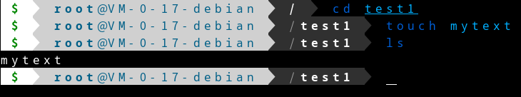
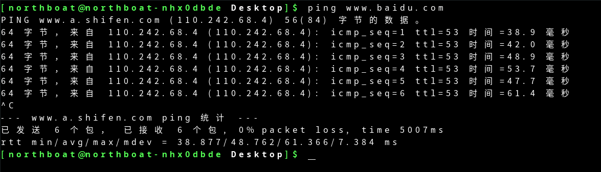
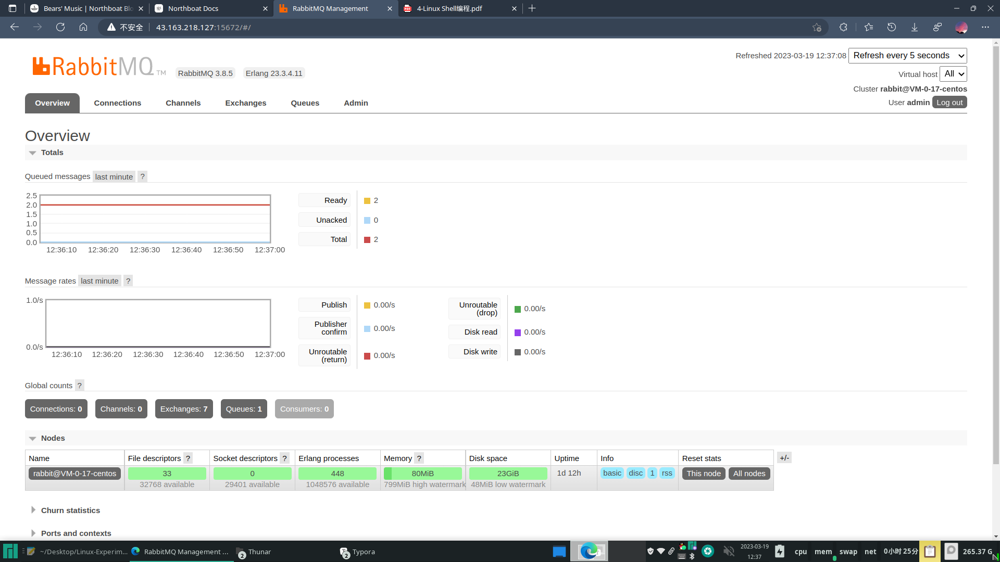
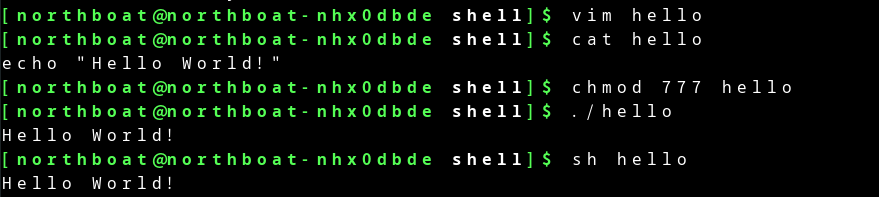
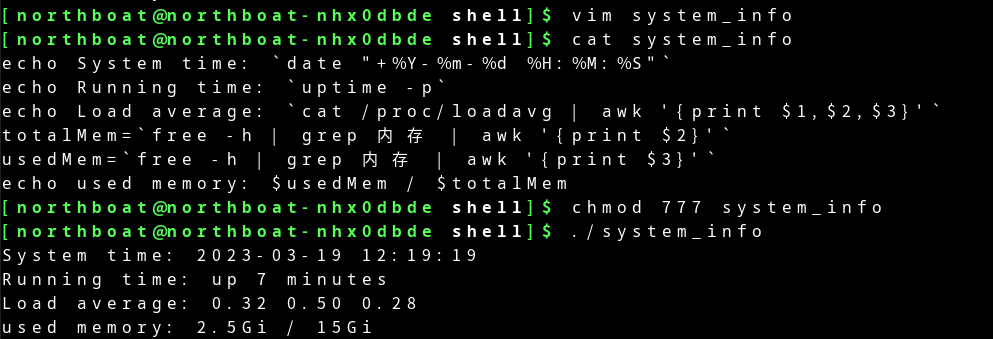
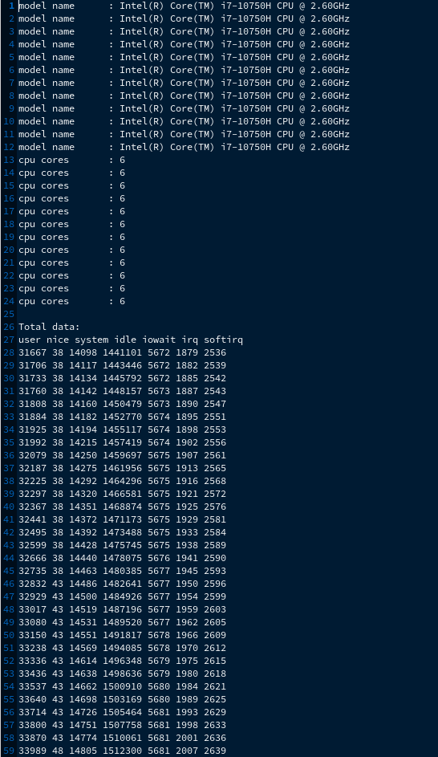

## Linux 基本命令

### 实验环境

Linux 版本

```bash
Linux northboat-nhx0dbde 6.1.12-1-MANJARO #1 SMP PREEMPT_DYNAMIC Tue Feb 14 21:59:10 UTC 2023 x86_64 GNU/Linux
```

ssh 版本

```bash
OpenSSH_9.2p1, OpenSSL 3.0.8 7 Feb 2023
```

目标机版本

```bash
Linux VM-0-17-debian 5.10.0-19-amd64 #1 SMP Debian 5.10.149-2 (2022-10-21) x86_64 GNU/Linux
```

### 实验内容

#### ssh 连接 Linux

在`manjaro`上连接`debian`服务器

```bash
ssh root@43.163.218.127
```

查看主机基本信息


查看网卡信息


#### 文件管理命令

搜索文件


查看文件内容


通过管道过滤查找关键字


创建目录


创建文本文件



编辑文件


复制文件


删除文件


删除目录


#### 用户管理

新建用户


切换并测试用户


修改用户权限


查看用户组


删除用户


#### 文件解压缩

压缩文件`.tar`


解压文件


压缩文件`.tar.gz`


解压文件


### 实验总结

debain 默认没有 wheel 组，在加入用户进 wheel 组时会报错：group wheel does not exist

需要新增组

```bash
groupadd wheel
```

再将用户加入组

```bash
usermod -a -G wheel northboat
```

删除组

```bash
groupdel wheel
```

通过查看组`cat /etc/group`发现存在`root`组，将用户加入`root`组

```bash
usermod -a -G root northboat
```

## Linux 系统管理

### 实现环境

Linux 版本

```bash
Linux northboat-nhx0dbde 6.1.12-1-MANJARO #1 SMP PREEMPT_DYNAMIC Tue Feb 14 21:59:10 UTC 2023 x86_64 GNU/Linux
```

本地 Shell

### 实验内容

#### 网络管理

> 设置静态 IP，manjaro 下，使用 netctl 实现

下载 netctl

```bash
yay -S netctl
```

查看网卡信息


得知网卡名称`enp13s0f1`

终止网络服务

```bash
sudo systemctl stop NetworkManager
sudo systemctl disable NetworkManager
```

复制`netctl`默认配置文件

```bash
sudo cp /etc/netctl/examples/ethernet-static /etc/netctl/enp13s0f1
```

编辑文件`enp13s0f1`


配置 DNS 解析


重启网络服务

```bash
sudo systemctl start NetworkManager
sudo systemctl enable NetworkManager
```

查看网络连接状态


ping  通



#### 进程管理

`ps`命令查看进程


查看所有用户所有进程信息


进程信息排序

- 按内存占用


- 按 CPU 占用


动态查看进程信息


终止进程

```bash
# 根据 pid 杀死进程
kill -9 pid

# 根据进程名查找 pid
pgrep -f name

# 根据进程名杀死进程
pkill -f name
```

#### 磁盘管理

查看已挂载磁盘总容量、已使用、剩余容量


查看目录或文件所占空间


### 实验总结

对于个人用户，修改静态 IP 便于在局域网内访问机器，之前使用系统提供的配置文件对静态 IP 进行过修改，但每次重启或重新联网后都会重置该 IP，后采用`netctl`对静态 IP 进行统一管理，解决问题

## Linux 服务器配置

### 实现环境

centos7

```bash
Linux VM-0-17-centos 3.10.0-1160.88.1.el7.x86_64 #1 SMP Tue Mar 7 15:41:52 UTC 2023 x86_64 x86_64 x86_64 GNU/Linux
```

ssh

### 实验内容

#### 下载 Nginx 服务器

通过 wget 在 nginx 官网下载

```bash
wget http://nginx.org/download/nginx-1.17.6.tar.gz 
```

安装必要依赖

```bash
yum -y install gcc pcre pcre-devel zlib zlib-devel openssl openssl-devel
```

创建目录

```bash
mkdir /usr/local/nginx
```

解压 nginx 压缩包

```bash
tar -zxvf nginx-1.17.6.tar.gz -C /usr/local/nginx
```

编译 nginx

```bash
cd /usr/local/nginx/nginx-1.17.6
./configure
make
make install
```

启动 nginx

```bash
cd /usr/local/nginx
./nginx
```

查看启动情况，浏览器进入`http://43.163.218.127/`


#### 下载 MariaDB

通过 yum 安装

```bash
yum install mariadb-server
```

启动 mariadb

```bash
systemctl start mariadb  # 开启服务
systemctl enable mariadb  # 设置为开机自启动服务
```

数据库配置

```bash
mysql_secure_installation
```

```bash
Enter current password for root (enter for none):  # 输入数据库超级管理员root的密码(注意不是系统root的密码)，第一次进入还没有设置密码则直接回车

Set root password? [Y/n]  # 设置密码，y

New password:  # 新密码
Re-enter new password:  # 再次输入密码

Remove anonymous users? [Y/n]  # 移除匿名用户， y

Disallow root login remotely? [Y/n]  # 拒绝root远程登录，n，不管y/n，都会拒绝root远程登录

Remove test database and access to it? [Y/n]  # 删除test数据库，y：删除。n：不删除，数据库中会有一个test数据库，一般不需要

Reload privilege tables now? [Y/n]  # 重新加载权限表，y。或者重启服务也许
```

登录


#### 下载 Redis

wget 下载

```bash
wget https://github.com/redis/redis/archive/redis-7.0.9.tar.gz
```

解压

```bash
tar -zvxf redis-7.0.9.tar.gz -C /usr/local/redis
```

编译

```bash
cd /usr/local/redis/redis/redis-7.0.9
make
```

安装

```bash
make PREFIX=/usr/local/redis install
```

复制默认配置文件

```bash
cp redis.conf ../bin
```

设置 redis.conf

```bash
requirepass 123456 # 设置密码
daemonize yes # 允许后台运行
bind 0.0.0.0 # 允许远程访问
```

启动

```bash
cd /usr/local/redis/bin
./redis-server redis.conf
```


#### 安装 OpenJDK17

wget 下载最新的 jdk17

```bash
wget https://download.oracle.com/java/17/latest/jdk-17_linux-x64_bin.tar.gz
```

解压

```bash
tar xf jdk-17_linux-x64_bin.tar.gz
```

移动位置

```bash
mv jdk-17.0.6/ /usr/lib/jvm/jdk-17.0.6
```

修改环境配置

```bash
vim /etc/profile
```

添加以下内容

```bash
export JAVA_HOME=/usr/lib/jvm/jdk-17.0.6
export CLASSPATH=$JAVA_HOME/lib:$JRE_HOME/lib:$CLASSPATH
export PATH=$JAVA_HOME/bin:$JRE_HOME/bin:$PATH
```

重新加载配置

```bash
source /etc/profile
```

测试安装

```bash
java -version
```


#### 安装 RabbitMQ

安装 Erlang 环境，yum 下载

安装依赖

```bash
curl -s https://packagecloud.io/install/repositories/rabbitmq/erlang/script.rpm.sh | sudo bash
```

下载 erlang

```bash
yum install -y erlang
```

测试安装

```bash
erl -version
```


安装 RabbitMQ

导入 key

```bash
rpm --import https://packagecloud.io/rabbitmq/rabbitmq-server/gpgkey
rpm --import https://packagecloud.io/gpg.key
```

安装依赖

```bash
curl -s https://packagecloud.io/install/repositories/rabbitmq/rabbitmq-server/script.rpm.sh | sudo bash
```

wget 下载 rabbitmq

```bash
wget https://github.com/rabbitmq/rabbitmq-server/releases/download/v3.8.5/rabbitmq-server-3.8.5-1.el7.noarch.rpm
```

直接安装将报错

```bash
rpm -ivh rabbitmq-server-3.8.5-1.el7.noarch.rpm

warning: rabbitmq-server-3.8.5-1.el7.noarch.rpm: Header V4 RSA/SHA256 Signature, key ID 6026dfca: NOKEY
error: Failed dependencies:
	socat is needed by rabbitmq-server-3.8.5-1.el7.noarch
```

导入 key

```bash
rpm --import https://www.rabbitmq.com/rabbitmq-release-signing-key.asc
```

安装 socat

```bash
yum -y install epel-release
yum -y install socat
```

重新安装

```bash
rpm -ivh rabbitmq-server-3.8.5-1.el7.noarch.rpm
```

启用 rabbitmq 插件

```bash
rabbitmq-plugins enable rabbitmq_management
```

启动 rabbitmq

```bash
systemctl start rabbitmq-server
```

创建用户

```bash
rabbitmqctl add_user admin 011026
```

设置超级管理员权限

```bash
rabbitmqctl set_user_tags admin administrator
```

重启 rabbitmq

```bash
systemctl restart rabbitmq-server
```

查看可视化界面：`43.163.218.127:15672`



设置`virtual host`为`/`，默认为`ALL`

#### 服务器使用

使用 ftp 工具上传文件

- 一个前端网页
- 一个 jar 包

将 nginx 目录下 html 文件夹内容替换为上传的`index.html`，并将资源放在相应目录下

配置 nginx.conf 文件，设置端口及负载均衡

启动 jar 包

```bash
nohup java -jar Shadow-0.0.1-SNAPSHOT.jar &
```

访问`43.163.218.127:80`


### 实验总结

好麻烦，宁愿用宝塔一键安装

## Linux Shell 编程

### 实现环境

manjaro 本地 shell，内核版本

```bash
Linux northboat-nhx0dbde 6.1.12-1-MANJARO #1 SMP PREEMPT_DYNAMIC Tue Feb 14 21:59:10 UTC 2023 x86_64 GNU/Linux
```

### 实验内容

#### 第一个 Shell 脚本

hello.sh

```bash
echo "Hello World!"
```



#### 利用脚本获取系统信息

```bash
echo System time: `date "+%Y-%m-%d %H:%M:%S"`
echo Running time: `uptime -p`
echo Load average: `cat /proc/loadavg | awk '{print $1,$2,$3}'`
totalMem=`free -h | grep 内存 | awk '{print $2}'`
usedMem=`free -h | grep 内存 | awk '{print $3}'`
echo used memory: $usedMem / $totalMem
```



#### 获取网卡信息

network_monitor.sh

```bash
echo IP: `ifconfig wlp12s0 | grep -w inet | awk '{print $2}'`

# get receive bytes 10 seconds ago
inputBytes1=`cat /proc/net/dev | grep wlp12s0 | awk -F: '{print $2}' | awk '{print $1}'`

# get transmit bytes 10 seconds ago
outputBytes1=`cat /proc/net/dev | grep wlp12s0 | awk -F: '{print $2}' | awk '{print $9}'`

echo Input bytes1: $inputBytes1 Output bytes1: $outputBytes1

sleep 10

# get receive bytes 10s later
inputBytes2=`cat /proc/net/dev | grep wlp12s0 | awk -F: '{print $2}'|awk '{print $1}'`

# get transmit bytes 10s later
outputBytes2=`cat /proc/net/dev | grep wlp12s0 | awk -F: '{print $2}'|awk '{print $9}'`

echo Input bytes2: $inputBytes2 Output bytes2: $outputBytes2

# evaluate the network
if [ $inputBytes1 -le $inputBytes2 ]
	then
	echo Network traffic is on the rise.
 	else
 	echo Network traffic is on the falling.
fi
```


#### 监控 CPU 负载

cpu_monitor.sh

```bash
#Function: monitor load average of cpu, and write to file
if [ -f cpu_monitor.txt ]
	then
	touch cpu_monitor.txt
fi

# modify file permission
if [ -w cpu_monitor.txt ]
	then
	chmod 755 cpu_monitor.txt
fi

# write cpu infomation
cat /proc/cpuinfo | grep "model name" > cpu_monitor.txt
cat /proc/cpuinfo | grep "cpu cores" >> cpu_monitor.txt

echo " " >> cpu_monitor.txt
echo Total data: >> cpu_monitor.txt
echo user nice system idle iowait irq softirq >> cpu_monitor.txt

#write cpu infomation every 2s
for ((i=0;i<=50;i++))
	do
	cat /proc/stat | grep 'cpu ' | awk '{print $2" "$3" "$4" "$5" "$6" "$7" "$8}' >> cpu_monitor.txt
	sleep 2
done 
```




### 实验总结

注意添加空格，命令后一定要有，加参数后一定要有，否则报错
